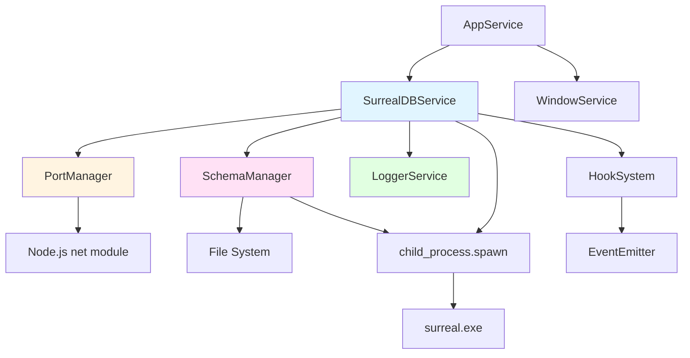
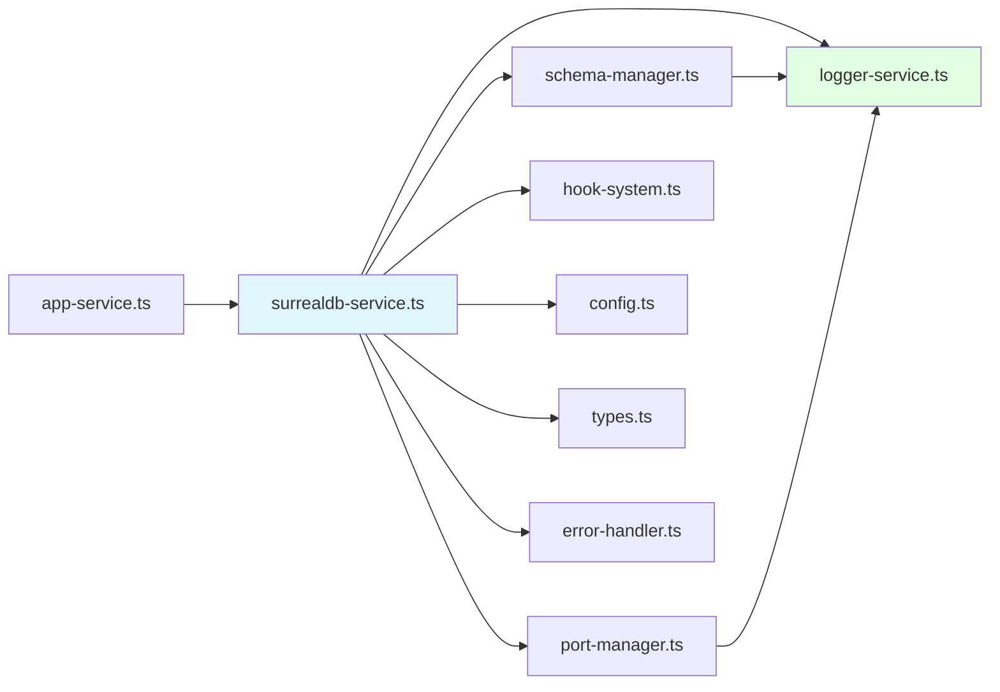
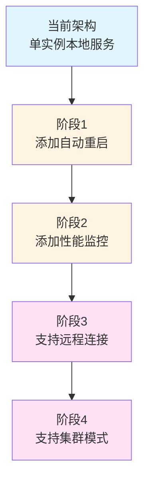

# 设计文档：SurrealDB 服务管理系统

## 概述

本文档描述了基于 Electron 的知识库应用程序中 SurrealDB 服务管理系统的设计。该系统负责管理 SurrealDB 服务器进程的完整生命周期，包括启动、配置、监控、模式管理和优雅关闭。系统采用 TypeScript 实现，直接通过 CLI 可执行文件（surreal.exe）操作 SurrealDB，而不使用 JavaScript SDK。

### 设计目标

1. **可靠性**：确保 SurrealDB 服务在任何场景下都能正确启动和关闭，不会出现端口冲突或资源泄漏
2. **可观测性**：提供完整的日志记录和事件钩子，便于监控和调试
3. **可维护性**：采用清晰的分层架构，遵循现有 Electron 后端的代码风格
4. **自动化**：自动处理端口分配、模式初始化和进程清理

### 技术栈

- **运行时**：Node.js (Electron Main Process)
- **语言**：TypeScript
- **数据库**：SurrealDB v2.4.0 (通过 CLI 可执行文件)
- **进程管理**：Node.js child_process
- **日志**：自定义日志服务（支持控制台和文件输出）

## 架构

### 系统架构图



### 分层架构

```
┌─────────────────────────────────────────┐
│         Application Layer               │
│         (AppService)                    │
└─────────────────┬───────────────────────┘
                  │
┌─────────────────▼───────────────────────┐
│      Service Orchestration Layer        │
│      (SurrealDBService)                 │
└─────┬──────┬──────┬──────┬──────────────┘
      │      │      │      │
┌─────▼──┐ ┌─▼────┐ ┌▼────┐ ┌▼──────────┐
│ Port   │ │Schema│ │Hook │ │Logger     │
│Manager │ │Mgr   │ │Sys  │ │Service    │
└────────┘ └──────┘ └─────┘ └───────────┘
      │        │
┌─────▼────────▼─────────────────────────┐
│      Infrastructure Layer               │
│  (child_process, fs, net, EventEmitter) │
└─────────────────────────────────────────┘
```

## 组件和接口

### 1. SurrealDBService（核心服务）

**职责**：
- 管理 SurrealDB 服务器进程的完整生命周期
- 协调各子组件（PortManager、SchemaManager、Logger、HookSystem）
- 提供统一的服务接口供 AppService 调用

**接口定义**：

```typescript
interface ISurrealDBService {
  // 生命周期方法
  initialize(): Promise<void>;
  start(): Promise<void>;
  shutdown(): Promise<void>;
  
  // 状态查询
  isRunning(): boolean;
  getStatus(): ServerStatus;
  
  // 配置访问
  getServerUrl(): string;
  getCredentials(): { username: string; password: string };
  
  // 事件订阅
  on(event: ServerEvent, handler: EventHandler): void;
  off(event: ServerEvent, handler: EventHandler): void;
}

enum ServerStatus {
  STOPPED = 'stopped',
  STARTING = 'starting',
  READY = 'ready',
  ERROR = 'error',
  SHUTTING_DOWN = 'shutting_down'
}

type ServerEvent = 
  | 'server:starting'
  | 'server:ready'
  | 'server:error'
  | 'server:shutdown'
  | 'server:stdout'
  | 'server:stderr'
  | 'schema:initialized'
  | 'schema:validated'
  | 'schema:overwritten';
```

**实现细节**：


```typescript
class SurrealDBService implements ISurrealDBService {
  private process: ChildProcess | null = null;
  private status: ServerStatus = ServerStatus.STOPPED;
  private config: SurrealDBConfig;
  private portManager: PortManager;
  private schemaManager: SchemaManager;
  private logger: LoggerService;
  private hookSystem: HookSystem;
  
  constructor(config?: Partial<SurrealDBConfig>) {
    this.config = { ...DEFAULT_CONFIG, ...config };
    this.portManager = new PortManager(this.config.portRange);
    this.logger = LoggerService.getInstance();
    this.hookSystem = new HookSystem();
    this.schemaManager = new SchemaManager(
      this.config.schemaDir,
      this.logger,
      this.hookSystem
    );
  }
  
  async initialize(): Promise<void> {
    this.logger.info('Initializing SurrealDB service');
    
    // 1. 验证 surreal.exe 是否存在
    const exePath = this.getSurrealExePath();
    if (!fs.existsSync(exePath)) {
      throw new Error(`SurrealDB executable not found at: ${exePath}`);
    }
    
    // 2. 分配端口（包含清理逻辑）
    this.config.port = await this.portManager.allocatePort();
    
    this.logger.info(`SurrealDB service initialized on port ${this.config.port}`);
  }
  
  async start(): Promise<void> {
    if (this.status !== ServerStatus.STOPPED) {
      throw new Error(`Cannot start server in ${this.status} state`);
    }
    
    this.status = ServerStatus.STARTING;
    this.hookSystem.emit('server:starting', { port: this.config.port });
    
    try {
      // 1. 启动服务器进程
      await this.startServerProcess();
      
      // 2. 等待服务器就绪
      await this.waitForServerReady();
      
      // 3. 初始化或验证模式
      await this.schemaManager.initializeSchema(this.getServerUrl(), this.config);

      
      this.status = ServerStatus.READY;
      this.hookSystem.emit('server:ready', { 
        url: this.getServerUrl(),
        port: this.config.port 
      });
      
      this.logger.info('SurrealDB server is ready');
    } catch (error) {
      this.status = ServerStatus.ERROR;
      this.hookSystem.emit('server:error', { error });
      this.logger.error('Failed to start SurrealDB server', error);
      await this.cleanup();
      throw error;
    }
  }
  
  private async startServerProcess(): Promise<void> {
    const exePath = this.getSurrealExePath();
    const args = this.buildStartArgs();
    
    this.logger.debug(`Starting SurrealDB: ${exePath} ${args.join(' ')}`);
    
    this.process = spawn(exePath, args, {
      stdio: ['ignore', 'pipe', 'pipe'],
      detached: false, // 确保子进程与父进程生命周期绑定
      windowsHide: true
    });
    
    // 监听进程输出
    this.process.stdout?.on('data', (data) => {
      const output = data.toString();
      this.logger.debug(`[SurrealDB stdout] ${output}`);
      this.hookSystem.emit('server:stdout', { output });
    });
    
    this.process.stderr?.on('data', (data) => {
      const output = data.toString();
      this.logger.warn(`[SurrealDB stderr] ${output}`);
      this.hookSystem.emit('server:stderr', { output });
    });
    
    // 监听进程退出
    this.process.on('exit', (code, signal) => {
      this.logger.info(`SurrealDB process exited with code ${code}, signal ${signal}`);
      if (this.status === ServerStatus.READY) {
        this.status = ServerStatus.ERROR;
        this.hookSystem.emit('server:error', { 
          error: new Error(`Server crashed with code ${code}`) 
        });
      }
    });
  }

  
  private buildStartArgs(): string[] {
    const { port, username, password, dbPath, logLevel } = this.config;
    
    return [
      'start',
      `rocksdb:${dbPath}`,  // 使用 RocksDB 后端
      '--bind', `127.0.0.1:${port}`,
      '--user', username,
      '--pass', password,
      '--log', logLevel,
      '--no-banner'
    ];
  }
  
  private async waitForServerReady(timeout = 30000): Promise<void> {
    const startTime = Date.now();
    const checkInterval = 500;
    
    while (Date.now() - startTime < timeout) {
      try {
        const isReady = await this.checkServerReady();
        if (isReady) return;
      } catch (error) {
        // 继续等待
      }
      await new Promise(resolve => setTimeout(resolve, checkInterval));
    }
    
    throw new Error('Server startup timeout');
  }
  
  private async checkServerReady(): Promise<boolean> {
    const exePath = this.getSurrealExePath();
    
    return new Promise((resolve) => {
      const proc = spawn(exePath, [
        'is-ready',
        '--endpoint', this.getServerUrl()
      ]);
      
      proc.on('exit', (code) => {
        resolve(code === 0);
      });
      
      proc.on('error', () => {
        resolve(false);
      });
    });
  }
  
  async shutdown(): Promise<void> {
    if (!this.process || this.status === ServerStatus.STOPPED) {
      return;
    }
    
    this.status = ServerStatus.SHUTTING_DOWN;
    this.hookSystem.emit('server:shutdown', {});
    this.logger.info('Shutting down SurrealDB server');
    
    try {
      // 1. 发送 SIGINT 信号（优雅关闭）
      this.process.kill('SIGINT');
      
      // 2. 等待进程退出（最多 5 秒）
      const exited = await this.waitForProcessExit(5000);
      
      // 3. 如果未退出，强制终止
      if (!exited && this.process) {
        this.logger.warn('Force killing SurrealDB process');
        this.process.kill('SIGKILL');
        await this.waitForProcessExit(2000);
      }
    } finally {
      await this.cleanup();
    }
  }

  
  private async waitForProcessExit(timeout: number): Promise<boolean> {
    return new Promise((resolve) => {
      if (!this.process) {
        resolve(true);
        return;
      }
      
      const timer = setTimeout(() => {
        resolve(false);
      }, timeout);
      
      this.process.once('exit', () => {
        clearTimeout(timer);
        resolve(true);
      });
    });
  }
  
  private async cleanup(): Promise<void> {
    this.process = null;
    this.status = ServerStatus.STOPPED;
    await this.portManager.releasePort();
    this.logger.info('SurrealDB service cleanup completed');
  }
  
  private getSurrealExePath(): string {
    const isDev = process.env.NODE_ENV !== 'production';
    const basePath = isDev 
      ? path.join(process.cwd(), 'vendor')
      : path.join(process.resourcesPath, 'vendor');
    
    return path.join(basePath, 'surrealdb', 'surreal-v2.4.0.windows-amd64.exe');
  }
  
  getServerUrl(): string {
    return `http://127.0.0.1:${this.config.port}`;
  }
  
  getCredentials() {
    return {
      username: this.config.username,
      password: this.config.password
    };
  }
  
  isRunning(): boolean {
    return this.status === ServerStatus.READY;
  }
  
  getStatus(): ServerStatus {
    return this.status;
  }
  
  on(event: ServerEvent, handler: EventHandler): void {
    this.hookSystem.on(event, handler);
  }
  
  off(event: ServerEvent, handler: EventHandler): void {
    this.hookSystem.off(event, handler);
  }
}
```

### 2. PortManager（端口管理器）

**职责**：
- 分配可用端口（默认 8000，范围 8000-8100）
- 检测端口占用情况
- 清理残余进程
- 处理 TIME_WAIT 状态

**接口定义**：

```typescript
interface IPortManager {
  allocatePort(): Promise<number>;
  releasePort(): Promise<void>;
  isPortAvailable(port: number): Promise<boolean>;
  findProcessOnPort(port: number): Promise<number | null>;
  killProcess(pid: number): Promise<void>;
}
```


**实现细节**：

```typescript
class PortManager implements IPortManager {
  private allocatedPort: number | null = null;
  private portRange: { min: number; max: number };
  
  constructor(portRange = { min: 8000, max: 8100 }) {
    this.portRange = portRange;
  }
  
  async allocatePort(): Promise<number> {
    const { min, max } = this.portRange;
    
    // 1. 尝试默认端口
    if (await this.tryAllocatePort(min)) {
      return min;
    }
    
    // 2. 在范围内查找可用端口
    for (let port = min + 1; port <= max; port++) {
      if (await this.tryAllocatePort(port)) {
        return port;
      }
    }
    
    throw new Error(`No available port in range ${min}-${max}`);
  }
  
  private async tryAllocatePort(port: number): Promise<boolean> {
    // 1. 检查端口是否可用
    const available = await this.isPortAvailable(port);
    if (available) {
      this.allocatedPort = port;
      return true;
    }
    
    // 2. 端口被占用，尝试清理
    const pid = await this.findProcessOnPort(port);
    if (pid) {
      const isSurrealDB = await this.isSurrealDBProcess(pid);
      if (isSurrealDB) {
        await this.killProcess(pid);
        
        // 3. 等待端口释放（处理 TIME_WAIT）
        const released = await this.waitForPortRelease(port, 2000);
        if (released) {
          this.allocatedPort = port;
          return true;
        }
      }
    }
    
    return false;
  }
  
  async isPortAvailable(port: number): Promise<boolean> {
    return new Promise((resolve) => {
      const server = net.createServer();
      
      server.once('error', () => {
        resolve(false);
      });
      
      server.once('listening', () => {
        server.close();
        resolve(true);
      });
      
      server.listen(port, '127.0.0.1');
    });
  }

  
  async findProcessOnPort(port: number): Promise<number | null> {
    return new Promise((resolve) => {
      // Windows: netstat -ano | findstr :port
      const proc = spawn('netstat', ['-ano']);
      let output = '';
      
      proc.stdout.on('data', (data) => {
        output += data.toString();
      });
      
      proc.on('close', () => {
        const lines = output.split('\n');
        for (const line of lines) {
          if (line.includes(`:${port}`) && line.includes('LISTENING')) {
            const parts = line.trim().split(/\s+/);
            const pid = parseInt(parts[parts.length - 1]);
            if (!isNaN(pid)) {
              resolve(pid);
              return;
            }
          }
        }
        resolve(null);
      });
      
      proc.on('error', () => resolve(null));
    });
  }
  
  private async isSurrealDBProcess(pid: number): Promise<boolean> {
    return new Promise((resolve) => {
      // Windows: tasklist /FI "PID eq pid" /FO CSV
      const proc = spawn('tasklist', ['/FI', `PID eq ${pid}`, '/FO', 'CSV']);
      let output = '';
      
      proc.stdout.on('data', (data) => {
        output += data.toString();
      });
      
      proc.on('close', () => {
        resolve(output.toLowerCase().includes('surreal'));
      });
      
      proc.on('error', () => resolve(false));
    });
  }
  
  async killProcess(pid: number): Promise<void> {
    return new Promise((resolve, reject) => {
      // Windows: taskkill /F /PID pid
      const proc = spawn('taskkill', ['/F', '/PID', pid.toString()]);
      
      proc.on('close', (code) => {
        if (code === 0) {
          resolve();
        } else {
          reject(new Error(`Failed to kill process ${pid}`));
        }
      });
      
      proc.on('error', reject);
    });
  }
  
  private async waitForPortRelease(port: number, timeout: number): Promise<boolean> {
    const startTime = Date.now();
    const checkInterval = 200;
    
    while (Date.now() - startTime < timeout) {
      if (await this.isPortAvailable(port)) {
        return true;
      }
      await new Promise(resolve => setTimeout(resolve, checkInterval));
    }
    
    return false;
  }
  
  async releasePort(): Promise<void> {
    this.allocatedPort = null;
  }
}
```


### 3. SchemaManager（模式管理器）

**职责**：
- 检查数据库模式是否存在
- 从 `.surql` 文件导入模式
- 验证模式与模板的一致性
- 备份和覆盖模式

**接口定义**：

```typescript
interface ISchemaManager {
  initializeSchema(serverUrl: string, config: SurrealDBConfig): Promise<void>;
  validateSchema(serverUrl: string, config: SurrealDBConfig): Promise<boolean>;
  importSchema(serverUrl: string, config: SurrealDBConfig): Promise<void>;
}
```

**实现细节**：

```typescript
class SchemaManager implements ISchemaManager {
  constructor(
    private schemaDir: string,
    private logger: LoggerService,
    private hookSystem: HookSystem
  ) {}
  
  async initializeSchema(serverUrl: string, config: SurrealDBConfig): Promise<void> {
    this.logger.info('Initializing database schema');
    
    // 1. 检查模式是否存在
    const schemaExists = await this.checkSchemaExists(serverUrl, config);
    
    if (!schemaExists) {
      // 2. 导入模式
      await this.importSchema(serverUrl, config);
      this.hookSystem.emit('schema:initialized', {});
    } else {
      // 3. 验证模式
      const isValid = await this.validateSchema(serverUrl, config);
      this.hookSystem.emit('schema:validated', { isValid });
      
      if (!isValid) {
        // 4. 模式不一致时重新导入（Schema 由 Git 版本控制，无需备份）
        this.logger.warn('Schema mismatch detected, re-importing schema');
        await this.importSchema(serverUrl, config);
        this.hookSystem.emit('schema:overwritten', {});
      }
    }
  }
  
  private async checkSchemaExists(serverUrl: string, config: SurrealDBConfig): Promise<boolean> {
    // 通过查询 DEFINE TABLE 语句来检查模式是否存在
    // 这里简化处理，实际可以通过 surreal sql 命令执行查询
    return false; // 首次启动假设不存在
  }
  
  async importSchema(serverUrl: string, config: SurrealDBConfig): Promise<void> {
    const schemaDefinitions = await this.getSchemaDefinitions();
    
    if (schemaDefinitions.length === 0) {
      this.logger.warn('No schema definitions found');
      return;
    }
    
    this.logger.info(`Importing ${schemaDefinitions.length} schema definitions`);
    
    for (const schemaSql of schemaDefinitions) {
      await this.executeSchema(schemaSql, serverUrl, config);
    }
    
    this.logger.info('Schema import completed');
  }

  
  private async getSchemaDefinitions(): Promise<string[]> {
    // 从 TypeScript 模块导入 schema 定义
    const schemaModule = await import(path.join(this.schemaDir, 'index'));
    const schemas = schemaModule.default || schemaModule.schemas;
    
    if (!Array.isArray(schemas)) {
      throw new Error('Schema module must export an array of schema definitions');
    }
    
    return schemas;
  }
  
  private async executeSchema(
    schemaSql: string, 
    serverUrl: string, 
    config: SurrealDBConfig
  ): Promise<void> {
    return new Promise((resolve, reject) => {
      const exePath = this.getSurrealExePath();
      
      const args = [
        'sql',
        '--endpoint', serverUrl,
        '--namespace', config.namespace,
        '--database', config.database,
        '--user', config.username,
        '--pass', config.password
      ];
      
      this.logger.debug(`Executing schema SQL`);
      
      const proc = spawn(exePath, args);
      
      // 通过 stdin 传入 SQL
      proc.stdin?.write(schemaSql);
      proc.stdin?.end();
      
      let output = '';
      let errorOutput = '';
      
      proc.stdout?.on('data', (data) => {
        output += data.toString();
      });
      
      proc.stderr?.on('data', (data) => {
        errorOutput += data.toString();
      });
      
      proc.on('close', (code) => {
        if (code === 0) {
          this.logger.info(`Schema executed successfully`);
          resolve();
        } else {
          const error = new Error(`Schema execution failed: ${errorOutput}`);
          this.logger.error(`Failed to execute schema`, error);
          reject(error);
        }
      });
      
      proc.on('error', reject);
    });
  }
  
  async validateSchema(serverUrl: string, config: SurrealDBConfig): Promise<boolean> {
    // 简化实现：假设模式总是有效的
    // 实际实现需要查询数据库并比较表结构
    return true;
  }
  
  private getSurrealExePath(): string {
    const isDev = process.env.NODE_ENV !== 'production';
    const basePath = isDev 
      ? path.join(process.cwd(), 'vendor')
      : path.join(process.resourcesPath, 'vendor');
    
    return path.join(basePath, 'surrealdb', 'surreal-v2.4.0.windows-amd64.exe');
  }
}
```


### 4. LoggerService（日志服务）

**职责**：
- 提供多级别日志记录（debug、info、warn、error）
- 同时输出到 Electron 控制台和 AppData 日志文件
- 通过环境变量控制日志级别
- 集中管理日志输出和过滤
- 单例模式，全局访问

**技术选型**：使用 `electron-log` 库

**安装依赖**：
```bash
pnpm add electron-log
```

**接口定义**：

```typescript
import log from 'electron-log';

interface ILoggerService {
  debug(message: string, ...args: any[]): void;
  info(message: string, ...args: any[]): void;
  warn(message: string, ...args: any[]): void;
  error(message: string, error?: Error, ...args: any[]): void;
  setLevel(level: log.LogLevel): void;
  getLogPath(): string;
}

// electron-log 支持的日志级别
type LogLevel = 'error' | 'warn' | 'info' | 'verbose' | 'debug' | 'silly';
```

**实现细节**：

```typescript
import log from 'electron-log';
import { app } from 'electron';

class LoggerService implements ILoggerService {
  private static instance: LoggerService;
  
  private constructor() {
    this.configure();
  }
  
  static getInstance(): LoggerService {
    if (!LoggerService.instance) {
      LoggerService.instance = new LoggerService();
    }
    return LoggerService.instance;
  }
  
  private configure(): void {
    // 1. 从环境变量读取日志级别（默认 info）
    const logLevel = (process.env.LOG_LEVEL || 'info') as log.LogLevel;
    
    // 2. 配置控制台输出（Electron DevTools 控制台）
    log.transports.console.level = logLevel;
    log.transports.console.format = '[{y}-{m}-{d} {h}:{i}:{s}] [{level}] {text}';
    
    // 3. 配置文件输出（AppData 目录）
    // Windows: %APPDATA%\{app name}\logs\main.log
    // macOS: ~/Library/Logs/{app name}/main.log
    // Linux: ~/.config/{app name}/logs/main.log
    log.transports.file.level = logLevel;
    log.transports.file.format = '[{y}-{m}-{d} {h}:{i}:{s}] [{level}] {text}';
    log.transports.file.maxSize = 10 * 1024 * 1024;  // 10MB 自动轮转
    
    // 4. 捕获未处理的异常和 Promise 拒绝
    log.catchErrors({
      showDialog: false,
      onError: (error) => {
        this.error('Uncaught exception', error);
      }
    });
    
    this.info(`Logger initialized with level: ${logLevel}`);
    this.info(`Log file: ${this.getLogPath()}`);
  }
  
  debug(message: string, ...args: any[]): void {
    log.debug(message, ...args);
  }
  
  info(message: string, ...args: any[]): void {
    log.info(message, ...args);
  }
  
  warn(message: string, ...args: any[]): void {
    log.warn(message, ...args);
  }
  
  error(message: string, error?: Error, ...args: any[]): void {
    if (error) {
      log.error(message, error, ...args);
    } else {
      log.error(message, ...args);
    }
  }
  
  // 动态调整日志级别
  setLevel(level: log.LogLevel): void {
    log.transports.console.level = level;
    log.transports.file.level = level;
    this.info(`Log level changed to: ${level}`);
  }
  
  // 获取日志文件路径（便于用户查看）
  getLogPath(): string {
    return log.transports.file.getFile()?.path || '';
  }
}

// 导出单例和便捷方法
export const logger = LoggerService.getInstance();
export { LoggerService };

### 5. HookSystem（事件钩子系统）

**职责**：
- 提供事件发布/订阅机制
- 支持多个监听器
- 异步事件处理
- 错误隔离

**接口定义**：

```typescript
interface IHookSystem {
  on(event: string, handler: EventHandler): void;
  off(event: string, handler: EventHandler): void;
  emit(event: string, data: any): void;
}

type EventHandler = (data: any) => void | Promise<void>;
```

**实现细节**：

```typescript
class HookSystem extends EventEmitter implements IHookSystem {
  constructor() {
    super();
    this.setMaxListeners(50); // 允许更多监听器
  }
  
  on(event: string, handler: EventHandler): void {
    super.on(event, handler);
  }
  
  off(event: string, handler: EventHandler): void {
    super.off(event, handler);
  }
  
  emit(event: string, data: any): void {
    const listeners = this.listeners(event);
    
    // 异步调用所有监听器
    listeners.forEach(async (listener) => {
      try {
        await (listener as EventHandler)(data);
      } catch (error) {
        console.error(`Error in event handler for ${event}:`, error);
      }
    });
  }
}
```

### 6. Schema 定义（TypeScript 模式）

**职责**：
- 使用 TypeScript 定义数据库模式
- 提供类型安全和 IDE 支持
- 模块化组织表定义

**目录结构**：

```
schema/
├── index.ts           # 导出所有 schema
├── tables.ts          # 表定义
├── user.ts            # 用户表（示例）
└── document.ts        # 文档表（示例）
```

**基础表定义示例**：

```typescript
// schema/tables.ts
export interface TableDefinition {
  name: string;
  sql: string;
}

// 用户表
export const userTable: TableDefinition = {
  name: 'user',
  sql: `
    DEFINE TABLE user SCHEMAFULL;
    
    DEFINE FIELD username ON user TYPE string
      ASSERT $value != NONE AND string::len($value) >= 3 AND string::len($value) <= 50;
    
    DEFINE FIELD email ON user TYPE string
      ASSERT $value != NONE AND string::is::email($value);
    
    DEFINE FIELD password_hash ON user TYPE string
      ASSERT $value != NONE;
    
    DEFINE FIELD created_at ON user TYPE datetime
      DEFAULT time::now();
    
    DEFINE FIELD updated_at ON user TYPE datetime
      DEFAULT time::now()
      VALUE time::now();
    
    DEFINE FIELD is_active ON user TYPE bool
      DEFAULT true;
    
    DEFINE INDEX unique_username ON user COLUMNS username UNIQUE;
    DEFINE INDEX unique_email ON user COLUMNS email UNIQUE;
    DEFINE INDEX idx_created_at ON user COLUMNS created_at;
  `
};

// 文档表
export const documentTable: TableDefinition = {
  name: 'document',
  sql: `
    DEFINE TABLE document SCHEMAFULL;
    
    DEFINE FIELD title ON document TYPE string
      ASSERT $value != NONE AND string::len($value) >= 1 AND string::len($value) <= 200;
    
    DEFINE FIELD content ON document TYPE string
      DEFAULT '';
    
    DEFINE FIELD author ON document TYPE record(user)
      ASSERT $value != NONE;
    
    DEFINE FIELD tags ON document TYPE array
      DEFAULT [];
    
    DEFINE FIELD created_at ON document TYPE datetime
      DEFAULT time::now();
    
    DEFINE FIELD updated_at ON document TYPE datetime
      DEFAULT time::now()
      VALUE time::now();
    
    DEFINE FIELD is_deleted ON document TYPE bool
      DEFAULT false;
    
    DEFINE INDEX idx_author ON document COLUMNS author;
    DEFINE INDEX idx_created_at ON document COLUMNS created_at;
    DEFINE INDEX idx_tags ON document COLUMNS tags;
  `
};
```

**Schema 索引文件**：

```typescript
// schema/index.ts
import { userTable, documentTable } from './tables';

// 导出所有 schema 定义（按顺序）
export const schemas = [
  userTable.sql,
  documentTable.sql
];

export default schemas;

// 也可以导出表定义供其他地方使用
export { userTable, documentTable };
export type { TableDefinition } from './tables';
```

**添加新表的步骤**：

1. 在 `schema/` 目录下创建新的 `.ts` 文件（如 `category.ts`）
2. 定义表结构：
```typescript
// schema/category.ts
import { TableDefinition } from './tables';

export const categoryTable: TableDefinition = {
  name: 'category',
  sql: `
    DEFINE TABLE category SCHEMAFULL;
    
    DEFINE FIELD name ON category TYPE string
      ASSERT $value != NONE;
    
    DEFINE FIELD description ON category TYPE string
      DEFAULT '';
    
    DEFINE FIELD parent ON category TYPE option<record(category)>;
    
    DEFINE FIELD created_at ON category TYPE datetime
      DEFAULT time::now();
    
    DEFINE INDEX unique_name ON category COLUMNS name UNIQUE;
  `
};
```

3. 在 `schema/index.ts` 中导入并添加到数组：
```typescript
import { userTable, documentTable } from './tables';
import { categoryTable } from './category';

export const schemas = [
  userTable.sql,
  documentTable.sql,
  categoryTable.sql  // 新增
];
```

**优势**：
- ✅ 类型安全：TypeScript 编译时检查
- ✅ IDE 支持：自动补全、语法高亮
- ✅ 模块化：每个表可以独立文件
- ✅ 可维护：易于查找和修改
- ✅ 可测试：可以单独测试 SQL 语法
- ✅ 版本控制：Git 友好


## 数据模型

### 配置模型

```typescript
interface SurrealDBConfig {
  // 数据库配置
  dbPath: string;              // 数据库文件路径
  namespace: string;           // 命名空间
  database: string;            // 数据库名称
  
  // 认证配置
  username: string;            // 用户名
  password: string;            // 密码
  
  // 网络配置
  port: number;                // 端口号
  portRange: {                 // 端口范围
    min: number;
    max: number;
  };
  
  // 日志配置
  logLevel: 'debug' | 'info' | 'warn' | 'error' | 'trace';
  
  // 路径配置
  schemaDir: string;           // 模式文件目录
}

const DEFAULT_CONFIG: SurrealDBConfig = {
  dbPath: './data/knowledge.db',
  namespace: 'knowledge',
  database: 'main',
  username: 'root',
  password: 'root',
  port: 8000,
  portRange: { min: 8000, max: 8100 },
  logLevel: 'info',
  schemaDir: './schema'
};
```

### 事件数据模型

```typescript
interface ServerStartingEvent {
  port: number;
}

interface ServerReadyEvent {
  url: string;
  port: number;
}

interface ServerErrorEvent {
  error: Error;
}

interface ServerShutdownEvent {}

interface ServerOutputEvent {
  output: string;
}

interface SchemaInitializedEvent {}

interface SchemaValidatedEvent {
  isValid: boolean;
}

interface SchemaOverwrittenEvent {}
```

## 正确性属性

*属性是一种特征或行为，应该在系统的所有有效执行中保持为真——本质上是关于系统应该做什么的形式化陈述。属性作为人类可读规范和机器可验证正确性保证之间的桥梁。*

### 属性 1：端口分配唯一性

*对于任何*端口分配请求，如果分配成功，则该端口在释放之前不应被其他进程占用。

**验证：需求 3.1, 3.3, 11.1**

### 属性 2：进程生命周期绑定

*对于任何*启动的 SurrealDB 进程，当父进程（Electron 主进程）终止时，子进程应该被自动清理。

**验证：需求 1.7, 11.9, 11.10**

### 属性 3：优雅关闭超时

*对于任何*关闭请求，如果进程在 5 秒内未响应 SIGINT，则应该被强制终止。

**验证：需求 1.5, 1.6, 11.4**


### 属性 4：端口清理幂等性

*对于任何*端口，多次调用释放操作应该是安全的，不会产生错误。

**验证：需求 3.4, 11.5**

### 属性 5：模式文件导入顺序

*对于任何*模式目录，模式文件应该按字母顺序导入，确保依赖关系正确。

**验证：需求 5.7**

### 属性 6：服务器就绪检测

*对于任何*启动的服务器，在 30 秒超时内，`is-ready` 命令应该最终返回成功（退出码 0）。

**验证：需求 2.7, 8.2**

### 属性 7：残余进程清理

*对于任何*被占用的端口，如果占用进程是 SurrealDB 实例，则应该能够被识别并终止。

**验证：需求 11.2, 11.3, 11.4**

### 属性 8：TIME_WAIT 状态处理

*对于任何*处于 TIME_WAIT 状态的端口，在 2 秒等待后应该能够被重新绑定。

**验证：需求 11.6, 11.11**

### 属性 9：事件监听器错误隔离

*对于任何*事件监听器抛出的错误，不应该影响其他监听器的执行。

**验证：需求 7.12**

### 属性 10：日志双输出

*对于任何*日志调用，应该同时输出到 Electron 控制台和 AppData 日志文件。

**验证：需求 6.3, 6.4, 6.5**

### 属性 11：环境变量日志级别控制

*对于任何*环境变量 LOG_LEVEL 设置，日志服务应该正确过滤低于该级别的日志。

**验证：需求 6.8**

### 属性 11：配置路径解析

*对于任何*环境（开发/生产），surreal.exe 路径应该正确解析到对应的目录。

**验证：需求 1.1, 1.2, 1.3**

## 错误处理

### 错误分类

1. **启动错误**
   - 可执行文件不存在
   - 端口分配失败
   - 进程启动失败
   - 服务器就绪超时

2. **运行时错误**
   - 进程崩溃
   - 模式导入失败
   - 连接丢失

3. **关闭错误**
   - 进程无响应
   - 资源清理失败

### 错误处理策略

```typescript
class ErrorHandler {
  static handleStartupError(error: Error, service: SurrealDBService): void {
    service.logger.error('Startup error', error);
    service.hookSystem.emit('server:error', { error });
    
    // 尝试清理资源
    service.cleanup().catch(cleanupError => {
      service.logger.error('Cleanup failed', cleanupError);
    });
    
    throw error;
  }
  
  static handleRuntimeError(error: Error, service: SurrealDBService): void {
    service.logger.error('Runtime error', error);
    service.hookSystem.emit('server:error', { error });
    
    // 不抛出异常，允许应用继续运行
  }
  
  static handleShutdownError(error: Error, service: SurrealDBService): void {
    service.logger.error('Shutdown error', error);
    
    // 强制清理
    if (service.process) {
      try {
        service.process.kill('SIGKILL');
      } catch (killError) {
        service.logger.error('Force kill failed', killError);
      }
    }
  }
}
```


### 错误恢复机制

| 错误类型 | 恢复策略 | 用户通知 |
|---------|---------|---------|
| 端口被占用 | 自动清理残余进程或使用下一个可用端口 | 日志记录 |
| 进程启动失败 | 清理资源并抛出异常 | 错误对话框 |
| 服务器崩溃 | 发出错误事件，不自动重启 | 错误事件 |
| 模式导入失败 | 记录错误并抛出异常 | 错误对话框 |
| 关闭超时 | 强制终止进程 | 日志记录 |

## 测试策略

### 单元测试

**测试范围**：
- PortManager 的端口分配和释放逻辑
- SchemaManager 的文件读取和排序
- LoggerService 的日志格式化
- HookSystem 的事件发布/订阅

**测试工具**：
- Jest 或 Vitest
- 模拟 Node.js 模块（fs、net、child_process）

**示例测试**：

```typescript
describe('PortManager', () => {
  it('should allocate default port when available', async () => {
    const manager = new PortManager();
    const port = await manager.allocatePort();
    expect(port).toBe(8000);
  });
  
  it('should find next available port when default is occupied', async () => {
    // Mock port 8000 as occupied
    const manager = new PortManager();
    const port = await manager.allocatePort();
    expect(port).toBeGreaterThan(8000);
    expect(port).toBeLessThanOrEqual(8100);
  });
  
  it('should throw error when no ports available', async () => {
    // Mock all ports as occupied
    const manager = new PortManager({ min: 8000, max: 8000 });
    await expect(manager.allocatePort()).rejects.toThrow();
  });
});
```

### 属性测试

**测试范围**：
- 端口分配的唯一性和幂等性
- 进程生命周期管理
- 事件系统的错误隔离
- 配置路径解析

**测试工具**：
- fast-check（TypeScript 的属性测试库）

**示例属性测试**：

```typescript
import fc from 'fast-check';

describe('Property Tests', () => {
  it('Property 1: Port allocation uniqueness', async () => {
    await fc.assert(
      fc.asyncProperty(fc.integer({ min: 8000, max: 8100 }), async (port) => {
        const manager = new PortManager();
        const allocated = await manager.allocatePort();
        
        // 分配的端口应该可用
        const isAvailable = await manager.isPortAvailable(allocated);
        expect(isAvailable).toBe(false); // 已被占用
        
        await manager.releasePort();
      }),
      { numRuns: 100 }
    );
  });
  
  it('Property 4: Port release idempotency', async () => {
    await fc.assert(
      fc.asyncProperty(fc.constant(null), async () => {
        const manager = new PortManager();
        await manager.allocatePort();
        
        // 多次释放应该安全
        await manager.releasePort();
        await manager.releasePort();
        await manager.releasePort();
        
        // 不应该抛出错误
      }),
      { numRuns: 100 }
    );
  });
});
```


### 集成测试

**测试范围**：
- 完整的服务启动和关闭流程
- 端口冲突场景
- 模式导入流程
- 事件钩子触发

**测试环境**：
- 真实的 surreal.exe 可执行文件
- 临时数据库文件
- 隔离的端口范围

**示例集成测试**：

```typescript
describe('SurrealDBService Integration', () => {
  let service: SurrealDBService;
  
  beforeEach(() => {
    service = new SurrealDBService({
      dbPath: './test-data/test.db',
      portRange: { min: 9000, max: 9100 }
    });
  });
  
  afterEach(async () => {
    await service.shutdown();
  });
  
  it('should start and stop server successfully', async () => {
    await service.initialize();
    await service.start();
    
    expect(service.isRunning()).toBe(true);
    expect(service.getStatus()).toBe(ServerStatus.READY);
    
    await service.shutdown();
    
    expect(service.isRunning()).toBe(false);
    expect(service.getStatus()).toBe(ServerStatus.STOPPED);
  });
  
  it('should handle port conflicts by cleaning up old process', async () => {
    // 启动第一个实例
    await service.initialize();
    await service.start();
    const port1 = service.config.port;
    
    // 尝试启动第二个实例（应该清理第一个）
    const service2 = new SurrealDBService({
      portRange: { min: port1, max: port1 }
    });
    await service2.initialize();
    await service2.start();
    
    expect(service2.isRunning()).toBe(true);
    
    await service2.shutdown();
  });
  
  it('should emit all lifecycle events', async () => {
    const events: string[] = [];
    
    service.on('server:starting', () => events.push('starting'));
    service.on('server:ready', () => events.push('ready'));
    service.on('server:shutdown', () => events.push('shutdown'));
    
    await service.initialize();
    await service.start();
    await service.shutdown();
    
    expect(events).toEqual(['starting', 'ready', 'shutdown']);
  });
});
```

### 测试配置

**最小迭代次数**：每个属性测试至少运行 100 次迭代

**测试标签格式**：
```typescript
// Feature: surrealdb-service-management, Property 1: Port allocation uniqueness
```

## 文件架构

### 目录结构

```
KnowledgeDatabase-src/
├── vendor/
│   └── surrealdb/
│       └── surreal-v2.4.0.windows-amd64.exe
├── src/
│   └── main/
│       ├── index.ts                          # 应用入口
│       ├── services/
│       │   ├── base-service/
│       │   │   ├── app-service.ts            # 应用服务（已存在，需修改）
│       │   │   ├── window-service.ts         # 窗口服务（已存在）
│       │   │   └── index.ts
│       │   ├── logger/
│       │   │   ├── logger-service.ts         # 日志服务（新建，基于 electron-log）
│       │   │   └── index.ts                  # 导出（新建）
│       │   ├── surrealdb-service/
│       │   │   ├── surrealdb-service.ts      # SurrealDB 服务（新建）
│       │   │   ├── port-manager.ts           # 端口管理器（新建）
│       │   │   ├── schema-manager.ts         # 模式管理器（新建）
│       │   │   ├── hook-system.ts            # 钩子系统（新建）
│       │   │   ├── types.ts                  # 类型定义（新建）
│       │   │   ├── config.ts                 # 配置定义（新建）
│       │   │   ├── error-handler.ts          # 错误处理（新建）
│       │   │   ├── schema/                   # 模式文件目录（TypeScript）
│       │   │   │   ├── index.ts              # Schema 导出
│       │   │   │   └── tables.ts             # 表定义
│       │   │   └── index.ts                  # 导出（新建）
│       │   ├── index.ts                      # 服务导出（修改）
│       │   └── README.md                     # 服务文档（已存在）
│       └── ipc/
│           └── ...                           # IPC 处理器（已存在）
├── data/                                     # 数据库文件目录（运行时创建）
│   └── knowledge.db/                         # SurrealDB 数据文件
└── package.json
```

**日志文件位置**（由 electron-log 自动管理）：
- Windows: `%APPDATA%\{app name}\logs\main.log`
- macOS: `~/Library/Logs/{app name}/main.log`
- Linux: `~/.config/{app name}/logs/main.log`

### 文件说明

#### 新建文件

1. **logger-service.ts** (约 80 行)
   - LoggerService 类实现
   - 基于 electron-log
   - 单例模式
   - 环境变量控制日志级别

2. **surrealdb-service.ts** (约 300 行)
   - SurrealDBService 类实现
   - 生命周期管理
   - 进程控制

3. **port-manager.ts** (约 200 行)
   - PortManager 类实现
   - 端口分配和清理
   - 进程检测和终止

4. **schema-manager.ts** (约 150 行)
   - SchemaManager 类实现
   - 模式导入和验证

5. **hook-system.ts** (约 50 行)
   - HookSystem 类实现
   - 基于 EventEmitter

7. **types.ts** (约 80 行)
   - 接口定义
   - 类型定义
   - 枚举定义

8. **config.ts** (约 40 行)
   - SurrealDBConfig 接口
   - DEFAULT_CONFIG 常量

9. **error-handler.ts** (约 80 行)
   - ErrorHandler 类
   - 错误分类和处理策略

10. **01-tables.surql** (示例)
    - 数据库表定义

11. **02-indexes.surql** (示例)
    - 数据库索引定义

#### 修改文件

1. **app-service.ts**
   - 添加 SurrealDBService 初始化
   - 在 initialize() 中启动 SurrealDB
   - 在 shutdown() 中关闭 SurrealDB

2. **services/index.ts**
   - 导出 SurrealDBService
   - 导出 LoggerService

### 依赖关系图




## 实现细节

### AppService 集成

修改 `app-service.ts` 以集成 SurrealDB 服务：

```typescript
import { app, BrowserWindow } from 'electron';
import { electronApp, optimizer } from '@electron-toolkit/utils';
import { WindowService } from './window-service';
import { SurrealDBService } from '../surrealdb-service';
import { LoggerService } from '../logger';

export class AppService {
  private windowService: WindowService;
  private surrealdbService: SurrealDBService;
  private logger: LoggerService;

  constructor() {
    this.windowService = new WindowService();
    this.logger = LoggerService.getInstance();
    this.surrealdbService = new SurrealDBService();
    
    // 注册事件监听器
    this.setupSurrealDBEventListeners();
  }

  async initialize(): Promise<void> {
    await app.whenReady();
    
    electronApp.setAppUserModelId('com.electron');

    app.on('browser-window-created', (_, window) => {
      optimizer.watchWindowShortcuts(window);
    });

    try {
      // 1. 初始化并启动 SurrealDB 服务
      this.logger.info('Initializing SurrealDB service...');
      await this.surrealdbService.initialize();
      await this.surrealdbService.start();
      this.logger.info('SurrealDB service started successfully');
      
      // 2. 创建主窗口
      this.windowService.createMainWindow();
      
      this.setupAppEvents();
    } catch (error) {
      this.logger.fatal('Failed to initialize application', error as Error);
      app.quit();
    }
  }

  private setupSurrealDBEventListeners(): void {
    this.surrealdbService.on('server:ready', (data) => {
      this.logger.info(`SurrealDB server ready at ${data.url}`);
    });
    
    this.surrealdbService.on('server:error', (data) => {
      this.logger.error('SurrealDB server error', data.error);
    });
    
    this.surrealdbService.on('schema:initialized', () => {
      this.logger.info('Database schema initialized');
    });
  }

  private setupAppEvents(): void {
    app.on('activate', () => {
      if (BrowserWindow.getAllWindows().length === 0) {
        this.windowService.createMainWindow();
      }
    });

    app.on('window-all-closed', () => {
      if (process.platform !== 'darwin') {
        this.shutdown();
      }
    });
    
    app.on('before-quit', async (event) => {
      event.preventDefault();
      await this.shutdown();
      app.exit(0);
    });
  }
  
  private async shutdown(): Promise<void> {
    this.logger.info('Shutting down application...');
    
    try {
      await this.surrealdbService.shutdown();
      this.logger.info('SurrealDB service stopped');
    } catch (error) {
      this.logger.error('Error during shutdown', error as Error);
    }
  }

  getWindowService(): WindowService {
    return this.windowService;
  }
  
  getSurrealDBService(): SurrealDBService {
    return this.surrealdbService;
  }
}
```

### 环境变量配置

支持通过环境变量覆盖默认配置：

```typescript
// config.ts
export function loadConfigFromEnv(): Partial<SurrealDBConfig> {
  return {
    dbPath: process.env.SURREALDB_PATH || undefined,
    username: process.env.SURREALDB_USER || undefined,
    password: process.env.SURREALDB_PASS || undefined,
    port: process.env.SURREALDB_PORT ? parseInt(process.env.SURREALDB_PORT) : undefined,
    logLevel: (process.env.SURREALDB_LOG_LEVEL as any) || undefined,
  };
}
```

### 信号处理（Windows）

Windows 下的信号处理实现：

```typescript
// surrealdb-service.ts 中添加
private setupSignalHandlers(): void {
  // Windows 不支持 POSIX 信号，但可以监听进程事件
  process.on('SIGINT', () => {
    this.logger.info('Received SIGINT, shutting down...');
    this.shutdown().then(() => process.exit(0));
  });
  
  process.on('SIGTERM', () => {
    this.logger.info('Received SIGTERM, shutting down...');
    this.shutdown().then(() => process.exit(0));
  });
  
  // Windows 特定事件
  if (process.platform === 'win32') {
    const readline = require('readline');
    const rl = readline.createInterface({
      input: process.stdin,
      output: process.stdout
    });
    
    rl.on('SIGINT', () => {
      process.emit('SIGINT' as any);
    });
  }
}
```

### 性能优化

1. **延迟初始化**：只在需要时初始化 SchemaManager
2. **并发控制**：使用 Promise.all 并行检查多个端口
3. **缓存**：缓存 surreal.exe 路径，避免重复文件系统操作
4. **流式日志**：使用流式写入避免内存积累

### 安全考虑

1. **凭据管理**：
   - 不在日志中输出密码
   - 支持从环境变量读取凭据
   - 考虑使用 Electron 的 safeStorage API

2. **路径验证**：
   - 验证所有文件路径，防止路径遍历攻击
   - 使用 path.resolve() 规范化路径

3. **进程隔离**：
   - SurrealDB 进程不继承父进程的环境变量（除必要的）
   - 使用最小权限原则


## 部署考虑

### 开发环境

- surreal.exe 位于 `vendor/surrealdb/`
- 数据库文件位于 `./data/`
- 日志输出到控制台（带颜色）
- 使用 `npm run dev` 启动

### 生产环境

- surreal.exe 打包到 `resources/vendor/surrealdb/`
- 数据库文件位于用户数据目录
- 日志写入文件并轮转
- 使用 electron-builder 打包

### Electron Builder 配置

在 `electron-builder.yml` 中添加：

```yaml
files:
  - "!vendor/**/*"  # 开发环境的 vendor 不打包

extraResources:
  - from: "vendor/surrealdb"
    to: "vendor/surrealdb"
    filter:
      - "*.exe"
```

**注意**：Schema TypeScript 文件会被编译到 app.asar 中，不需要额外配置。

### 数据库迁移

未来版本升级时的模式迁移策略：

1. **版本号管理**：在数据库中存储模式版本号
2. **迁移脚本**：为每个版本提供迁移脚本
3. **备份优先**：迁移前自动备份
4. **回滚支持**：提供回滚机制

```typescript
interface SchemaMigration {
  version: string;
  up: string;    // 升级脚本路径
  down: string;  // 回滚脚本路径
}

const migrations: SchemaMigration[] = [
  {
    version: '1.0.0',
    up: './migrations/001-initial.surql',
    down: './migrations/001-rollback.surql'
  },
  {
    version: '1.1.0',
    up: './migrations/002-add-indexes.surql',
    down: './migrations/002-rollback.surql'
  }
];
```

## 监控和调试

### 日志级别建议

- **开发环境**：DEBUG
- **测试环境**：INFO
- **生产环境**：WARN

### 关键日志点

1. 服务启动和关闭
2. 端口分配和释放
3. 进程创建和终止
4. 模式导入和验证
5. 错误和异常

### 调试工具

1. **进程监控**：
   ```typescript
   // 添加到 SurrealDBService
   getProcessInfo(): ProcessInfo {
     return {
       pid: this.process?.pid,
       status: this.status,
       port: this.config.port,
       uptime: Date.now() - this.startTime,
       memoryUsage: this.process ? process.memoryUsage() : null
     };
   }
   ```

2. **健康检查端点**：
   ```typescript
   async healthCheck(): Promise<HealthStatus> {
     return {
       isRunning: this.isRunning(),
       status: this.status,
       serverUrl: this.getServerUrl(),
       lastError: this.lastError,
       uptime: Date.now() - this.startTime
     };
   }
   ```

## 未来扩展

### 可能的增强功能

1. **自动重启**：进程崩溃后自动重启（带重试限制）
2. **性能监控**：收集查询性能指标
3. **备份调度**：定期自动备份数据库
4. **多实例支持**：支持运行多个 SurrealDB 实例
5. **远程连接**：支持连接到远程 SurrealDB 服务器
6. **集群模式**：支持 SurrealDB 集群配置

### 架构演进



## 总结

本设计文档描述了一个完整的 SurrealDB 服务管理系统，具有以下特点：

1. **可靠性**：通过端口清理、进程监控和优雅关闭确保服务稳定运行
2. **可观测性**：完整的日志记录和事件钩子系统
3. **可维护性**：清晰的分层架构和模块化设计
4. **可扩展性**：预留了未来增强的空间

系统采用 TypeScript 实现，直接通过 CLI 可执行文件操作 SurrealDB，遵循现有 Electron 后端的代码风格和架构模式。所有组件都经过精心设计，确保在各种场景下都能正确处理资源和错误。

