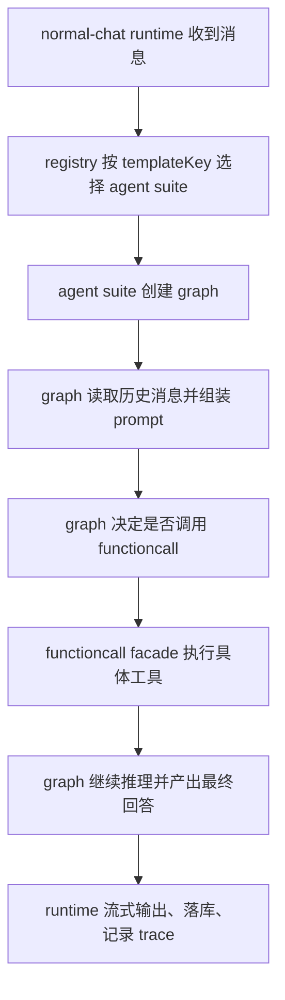

# normal-chat agent 目录

## 目录职责

这里放的是 normal-chat 的 **Agent 套件层**，不是会话总控层，也不是具体工具的杂物堆。

- `runtime/`：会话生命周期总控，只负责收消息、发事件、控制中断、落库、调用模型和驱动图谱执行。
- `registry/`：Agent 套件注册入口，根据 `templateKey` 选择对应的 agent 套件。
- `contracts/`：Agent 子系统内部共享契约，定义 runtime、graph、trace、tool 执行上下文。
- `Agents/`：具体 Agent 实现目录，每个 agent 自己维护自己的 graph 和 functioncall。
- `trace/`：最小 trace recorder，给 graph / tool 执行提供记录能力。
- `utils/`：通用小工具，放与具体 agent 无关的纯函数。

## 当前架构边界

当前这套 normal-chat 的原则是：

1. `runtime` 只认识“**通用 suite**”，不直接认识某个具体 functioncall 的实现。
2. `registry` 负责把 `templateKey` 映射成可创建的 agent suite。
3. `graph` 负责 Agent 的推理流程和工具编排。
4. `functioncall` 负责该 Agent 自己的工具封装和公共 tool facade。
5. `pubmed-search` 之类的具体工具实现，只能留在对应 agent 的 functioncall 子目录里。

换句话说：

- **runtime 负责“怎么跑一次对话”**
- **agent 负责“怎么思考、怎么调用工具”**
- **functioncall 负责“这个 agent 有哪些可复用工具能力”**

## 目录结构

```text
agent/
├── README.md
├── contracts/
│   └── index.ts
├── registry/
│   ├── index.ts
│   └── index.test.ts
├── runtime/
│   ├── index.ts
│   └── normal-chat-conversation.runtime.ts
├── trace/
│   └── index.ts
├── utils/
│   └── index.ts
└── Agents/
    └── base-chat-agent/
        ├── index.ts
        ├── graph.ts
        └── functioncall/
            ├── index.ts
            ├── index.test.ts
            └── pubmed-search/
                ├── schema.ts
                └── execute.ts
```

## 执行流程



## 读取顺序

如果你要理解这套架构，建议按这个顺序看：

1. [`runtime/normal-chat-conversation.runtime.ts`](./runtime/normal-chat-conversation.runtime.ts)
2. [`registry/index.ts`](./registry/index.ts)
3. [`Agents/base-chat-agent/graph.ts`](./Agents/base-chat-agent/graph.ts)
4. [`Agents/base-chat-agent/functioncall/index.ts`](./Agents/base-chat-agent/functioncall/index.ts)
5. [`Agents/base-chat-agent/functioncall/pubmed-search/execute.ts`](./Agents/base-chat-agent/functioncall/pubmed-search/execute.ts)
6. [`contracts/index.ts`](./contracts/index.ts)

## 新增 Agent 的约定

新增一个 agent 时，优先遵守下面这条线：

- 在 `Agents/<agent-name>/` 下放自己的 `graph.ts`。
- 如果这个 agent 有可复用工具封装，再加 `functioncall/index.ts`。
- 具体工具实现放在 `functioncall/<tool-name>/`。
- 只在 `registry/index.ts` 注册，不要把具体工具实现回流到 `runtime`。
- 如果某个工具逻辑将来会被同一个 agent 的多个 graph 复用，优先放进该 agent 的 `functioncall/index.ts`。

## 维护原则

- `runtime` 不要直接 import 某个具体工具的 `execute.ts`。
- `graph` 不要直接依赖 `runtime` 的业务编排细节，只拿它需要的桥接能力。
- `functioncall` 目录内部可以有公共 facade，但不要把 agent 私有逻辑上提到 `runtime`。
- 新增或调整架构时，README 要同步更新，避免文档和实现脱节。
