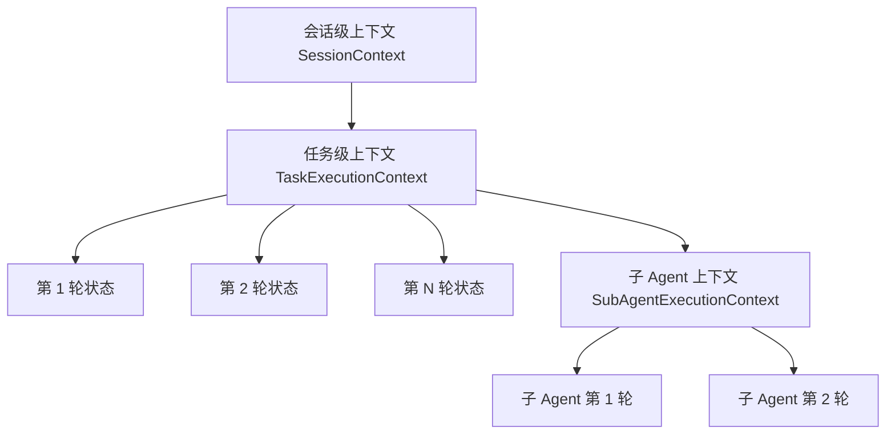
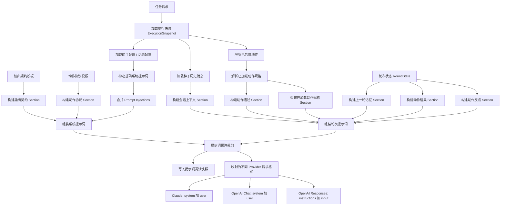

# normal-chat 改造计划 v1

## 目标与原则

本次改造采用“演进式重构”路线，不直接把 `normal-chat` 重写成 Claude Code，而是在保留当前 `normal_chat_action` 文本协议的前提下，把运行时补强成一个更完整的 agent kernel。目标不是一次性追求 provider-native tool calling，而是先把以下基础能力补齐：

- 动作协议强约束化：从“提示词里描述 schema”升级为“运行时统一校验、权限、执行、结果映射”。
- 多轮工作记忆：当前任务不再像“失忆重开”，而是能回看自己上一轮的计划、动作与结果。
- 流式调用与可观测性：既能给前端提供更细粒度的过程反馈，也能让调试系统看到关键运行细节。
- 恢复与裁剪系统：面对解析失败、schema 失败、provider 错误、上下文膨胀时，有统一的修复和预算机制。
- 子 agent 与并发执行：在不破坏稳定性的前提下，逐步支持局部并发和更清晰的上下文边界。

核心原则：

1. 先把应用层 runtime 做完整，再决定是否接入 provider-native tool calling。
2. 调试系统必须能看到“模型可见内容”和“运行时真实执行内容”的差异，不能因为裁剪或压缩而失去可解释性。
3. 所有上下文处理都应该基于结构化 section，而不是对一大段字符串做黑盒截断。
4. `body_md` 是用户可见的正文，不承担隐藏思维转储职责；如果需要展示深度思考，必须走独立通道。
5. 默认优先使用程序自动提取 memory 和调试摘要，避免每轮额外追加一次 LLM 调用；只有远轮压缩才考虑可选的 LLM-assisted compact。

当前关键落点：

- 运行时主循环：[agent-runtime.ts](/D:/code/Large-scale-integrated-project/HNULS-LabHub/HNULS-LuminaStudio/LuminaStudio/src/main/services/normal-chat/runtime/agent/agent-runtime.ts)
- 提示词构建：[prompt-builder.ts](/D:/code/Large-scale-integrated-project/HNULS-LabHub/HNULS-LuminaStudio/LuminaStudio/src/main/services/normal-chat/runtime/prompt/prompt-builder.ts)
- 动作执行：[action-executor.service.ts](/D:/code/Large-scale-integrated-project/HNULS-LabHub/HNULS-LuminaStudio/LuminaStudio/src/main/services/normal-chat/runtime/actions/shared/action-executor.service.ts)
- 任务入口：[runtime-service.ts](/D:/code/Large-scale-integrated-project/HNULS-LabHub/HNULS-LuminaStudio/LuminaStudio/src/main/services/normal-chat/runtime/runtime-service.ts)
- 调试事件输出：[stream-publisher.ts](/D:/code/Large-scale-integrated-project/HNULS-LabHub/HNULS-LuminaStudio/LuminaStudio/src/main/services/normal-chat/runtime/streaming/stream-publisher.ts)
- 模型调用持久化：[round-persistence.service.ts](/D:/code/Large-scale-integrated-project/HNULS-LabHub/HNULS-LuminaStudio/LuminaStudio/src/main/services/normal-chat/runtime/agent/round-persistence.service.ts)

## 一、重构后的总体模型

建议把系统显式拆成以下 7 个概念：

1. `ExecutionSnapshot`
当前请求的不可变基线，已存在于 `conversation.types.ts` 中。

2. `SessionContext`
会话级上下文，表示一个 topic / conversation 的稳定背景，包括基础 system prompt、prompt injections、种子历史、已启用动作池。

3. `TaskExecutionContext`
单次消息驱动的一整次 agent 循环上下文，生命周期从 `sendMessage()` 到 `finish`。

4. `RoundState`
当前 agent 在一次任务中的可变工作状态，包括轮次编号、已加载动作、动作结果、动作反馈、上一轮 artifacts、恢复信息等。

5. `PromptBundleV2`
提示词分层产物，显式区分系统层和轮次层，并为调试系统保留 section 级快照。

6. `ActionRuntime`
动作统一协议层，负责 schema、权限、执行、并发性、结果投影。

7. `Persistence + Debug + Stream`
持久化、调试快照和前端流式事件三者的统一出入口。

### 1.1 三层上下文关系

- 会话级上下文 `SessionContext`
  负责长期背景与稳定身份。
- 任务级上下文 `TaskExecutionContext`
  负责本次用户消息触发的完整 agent loop。
- 子 agent 上下文 `SubAgentExecutionContext`
  负责从父任务切出来的局部研究分支。

Mermaid：



设计原则：

- `SessionContext` 以只读为主，不在轮次运行中随意修改。
- `TaskExecutionContext` 是主工作区，承载本次任务的所有可变状态。
- `SubAgentExecutionContext` 是派生副本，不直接回写父级原始上下文，只回写结果摘要。

## 二、调试系统与可观测性设计

目标：在不明显提高系统复杂度的前提下，让调试系统能看到每个关键状态转移点和每个关键快照。

### 2.1 三级可观测模型

第一级：业务主视图

- Task
- AgentRun
- ActionRun
- ModelCall
- ConversationMessage

用途：看整体执行路径和最终结果。

第二级：运行时事件流

事件类型建议固定枚举，不允许各模块自由发散：

- `status`
- `prompt-built`
- `prompt-budget-trimmed`
- `model-start`
- `model-first-token`
- `model-text-delta`
- `model-done`
- `model-parse-succeeded`
- `model-parse-failed`
- `action-queued`
- `action-validated`
- `action-permission`
- `action-started`
- `action-finished`
- `memory-updated`
- `repair-triggered`
- `finish`
- `error`

第三级：调试快照

这些内容不建议都做成独立事件，而是挂到已有实体上：

- `ModelCall.debugPromptSnapshot`
- `ActionRun.debugValidationSnapshot`
- `ActionDefinition.debugSchemaSnapshot`
- `RoundState.debugMemorySnapshot`

### 2.2 Schema 调试快照设计

关键要求：无论模型可见 schema 和运行时真实 schema 如何裁剪、调整，调试对话框必须能查看裁剪前和裁剪后。

因此 action schema 必须拆成 3 层：

- `runtimeSchema`：运行时真实 `safeParse` 使用的 schema。
- `publicSchema`：给模型看的裁剪后 schema。
- `debugSchemaSnapshot`：用于调试和 diff 展示的快照。

建议结构：

```ts
export interface NormalChatActionSchemaDebugSnapshot {
  actionKey: string
  runtimeSchemaJson: Record<string, unknown>
  publicSchemaJson: Record<string, unknown>
  redactionSummary: {
    removedFields: string[]
    changedFields: Array<{
      fieldPath: string
      reason: string
      before?: unknown
      after?: unknown
    }>
  }
}
```

调试 UI 至少展示：

- Runtime Schema
- Public Schema
- Schema Diff / Why Redacted

也就是说，`publicSchema` 的引入不能以牺牲可解释性为代价。

### 2.3 调试系统实施原则

- 所有模块只通过统一的 `RuntimeDebugRecorder` 输出调试信息。
- 不允许每个 service 自由定义自己的调试 payload 结构。
- 高频 delta 事件不应每个 token 都持久化；落库时采用 100-200ms 聚合或只更新 `modelCalls.responseStreamText`。
- “发生了什么”用事件表示，“当时看到了什么”用快照表示。

## 三、动态提示词构建设计

### 3.1 提示词分层

新的 `PromptBundleV2` 必须至少分成两层：

- `compiledSystemPrompt`
- `compiledRoundPrompt`

系统层 section：

- `identity`
- `outputContract`
- `actionProtocol`
- `repairContract`

轮次层 section：

- `context`
- `priorRoundMemory`
- `actionDescriptions`
- `loadedActionSpecs`
- `actionResults`
- `actionFeedback`
- 可选的 `thinkingDigest` 与 `repairNotice`

建议结构：

```ts
export interface NormalChatPromptBundleV2 {
  systemSections: {
    identity: string
    outputContract: string
    actionProtocol: string
    repairContract: string
  }
  roundSections: {
    context: string
    priorRoundMemory: string
    actionDescriptions: string
    loadedActionSpecs: string
    actionResults: string
    actionFeedback: string
    thinkingDigest?: string
    repairNotice?: string
  }
  compiledSystemPrompt: string
  compiledRoundPrompt: string
}
```

### 3.2 动态提示词构建流程



### 3.3 提示词约束建议

#### OutputContract v2

```md
## OutputContract
Write user-facing content as concise Markdown.
Your Markdown body is visible to the user and may be summarized back to you next round.
Do not dump hidden chain-of-thought.
Use 1-4 short paragraphs to explain:
1. what you learned,
2. what you will do next,
3. or your final answer if no action is needed.

If you need the program to execute an action, append one or more fenced code blocks tagged normal_chat_action.
Each normal_chat_action block must contain exactly one JSON object:
{"actionKey":"...","input":{...}}

Rules:
- actionKey must come from the currently exposed action list.
- slow mode actions may only be called after their full schema appears in LoadedActionSpecs.
- if ActionFeedback reports a previous validation or permission failure, do not repeat the same invalid call unchanged.
- if no action is needed, output only Markdown.
```

#### ActionProtocol

```md
## ActionProtocol
Fast actions may be called directly once exposed.
Slow actions expose only a description until you explicitly load their full spec.
Use system.get_action_spec only when you are actually ready to call that slow action in the current or next immediate step.
Do not prefetch a large set of backup actions.
```

#### RepairNotice

```md
## RepairNotice
The previous round could not be executed by the runtime.
Reason: {{error}}

Repair the structure instead of restarting the task.
Preserve any still-valid Markdown answer.
If actions are needed, emit them only as normal_chat_action blocks with valid actionKey and schema-conforming input.
```

## 四、ActionRuntime：统一动作协议层

### 4.1 目标

把当前“schema 写在 prompt 里，执行时手工归一化”的模式升级为统一 pipeline：

- `safeParse`
- `validateInput`
- `checkPermissions`
- `execute`
- `mapResult`

### 4.2 动作定义接口

```ts
import { z } from 'zod'

export type ActionValidationResult =
  | { ok: true; normalizedInput?: unknown }
  | { ok: false; kind: 'schema' | 'business'; message: string; retryable: boolean }

export type ActionPermissionResult =
  | { behavior: 'allow'; updatedInput?: unknown }
  | { behavior: 'deny'; message: string; retryable: boolean }

export interface ActionRuntimeContext {
  taskId: string
  requestId: string
  roundIndex: number
  agentDepth: number
  executionSnapshot: NormalChatTaskExecutionSnapshot
}

export interface NormalChatRuntimeActionDefinition<
  TInputSchema extends z.ZodTypeAny,
  TOutput
> {
  descriptor: NormalChatActionDescriptor
  inputSchema: TInputSchema
  publicSchema?: Record<string, unknown>
  prompt: string
  alwaysLoaded?: boolean
  isReadOnly?(input: z.infer<TInputSchema>): boolean
  isConcurrencySafe?(input: z.infer<TInputSchema>): boolean
  validateInput?(
    input: z.infer<TInputSchema>,
    ctx: ActionRuntimeContext
  ): Promise<ActionValidationResult>
  checkPermissions?(
    input: z.infer<TInputSchema>,
    ctx: ActionRuntimeContext
  ): Promise<ActionPermissionResult>
  execute(
    input: z.infer<TInputSchema>,
    ctx: ActionRuntimeContext
  ): Promise<TOutput>
}
```

### 4.3 执行伪代码

```ts
async function executeOneAction(call, ctx) {
  const def = registry.get(call.actionKey)
  if (!def) return actionError('unknown_action', 'Unknown action', { retryable: false })

  const parsed = def.inputSchema.safeParse(call.input)
  if (!parsed.success) {
    return actionError('schema_error', formatZodError(parsed.error), { retryable: true })
  }

  let input = parsed.data

  if (def.validateInput) {
    const valid = await def.validateInput(input, ctx)
    if (!valid.ok) return actionError(valid.kind, valid.message, { retryable: valid.retryable })
    if (valid.normalizedInput) input = valid.normalizedInput
  }

  if (def.checkPermissions) {
    const perm = await def.checkPermissions(input, ctx)
    if (perm.behavior === 'deny') {
      return actionError('permission_denied', perm.message, { retryable: perm.retryable })
    }
    if (perm.updatedInput) input = perm.updatedInput
  }

  const output = await def.execute(input, ctx)
  return actionSuccess(output)
}
```

### 4.4 结果记录结构

```ts
export interface NormalChatActionResultRecord {
  actionKey: string
  title: string
  status: 'success' | 'schema_error' | 'validation_error' | 'permission_denied' | 'execution_error'
  retryable: boolean
  inputJson: string
  outputJson: string | null
  errorMessage: string | null
  modelFacingSummaryMd: string
}
```

## 五、Round Memory 回填与自动提取策略

### 5.1 目标

补齐当前最大的语义缺口：下一轮不再只能看到初始 history 和 actionResults，而是能回看上一轮 assistant 可见计划文本、计划动作和动作结果。

### 5.2 核心结论

第一版采用“程序自动提取为主，LLM 压缩为辅”的策略：

- 近轮记忆：程序自动提取，不额外调用 LLM。
- 动作结果摘要：优先程序投影，不额外调用 LLM。
- 远轮压缩：达到阈值后可选单独调用一个便宜模型做 memory compaction。

不建议每轮“顺便再调用一次 LLM 做总结”，否则会：

- 提高成本
- 引入二次幻觉
- 把主任务和记忆整理耦合在一起

### 5.3 数据结构

```ts
export interface NormalChatAssistantRoundArtifact {
  roundIndex: number
  bodyMd: string
  plannedActions: Array<{
    actionKey: string
    inputPreview: string
  }>
  resultSummaryMd: string
  compactSummaryMd: string
}
```

### 5.4 自动提取规则

- `bodyMd`：直接来自本轮 `structuredOutput.body_md`。
- `plannedActions`：直接来自本轮 `structuredOutput.action_calls`。
- `resultSummaryMd`：由程序根据 action 结果模板拼装。
- `compactSummaryMd`：仅在远轮压缩时生成。

示例：

```ts
const artifact: NormalChatAssistantRoundArtifact = {
  roundIndex,
  bodyMd: structuredOutput.body_md,
  plannedActions: structuredOutput.action_calls.map(call => ({
    actionKey: call.actionKey,
    inputPreview: buildInputPreview(call.input)
  })),
  resultSummaryMd: summarizeActionResults(actionResultsOfThisRound),
  compactSummaryMd: ''
}
```

### 5.5 回填策略

- 最近 3 轮：详细保留。
- 更老轮次：合并成一段 `older_round_digest`。
- `bodyMd` 不原样无限注入，建议截断到 200-400 字。
- `resultSummaryMd` 不直接注入完整 JSON，而是优先使用结构化摘要。

#### PriorRoundMemory 示例

```md
## PriorRoundMemory

### Round 1
Assistant summary:
先确认需要文献检索，再查询 PubMed 的高相关结果。

Planned actions:
- functioncall.pubmed_search(query="COVID-19", top_k=5)

Outcome summary:
PubMed 返回 5 条结果，主题集中在 long COVID 与免疫反应。
```

#### ActionFeedback 示例

```md
## ActionFeedback

### functioncall.pubmed_search
status: schema_error
retryable: true
message: top_k must be an integer between 1 and 20
fix_hint: set top_k to a small integer such as 3 or 5
```

### 5.6 子 agent 结果

当前 `childSummaries` 已被收集，但没有真正参与后续 prompt。重构后应二选一：

- 要么删掉，避免误导后续结构。
- 要么纳入 `PriorRoundMemory` 的子节，例如 `ChildAgentSummary`。

建议采用后者，但只写摘要，不原样注入整个子 agent 正文。

## 六、Thinking / 深度思考通道设计

### 6.1 设计结论

需要支持深度思考展示，但不能让其混入 `body_md` 主正文，也不应默认直接回填进下一轮。

`body_md` 的职责：

- 用户可见正文
- 下一轮自己的短状态文本
- 不是隐藏思维转储

### 6.2 新的消息 part 建议

```ts
export interface NormalChatThinkingMessagePart {
  kind: 'thinking'
  source: 'provider-native' | 'assistant-tagged'
  title: string
  content: string
  isStreaming: boolean
  roundIndex: number
  depth: number
}
```

### 6.3 Thinking 来源

- `provider-native`
  如果底层 provider 原生返回 reasoning / thinking block，则直接承接。
- `assistant-tagged`
  对于没有原生思考通道的 provider，可约定模型输出单独 fenced block，例如：

```md
```normal_chat_thinking
...
```
```

再由 parser 把它拆成 `thinking` part。

### 6.4 Thinking 使用规则

- 默认只用于调试和单独渲染。
- 默认不进入下一轮 `PriorRoundMemory`。
- 如果未来需要进入下一轮，只能进入程序压缩后的 `thinkingDigest`，不能原样喂回去。

## 七、流式 Transport 改造

### 7.1 目标

先支持真正的文本流式输出，不急于实现 mid-stream action execution。后者仅在未来接入 provider-native tool calling 后才考虑。

### 7.2 接口改造

```ts
export type NormalChatModelStreamEvent =
  | { type: 'start' }
  | { type: 'first-token'; latencyMs: number }
  | { type: 'text-delta'; delta: string }
  | { type: 'usage'; promptTokens?: number; completionTokens?: number; totalTokens?: number }
  | { type: 'done'; fullText: string }
  | { type: 'error'; message: string }

export interface NormalChatModelAdapter {
  invokeRound(input: NormalChatScriptRoundInput): Promise<string>
  streamRound?(
    input: NormalChatScriptRoundInput
  ): AsyncGenerator<NormalChatModelStreamEvent, string, void>
}
```

### 7.3 运行时逻辑

```ts
if (streamingEnabled && modelAdapter.streamRound) {
  let buffer = ''
  for await (const event of modelAdapter.streamRound(input)) {
    if (event.type === 'text-delta') {
      buffer += event.delta
      streamPublisher.publish(..., { type: 'assistant-text-delta', delta: event.delta })
    }
    if (event.type === 'first-token') {
      recordLatency(event.latencyMs)
    }
  }
  rawModelResponseText = buffer
} else {
  rawModelResponseText = await modelAdapter.invokeRound(input)
}
structuredOutput = parser.parse(rawModelResponseText)
```

### 7.4 新增运行时事件

```ts
export interface NormalChatConversationAssistantTextDeltaEvent {
  type: 'assistant-text-delta'
  requestId: string
  topicId: string
  delta: string
  roundIndex: number
  depth: number
}
```

## 八、恢复策略与 Prompt Budget

### 8.1 恢复目标

把“出错就整轮失败”升级为：

- 可恢复错误：进入下一轮修复
- 不可恢复错误：终止任务

建议首批支持的恢复类型：

- output contract 解析失败
- action schema 校验失败
- action business validation 失败
- permission deny
- provider 瞬时错误
- prompt 过长 / 上下文过大

### 8.2 恢复原则

- 同类错误不要无限重试，每类最多 1-2 次。
- 恢复信息通过 `ActionFeedback` 或 `RepairNotice` 注入下一轮。
- 恢复行为必须出现在调试系统中，且可被回放。

### 8.3 Prompt Budget 策略

第一阶段不做 tokenizer 级精算，先做 section 级字符预算。

新增 runtime 配置建议：

- `promptBudgetChars`
- `roundMemoryWindow`
- `maxRepairAttempts`
- `maxProviderRetries`

裁剪顺序建议：

1. `LoadedActionSpecs` 中当前轮未必需要的慢动作 spec
2. 老的 `PriorRoundMemory`
3. `ActionResults` 的长 JSON，仅保留摘要
4. 最老的 `seedHistoryMessages`

不应优先裁掉的内容：

- 当前用户输入
- 当前任务目标
- 最近一轮或最近几轮的 `ActionFeedback`
- 当前可执行动作最小集

伪代码：

```ts
const built = promptBuilder.build(...)
const budgeted = promptBudgetService.fit(built, {
  maxChars: runtime.promptBudgetChars,
  trimOrder: ['loadedActionSpecs', 'priorRoundMemory', 'actionResults', 'seedHistory']
})
```

## 九、并发 action 执行

### 9.1 目标

把当前严格串行的 `for ... of` 执行方式升级为“仅对并发安全 action 并发”。

首批建议：

- `system.get_action_spec`：可并发
- `functioncall.pubmed_search`：可并发
- `system.dispatch_sub_agent`：保持串行

### 9.2 批处理器

```ts
type ActionBatch = {
  parallel: boolean
  calls: NormalChatActionCall[]
}

function partitionActionCalls(calls, defs): ActionBatch[] {
  const batches: ActionBatch[] = []
  for (const call of calls) {
    const def = defs.get(call.actionKey)
    const safe = !!def?.isConcurrencySafe?.(call.input as never)
    const last = batches.at(-1)
    if (safe && last?.parallel) last.calls.push(call)
    else batches.push({ parallel: safe, calls: [call] })
  }
  return batches
}
```

执行伪代码：

```ts
for (const batch of batches) {
  if (batch.parallel) {
    const settled = await Promise.allSettled(batch.calls.map(call => executeOneAction(call, ctx)))
    consumeResultsInOriginalOrder(settled)
  } else {
    for (const call of batch.calls) {
      const result = await executeOneAction(call, ctx)
      consumeResult(result)
    }
  }
}
```

注意：并发执行不等于并发写上下文。结果写回顺序仍应按原 action call 顺序落地，保证下一轮上下文稳定。

## 十、Provider-native Tool Calling 的位置

### 10.1 定义

provider-native tool calling 指的是：不是通过 prompt 约定模型输出某种 JSON 文本格式，而是把工具 schema 直接交给 provider API，由模型返回结构化的 `tool_call / function_call / tool_use`，再由运行时直接执行和回填结果。

### 10.2 当前结论

这一步暂不作为当前计划主线。原因：

- 当前更大的缺口是运行时内核不完整，而不是 provider 原生工具能力缺失。
- 先把 action runtime、memory、流式、恢复、裁剪做好，收益更大。
- 等前 5 个阶段做完后，再考虑做“双通道”：
  - 支持 native tools 的 provider：走 native
  - 其他 provider：保留 `normal_chat_action` 文本协议作为 fallback

## 十一、实施顺序

建议严格按以下顺序执行：

1. Phase 0：状态抽象与 PromptBundleV2。
2. Phase 1：ActionRuntime 强约束化与 schema 调试快照。
3. Phase 2：Round Memory、ActionFeedback、Child Summary 回填。
4. Phase 3：文本流式 transport 与 provider 分层发送。
5. Phase 4：RecoveryPolicy 与 Prompt Budget。
6. Phase 5：并发 action 执行。
7. Phase 6：可选 provider-native tool calling。

## 十二、测试策略

现有 parser、prompt builder、graph runner 的测试基础继续保留，新增测试重点：

- action pipeline：schema 错、business 错、permission deny、success
- schema debug snapshot：runtime/public/diff 是否正确生成
- round memory：上一轮 body 和 action 结果是否进入下一轮 prompt
- action feedback：失败是否形成可重试提示
- repair flow： malformed `normal_chat_action` 后是否生成 `RepairNotice`
- prompt budget：超长时是否按 section 规则裁剪
- parallel planner：并发/串行 batch 是否保序
- stream transport：fake adapter 是否能稳定产出 delta
- thinking part：provider-native 与 assistant-tagged 是否都能拆分到独立通道

## 十三、后续文档建议

本计划修改完成后，建议再补两份配套文档：

- `schema-and-debugging.md`
  详细说明 `runtimeSchema/publicSchema/debugSchemaSnapshot` 的规则与 UI 展示方式。
- `prompt-and-memory.md`
  详细说明 SessionContext、TaskExecutionContext、SubAgentExecutionContext，以及 Round Memory 的自动提取与压缩策略。
