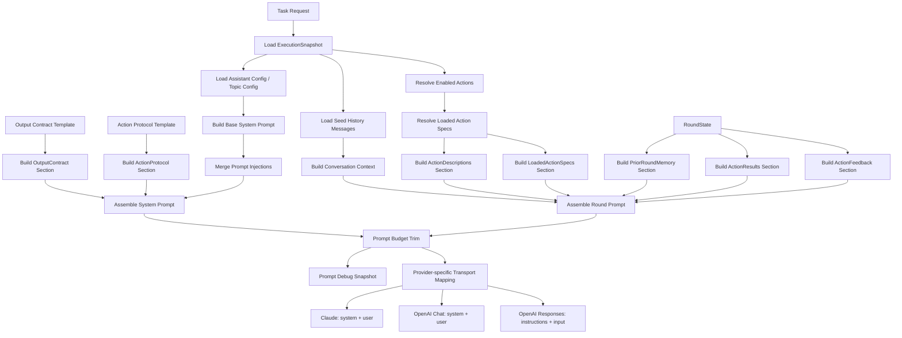

<!--
  Normal Chat Prompt 构建与调用流程图

  该流程图描述了从任务请求到 LLM 调用的完整 Prompt 构建流程：

  1. 加载阶段（B~F）：
     - 从任务快照中加载执行上下文（ExecutionSnapshot）
     - 加载种子历史消息、助手/话题配置
     - 解析已启用的动作和已加载的动作规格

  2. Prompt 组装阶段（G~S）：
     - 系统 Prompt：基础系统 Prompt + Prompt 注入 + 输出契约 + 动作协议
     - 轮次 Prompt：对话上下文 + 历史记忆 + 动作描述 + 动作规格 + 动作结果 + 动作反馈

  3. 预算控制阶段（V）：
     - 对编译后的 Prompt 进行字符数预算检查
     - 按优先级截断低优先级段（loadedActionSpecs → priorRoundMemory → actionResults → actionFeedback → context）

  4. 提供商映射阶段（X~AA）：
     - Claude：映射为 system + user 消息
     - OpenAI Chat：映射为 system + user 消息
     - OpenAI Responses：映射为 instructions + input 参数
-->