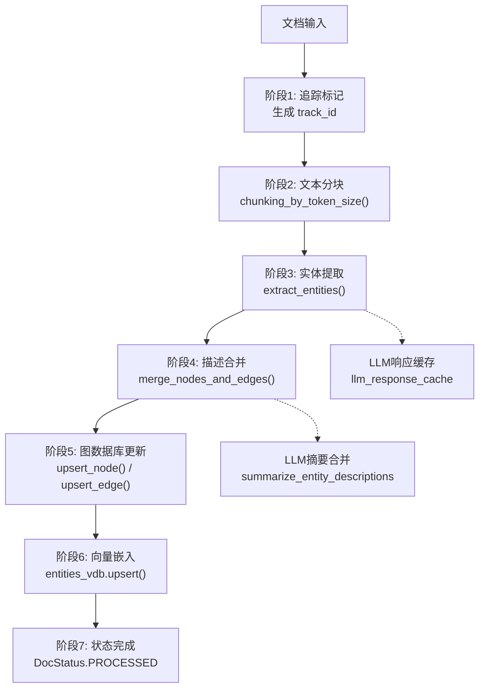
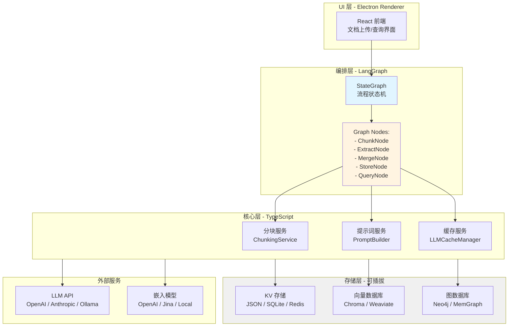

# DeepWiki Q&A with Code Context for Repository: HKUDS/LightRAG
## Q1
帮我出具一份文档给我讲解他进行知识图谱构建的全流程以便于我在electron中使用langgraph进行1:1复刻
同时出具一个mvr的架构设计和应有的功能 以及列出一些列阶段来让我可以逐步横向文档的扩展又不需要中间大改架构来逐步复刻原lightrag的功能
核心工作之一就是提示词 需要讲解提示词设计等等
### Answer
# LightRAG 知识图谱构建全流程详解与 Electron + LangGraph 复刻指南

## 一、知识图谱构建完整流程

LightRAG 的知识图谱构建采用**七阶段流水线架构**，从文档摄入到最终存储形成完整的数据处理链。

### 1.1 整体架构流程图



### 1.2 阶段详解

#### 阶段 1: 文档追踪与队列管理

文档进入系统后首先生成追踪 ID 并建立状态记录： LightRAG:1257-1284 

**核心功能：**
- 生成唯一 `track_id` 用于监控处理状态
- 对文档内容进行 MD5 哈希生成 `doc_id`
- 创建文档状态记录（PENDING 状态）
- 去重处理，避免重复摄入

#### 阶段 2: 文本分块（Chunking）

使用 token 计数进行智能分块： LightRAG:99-162 

**分块策略：**
- 默认块大小：1200 tokens
- 块间重叠：100 tokens（保持上下文连续性）
- 支持自定义分隔符（如按段落分割）
- 每个块携带元数据：`chunk_order_index`、`tokens`、`full_doc_id`、`file_path`

#### 阶段 3: 实体与关系提取

这是**核心阶段**，通过 LLM 从文本块中提取结构化知识： LightRAG:2768-2856 

**提取流程：**

1. **初始提取（Initial Extraction）**
   - 使用 `entity_extraction_system_prompt` 和 `entity_extraction_user_prompt`
   - 并发处理多个块（默认 4 个并发）
   - LLM 输出格式化的实体和关系数据

2. **补充提取（Gleaning Pass）**
   - 使用 `entity_continue_extraction_user_prompt`
   - 捕获初次遗漏的实体/关系
   - 可配置 `entity_extract_max_gleaning` 次数 LightRAG:2872-2923 

3. **结果解析与验证**

实体解析： LightRAG:379-448 

关系解析： LightRAG:451-530 

**数据验证规则：**
- 实体名称去重与规范化（title case）
- 实体类型限制在预定义列表内
- 关系方向处理（无向图，src/tgt 排序）
- 空值与格式错误过滤

#### 阶段 4: 描述合并（Map-Reduce 摘要）

多个块可能提取到相同实体/关系的不同描述，需要合并： LightRAG:165-295 

**合并策略（Map-Reduce 递归）：**

1. **条件判断**
   - 描述少于 `force_llm_summary_on_merge` 且总 token < `summary_context_size`：直接拼接
   - 否则进入 LLM 摘要流程

2. **Map 阶段**
   - 将描述列表按 `summary_max_tokens` 分组
   - 每组至少 2 个描述（避免单描述无意义调用）

3. **Reduce 阶段**
   - 对每组调用 LLM 生成摘要
   - 递归处理：若摘要结果仍超限，再次 Map-Reduce

4. **摘要生成** LightRAG:297-376 

使用提示词模板： LightRAG:185-218 

#### 阶段 5: 图数据库存储

将合并后的实体和关系写入图存储： LightRAG:2722-2759 

**存储操作：**
- `chunk_entity_relation_graph.upsert_node()` - 存储实体节点
- `chunk_entity_relation_graph.upsert_edge()` - 存储关系边
- 使用分布式锁 `get_storage_keyed_lock` 保证多进程一致性 LightRAG:688-715 

#### 阶段 6: 向量嵌入

为实体、关系和文本块生成向量表示，支持语义检索： LightRAG:2189-2218 

**向量化目标：**
- `entities_vdb` - 实体描述向量
- `relationships_vdb` - 关系描述向量  
- `chunks_vdb` - 原始文本块向量

#### 阶段 7: 状态更新

将文档状态从 PENDING 更新为 PROCESSED，完成整个流程。

---

## 二、提示词设计详解（核心重点）

LightRAG 的提示词设计是系统的**灵魂**，采用严格的格式化输出和多语言支持。

### 2.1 提示词架构

所有提示词存储在统一的字典中： LightRAG:1-10 

### 2.2 实体提取提示词设计

#### System Prompt（系统指令） LightRAG:11-61 

**设计要点：**

1. **角色定义**
   - 明确角色："Knowledge Graph Specialist"
   - 职责：提取实体和关系

2. **输出格式规范**
   
   实体格式（4 字段）：
   ```
   entity<|#|>实体名<|#|>实体类型<|#|>实体描述
   ```
   
   关系格式（5 字段）：
   ```
   relation<|#|>源实体<|#|>目标实体<|#|>关系关键词<|#|>关系描述
   ```

3. **核心规则**
   - **分隔符协议**：`<|#|>` 作为原子标记，不可填充内容
   - **命名一致性**：实体名称统一采用 title case
   - **N 元关系分解**：将多实体关系拆分为二元关系
   - **方向无关性**：关系视为无向边
   - **第三人称客观性**：避免使用"this article"、"our company"等

4. **多语言支持**
   - 变量：`{language}` - 控制输出语言
   - 专有名词保留原语言（避免翻译歧义）

5. **完成信号**
   - 输出结束标记：`<|COMPLETE|>`

#### User Prompt（用户指令） LightRAG:63-82 

**动态变量：**
- `{entity_types}` - 允许的实体类型列表
- `{input_text}` - 待提取的文本块
- `{language}` - 目标语言

#### Continue Extraction Prompt（补充提取） LightRAG:84-100 

**补充策略：**
- 仅输出**遗漏**或**格式错误**的实体/关系
- 不重复正确提取的内容
- 修正截断或字段缺失的记录

### 2.3 Few-Shot 示例设计

提供 3 个高质量示例引导 LLM 输出： LightRAG:102-183 

**示例覆盖场景：**
1. **叙事文本**：人物关系和设备交互（Alex、Taylor、Jordan、The Device）
2. **金融新闻**：市场事件和企业关系（Stock markets、Tech Index、Nexon Technologies）
3. **体育报道**：简洁事实提取（World Athletics Championship、Noah Carter、Carbon-Fiber Spikes）

**示例设计原则：**
- 展示正确的分隔符使用
- 覆盖不同实体类型
- 演示关系关键词提取
- 包含多语言实体名处理

### 2.4 摘要合并提示词 LightRAG:185-218 

**合并要求：**
- 输入：JSONL 格式的多个描述
- 输出：单一连贯段落
- 约束：不超过 `{summary_length}` tokens
- 冲突处理：
  - 优先判断是否为不同实体/关系（同名不同义）
  - 若确属同一对象，尝试调和或注明不确定性

### 2.5 查询响应提示词

#### RAG Response Prompt LightRAG:224-276 

**核心指令：**
1. **严格上下文依赖**："ONLY using the information within the provided Context"
2. **引用追踪**：记录 `reference_id` 并生成引用列表
3. **Markdown 格式化**：增强可读性
4. **引用格式**：
   ```markdown
   ### References
   - [1] Document Title One
   - [2] Document Title Two
   ```

#### Naive RAG Prompt（纯向量检索） LightRAG:278-330 

简化版本，仅使用文本块（不使用知识图谱）。

### 2.6 关键词提取提示词

用于查询时生成高/低层级关键词： LightRAG:374-432 

**输出格式（JSON）：**
```json
{
  "high_level_keywords": ["国际贸易", "全球经济稳定"],
  "low_level_keywords": ["关税", "汇率", "进出口"]
}
```

**设计特点：**
- 严格 JSON 输出（无 markdown 包裹）
- 区分概念层级（high/low）
- 多词短语优先（"latest financial report" 而非 "latest", "financial"）
- 边缘情况处理（空输入返回空列表）

---

## 三、MVP（Minimum Viable RAG）架构设计

为 Electron + LangGraph 复刻设计的渐进式架构。

### 3.1 架构分层



### 3.2 核心模块与职责

#### 模块 1: 文档处理流水线（DocumentPipeline）

**职责：**
- 接收文档输入
- 生成追踪 ID
- 状态管理（PENDING → PROCESSING → PROCESSED）

**接口：**
```typescript
interface DocumentPipeline {
  enqueueDocuments(docs: string[], ids?: string[]): Promise<string>; // 返回 track_id
  getStatus(trackId: string): Promise<PipelineStatus>;
  cancelProcessing(trackId: string): Promise<void>;
}
```

#### 模块 2: 分块服务（ChunkingService）

**职责：**
- Token 计数（使用 tiktoken.js 或 gpt-tokenizer）
- 智能分块（重叠窗口）
- 分块元数据管理

**接口：**
```typescript
interface ChunkingService {
  chunkByTokenSize(
    content: string,
    chunkSize: number,
    overlapSize: number
  ): TextChunk[];
}

interface TextChunk {
  chunkId: string;
  content: string;
  tokens: number;
  chunkOrderIndex: number;
  fullDocId: string;
}
```

#### 模块 3: 提示词构建器（PromptBuilder）

**职责：**
- 管理所有提示词模板
- 动态变量替换
- 多语言支持

**接口：**
```typescript
interface PromptBuilder {
  buildEntityExtractionPrompt(
    chunk: string,
    language: string,
    entityTypes: string[]
  ): { system: string; user: string };
  
  buildSummaryPrompt(
    descriptions: string[],
    entityName: string,
    language: string
  ): string;
  
  buildQueryPrompt(
    query: string,
    context: ContextData,
    language: string
  ): string;
}
```

#### 模块 4: LLM 缓存管理器（LLMCacheManager）

**职责：**
- 请求/响应缓存
- 哈希键生成
- 缓存失效策略

**接口：**
```typescript
interface LLMCacheManager {
  getCachedResponse(
    prompt: string,
    systemPrompt: string,
    cacheType: 'extract' | 'summary' | 'query'
  ): Promise<CachedResult | null>;
  
  saveCachedResponse(
    prompt: string,
    response: string,
    cacheType: string
  ): Promise<void>;
}
```

#### 模块 5: 实体合并器（EntityMerger）

**职责：**
- 描述列表聚合
- Map-Reduce 摘要
- Token 限制控制

**接口：**
```typescript
interface EntityMerger {
  mergeDescriptions(
    descriptions: string[],
    entityName: string,
    maxTokens: number,
    useLLM: boolean
  ): Promise<string>;
}
```

#### 模块 6: 存储抽象层（StorageAdapter）

**职责：**
- 统一存储接口
- 多后端支持（JSON/SQLite/PostgreSQL/Neo4j）
- 事务管理

**接口：**
```typescript
interface KVStorage {
  upsert(data: Record<string, any>): Promise<void>;
  get(keys: string[]): Promise<Record<string, any>>;
  delete(keys: string[]): Promise<void>;
}

interface VectorStorage {
  upsert(vectors: VectorData[]): Promise<void>;
  query(queryVector: number[], topK: number): Promise<SearchResult[]>;
}

interface GraphStorage {
  upsertNode(id: string, properties: NodeData): Promise<void>;
  upsertEdge(src: string, tgt: string, properties: EdgeData): Promise<void>;
  query(cypher: string): Promise<any[]>;
}
```

#### 模块 7: 查询引擎（QueryEngine）

**职责：**
- 多模式检索（local/global/hybrid/naive/mix）
- 上下文组装
- LLM 生成

**接口：**
```typescript
interface QueryEngine {
  query(
    query: string,
    mode: 'local' | 'global' | 'hybrid' | 'naive' | 'mix',
    topK: number
  ): Promise<QueryResult>;
  
  streamQuery(
    query: string,
    mode: string
  ): AsyncGenerator<string>;
}
```

### 3.3 LangGraph 状态图设计

```typescript
import { StateGraph } from "@langchain/langgraph";

// 定义状态
interface PipelineState {
  documents: string[];
  chunks: TextChunk[];
  extractedEntities: Map<string, Entity[]>;
  extractedRelations: Map<string, Relation[]>;
  mergedEntities: Map<string, string>; // entityName -> description
  mergedRelations: Map<string, string>; // relationKey -> description
  status: 'pending' | 'chunking' | 'extracting' | 'merging' | 'storing' | 'done';
  error?: Error;
}

// 创建图
const workflow = new StateGraph<PipelineState>({
  channels: {
    documents: { value: (x, y) => y ?? x, default: () => [] },
    chunks: { value: (x, y) => y ?? x, default: () => [] },
    extractedEntities: { value: (x, y) => y ?? x, default: () => new Map() },
    // ... 其他 channels
  }
});

// 添加节点
workflow.addNode("chunk", chunkNode);
workflow.addNode("extract", extractNode);
workflow.addNode("merge", mergeNode);
workflow.addNode("store", storeNode);

// 添加边
workflow.addEdge("chunk", "extract");
workflow.addEdge("extract", "merge");
workflow.addEdge("merge", "store");
workflow.addEdge("store", END);

// 编译
const app = workflow.compile();
```

---

## 四、分阶段实施路线图

采用**横向扩展**策略，每个阶段独立可运行，无需回溯重构。

### 阶段 0: 基础设施搭建（1-2 周）

**目标：** 建立项目骨架和开发环境

**任务：**
1. Electron + React 项目初始化
   - 使用 Electron Forge 或 Vite Electron
   - 配置 TypeScript + ESLint
   
2. 安装核心依赖
   ```json
   {
     "@langchain/langgraph": "latest",
     "@langchain/core": "latest",
     "tiktoken": "latest",
     "chromadb": "latest",
     "neo4j-driver": "latest"
   }
   ```

3. 创建模块目录结构
   ```
   src/
   ├── main/               # Electron 主进程
   ├── renderer/           # React UI
   ├── core/
   │   ├── chunking/
   │   ├── prompts/
   │   ├── cache/
   │   ├── merge/
   │   └── storage/
   ├── langgraph/
   │   ├── nodes/
   │   ├── states/
   │   └── workflow.ts
   └── types/
   ```

4. 配置环境变量管理（dotenv）

**验收标准：**
- Electron 应用成功启动
- React 前端显示基础界面
- TypeScript 编译通过

---

### 阶段 1: 文本分块 + 存储（2 周）

**目标：** 实现文档分块和本地存储

**核心实现：**

1. **ChunkingService 实现**
   - 参考 LightRAG 的 token 计数逻辑 LightRAG:99-162 
   
   - 使用 `tiktoken` 库（或 `gpt-tokenizer`）
   - 实现滑动窗口算法

2. **JSON KV Storage 实现**
   - 在本地目录存储 JSON 文件
   - 实现 `upsert()`、`get()`、`delete()` 方法
   - 使用 Node.js `fs/promises` API

3. **UI 功能**
   - 文件上传组件
   - 分块预览界面
   - 显示块的 token 数量

**测试用例：**
- 输入 10KB 文本，验证分块数量和重叠
- 测试中英文混合文本
- 验证 JSON 文件正确保存

**交付物：**
- `ChunkingService.ts`
- `JsonKVStorage.ts`
- 前端上传页面

---

### 阶段 2: 提示词系统 + LLM 集成（2-3 周）

**目标：** 实现提示词管理和 LLM 调用

**核心实现：**

1. **PromptBuilder 实现**
   - 移植 LightRAG 的所有提示词模板 LightRAG:11-61 LightRAG:185-218 
   
   - 支持模板变量替换（`{language}`, `{entity_types}` 等）
   - 提供多语言切换（中文/英文）

2. **LLM 适配器**
   - 封装 OpenAI API（使用 `@langchain/openai`）
   - 支持本地 Ollama（使用 `@langchain/ollama`）
   - 统一接口：
     ```typescript
     interface LLMAdapter {
       invoke(prompt: string, systemPrompt?: string): Promise<string>;
     }
     ```

3. **LLMCacheManager 实现**
   - 使用 MD5 哈希生成缓存键 LightRAG:540-900 
   
   - 缓存类型区分：`extract` / `summary` / `query`
   - 存储在 JSON KV Storage

4. **UI 功能**
   - LLM 配置界面（API Key、模型选择）
   - 提示词预览工具
   - 缓存统计面板

**测试用例：**
- 验证提示词变量正确替换
- 测试 LLM 调用成功返回
- 验证缓存命中率

**交付物：**
- `PromptBuilder.ts`
- `LLMAdapter.ts`
- `LLMCacheManager.ts`
- LLM 配置 UI

---

### 阶段 3: 实体提取流水线（3-4 周）

**目标：** 实现完整的实体/关系提取逻辑

**核心实现：**

1. **EntityExtractor 实现**
   - 解析 LLM 输出（按 `<|#|>` 分隔） LightRAG:379-448 LightRAG:451-530 
   
   - 实体验证逻辑：
     - 名称规范化（title case）
     - 类型校验
     - 描述非空检查
   
   - 关系验证逻辑：
     - 源/目标实体存在性
     - 自环过滤
     - 关键词清洗

2. **并发控制**
   - 使用 `p-limit` 库限制并发数（默认 4）
   - 参考 LightRAG 的 semaphore 机制 LightRAG:2947-2967 

3. **Gleaning Pass（补充提取）**
   - 实现二次提取逻辑 LightRAG:2872-2923 
   
   - 仅输出遗漏/错误的实体

4. **LangGraph 节点**
   ```typescript
   async function extractNode(state: PipelineState): Promise<Partial<PipelineState>> {
     const extractor = new EntityExtractor(llmAdapter, promptBuilder);
     const results = await extractor.extractFromChunks(state.chunks);
     
     return {
       extractedEntities: results.entities,
       extractedRelations: results.relations,
       status: 'extracting'
     };
   }
   ```

**测试用例：**
- 输入示例文本，验证实体提取准确性
- 测试 gleaning 补充提取效果
- 验证并发控制（4 个任务同时进行）

**交付物：**
- `EntityExtractor.ts`
- LangGraph `extractNode`
- 提取结果展示 UI

---

### 阶段 4: 描述合并（Map-Reduce）（2-3 周）

**目标：** 实现多描述合并和 LLM 摘要

**核心实现：**

1. **EntityMerger 实现**
   - 递归 Map-Reduce 算法 LightRAG:165-295 
   
   - Token 计数与分组：
     - 使用 `tiktoken` 计算 token 数
     - 按 `summary_max_tokens` 分组
     - 每组至少 2 个描述
   
   - LLM 摘要调用： LightRAG:297-376 

2. **配置参数**
   ```typescript
   interface MergeConfig {
     forceLLMSummaryOnMerge: number;      // 默认 2
     summaryContextSize: number;           // 默认 4000
     summaryMaxTokens: number;             // 默认 1000
     summaryLengthRecommended: number;     // 默认 500
   }
   ```

3. **LangGraph 节点**
   ```typescript
   async function mergeNode(state: PipelineState): Promise<Partial<PipelineState>> {
     const merger = new EntityMerger(llmAdapter, promptBuilder);
     
     const mergedEntities = await merger.mergeEntities(
       state.extractedEntities
     );
     const mergedRelations = await merger.mergeRelations(
       state.extractedRelations
     );
     
     return {
       mergedEntities,
       mergedRelations,
       status: 'merging'
     };
   }
   ```

**测试用例：**
- 输入同一实体的 10 个描述，验证合并结果
- 测试递归合并（大量描述）
- 验证 token 限制生效

**交付物：**
- `EntityMerger.ts`
- LangGraph `mergeNode`
- 合并过程可视化 UI

---

### 阶段 5: 图数据库存储（2-3 周）

**目标：** 实现知识图谱持久化

**核心实现：**

1. **GraphStorage 适配器**
   - 优先支持 Neo4j
   - 使用 `neo4j-driver` 包
   - 实现接口：
     ```typescript
     interface GraphStorage {
       upsertNode(id: string, properties: NodeData): Promise<void>;
       upsertEdge(src: string, tgt: string, properties: EdgeData): Promise<void>;
       getNode(id: string): Promise<NodeData | null>;
       getNeighbors(id: string, depth: number): Promise<SubGraph>;
     }
     ```

2. **分布式锁（可选）**
   - 如果使用多进程，实现基于 Redis 的锁 LightRAG:688-715 
   
   - 单进程模式可跳过

3. **Workspace 隔离**
   - 使用 Neo4j Label 前缀实现多租户 LightRAG:157-159 

4. **LangGraph 节点**
   ```typescript
   async function storeNode(state: PipelineState): Promise<Partial<PipelineState>> {
     const graphStorage = new Neo4jGraphStorage(config);
     
     // 存储实体
     for (const [name, description] of state.mergedEntities) {
       await graphStorage.upsertNode(name, {
         description,
         entityType: '...',
         sourceId: '...'
       });
     }
     
     // 存储关系
     for (const [key, description] of state.mergedRelations) {
       const [src, tgt] = key.split('~~~');
       await graphStorage.upsertEdge(src, tgt, { description });
     }
     
     return { status: 'storing' };
   }
   ```

**测试用例：**
- 验证实体节点正确创建
- 验证关系边正确创建
- 测试图查询（获取邻居节点）

**交付物：**
- `Neo4jGraphStorage.ts`
- LangGraph `storeNode`
- 图可视化界面（使用 vis-network 或 cytoscape.js）

---

### 阶段 6: 向量数据库 + 嵌入（2 周）

**目标：** 实现语义检索能力

**核心实现：**

1. **VectorStorage 适配器**
   - 优先支持 ChromaDB
   - 使用 `chromadb` 包
   - 实现接口：
     ```typescript
     interface VectorStorage {
       upsert(vectors: VectorData[]): Promise<void>;
       query(queryVector: number[], topK: number): Promise<SearchResult[]>;
     }
     
     interface VectorData {
       id: string;
       vector: number[];
       metadata: Record<string, any>;
     }
     ```

2. **嵌入服务**
   - 使用 OpenAI Embeddings（`@langchain/openai`）
   - 或本地模型（`@xenova/transformers`）
   - 批量嵌入优化

3. **存储三类向量** LightRAG:2189-2218 
   
   - `entities_vdb` - 实体描述向量
   - `relationships_vdb` - 关系描述向量
   - `chunks_vdb` - 文本块向量

**测试用例：**
- 验证嵌入生成正确
- 测试向量检索（输入查询，返回 Top-K）
- 性能测试（1000 个向量的检索速度）

**交付物：**
- `ChromaVectorStorage.ts`
- `EmbeddingService.ts`
- 向量检索测试页面

---

### 阶段 7: 查询引擎（3-4 周）

**目标：** 实现多模式 RAG 查询

**核心实现：**

1. **QueryEngine 实现**
   - 支持 5 种模式：
     - **Naive**: 纯向量检索
     - **Local**: 实体中心检索
     - **Global**: 关系分析检索
     - **Hybrid**: 实体+关系
     - **Mix**: 统一 token 预算

2. **关键词提取** LightRAG:374-432 
   
   - 使用 LLM 提取高/低层级关键词
   - JSON 格式输出

3. **上下文组装** LightRAG:332-372 
   
   - 从图数据库检索实体/关系
   - 从向量数据库检索相关块
   - 按 token 预算截断

4. **RAG 生成** LightRAG:224-276 
   
   - 使用 RAG 提示词模板
   - 生成带引用的回答

5. **流
### Citations
**File:** lightrag/lightrag.py (L157-159)
```python
    workspace: str = field(default_factory=lambda: os.getenv("WORKSPACE", ""))
    """Workspace for data isolation. Defaults to empty string if WORKSPACE environment variable is not set."""

```
**File:** lightrag/lightrag.py (L1257-1284)
```python
    async def apipeline_enqueue_documents(
        self,
        input: str | list[str],
        ids: list[str] | None = None,
        file_paths: str | list[str] | None = None,
        track_id: str | None = None,
    ) -> str:
        """
        Pipeline for Processing Documents

        1. Validate ids if provided or generate MD5 hash IDs and remove duplicate contents
        2. Generate document initial status
        3. Filter out already processed documents
        4. Enqueue document in status

        Args:
            input: Single document string or list of document strings
            ids: list of unique document IDs, if not provided, MD5 hash IDs will be generated
            file_paths: list of file paths corresponding to each document, used for citation
            track_id: tracking ID for monitoring processing status, if not provided, will be generated with "enqueue" prefix

        Returns:
            str: tracking ID for monitoring processing status
        """
        # Generate track_id if not provided
        if track_id is None or track_id.strip() == "":
            track_id = generate_track_id("enqueue")
        if isinstance(input, str):
```
**File:** lightrag/lightrag.py (L2189-2218)
```python
    async def _insert_done(
        self, pipeline_status=None, pipeline_status_lock=None
    ) -> None:
        tasks = [
            cast(StorageNameSpace, storage_inst).index_done_callback()
            for storage_inst in [  # type: ignore
                self.full_docs,
                self.doc_status,
                self.text_chunks,
                self.full_entities,
                self.full_relations,
                self.entity_chunks,
                self.relation_chunks,
                self.llm_response_cache,
                self.entities_vdb,
                self.relationships_vdb,
                self.chunks_vdb,
                self.chunk_entity_relation_graph,
            ]
            if storage_inst is not None
        ]
        await asyncio.gather(*tasks)

        log_message = "In memory DB persist to disk"
        logger.info(log_message)

        if pipeline_status is not None and pipeline_status_lock is not None:
            async with pipeline_status_lock:
                pipeline_status["latest_message"] = log_message
                pipeline_status["history_messages"].append(log_message)
```
**File:** lightrag/operate.py (L99-162)
```python
def chunking_by_token_size(
    tokenizer: Tokenizer,
    content: str,
    split_by_character: str | None = None,
    split_by_character_only: bool = False,
    chunk_overlap_token_size: int = 100,
    chunk_token_size: int = 1200,
) -> list[dict[str, Any]]:
    tokens = tokenizer.encode(content)
    results: list[dict[str, Any]] = []
    if split_by_character:
        raw_chunks = content.split(split_by_character)
        new_chunks = []
        if split_by_character_only:
            for chunk in raw_chunks:
                _tokens = tokenizer.encode(chunk)
                if len(_tokens) > chunk_token_size:
                    logger.warning(
                        "Chunk split_by_character exceeds token limit: len=%d limit=%d",
                        len(_tokens),
                        chunk_token_size,
                    )
                    raise ChunkTokenLimitExceededError(
                        chunk_tokens=len(_tokens),
                        chunk_token_limit=chunk_token_size,
                        chunk_preview=chunk[:120],
                    )
                new_chunks.append((len(_tokens), chunk))
        else:
            for chunk in raw_chunks:
                _tokens = tokenizer.encode(chunk)
                if len(_tokens) > chunk_token_size:
                    for start in range(
                        0, len(_tokens), chunk_token_size - chunk_overlap_token_size
                    ):
                        chunk_content = tokenizer.decode(
                            _tokens[start : start + chunk_token_size]
                        )
                        new_chunks.append(
                            (min(chunk_token_size, len(_tokens) - start), chunk_content)
                        )
                else:
                    new_chunks.append((len(_tokens), chunk))
        for index, (_len, chunk) in enumerate(new_chunks):
            results.append(
                {
                    "tokens": _len,
                    "content": chunk.strip(),
                    "chunk_order_index": index,
                }
            )
    else:
        for index, start in enumerate(
            range(0, len(tokens), chunk_token_size - chunk_overlap_token_size)
        ):
            chunk_content = tokenizer.decode(tokens[start : start + chunk_token_size])
            results.append(
                {
                    "tokens": min(chunk_token_size, len(tokens) - start),
                    "content": chunk_content.strip(),
                    "chunk_order_index": index,
                }
            )
    return results
```
**File:** lightrag/operate.py (L165-295)
```python
async def _handle_entity_relation_summary(
    description_type: str,
    entity_or_relation_name: str,
    description_list: list[str],
    seperator: str,
    global_config: dict,
    llm_response_cache: BaseKVStorage | None = None,
) -> tuple[str, bool]:
    """Handle entity relation description summary using map-reduce approach.

    This function summarizes a list of descriptions using a map-reduce strategy:
    1. If total tokens < summary_context_size and len(description_list) < force_llm_summary_on_merge, no need to summarize
    2. If total tokens < summary_max_tokens, summarize with LLM directly
    3. Otherwise, split descriptions into chunks that fit within token limits
    4. Summarize each chunk, then recursively process the summaries
    5. Continue until we get a final summary within token limits or num of descriptions is less than force_llm_summary_on_merge

    Args:
        entity_or_relation_name: Name of the entity or relation being summarized
        description_list: List of description strings to summarize
        global_config: Global configuration containing tokenizer and limits
        llm_response_cache: Optional cache for LLM responses

    Returns:
        Tuple of (final_summarized_description_string, llm_was_used_boolean)
    """
    # Handle empty input
    if not description_list:
        return "", False

    # If only one description, return it directly (no need for LLM call)
    if len(description_list) == 1:
        return description_list[0], False

    # Get configuration
    tokenizer: Tokenizer = global_config["tokenizer"]
    summary_context_size = global_config["summary_context_size"]
    summary_max_tokens = global_config["summary_max_tokens"]
    force_llm_summary_on_merge = global_config["force_llm_summary_on_merge"]

    current_list = description_list[:]  # Copy the list to avoid modifying original
    llm_was_used = False  # Track whether LLM was used during the entire process

    # Iterative map-reduce process
    while True:
        # Calculate total tokens in current list
        total_tokens = sum(len(tokenizer.encode(desc)) for desc in current_list)

        # If total length is within limits, perform final summarization
        if total_tokens <= summary_context_size or len(current_list) <= 2:
            if (
                len(current_list) < force_llm_summary_on_merge
                and total_tokens < summary_max_tokens
            ):
                # no LLM needed, just join the descriptions
                final_description = seperator.join(current_list)
                return final_description if final_description else "", llm_was_used
            else:
                if total_tokens > summary_context_size and len(current_list) <= 2:
                    logger.warning(
                        f"Summarizing {entity_or_relation_name}: Oversize descpriton found"
                    )
                # Final summarization of remaining descriptions - LLM will be used
                final_summary = await _summarize_descriptions(
                    description_type,
                    entity_or_relation_name,
                    current_list,
                    global_config,
                    llm_response_cache,
                )
                return final_summary, True  # LLM was used for final summarization

        # Need to split into chunks - Map phase
        # Ensure each chunk has minimum 2 descriptions to guarantee progress
        chunks = []
        current_chunk = []
        current_tokens = 0

        # Currently least 3 descriptions in current_list
        for i, desc in enumerate(current_list):
            desc_tokens = len(tokenizer.encode(desc))

            # If adding current description would exceed limit, finalize current chunk
            if current_tokens + desc_tokens > summary_context_size and current_chunk:
                # Ensure we have at least 2 descriptions in the chunk (when possible)
                if len(current_chunk) == 1:
                    # Force add one more description to ensure minimum 2 per chunk
                    current_chunk.append(desc)
                    chunks.append(current_chunk)
                    logger.warning(
                        f"Summarizing {entity_or_relation_name}: Oversize descpriton found"
                    )
                    current_chunk = []  # next group is empty
                    current_tokens = 0
                else:  # curren_chunk is ready for summary in reduce phase
                    chunks.append(current_chunk)
                    current_chunk = [desc]  # leave it for next group
                    current_tokens = desc_tokens
            else:
                current_chunk.append(desc)
                current_tokens += desc_tokens

        # Add the last chunk if it exists
        if current_chunk:
            chunks.append(current_chunk)

        logger.info(
            f"   Summarizing {entity_or_relation_name}: Map {len(current_list)} descriptions into {len(chunks)} groups"
        )

        # Reduce phase: summarize each group from chunks
        new_summaries = []
        for chunk in chunks:
            if len(chunk) == 1:
                # Optimization: single description chunks don't need LLM summarization
                new_summaries.append(chunk[0])
            else:
                # Multiple descriptions need LLM summarization
                summary = await _summarize_descriptions(
                    description_type,
                    entity_or_relation_name,
                    chunk,
                    global_config,
                    llm_response_cache,
                )
                new_summaries.append(summary)
                llm_was_used = True  # Mark that LLM was used in reduce phase

        # Update current list with new summaries for next iteration
        current_list = new_summaries

```
**File:** lightrag/operate.py (L297-376)
```python
async def _summarize_descriptions(
    description_type: str,
    description_name: str,
    description_list: list[str],
    global_config: dict,
    llm_response_cache: BaseKVStorage | None = None,
) -> str:
    """Helper function to summarize a list of descriptions using LLM.

    Args:
        entity_or_relation_name: Name of the entity or relation being summarized
        descriptions: List of description strings to summarize
        global_config: Global configuration containing LLM function and settings
        llm_response_cache: Optional cache for LLM responses

    Returns:
        Summarized description string
    """
    use_llm_func: callable = global_config["llm_model_func"]
    # Apply higher priority (8) to entity/relation summary tasks
    use_llm_func = partial(use_llm_func, _priority=8)

    language = global_config["addon_params"].get("language", DEFAULT_SUMMARY_LANGUAGE)

    summary_length_recommended = global_config["summary_length_recommended"]

    prompt_template = PROMPTS["summarize_entity_descriptions"]

    # Convert descriptions to JSONL format and apply token-based truncation
    tokenizer = global_config["tokenizer"]
    summary_context_size = global_config["summary_context_size"]

    # Create list of JSON objects with "Description" field
    json_descriptions = [{"Description": desc} for desc in description_list]

    # Use truncate_list_by_token_size for length truncation
    truncated_json_descriptions = truncate_list_by_token_size(
        json_descriptions,
        key=lambda x: json.dumps(x, ensure_ascii=False),
        max_token_size=summary_context_size,
        tokenizer=tokenizer,
    )

    # Convert to JSONL format (one JSON object per line)
    joined_descriptions = "\n".join(
        json.dumps(desc, ensure_ascii=False) for desc in truncated_json_descriptions
    )

    # Prepare context for the prompt
    context_base = dict(
        description_type=description_type,
        description_name=description_name,
        description_list=joined_descriptions,
        summary_length=summary_length_recommended,
        language=language,
    )
    use_prompt = prompt_template.format(**context_base)

    # Use LLM function with cache (higher priority for summary generation)
    summary, _ = await use_llm_func_with_cache(
        use_prompt,
        use_llm_func,
        llm_response_cache=llm_response_cache,
        cache_type="summary",
    )

    # Check summary token length against embedding limit
    embedding_token_limit = global_config.get("embedding_token_limit")
    if embedding_token_limit is not None and summary:
        tokenizer = global_config["tokenizer"]
        summary_token_count = len(tokenizer.encode(summary))
        threshold = int(embedding_token_limit)

        if summary_token_count > threshold:
            logger.warning(
                f"Summary tokens({summary_token_count}) exceeds embedding_token_limit({embedding_token_limit}) "
                f" for {description_type}: {description_name}"
            )

    return summary
```
**File:** lightrag/operate.py (L379-448)
```python
async def _handle_single_entity_extraction(
    record_attributes: list[str],
    chunk_key: str,
    timestamp: int,
    file_path: str = "unknown_source",
):
    if len(record_attributes) != 4 or "entity" not in record_attributes[0]:
        if len(record_attributes) > 1 and "entity" in record_attributes[0]:
            logger.warning(
                f"{chunk_key}: LLM output format error; found {len(record_attributes)}/4 feilds on ENTITY `{record_attributes[1]}` @ `{record_attributes[2] if len(record_attributes) > 2 else 'N/A'}`"
            )
            logger.debug(record_attributes)
        return None

    try:
        entity_name = sanitize_and_normalize_extracted_text(
            record_attributes[1], remove_inner_quotes=True
        )

        # Validate entity name after all cleaning steps
        if not entity_name or not entity_name.strip():
            logger.info(
                f"Empty entity name found after sanitization. Original: '{record_attributes[1]}'"
            )
            return None

        # Process entity type with same cleaning pipeline
        entity_type = sanitize_and_normalize_extracted_text(
            record_attributes[2], remove_inner_quotes=True
        )

        if not entity_type.strip() or any(
            char in entity_type for char in ["'", "(", ")", "<", ">", "|", "/", "\\"]
        ):
            logger.warning(
                f"Entity extraction error: invalid entity type in: {record_attributes}"
            )
            return None

        # Remove spaces and convert to lowercase
        entity_type = entity_type.replace(" ", "").lower()

        # Process entity description with same cleaning pipeline
        entity_description = sanitize_and_normalize_extracted_text(record_attributes[3])

        if not entity_description.strip():
            logger.warning(
                f"Entity extraction error: empty description for entity '{entity_name}' of type '{entity_type}'"
            )
            return None

        return dict(
            entity_name=entity_name,
            entity_type=entity_type,
            description=entity_description,
            source_id=chunk_key,
            file_path=file_path,
            timestamp=timestamp,
        )

    except ValueError as e:
        logger.error(
            f"Entity extraction failed due to encoding issues in chunk {chunk_key}: {e}"
        )
        return None
    except Exception as e:
        logger.error(
            f"Entity extraction failed with unexpected error in chunk {chunk_key}: {e}"
        )
        return None
```
**File:** lightrag/operate.py (L451-530)
```python
async def _handle_single_relationship_extraction(
    record_attributes: list[str],
    chunk_key: str,
    timestamp: int,
    file_path: str = "unknown_source",
):
    if (
        len(record_attributes) != 5 or "relation" not in record_attributes[0]
    ):  # treat "relationship" and "relation" interchangeable
        if len(record_attributes) > 1 and "relation" in record_attributes[0]:
            logger.warning(
                f"{chunk_key}: LLM output format error; found {len(record_attributes)}/5 fields on REALTION `{record_attributes[1]}`~`{record_attributes[2] if len(record_attributes) > 2 else 'N/A'}`"
            )
            logger.debug(record_attributes)
        return None

    try:
        source = sanitize_and_normalize_extracted_text(
            record_attributes[1], remove_inner_quotes=True
        )
        target = sanitize_and_normalize_extracted_text(
            record_attributes[2], remove_inner_quotes=True
        )

        # Validate entity names after all cleaning steps
        if not source:
            logger.info(
                f"Empty source entity found after sanitization. Original: '{record_attributes[1]}'"
            )
            return None

        if not target:
            logger.info(
                f"Empty target entity found after sanitization. Original: '{record_attributes[2]}'"
            )
            return None

        if source == target:
            logger.debug(
                f"Relationship source and target are the same in: {record_attributes}"
            )
            return None

        # Process keywords with same cleaning pipeline
        edge_keywords = sanitize_and_normalize_extracted_text(
            record_attributes[3], remove_inner_quotes=True
        )
        edge_keywords = edge_keywords.replace("，", ",")

        # Process relationship description with same cleaning pipeline
        edge_description = sanitize_and_normalize_extracted_text(record_attributes[4])

        edge_source_id = chunk_key
        weight = (
            float(record_attributes[-1].strip('"').strip("'"))
            if is_float_regex(record_attributes[-1].strip('"').strip("'"))
            else 1.0
        )

        return dict(
            src_id=source,
            tgt_id=target,
            weight=weight,
            description=edge_description,
            keywords=edge_keywords,
            source_id=edge_source_id,
            file_path=file_path,
            timestamp=timestamp,
        )

    except ValueError as e:
        logger.warning(
            f"Relationship extraction failed due to encoding issues in chunk {chunk_key}: {e}"
        )
        return None
    except Exception as e:
        logger.warning(
            f"Relationship extraction failed with unexpected error in chunk {chunk_key}: {e}"
        )
        return None
```
**File:** lightrag/operate.py (L688-715)
```python
    async def _locked_rebuild_entity(entity_name, chunk_ids):
        nonlocal rebuilt_entities_count, failed_entities_count
        async with semaphore:
            workspace = global_config.get("workspace", "")
            namespace = f"{workspace}:GraphDB" if workspace else "GraphDB"
            async with get_storage_keyed_lock(
                [entity_name], namespace=namespace, enable_logging=False
            ):
                try:
                    await _rebuild_single_entity(
                        knowledge_graph_inst=knowledge_graph_inst,
                        entities_vdb=entities_vdb,
                        entity_name=entity_name,
                        chunk_ids=chunk_ids,
                        chunk_entities=chunk_entities,
                        llm_response_cache=llm_response_cache,
                        global_config=global_config,
                        entity_chunks_storage=entity_chunks_storage,
                    )
                    rebuilt_entities_count += 1
                except Exception as e:
                    failed_entities_count += 1
                    status_message = f"Failed to rebuild `{entity_name}`: {e}"
                    logger.info(status_message)  # Per requirement, change to info
                    if pipeline_status is not None and pipeline_status_lock is not None:
                        async with pipeline_status_lock:
                            pipeline_status["latest_message"] = status_message
                            pipeline_status["history_messages"].append(status_message)
```
**File:** lightrag/operate.py (L2722-2759)
```python
            log_message = f"Phase 3: Updating final {len(final_entity_names)}({len(processed_entities)}+{len(all_added_entities)}) entities and  {len(final_relation_pairs)} relations from {doc_id}"
            logger.info(log_message)
            async with pipeline_status_lock:
                pipeline_status["latest_message"] = log_message
                pipeline_status["history_messages"].append(log_message)

            # Update storage
            if final_entity_names:
                await full_entities_storage.upsert(
                    {
                        doc_id: {
                            "entity_names": list(final_entity_names),
                            "count": len(final_entity_names),
                        }
                    }
                )

            if final_relation_pairs:
                await full_relations_storage.upsert(
                    {
                        doc_id: {
                            "relation_pairs": [
                                list(pair) for pair in final_relation_pairs
                            ],
                            "count": len(final_relation_pairs),
                        }
                    }
                )

            logger.debug(
                f"Updated entity-relation index for document {doc_id}: {len(final_entity_names)} entities (original: {len(processed_entities)}, added: {len(all_added_entities)}), {len(final_relation_pairs)} relations"
            )

        except Exception as e:
            logger.error(
                f"Failed to update entity-relation index for document {doc_id}: {e}"
            )
            # Don't raise exception to avoid affecting main flow
```
**File:** lightrag/operate.py (L2768-2856)
```python
async def extract_entities(
    chunks: dict[str, TextChunkSchema],
    global_config: dict[str, str],
    pipeline_status: dict = None,
    pipeline_status_lock=None,
    llm_response_cache: BaseKVStorage | None = None,
    text_chunks_storage: BaseKVStorage | None = None,
) -> list:
    # Check for cancellation at the start of entity extraction
    if pipeline_status is not None and pipeline_status_lock is not None:
        async with pipeline_status_lock:
            if pipeline_status.get("cancellation_requested", False):
                raise PipelineCancelledException(
                    "User cancelled during entity extraction"
                )

    use_llm_func: callable = global_config["llm_model_func"]
    entity_extract_max_gleaning = global_config["entity_extract_max_gleaning"]

    ordered_chunks = list(chunks.items())
    # add language and example number params to prompt
    language = global_config["addon_params"].get("language", DEFAULT_SUMMARY_LANGUAGE)
    entity_types = global_config["addon_params"].get(
        "entity_types", DEFAULT_ENTITY_TYPES
    )

    examples = "\n".join(PROMPTS["entity_extraction_examples"])

    example_context_base = dict(
        tuple_delimiter=PROMPTS["DEFAULT_TUPLE_DELIMITER"],
        completion_delimiter=PROMPTS["DEFAULT_COMPLETION_DELIMITER"],
        entity_types=", ".join(entity_types),
        language=language,
    )
    # add example's format
    examples = examples.format(**example_context_base)

    context_base = dict(
        tuple_delimiter=PROMPTS["DEFAULT_TUPLE_DELIMITER"],
        completion_delimiter=PROMPTS["DEFAULT_COMPLETION_DELIMITER"],
        entity_types=",".join(entity_types),
        examples=examples,
        language=language,
    )

    processed_chunks = 0
    total_chunks = len(ordered_chunks)

    async def _process_single_content(chunk_key_dp: tuple[str, TextChunkSchema]):
        """Process a single chunk
        Args:
            chunk_key_dp (tuple[str, TextChunkSchema]):
                ("chunk-xxxxxx", {"tokens": int, "content": str, "full_doc_id": str, "chunk_order_index": int})
        Returns:
            tuple: (maybe_nodes, maybe_edges) containing extracted entities and relationships
        """
        nonlocal processed_chunks
        chunk_key = chunk_key_dp[0]
        chunk_dp = chunk_key_dp[1]
        content = chunk_dp["content"]
        # Get file path from chunk data or use default
        file_path = chunk_dp.get("file_path", "unknown_source")

        # Create cache keys collector for batch processing
        cache_keys_collector = []

        # Get initial extraction
        # Format system prompt without input_text for each chunk (enables OpenAI prompt caching across chunks)
        entity_extraction_system_prompt = PROMPTS[
            "entity_extraction_system_prompt"
        ].format(**context_base)
        # Format user prompts with input_text for each chunk
        entity_extraction_user_prompt = PROMPTS["entity_extraction_user_prompt"].format(
            **{**context_base, "input_text": content}
        )
        entity_continue_extraction_user_prompt = PROMPTS[
            "entity_continue_extraction_user_prompt"
        ].format(**{**context_base, "input_text": content})

        final_result, timestamp = await use_llm_func_with_cache(
            entity_extraction_user_prompt,
            use_llm_func,
            system_prompt=entity_extraction_system_prompt,
            llm_response_cache=llm_response_cache,
            cache_type="extract",
            chunk_id=chunk_key,
            cache_keys_collector=cache_keys_collector,
        )

```
**File:** lightrag/operate.py (L2872-2923)
```python
        if entity_extract_max_gleaning > 0:
            glean_result, timestamp = await use_llm_func_with_cache(
                entity_continue_extraction_user_prompt,
                use_llm_func,
                system_prompt=entity_extraction_system_prompt,
                llm_response_cache=llm_response_cache,
                history_messages=history,
                cache_type="extract",
                chunk_id=chunk_key,
                cache_keys_collector=cache_keys_collector,
            )

            # Process gleaning result separately with file path
            glean_nodes, glean_edges = await _process_extraction_result(
                glean_result,
                chunk_key,
                timestamp,
                file_path,
                tuple_delimiter=context_base["tuple_delimiter"],
                completion_delimiter=context_base["completion_delimiter"],
            )

            # Merge results - compare description lengths to choose better version
            for entity_name, glean_entities in glean_nodes.items():
                if entity_name in maybe_nodes:
                    # Compare description lengths and keep the better one
                    original_desc_len = len(
                        maybe_nodes[entity_name][0].get("description", "") or ""
                    )
                    glean_desc_len = len(glean_entities[0].get("description", "") or "")

                    if glean_desc_len > original_desc_len:
                        maybe_nodes[entity_name] = list(glean_entities)
                    # Otherwise keep original version
                else:
                    # New entity from gleaning stage
                    maybe_nodes[entity_name] = list(glean_entities)

            for edge_key, glean_edges in glean_edges.items():
                if edge_key in maybe_edges:
                    # Compare description lengths and keep the better one
                    original_desc_len = len(
                        maybe_edges[edge_key][0].get("description", "") or ""
                    )
                    glean_desc_len = len(glean_edges[0].get("description", "") or "")

                    if glean_desc_len > original_desc_len:
                        maybe_edges[edge_key] = list(glean_edges)
                    # Otherwise keep original version
                else:
                    # New edge from gleaning stage
                    maybe_edges[edge_key] = list(glean_edges)
```
**File:** lightrag/operate.py (L2947-2967)
```python
    # Get max async tasks limit from global_config
    chunk_max_async = global_config.get("llm_model_max_async", 4)
    semaphore = asyncio.Semaphore(chunk_max_async)

    async def _process_with_semaphore(chunk):
        async with semaphore:
            # Check for cancellation before processing chunk
            if pipeline_status is not None and pipeline_status_lock is not None:
                async with pipeline_status_lock:
                    if pipeline_status.get("cancellation_requested", False):
                        raise PipelineCancelledException(
                            "User cancelled during chunk processing"
                        )

            try:
                return await _process_single_content(chunk)
            except Exception as e:
                chunk_id = chunk[0]  # Extract chunk_id from chunk[0]
                prefixed_exception = create_prefixed_exception(e, chunk_id)
                raise prefixed_exception from e

```
**File:** lightrag/prompt.py (L1-10)
```python
from __future__ import annotations
from typing import Any


PROMPTS: dict[str, Any] = {}

# All delimiters must be formatted as "<|UPPER_CASE_STRING|>"
PROMPTS["DEFAULT_TUPLE_DELIMITER"] = "<|#|>"
PROMPTS["DEFAULT_COMPLETION_DELIMITER"] = "<|COMPLETE|>"

```
**File:** lightrag/prompt.py (L11-61)
```python
PROMPTS["entity_extraction_system_prompt"] = """---Role---
You are a Knowledge Graph Specialist responsible for extracting entities and relationships from the input text.

---Instructions---
1.  **Entity Extraction & Output:**
    *   **Identification:** Identify clearly defined and meaningful entities in the input text.
    *   **Entity Details:** For each identified entity, extract the following information:
        *   `entity_name`: The name of the entity. If the entity name is case-insensitive, capitalize the first letter of each significant word (title case). Ensure **consistent naming** across the entire extraction process.
        *   `entity_type`: Categorize the entity using one of the following types: `{entity_types}`. If none of the provided entity types apply, do not add new entity type and classify it as `Other`.
        *   `entity_description`: Provide a concise yet comprehensive description of the entity's attributes and activities, based *solely* on the information present in the input text.
    *   **Output Format - Entities:** Output a total of 4 fields for each entity, delimited by `{tuple_delimiter}`, on a single line. The first field *must* be the literal string `entity`.
        *   Format: `entity{tuple_delimiter}entity_name{tuple_delimiter}entity_type{tuple_delimiter}entity_description`

2.  **Relationship Extraction & Output:**
    *   **Identification:** Identify direct, clearly stated, and meaningful relationships between previously extracted entities.
    *   **N-ary Relationship Decomposition:** If a single statement describes a relationship involving more than two entities (an N-ary relationship), decompose it into multiple binary (two-entity) relationship pairs for separate description.
        *   **Example:** For "Alice, Bob, and Carol collaborated on Project X," extract binary relationships such as "Alice collaborated with Project X," "Bob collaborated with Project X," and "Carol collaborated with Project X," or "Alice collaborated with Bob," based on the most reasonable binary interpretations.
    *   **Relationship Details:** For each binary relationship, extract the following fields:
        *   `source_entity`: The name of the source entity. Ensure **consistent naming** with entity extraction. Capitalize the first letter of each significant word (title case) if the name is case-insensitive.
        *   `target_entity`: The name of the target entity. Ensure **consistent naming** with entity extraction. Capitalize the first letter of each significant word (title case) if the name is case-insensitive.
        *   `relationship_keywords`: One or more high-level keywords summarizing the overarching nature, concepts, or themes of the relationship. Multiple keywords within this field must be separated by a comma `,`. **DO NOT use `{tuple_delimiter}` for separating multiple keywords within this field.**
        *   `relationship_description`: A concise explanation of the nature of the relationship between the source and target entities, providing a clear rationale for their connection.
    *   **Output Format - Relationships:** Output a total of 5 fields for each relationship, delimited by `{tuple_delimiter}`, on a single line. The first field *must* be the literal string `relation`.
        *   Format: `relation{tuple_delimiter}source_entity{tuple_delimiter}target_entity{tuple_delimiter}relationship_keywords{tuple_delimiter}relationship_description`

3.  **Delimiter Usage Protocol:**
    *   The `{tuple_delimiter}` is a complete, atomic marker and **must not be filled with content**. It serves strictly as a field separator.
    *   **Incorrect Example:** `entity{tuple_delimiter}Tokyo<|location|>Tokyo is the capital of Japan.`
    *   **Correct Example:** `entity{tuple_delimiter}Tokyo{tuple_delimiter}location{tuple_delimiter}Tokyo is the capital of Japan.`

4.  **Relationship Direction & Duplication:**
    *   Treat all relationships as **undirected** unless explicitly stated otherwise. Swapping the source and target entities for an undirected relationship does not constitute a new relationship.
    *   Avoid outputting duplicate relationships.

5.  **Output Order & Prioritization:**
    *   Output all extracted entities first, followed by all extracted relationships.
    *   Within the list of relationships, prioritize and output those relationships that are **most significant** to the core meaning of the input text first.

6.  **Context & Objectivity:**
    *   Ensure all entity names and descriptions are written in the **third person**.
    *   Explicitly name the subject or object; **avoid using pronouns** such as `this article`, `this paper`, `our company`, `I`, `you`, and `he/she`.

7.  **Language & Proper Nouns:**
    *   The entire output (entity names, keywords, and descriptions) must be written in `{language}`.
    *   Proper nouns (e.g., personal names, place names, organization names) should be retained in their original language if a proper, widely accepted translation is not available or would cause ambiguity.

8.  **Completion Signal:** Output the literal string `{completion_delimiter}` only after all entities and relationships, following all criteria, have been completely extracted and outputted.

---Examples---
{examples}
"""
```
**File:** lightrag/prompt.py (L63-82)
```python
PROMPTS["entity_extraction_user_prompt"] = """---Task---
Extract entities and relationships from the input text in Data to be Processed below.

---Instructions---
1.  **Strict Adherence to Format:** Strictly adhere to all format requirements for entity and relationship lists, including output order, field delimiters, and proper noun handling, as specified in the system prompt.
2.  **Output Content Only:** Output *only* the extracted list of entities and relationships. Do not include any introductory or concluding remarks, explanations, or additional text before or after the list.
3.  **Completion Signal:** Output `{completion_delimiter}` as the final line after all relevant entities and relationships have been extracted and presented.
4.  **Output Language:** Ensure the output language is {language}. Proper nouns (e.g., personal names, place names, organization names) must be kept in their original language and not translated.

---Data to be Processed---
<Entity_types>
[{entity_types}]

<Input Text>
```
{input_text}
```

<Output>
"""
```
**File:** lightrag/prompt.py (L84-100)
```python
PROMPTS["entity_continue_extraction_user_prompt"] = """---Task---
Based on the last extraction task, identify and extract any **missed or incorrectly formatted** entities and relationships from the input text.

---Instructions---
1.  **Strict Adherence to System Format:** Strictly adhere to all format requirements for entity and relationship lists, including output order, field delimiters, and proper noun handling, as specified in the system instructions.
2.  **Focus on Corrections/Additions:**
    *   **Do NOT** re-output entities and relationships that were **correctly and fully** extracted in the last task.
    *   If an entity or relationship was **missed** in the last task, extract and output it now according to the system format.
    *   If an entity or relationship was **truncated, had missing fields, or was otherwise incorrectly formatted** in the last task, re-output the *corrected and complete* version in the specified format.
3.  **Output Format - Entities:** Output a total of 4 fields for each entity, delimited by `{tuple_delimiter}`, on a single line. The first field *must* be the literal string `entity`.
4.  **Output Format - Relationships:** Output a total of 5 fields for each relationship, delimited by `{tuple_delimiter}`, on a single line. The first field *must* be the literal string `relation`.
5.  **Output Content Only:** Output *only* the extracted list of entities and relationships. Do not include any introductory or concluding remarks, explanations, or additional text before or after the list.
6.  **Completion Signal:** Output `{completion_delimiter}` as the final line after all relevant missing or corrected entities and relationships have been extracted and presented.
7.  **Output Language:** Ensure the output language is {language}. Proper nouns (e.g., personal names, place names, organization names) must be kept in their original language and not translated.

<Output>
"""
```
**File:** lightrag/prompt.py (L102-183)
```python
PROMPTS["entity_extraction_examples"] = [
    """<Entity_types>
["Person","Creature","Organization","Location","Event","Concept","Method","Content","Data","Artifact","NaturalObject"]

<Input Text>
```
while Alex clenched his jaw, the buzz of frustration dull against the backdrop of Taylor's authoritarian certainty. It was this competitive undercurrent that kept him alert, the sense that his and Jordan's shared commitment to discovery was an unspoken rebellion against Cruz's narrowing vision of control and order.

Then Taylor did something unexpected. They paused beside Jordan and, for a moment, observed the device with something akin to reverence. "If this tech can be understood..." Taylor said, their voice quieter, "It could change the game for us. For all of us."

The underlying dismissal earlier seemed to falter, replaced by a glimpse of reluctant respect for the gravity of what lay in their hands. Jordan looked up, and for a fleeting heartbeat, their eyes locked with Taylor's, a wordless clash of wills softening into an uneasy truce.

It was a small transformation, barely perceptible, but one that Alex noted with an inward nod. They had all been brought here by different paths
```

<Output>
entity{tuple_delimiter}Alex{tuple_delimiter}person{tuple_delimiter}Alex is a character who experiences frustration and is observant of the dynamics among other characters.
entity{tuple_delimiter}Taylor{tuple_delimiter}person{tuple_delimiter}Taylor is portrayed with authoritarian certainty and shows a moment of reverence towards a device, indicating a change in perspective.
entity{tuple_delimiter}Jordan{tuple_delimiter}person{tuple_delimiter}Jordan shares a commitment to discovery and has a significant interaction with Taylor regarding a device.
entity{tuple_delimiter}Cruz{tuple_delimiter}person{tuple_delimiter}Cruz is associated with a vision of control and order, influencing the dynamics among other characters.
entity{tuple_delimiter}The Device{tuple_delimiter}equipment{tuple_delimiter}The Device is central to the story, with potential game-changing implications, and is revered by Taylor.
relation{tuple_delimiter}Alex{tuple_delimiter}Taylor{tuple_delimiter}power dynamics, observation{tuple_delimiter}Alex observes Taylor's authoritarian behavior and notes changes in Taylor's attitude toward the device.
relation{tuple_delimiter}Alex{tuple_delimiter}Jordan{tuple_delimiter}shared goals, rebellion{tuple_delimiter}Alex and Jordan share a commitment to discovery, which contrasts with Cruz's vision.)
relation{tuple_delimiter}Taylor{tuple_delimiter}Jordan{tuple_delimiter}conflict resolution, mutual respect{tuple_delimiter}Taylor and Jordan interact directly regarding the device, leading to a moment of mutual respect and an uneasy truce.
relation{tuple_delimiter}Jordan{tuple_delimiter}Cruz{tuple_delimiter}ideological conflict, rebellion{tuple_delimiter}Jordan's commitment to discovery is in rebellion against Cruz's vision of control and order.
relation{tuple_delimiter}Taylor{tuple_delimiter}The Device{tuple_delimiter}reverence, technological significance{tuple_delimiter}Taylor shows reverence towards the device, indicating its importance and potential impact.
{completion_delimiter}

""",
    """<Entity_types>
["Person","Creature","Organization","Location","Event","Concept","Method","Content","Data","Artifact","NaturalObject"]

<Input Text>
```
Stock markets faced a sharp downturn today as tech giants saw significant declines, with the global tech index dropping by 3.4% in midday trading. Analysts attribute the selloff to investor concerns over rising interest rates and regulatory uncertainty.

Among the hardest hit, nexon technologies saw its stock plummet by 7.8% after reporting lower-than-expected quarterly earnings. In contrast, Omega Energy posted a modest 2.1% gain, driven by rising oil prices.

Meanwhile, commodity markets reflected a mixed sentiment. Gold futures rose by 1.5%, reaching $2,080 per ounce, as investors sought safe-haven assets. Crude oil prices continued their rally, climbing to $87.60 per barrel, supported by supply constraints and strong demand.

Financial experts are closely watching the Federal Reserve's next move, as speculation grows over potential rate hikes. The upcoming policy announcement is expected to influence investor confidence and overall market stability.
```

<Output>
entity{tuple_delimiter}Global Tech Index{tuple_delimiter}category{tuple_delimiter}The Global Tech Index tracks the performance of major technology stocks and experienced a 3.4% decline today.
entity{tuple_delimiter}Nexon Technologies{tuple_delimiter}organization{tuple_delimiter}Nexon Technologies is a tech company that saw its stock decline by 7.8% after disappointing earnings.
entity{tuple_delimiter}Omega Energy{tuple_delimiter}organization{tuple_delimiter}Omega Energy is an energy company that gained 2.1% in stock value due to rising oil prices.
entity{tuple_delimiter}Gold Futures{tuple_delimiter}product{tuple_delimiter}Gold futures rose by 1.5%, indicating increased investor interest in safe-haven assets.
entity{tuple_delimiter}Crude Oil{tuple_delimiter}product{tuple_delimiter}Crude oil prices rose to $87.60 per barrel due to supply constraints and strong demand.
entity{tuple_delimiter}Market Selloff{tuple_delimiter}category{tuple_delimiter}Market selloff refers to the significant decline in stock values due to investor concerns over interest rates and regulations.
entity{tuple_delimiter}Federal Reserve Policy Announcement{tuple_delimiter}category{tuple_delimiter}The Federal Reserve's upcoming policy announcement is expected to impact investor confidence and market stability.
entity{tuple_delimiter}3.4% Decline{tuple_delimiter}category{tuple_delimiter}The Global Tech Index experienced a 3.4% decline in midday trading.
relation{tuple_delimiter}Global Tech Index{tuple_delimiter}Market Selloff{tuple_delimiter}market performance, investor sentiment{tuple_delimiter}The decline in the Global Tech Index is part of the broader market selloff driven by investor concerns.
relation{tuple_delimiter}Nexon Technologies{tuple_delimiter}Global Tech Index{tuple_delimiter}company impact, index movement{tuple_delimiter}Nexon Technologies' stock decline contributed to the overall drop in the Global Tech Index.
relation{tuple_delimiter}Gold Futures{tuple_delimiter}Market Selloff{tuple_delimiter}market reaction, safe-haven investment{tuple_delimiter}Gold prices rose as investors sought safe-haven assets during the market selloff.
relation{tuple_delimiter}Federal Reserve Policy Announcement{tuple_delimiter}Market Selloff{tuple_delimiter}interest rate impact, financial regulation{tuple_delimiter}Speculation over Federal Reserve policy changes contributed to market volatility and investor selloff.
{completion_delimiter}

""",
    """<Entity_types>
["Person","Creature","Organization","Location","Event","Concept","Method","Content","Data","Artifact","NaturalObject"]

<Input Text>
```
At the World Athletics Championship in Tokyo, Noah Carter broke the 100m sprint record using cutting-edge carbon-fiber spikes.
```

<Output>
entity{tuple_delimiter}World Athletics Championship{tuple_delimiter}event{tuple_delimiter}The World Athletics Championship is a global sports competition featuring top athletes in track and field.
entity{tuple_delimiter}Tokyo{tuple_delimiter}location{tuple_delimiter}Tokyo is the host city of the World Athletics Championship.
entity{tuple_delimiter}Noah Carter{tuple_delimiter}person{tuple_delimiter}Noah Carter is a sprinter who set a new record in the 100m sprint at the World Athletics Championship.
entity{tuple_delimiter}100m Sprint Record{tuple_delimiter}category{tuple_delimiter}The 100m sprint record is a benchmark in athletics, recently broken by Noah Carter.
entity{tuple_delimiter}Carbon-Fiber Spikes{tuple_delimiter}equipment{tuple_delimiter}Carbon-fiber spikes are advanced sprinting shoes that provide enhanced speed and traction.
entity{tuple_delimiter}World Athletics Federation{tuple_delimiter}organization{tuple_delimiter}The World Athletics Federation is the governing body overseeing the World Athletics Championship and record validations.
relation{tuple_delimiter}World Athletics Championship{tuple_delimiter}Tokyo{tuple_delimiter}event location, international competition{tuple_delimiter}The World Athletics Championship is being hosted in Tokyo.
relation{tuple_delimiter}Noah Carter{tuple_delimiter}100m Sprint Record{tuple_delimiter}athlete achievement, record-breaking{tuple_delimiter}Noah Carter set a new 100m sprint record at the championship.
relation{tuple_delimiter}Noah Carter{tuple_delimiter}Carbon-Fiber Spikes{tuple_delimiter}athletic equipment, performance boost{tuple_delimiter}Noah Carter used carbon-fiber spikes to enhance performance during the race.
relation{tuple_delimiter}Noah Carter{tuple_delimiter}World Athletics Championship{tuple_delimiter}athlete participation, competition{tuple_delimiter}Noah Carter is competing at the World Athletics Championship.
{completion_delimiter}

""",
]
```
**File:** lightrag/prompt.py (L185-218)
```python
PROMPTS["summarize_entity_descriptions"] = """---Role---
You are a Knowledge Graph Specialist, proficient in data curation and synthesis.

---Task---
Your task is to synthesize a list of descriptions of a given entity or relation into a single, comprehensive, and cohesive summary.

---Instructions---
1. Input Format: The description list is provided in JSON format. Each JSON object (representing a single description) appears on a new line within the `Description List` section.
2. Output Format: The merged description will be returned as plain text, presented in multiple paragraphs, without any additional formatting or extraneous comments before or after the summary.
3. Comprehensiveness: The summary must integrate all key information from *every* provided description. Do not omit any important facts or details.
4. Context: Ensure the summary is written from an objective, third-person perspective; explicitly mention the name of the entity or relation for full clarity and context.
5. Context & Objectivity:
  - Write the summary from an objective, third-person perspective.
  - Explicitly mention the full name of the entity or relation at the beginning of the summary to ensure immediate clarity and context.
6. Conflict Handling:
  - In cases of conflicting or inconsistent descriptions, first determine if these conflicts arise from multiple, distinct entities or relationships that share the same name.
  - If distinct entities/relations are identified, summarize each one *separately* within the overall output.
  - If conflicts within a single entity/relation (e.g., historical discrepancies) exist, attempt to reconcile them or present both viewpoints with noted uncertainty.
7. Length Constraint:The summary's total length must not exceed {summary_length} tokens, while still maintaining depth and completeness.
8. Language: The entire output must be written in {language}. Proper nouns (e.g., personal names, place names, organization names) may in their original language if proper translation is not available.
  - The entire output must be written in {language}.
  - Proper nouns (e.g., personal names, place names, organization names) should be retained in their original language if a proper, widely accepted translation is not available or would cause ambiguity.

---Input---
{description_type} Name: {description_name}

Description List:

```
{description_list}
```

---Output---
"""
```
**File:** lightrag/prompt.py (L224-276)
```python
PROMPTS["rag_response"] = """---Role---

You are an expert AI assistant specializing in synthesizing information from a provided knowledge base. Your primary function is to answer user queries accurately by ONLY using the information within the provided **Context**.

---Goal---

Generate a comprehensive, well-structured answer to the user query.
The answer must integrate relevant facts from the Knowledge Graph and Document Chunks found in the **Context**.
Consider the conversation history if provided to maintain conversational flow and avoid repeating information.

---Instructions---

1. Step-by-Step Instruction:
  - Carefully determine the user's query intent in the context of the conversation history to fully understand the user's information need.
  - Scrutinize both `Knowledge Graph Data` and `Document Chunks` in the **Context**. Identify and extract all pieces of information that are directly relevant to answering the user query.
  - Weave the extracted facts into a coherent and logical response. Your own knowledge must ONLY be used to formulate fluent sentences and connect ideas, NOT to introduce any external information.
  - Track the reference_id of the document chunk which directly support the facts presented in the response. Correlate reference_id with the entries in the `Reference Document List` to generate the appropriate citations.
  - Generate a references section at the end of the response. Each reference document must directly support the facts presented in the response.
  - Do not generate anything after the reference section.

2. Content & Grounding:
  - Strictly adhere to the provided context from the **Context**; DO NOT invent, assume, or infer any information not explicitly stated.
  - If the answer cannot be found in the **Context**, state that you do not have enough information to answer. Do not attempt to guess.

3. Formatting & Language:
  - The response MUST be in the same language as the user query.
  - The response MUST utilize Markdown formatting for enhanced clarity and structure (e.g., headings, bold text, bullet points).
  - The response should be presented in {response_type}.

4. References Section Format:
  - The References section should be under heading: `### References`
  - Reference list entries should adhere to the format: `* [n] Document Title`. Do not include a caret (`^`) after opening square bracket (`[`).
  - The Document Title in the citation must retain its original language.
  - Output each citation on an individual line
  - Provide maximum of 5 most relevant citations.
  - Do not generate footnotes section or any comment, summary, or explanation after the references.

5. Reference Section Example:
```
### References

- [1] Document Title One
- [2] Document Title Two
- [3] Document Title Three
```

6. Additional Instructions: {user_prompt}


---Context---

{context_data}
"""
```
**File:** lightrag/prompt.py (L278-330)
```python
PROMPTS["naive_rag_response"] = """---Role---

You are an expert AI assistant specializing in synthesizing information from a provided knowledge base. Your primary function is to answer user queries accurately by ONLY using the information within the provided **Context**.

---Goal---

Generate a comprehensive, well-structured answer to the user query.
The answer must integrate relevant facts from the Document Chunks found in the **Context**.
Consider the conversation history if provided to maintain conversational flow and avoid repeating information.

---Instructions---

1. Step-by-Step Instruction:
  - Carefully determine the user's query intent in the context of the conversation history to fully understand the user's information need.
  - Scrutinize `Document Chunks` in the **Context**. Identify and extract all pieces of information that are directly relevant to answering the user query.
  - Weave the extracted facts into a coherent and logical response. Your own knowledge must ONLY be used to formulate fluent sentences and connect ideas, NOT to introduce any external information.
  - Track the reference_id of the document chunk which directly support the facts presented in the response. Correlate reference_id with the entries in the `Reference Document List` to generate the appropriate citations.
  - Generate a **References** section at the end of the response. Each reference document must directly support the facts presented in the response.
  - Do not generate anything after the reference section.

2. Content & Grounding:
  - Strictly adhere to the provided context from the **Context**; DO NOT invent, assume, or infer any information not explicitly stated.
  - If the answer cannot be found in the **Context**, state that you do not have enough information to answer. Do not attempt to guess.

3. Formatting & Language:
  - The response MUST be in the same language as the user query.
  - The response MUST utilize Markdown formatting for enhanced clarity and structure (e.g., headings, bold text, bullet points).
  - The response should be presented in {response_type}.

4. References Section Format:
  - The References section should be under heading: `### References`
  - Reference list entries should adhere to the format: `* [n] Document Title`. Do not include a caret (`^`) after opening square bracket (`[`).
  - The Document Title in the citation must retain its original language.
  - Output each citation on an individual line
  - Provide maximum of 5 most relevant citations.
  - Do not generate footnotes section or any comment, summary, or explanation after the references.

5. Reference Section Example:
```
### References

- [1] Document Title One
- [2] Document Title Two
- [3] Document Title Three
```

6. Additional Instructions: {user_prompt}


---Context---

{content_data}
"""
```
**File:** lightrag/prompt.py (L332-372)
```python
PROMPTS["kg_query_context"] = """
Knowledge Graph Data (Entity):

```json
{entities_str}
```

Knowledge Graph Data (Relationship):

```json
{relations_str}
```

Document Chunks (Each entry has a reference_id refer to the `Reference Document List`):

```json
{text_chunks_str}
```

Reference Document List (Each entry starts with a [reference_id] that corresponds to entries in the Document Chunks):

```
{reference_list_str}
```

"""

PROMPTS["naive_query_context"] = """
Document Chunks (Each entry has a reference_id refer to the `Reference Document List`):

```json
{text_chunks_str}
```

Reference Document List (Each entry starts with a [reference_id] that corresponds to entries in the Document Chunks):

```
{reference_list_str}
```

"""
```
**File:** lightrag/prompt.py (L374-432)
```python
PROMPTS["keywords_extraction"] = """---Role---
You are an expert keyword extractor, specializing in analyzing user queries for a Retrieval-Augmented Generation (RAG) system. Your purpose is to identify both high-level and low-level keywords in the user's query that will be used for effective document retrieval.

---Goal---
Given a user query, your task is to extract two distinct types of keywords:
1. **high_level_keywords**: for overarching concepts or themes, capturing user's core intent, the subject area, or the type of question being asked.
2. **low_level_keywords**: for specific entities or details, identifying the specific entities, proper nouns, technical jargon, product names, or concrete items.

---Instructions & Constraints---
1. **Output Format**: Your output MUST be a valid JSON object and nothing else. Do not include any explanatory text, markdown code fences (like ```json), or any other text before or after the JSON. It will be parsed directly by a JSON parser.
2. **Source of Truth**: All keywords must be explicitly derived from the user query, with both high-level and low-level keyword categories are required to contain content.
3. **Concise & Meaningful**: Keywords should be concise words or meaningful phrases. Prioritize multi-word phrases when they represent a single concept. For example, from "latest financial report of Apple Inc.", you should extract "latest financial report" and "Apple Inc." rather than "latest", "financial", "report", and "Apple".
4. **Handle Edge Cases**: For queries that are too simple, vague, or nonsensical (e.g., "hello", "ok", "asdfghjkl"), you must return a JSON object with empty lists for both keyword types.
5. **Language**: All extracted keywords MUST be in {language}. Proper nouns (e.g., personal names, place names, organization names) should be kept in their original language.

---Examples---
{examples}

---Real Data---
User Query: {query}

---Output---
Output:"""

PROMPTS["keywords_extraction_examples"] = [
    """Example 1:

Query: "How does international trade influence global economic stability?"

Output:
{
  "high_level_keywords": ["International trade", "Global economic stability", "Economic impact"],
  "low_level_keywords": ["Trade agreements", "Tariffs", "Currency exchange", "Imports", "Exports"]
}

""",
    """Example 2:

Query: "What are the environmental consequences of deforestation on biodiversity?"

Output:
{
  "high_level_keywords": ["Environmental consequences", "Deforestation", "Biodiversity loss"],
  "low_level_keywords": ["Species extinction", "Habitat destruction", "Carbon emissions", "Rainforest", "Ecosystem"]
}

""",
    """Example 3:

Query: "What is the role of education in reducing poverty?"

Output:
{
  "high_level_keywords": ["Education", "Poverty reduction", "Socioeconomic development"],
  "low_level_keywords": ["School access", "Literacy rates", "Job training", "Income inequality"]
}

""",
]
```
**File:** lightrag/utils.py (L540-900)
```python

    # Use 'replace' error handling to safely encode problematic Unicode characters
    # This replaces invalid characters with Unicode replacement character (U+FFFD)
    try:
        return md5(args_str.encode("utf-8")).hexdigest()
    except UnicodeEncodeError:
        # Handle surrogate characters and other encoding issues
        safe_bytes = args_str.encode("utf-8", errors="replace")
        return md5(safe_bytes).hexdigest()


def compute_mdhash_id(content: str, prefix: str = "") -> str:
    """
    Compute a unique ID for a given content string.

    The ID is a combination of the given prefix and the MD5 hash of the content string.
    """
    return prefix + compute_args_hash(content)


def generate_cache_key(mode: str, cache_type: str, hash_value: str) -> str:
    """Generate a flattened cache key in the format {mode}:{cache_type}:{hash}

    Args:
        mode: Cache mode (e.g., 'default', 'local', 'global')
        cache_type: Type of cache (e.g., 'extract', 'query', 'keywords')
        hash_value: Hash value from compute_args_hash

    Returns:
        str: Flattened cache key
    """
    return f"{mode}:{cache_type}:{hash_value}"


def parse_cache_key(cache_key: str) -> tuple[str, str, str] | None:
    """Parse a flattened cache key back into its components

    Args:
        cache_key: Flattened cache key in format {mode}:{cache_type}:{hash}

    Returns:
        tuple[str, str, str] | None: (mode, cache_type, hash) or None if invalid format
    """
    parts = cache_key.split(":", 2)
    if len(parts) == 3:
        return parts[0], parts[1], parts[2]
    return None


# Custom exception classes
class QueueFullError(Exception):
    """Raised when the queue is full and the wait times out"""

    pass


class WorkerTimeoutError(Exception):
    """Worker-level timeout exception with specific timeout information"""

    def __init__(self, timeout_value: float, timeout_type: str = "execution"):
        self.timeout_value = timeout_value
        self.timeout_type = timeout_type
        super().__init__(f"Worker {timeout_type} timeout after {timeout_value}s")


class HealthCheckTimeoutError(Exception):
    """Health Check-level timeout exception"""

    def __init__(self, timeout_value: float, execution_duration: float):
        self.timeout_value = timeout_value
        self.execution_duration = execution_duration
        super().__init__(
            f"Task forcefully terminated due to execution timeout (>{timeout_value}s, actual: {execution_duration:.1f}s)"
        )


def priority_limit_async_func_call(
    max_size: int,
    llm_timeout: float = None,
    max_execution_timeout: float = None,
    max_task_duration: float = None,
    max_queue_size: int = 1000,
    cleanup_timeout: float = 2.0,
    queue_name: str = "limit_async",
):
    """
    Enhanced priority-limited asynchronous function call decorator with robust timeout handling

    This decorator provides a comprehensive solution for managing concurrent LLM requests with:
    - Multi-layer timeout protection (LLM -> Worker -> Health Check -> User)
    - Task state tracking to prevent race conditions
    - Enhanced health check system with stuck task detection
    - Proper resource cleanup and error recovery

    Args:
        max_size: Maximum number of concurrent calls
        max_queue_size: Maximum queue capacity to prevent memory overflow
        llm_timeout: LLM provider timeout (from global config), used to calculate other timeouts
        max_execution_timeout: Maximum time for worker to execute function (defaults to llm_timeout + 30s)
        max_task_duration: Maximum time before health check intervenes (defaults to llm_timeout + 60s)
        cleanup_timeout: Maximum time to wait for cleanup operations (defaults to 2.0s)
        queue_name: Optional queue name for logging identification (defaults to "limit_async")

    Returns:
        Decorator function
    """

    def final_decro(func):
        # Ensure func is callable
        if not callable(func):
            raise TypeError(f"Expected a callable object, got {type(func)}")

        # Calculate timeout hierarchy if llm_timeout is provided (Dynamic Timeout Calculation)
        if llm_timeout is not None:
            nonlocal max_execution_timeout, max_task_duration
            if max_execution_timeout is None:
                max_execution_timeout = (
                    llm_timeout * 2
                )  # Reserved timeout buffer for low-level retry
            if max_task_duration is None:
                max_task_duration = (
                    llm_timeout * 2 + 15
                )  # Reserved timeout buffer for health check phase

        queue = asyncio.PriorityQueue(maxsize=max_queue_size)
        tasks = set()
        initialization_lock = asyncio.Lock()
        counter = 0
        shutdown_event = asyncio.Event()
        initialized = False
        worker_health_check_task = None

        # Enhanced task state management
        task_states = {}  # task_id -> TaskState
        task_states_lock = asyncio.Lock()
        active_futures = weakref.WeakSet()
        reinit_count = 0

        async def worker():
            """Enhanced worker that processes tasks with proper timeout and state management"""
            try:
                while not shutdown_event.is_set():
                    try:
                        # Get task from queue with timeout for shutdown checking
                        try:
                            (
                                priority,
                                count,
                                task_id,
                                args,
                                kwargs,
                            ) = await asyncio.wait_for(queue.get(), timeout=1.0)
                        except asyncio.TimeoutError:
                            continue

                        # Get task state and mark worker as started
                        async with task_states_lock:
                            if task_id not in task_states:
                                queue.task_done()
                                continue
                            task_state = task_states[task_id]
                            task_state.worker_started = True
                            # Record execution start time when worker actually begins processing
                            task_state.execution_start_time = (
                                asyncio.get_event_loop().time()
                            )

                        # Check if task was cancelled before worker started
                        if (
                            task_state.cancellation_requested
                            or task_state.future.cancelled()
                        ):
                            async with task_states_lock:
                                task_states.pop(task_id, None)
                            queue.task_done()
                            continue

                        try:
                            # Execute function with timeout protection
                            if max_execution_timeout is not None:
                                result = await asyncio.wait_for(
                                    func(*args, **kwargs), timeout=max_execution_timeout
                                )
                            else:
                                result = await func(*args, **kwargs)

                            # Set result if future is still valid
                            if not task_state.future.done():
                                task_state.future.set_result(result)

                        except asyncio.TimeoutError:
                            # Worker-level timeout (max_execution_timeout exceeded)
                            logger.warning(
                                f"{queue_name}: Worker timeout for task {task_id} after {max_execution_timeout}s"
                            )
                            if not task_state.future.done():
                                task_state.future.set_exception(
                                    WorkerTimeoutError(
                                        max_execution_timeout, "execution"
                                    )
                                )
                        except asyncio.CancelledError:
                            # Task was cancelled during execution
                            if not task_state.future.done():
                                task_state.future.cancel()
                            logger.debug(
                                f"{queue_name}: Task {task_id} cancelled during execution"
                            )
                        except Exception as e:
                            # Function execution error
                            logger.error(
                                f"{queue_name}: Error in decorated function for task {task_id}: {str(e)}"
                            )
                            if not task_state.future.done():
                                task_state.future.set_exception(e)
                        finally:
                            # Clean up task state
                            async with task_states_lock:
                                task_states.pop(task_id, None)
                            queue.task_done()

                    except Exception as e:
                        # Critical error in worker loop
                        logger.error(
                            f"{queue_name}: Critical error in worker: {str(e)}"
                        )
                        await asyncio.sleep(0.1)
            finally:
                logger.debug(f"{queue_name}: Worker exiting")

        async def enhanced_health_check():
            """Enhanced health check with stuck task detection and recovery"""
            nonlocal initialized
            try:
                while not shutdown_event.is_set():
                    await asyncio.sleep(5)  # Check every 5 seconds

                    current_time = asyncio.get_event_loop().time()

                    # Detect and handle stuck tasks based on execution start time
                    if max_task_duration is not None:
                        stuck_tasks = []
                        async with task_states_lock:
                            for task_id, task_state in list(task_states.items()):
                                # Only check tasks that have started execution
                                if (
                                    task_state.worker_started
                                    and task_state.execution_start_time is not None
                                    and current_time - task_state.execution_start_time
                                    > max_task_duration
                                ):
                                    stuck_tasks.append(
                                        (
                                            task_id,
                                            current_time
                                            - task_state.execution_start_time,
                                        )
                                    )

                        # Force cleanup of stuck tasks
                        for task_id, execution_duration in stuck_tasks:
                            logger.warning(
                                f"{queue_name}: Detected stuck task {task_id} (execution time: {execution_duration:.1f}s), forcing cleanup"
                            )
                            async with task_states_lock:
                                if task_id in task_states:
                                    task_state = task_states[task_id]
                                    if not task_state.future.done():
                                        task_state.future.set_exception(
                                            HealthCheckTimeoutError(
                                                max_task_duration, execution_duration
                                            )
                                        )
                                    task_states.pop(task_id, None)

                    # Worker recovery logic
                    current_tasks = set(tasks)
                    done_tasks = {t for t in current_tasks if t.done()}
                    tasks.difference_update(done_tasks)

                    active_tasks_count = len(tasks)
                    workers_needed = max_size - active_tasks_count

                    if workers_needed > 0:
                        logger.info(
                            f"{queue_name}: Creating {workers_needed} new workers"
                        )
                        new_tasks = set()
                        for _ in range(workers_needed):
                            task = asyncio.create_task(worker())
                            new_tasks.add(task)
                            task.add_done_callback(tasks.discard)
                        tasks.update(new_tasks)

            except Exception as e:
                logger.error(f"{queue_name}: Error in enhanced health check: {str(e)}")
            finally:
                logger.debug(f"{queue_name}: Enhanced health check task exiting")
                initialized = False

        async def ensure_workers():
            """Ensure worker system is initialized with enhanced error handling"""
            nonlocal initialized, worker_health_check_task, tasks, reinit_count

            if initialized:
                return

            async with initialization_lock:
                if initialized:
                    return

                if reinit_count > 0:
                    reinit_count += 1
                    logger.warning(
                        f"{queue_name}: Reinitializing system (count: {reinit_count})"
                    )
                else:
                    reinit_count = 1

                # Clean up completed tasks
                current_tasks = set(tasks)
                done_tasks = {t for t in current_tasks if t.done()}
                tasks.difference_update(done_tasks)

                active_tasks_count = len(tasks)
                if active_tasks_count > 0 and reinit_count > 1:
                    logger.warning(
                        f"{queue_name}: {active_tasks_count} tasks still running during reinitialization"
                    )

                # Create worker tasks
                workers_needed = max_size - active_tasks_count
                for _ in range(workers_needed):
                    task = asyncio.create_task(worker())
                    tasks.add(task)
                    task.add_done_callback(tasks.discard)

                # Start enhanced health check
                worker_health_check_task = asyncio.create_task(enhanced_health_check())

                initialized = True
                # Log dynamic timeout configuration
                timeout_info = []
                if llm_timeout is not None:
                    timeout_info.append(f"Func: {llm_timeout}s")
                if max_execution_timeout is not None:
                    timeout_info.append(f"Worker: {max_execution_timeout}s")
                if max_task_duration is not None:
                    timeout_info.append(f"Health Check: {max_task_duration}s")

                timeout_str = (
                    f"(Timeouts: {', '.join(timeout_info)})" if timeout_info else ""
                )
                logger.info(
                    f"{queue_name}: {workers_needed} new workers initialized {timeout_str}"
                )

        async def shutdown():
            """Gracefully shut down all workers and cleanup resources"""
            logger.info(f"{queue_name}: Shutting down priority queue workers")

```