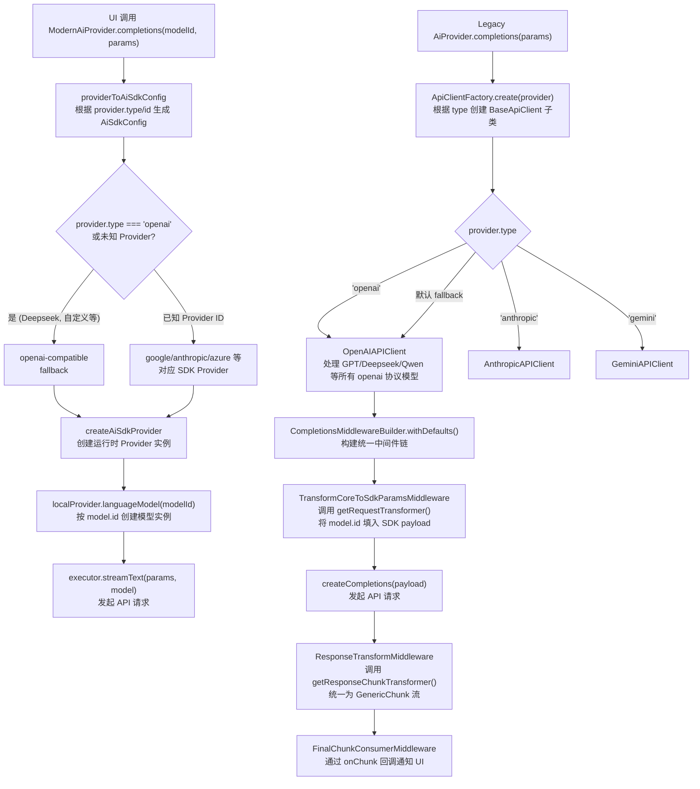
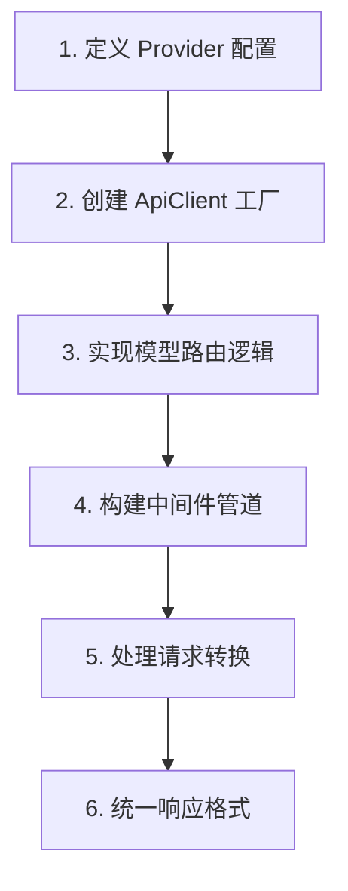

# DeepWiki Q&A with Code Context for Repository: CherryHQ/cherry-studio
## Q1
你给我查一下 cherryStudio底层的模型请求是怎么写的
===
openai chat completion；anthropic message；gemini
尤其关注几点 我使用了很多中转聚合站 这些站点允许使用chat completion访问调用gemini gpt等等各种模型 Cherrystudio基本上没什么影响 他底层如何做到的
### Answer
CherryStudio 通过统一的 AI Provider 架构实现了对不同模型的无缝支持，即使是通过中转聚合站的 chat completion 接口也能调用各种模型。

## 核心架构概览

CherryStudio 使用 `AiProviderNew` 作为统一的模型请求入口，通过模型ID前缀自动识别并适配不同的API格式 cherry-studio:223-224 。

### 关键实现机制

#### 1. 模型类型识别
系统通过模型ID前缀自动识别模型类型：
- `anthropic/` 前缀 → Anthropic Messages API
- `google/` 前缀 → Gemini API  
- 其他前缀或无前缀 → OpenAI Chat Completions API cherry-studio:29-30 

#### 2. CherryIn Provider 统一适配
`createCherryIn` 函数根据模型ID创建对应的客户端实例 cherry-studio:212-228 ：

```typescript
const createChatModelByModelId = (modelId: string, settings: OpenAIProviderSettings = {}) => {
  if (isAnthropicModel(modelId)) {
    return createAnthropicModel(modelId)
  }
  if (isGeminiModel(modelId)) {
    return createGeminiModel(modelId)
  }
  return new OpenAIResponsesLanguageModel(modelId, {
    // OpenAI 兼容配置
  })
}
```

#### 3. API 格式自动转换
不同模型的API参数会被自动转换为对应格式：

**Anthropic 模型**：使用 `x-api-key` 头部和 Messages API 格式 cherry-studio:166-182 

**Gemini 模型**：使用 `x-goog-api-key` 头部和 Gemini API 格式 cherry-studio:184-199 

**OpenAI 兼容模型**：使用标准的 Bearer token 和 Chat Completions 格式 cherry-studio:201-210 

#### 4. 请求流程
1. `ApiService.transformMessagesAndFetch` 处理消息转换 cherry-studio:141-188 
2. `buildStreamTextParams` 构建适配的参数 cherry-studio:242-253 
3. `AiProviderNew.completions` 执行实际请求 cherry-studio:278-285 

## 中转聚合站兼容性

CherryStudio 能够无缝使用中转站的关键在于：

1. **统一接口抽象**：所有模型都通过相同的 `AiProviderNew` 接口调用
2. **自动格式转换**：根据模型ID自动选择正确的API格式和认证方式
3. **OpenAI 兼容性**：大部分中转站都支持 OpenAI Chat Completions 格式，CherryStudio 将其他模型格式转换为兼容格式

例如，即使你通过中转站调用 Gemini 模型，系统也会：
- 识别 `google/` 前缀
- 使用 Gemini 专用的参数格式
- 但通过 OpenAI 兼容的 HTTP 接口发送请求

## Notes

- CherryStudio 的 API 服务器也提供了标准的 OpenAI Chat Completions 接口 cherry-studio:41-81 
- 测试文件展示了如何通过不同端点调用各种模型 cherry-studio:16-96 
- 系统支持流式和非流式响应，自动处理不同模型的响应格式差异

Wiki pages you might want to explore:
- [Service Layer Architecture (CherryHQ/cherry-studio)](/wiki/CherryHQ/cherry-studio#3.6)
### Citations
**File:** src/renderer/src/services/ApiService.ts (L141-188)
```typescript
export async function transformMessagesAndFetch(
  request: {
    messages: Message[]
    assistant: Assistant
    blockManager: BlockManager
    assistantMsgId: string
    callbacks: StreamProcessorCallbacks
    topicId?: string // 添加 topicId 用于 trace
    allowedTools?: string[]
    options: {
      signal?: AbortSignal
      timeout?: number
      headers?: Record<string, string>
    }
  },
  onChunkReceived: (chunk: Chunk) => void
) {
  const { messages, assistant } = request

  try {
    const { modelMessages, uiMessages } = await ConversationService.prepareMessagesForModel(messages, assistant)

    // replace prompt variables
    assistant.prompt = await replacePromptVariables(assistant.prompt, assistant.model?.name)

    // inject knowledge search prompt into model messages
    await injectUserMessageWithKnowledgeSearchPrompt({
      modelMessages,
      assistant,
      assistantMsgId: request.assistantMsgId,
      topicId: request.topicId,
      blockManager: request.blockManager,
      setCitationBlockId: request.callbacks.setCitationBlockId!
    })

    await fetchChatCompletion({
      messages: modelMessages,
      assistant: assistant,
      topicId: request.topicId,
      allowedTools: request.allowedTools,
      requestOptions: request.options,
      uiMessages,
      onChunkReceived
    })
  } catch (error: any) {
    onChunkReceived({ type: ChunkType.ERROR, error })
  }
}
```
**File:** src/renderer/src/services/ApiService.ts (L223-224)
```typescript
  const AI = new AiProviderNew(assistant.model || getDefaultModel(), providerWithRotatedKey)
  const provider = AI.getActualProvider()
```
**File:** src/renderer/src/services/ApiService.ts (L242-253)
```typescript
  const {
    params: aiSdkParams,
    modelId,
    capabilities,
    webSearchPluginConfig,
    idleTimeout
  } = await buildStreamTextParams(messages, assistant, provider, {
    mcpTools: mcpTools,
    allowedTools,
    webSearchProviderId: assistant.webSearchProviderId,
    requestOptions
  })
```
**File:** src/renderer/src/services/ApiService.ts (L278-285)
```typescript
  await AI.completions(modelId, aiSdkParams, {
    ...middlewareConfig,
    assistant,
    topicId,
    callType: 'chat',
    uiMessages,
    idleTimeout
  })
```
**File:** packages/ai-sdk-provider/src/cherryin-provider.ts (L29-30)
```typescript
const ANTHROPIC_PREFIX = /^anthropic\//i
const GEMINI_PREFIX = /^google\//i
```
**File:** packages/ai-sdk-provider/src/cherryin-provider.ts (L166-182)
```typescript
  const createAnthropicModel = (modelId: string) =>
    new AnthropicMessagesLanguageModel(modelId, {
      provider: `${CHERRYIN_PROVIDER_NAME}.anthropic`,
      baseURL: anthropicBaseURL,
      headers: () => {
        const headers = getJsonHeaders()
        const apiKey = toBearerToken(headers.Authorization)
        return {
          ...headers,
          'x-api-key': apiKey
        }
      },
      fetch,
      supportedUrls: () => ({
        'image/*': [/^https?:\/\/.*$/]
      })
    })
```
**File:** packages/ai-sdk-provider/src/cherryin-provider.ts (L184-199)
```typescript
  const createGeminiModel = (modelId: string) =>
    new GoogleGenerativeAILanguageModel(modelId, {
      provider: `${CHERRYIN_PROVIDER_NAME}.google`,
      baseURL: geminiBaseURL,
      headers: () => {
        const headers = getJsonHeaders()
        const apiKey = toBearerToken(headers.Authorization)
        return {
          ...headers,
          'x-goog-api-key': apiKey
        }
      },
      fetch,
      generateId: () => `${CHERRYIN_PROVIDER_NAME}-${Date.now()}`,
      supportedUrls: () => ({})
    })
```
**File:** packages/ai-sdk-provider/src/cherryin-provider.ts (L201-210)
```typescript
  const createOpenAIChatModel = (modelId: string, settings: OpenAIProviderSettings = {}) =>
    new CherryInOpenAIChatLanguageModel(modelId, {
      provider: `${CHERRYIN_PROVIDER_NAME}.openai-chat`,
      url,
      headers: () => ({
        ...getJsonHeaders(),
        ...settings.headers
      }),
      fetch
    })
```
**File:** packages/ai-sdk-provider/src/cherryin-provider.ts (L212-228)
```typescript
  const createChatModelByModelId = (modelId: string, settings: OpenAIProviderSettings = {}) => {
    if (isAnthropicModel(modelId)) {
      return createAnthropicModel(modelId)
    }
    if (isGeminiModel(modelId)) {
      return createGeminiModel(modelId)
    }
    return new OpenAIResponsesLanguageModel(modelId, {
      provider: `${CHERRYIN_PROVIDER_NAME}.openai`,
      url,
      headers: () => ({
        ...getJsonHeaders(),
        ...settings.headers
      }),
      fetch
    })
  }
```
**File:** src/main/apiServer/services/chat-completion.ts (L41-81)
```typescript
export class ChatCompletionService {
  async resolveProviderContext(
    model: string
  ): Promise<
    { ok: false; error: ModelValidationError } | { ok: true; provider: Provider; modelId: string; client: OpenAI }
  > {
    const modelValidation = await validateModelId(model)
    if (!modelValidation.valid) {
      return {
        ok: false,
        error: modelValidation.error!
      }
    }

    const provider = modelValidation.provider!

    if (provider.type !== 'openai') {
      return {
        ok: false,
        error: {
          type: 'unsupported_provider_type',
          message: `Provider '${provider.id}' of type '${provider.type}' is not supported for OpenAI chat completions`,
          code: 'unsupported_provider_type'
        }
      }
    }

    const modelId = modelValidation.modelId!

    const client = new OpenAI({
      baseURL: provider.apiHost,
      apiKey: provider.apiKey
    })

    return {
      ok: true,
      provider,
      modelId,
      client
    }
  }
```
**File:** tests/apis/chat.http (L16-96)
```text
### OpenAI Chat Completion
POST {{host}}/v1/chat/completions
Authorization: Bearer {{token}}
Content-Type: application/json

{
  "model": "tokenflux:openai/gpt-5-nano",
  "messages": [
    {
      "role": "user",
      "content": "Explain the theory of relativity in simple terms."
    }
  ]
}

### OpenAI Chat Completion with streaming
POST {{host}}/v1/chat/completions
Authorization: Bearer {{token}}
Content-Type: application/json

{
  "model": "tokenflux:openai/gpt-5-nano",
  "stream": true,
  "messages": [
    {
      "role": "user",
      "content": "Explain the theory of relativity in simple terms."
    }
  ]
}

### Anthropic Chat Message
POST {{host}}/v1/messages
Authorization: Bearer {{token}}
Content-Type: application/json

{
  "model": "anthropic:claude-sonnet-4-20250514",
  "stream": false,
  "max_tokens": 1024,
  "messages": [
    {
      "role": "user",
      "content": "Explain the theory of relativity in simple terms."
    }
  ]
}

### Anthropic Chat Message with streaming
POST {{host}}/v1/messages
Authorization: Bearer {{token}}
Content-Type: application/json

{
  "model": "anthropic:claude-sonnet-4-20250514",
  "stream": true,
  "max_tokens": 1024,
  "messages": [
    {
      "role": "user",
      "content": "Explain the theory of relativity in simple terms."
    }
  ]
}

### Anthropic Chat Message with streaming
POST {{host}}/anthropic/v1/messages
Authorization: Bearer {{token}}
Content-Type: application/json

{
  "model": "claude-sonnet-4-20250514",
  "stream": true,
  "max_tokens": 1024,
  "messages": [
    {
      "role": "user",
      "content": "Explain the theory of relativity in simple terms."
    }
  ]
}
```
## Q2
我的意思是添加提供商哪里不是可以设定提供商的类型吗 这个类型是chat completion的时候我发现不影响调用中转站的各家的模型 即一个提供商提供deepseek gemini gpt等等模型 cherryStudio的提供商将这个·设定为chat compltion 为什么可以做到不论选取什么模型都基本没有影响 他的顶层架构和设计是如何进的
中文回答
### Answer
# CherryStudio 多模型支持架构深度解析

CherryStudio 通过一套精心设计的三层抽象体系，实现了在不变更 Provider 类型的前提下，支持同一提供商下多个异构模型的调用。以下是完整解析。

---

## 一、核心设计理念：Provider Type ≠ Model，Type 只是协议标识

**`ProviderType`** 本质上是 **API 协议类型**（如 OpenAI Chat Completions 协议、Anthropic 协议、Gemini 协议等），而不是具体的模型。具体的模型（`model.id`，例如 `deepseek-chat`、`gpt-4o`）是在每次 API 请求时作为参数传递的，与 Provider 类型无关。

`Provider` 类型的定义中，`type` 字段枚举了所有支持的协议，而 `models` 字段是该 Provider 下所有注册的模型列表： cherry-studio:7-22 cherry-studio:103-114 

---

## 二、Provider 抽象层设计

### 2.1 `ApiClient` 接口——模型无关的统一契约

整个系统的核心抽象是 `ApiClient` 接口，它定义了所有 Provider SDK 适配器必须实现的方法，完全不含任何具体模型的概念： cherry-studio:96-141 

### 2.2 `BaseApiClient`——通用逻辑的基类

`BaseApiClient` 是一个泛型抽象基类，对所有具体的 Provider SDK 客户端提供通用功能（API Key 轮换、温度参数、Service Tier 等），并强制子类实现两个最关键的模型无关接口：

- `getRequestTransformer()`：将统一的 `CompletionsParams` 转换为 SDK 特定的请求参数
- `getResponseChunkTransformer()`：将 SDK 原始响应块转换为统一的 `GenericChunk` cherry-studio:66-130 

---

## 三、模型路由机制（`ApiClientFactory`）

### 3.1 工厂模式：Provider ID/Type → SDK Client

`ApiClientFactory` 是整个路由的第一道关卡。它根据 `provider.id`（先检查特殊 ID）和 `provider.type`（再检查协议类型）来创建对应的 `BaseApiClient` 实例，**同一 Provider 下所有模型共享同一个 Client 实例**： cherry-studio:25-102 

**关键点**：`switch` 的 `default` 分支将所有未识别的 Provider 类型（包括大量使用 OpenAI 兼容接口的国产模型提供商）路由到 `OpenAIAPIClient`，使它们自动获得对所有注册模型的支持。

### 3.2 模型 ID 作为 Payload 参数传递

在 `OpenAIAPIClient` 的 `RequestTransformer` 中，`model.id` 只是最终 API 请求参数（`OpenAISdkParams.model`）中的一个字段，**Provider 类型决定了调用哪套 SDK，而模型 ID 决定了调用哪个具体模型**： cherry-studio:703-733 

这意味着同一个 `OpenAIAPIClient` 实例可以无差别地处理 `deepseek-chat`、`gpt-4o`、`qwen-turbo` 等所有遵循 OpenAI Chat Completions 协议的模型。

---

## 四、混合多协议路由：`MixedBaseAPIClient`

对于像 AiHubMix 这样在一个 Provider 下聚合了 Claude（Anthropic 协议）、Gemini 协议、GPT（OpenAI 协议）等多种模型的特殊 Provider，系统提供了 **`MixedBaseAPIClient`** 抽象层。它在 **Client 层面**根据模型 ID 进行二次路由，选择正确的子 Client： cherry-studio:33-101 

以 `AihubmixAPIClient` 为例，它初始化了 Claude、Gemini、OpenAI Response、OpenAI 四个子 Client，并通过 `getClient(model)` 根据模型 ID 前缀进行路由： cherry-studio:15-96 

---

## 五、模型无关性：中间件管道（Middleware Pipeline）

### 5.1 统一的 `CompletionsParams`

所有模型的调用，无论是 GPT-4o、Deepseek-R1 还是 Gemini 2.0，在进入中间件链之前都被统一为 `CompletionsParams` 结构。该结构与具体 Provider 完全无关： cherry-studio:17-76 

### 5.2 `DefaultCompletionsNamedMiddlewares`——固定的通用处理链

`MiddlewareRegistry` 中注册的默认中间件链对所有 Provider 和模型都是相同的： cherry-studio:110-124 

### 5.3 中间件链的动态裁剪（模型特性感知）

`AiProvider.completions` 在构建中间件链时，会根据模型特性（是否为图像生成模型、是否支持函数调用、是否启用 Web 搜索等）动态移除不需要的中间件，实现细粒度的模型适配： cherry-studio:71-126 

### 5.4 关键中间件：`TransformCoreToSdkParamsMiddleware`

该中间件从 `CompletionsContext` 中取出 `apiClientInstance`，调用其 `getRequestTransformer()` 进行模型特定的参数转换（如推理 token budget、思考模式开关等）。所有模型特异性逻辑被封装在各自 Client 的 Transformer 中： cherry-studio:15-81 

### 5.5 关键中间件：`ResponseTransformMiddleware`

该中间件调用 `apiClientInstance.getResponseChunkTransformer()` 将各 Provider SDK 的原始响应流统一转换为 `ReadableStream<GenericChunk>`，使后续中间件无需关心响应的具体格式： cherry-studio:22-88 

---

## 六、现代路径（`ModernAiProvider`）的 SDK Provider 映射

在现代路径（`ModernAiProvider`）中，`getAiSdkProviderId` 将 CherryStudio 内部的 Provider ID/Type 映射到 Vercel AI SDK 的标准 Provider ID。对于 `openai` 类型且没有特殊 ID 的自定义 Provider（如企业内部部署的 Deepseek-compatible 服务），最终 fallback 到 `openai-compatible`，支持所有 OpenAI 兼容模型： cherry-studio:29-89 

`providerToAiSdkConfig` 最终为已知 Provider 生成 `AiSdkConfig`，未知 Provider 使用 `openai-compatible` fallback，通过 `createAiSdkProvider` 创建运行时 SDK 实例，再由 `localProvider.languageModel(modelId)` 按需创建具体的模型实例： cherry-studio:358-378 cherry-studio:155-164 

---

## 七、完整架构流程图



---

## 总结

| 层次 | 组件 | 职责 |
|------|------|------|
| **协议层** | `Provider.type` (`ProviderType`) | 标识使用哪种 API 协议，而非具体模型 |
| **工厂层** | `ApiClientFactory` / `getAiSdkProviderId` | 将 Provider 类型映射到 SDK Client，所有同类型模型共享一个 Client |
| **适配层** | `BaseApiClient` + `RequestTransformer` | `model.id` 作为 payload 参数传递，实现模型无关的统一接口 |
| **路由层** | `MixedBaseAPIClient` | 针对聚合型 Provider，在 Client 内部按模型 ID 二次路由到子 Client |
| **处理层** | 中间件管道 (`DefaultCompletionsNamedMiddlewares`) | 对所有模型使用统一处理链，模型特性通过动态裁剪中间件实现适配 |
| **归一层** | `ResponseTransformMiddleware` / `FinalChunkConsumerMiddleware` | 将各 SDK 异构响应统一为 `GenericChunk` 流，UI 层无需感知底层差异 |

核心模型无关性实现原理：**Provider 类型决定协议（使用哪套 SDK），模型 ID 只是该协议请求中的一个字符串参数**。只要模型遵循该 Provider 的 API 协议（如 OpenAI Chat Completions），就可以在不改变 Provider 类型的情况下，通过同一套管道进行调用。

---

## Notes

1. **双路径并存**：CherryStudio 目前同时维护 **Legacy AiProvider**（`src/renderer/src/aiCore/legacy/`）和 **Modern ModernAiProvider**（`src/renderer/src/aiCore/index_new.ts`）两条路径，两者都遵循相同的抽象原则，但 Modern 路径依赖 Vercel AI SDK 的 `@cherrystudio/ai-core` 库。
2. **openai 类型 Deepseek 等中国模型**：Deepseek、Qwen、Moonshot 等提供商都使用 `type: 'openai'`，全部通过 `OpenAIAPIClient` 处理。模型特定的参数（如 `enable_thinking`）在 `getReasoningEffort()` 内部通过 `provider.id` + `model.id` 组合判断。
3. **`MixedBaseAPIClient`** 是为 AiHubMix 等"超级 Provider"专门设计的，这类 Provider 在一个 API 入口下聚合了多个不同协议的模型，是系统中最复杂的路由场景。
### Citations
**File:** src/renderer/src/types/provider.ts (L7-22)
```typescript
export const ProviderTypeSchema = z.enum([
  'openai',
  'openai-response',
  'anthropic',
  'gemini',
  'azure-openai',
  'vertexai',
  'mistral',
  'aws-bedrock',
  'vertex-anthropic',
  'new-api',
  'gateway',
  'ollama'
])

export type ProviderType = z.infer<typeof ProviderTypeSchema>
```
**File:** src/renderer/src/types/provider.ts (L103-114)
```typescript
export type Provider = {
  id: string
  type: ProviderType
  name: string
  apiKey: string
  apiHost: string
  anthropicApiHost?: string
  isAnthropicModel?: (m: Model) => boolean
  apiVersion?: string
  models: Model[]
  enabled?: boolean
  isSystem?: boolean
```
**File:** src/renderer/src/aiCore/legacy/clients/types.ts (L96-141)
```typescript
export interface ApiClient<
  TSdkInstance = any,
  TSdkParams extends SdkParams = SdkParams,
  TRawOutput extends SdkRawOutput = SdkRawOutput,
  TRawChunk extends SdkRawChunk = SdkRawChunk,
  TMessageParam extends SdkMessageParam = SdkMessageParam,
  TToolCall extends SdkToolCall = SdkToolCall,
  TSdkSpecificTool extends SdkTool = SdkTool
> {
  provider: Provider

  // 核心方法 - 在中间件架构中，这个方法可能只是一个占位符
  // 实际的SDK调用由SdkCallMiddleware处理
  // completions(params: CompletionsParams): Promise<CompletionsResult>

  createCompletions(payload: TSdkParams): Promise<TRawOutput>

  // SDK相关方法
  getSdkInstance(): Promise<TSdkInstance> | TSdkInstance
  getRequestTransformer(): RequestTransformer<TSdkParams, TMessageParam>
  getResponseChunkTransformer(ctx: CompletionsContext): ResponseChunkTransformer<TRawChunk>

  // 原始流监听方法
  attachRawStreamListener?(rawOutput: TRawOutput, listener: RawStreamListener<TRawChunk>): TRawOutput

  // 工具转换相关方法 (保持可选，因为不是所有Provider都支持工具)
  convertMcpToolsToSdkTools(mcpTools: MCPTool[]): TSdkSpecificTool[]
  convertMcpToolResponseToSdkMessageParam?(
    mcpToolResponse: MCPToolResponse,
    resp: any,
    model: Model
  ): TMessageParam | undefined
  convertSdkToolCallToMcp?(toolCall: TToolCall, mcpTools: MCPTool[]): MCPTool | undefined
  convertSdkToolCallToMcpToolResponse(toolCall: TToolCall, mcpTool: MCPTool): ToolCallResponse

  // 构建SDK特定的消息列表，用于工具调用后的递归调用
  buildSdkMessages(
    currentReqMessages: TMessageParam[],
    output: TRawOutput | string,
    toolResults: TMessageParam[],
    toolCalls?: TToolCall[]
  ): TMessageParam[]

  // 从SDK载荷中提取消息数组（用于中间件中的类型安全访问）
  extractMessagesFromSdkPayload(sdkPayload: TSdkParams): TMessageParam[]
}
```
**File:** src/renderer/src/aiCore/legacy/clients/BaseApiClient.ts (L66-130)
```typescript
export abstract class BaseApiClient<
  TSdkInstance extends SdkInstance = SdkInstance,
  TSdkParams extends SdkParams = SdkParams,
  TRawOutput extends SdkRawOutput = SdkRawOutput,
  TRawChunk extends SdkRawChunk = SdkRawChunk,
  TMessageParam extends SdkMessageParam = SdkMessageParam,
  TToolCall extends SdkToolCall = SdkToolCall,
  TSdkSpecificTool extends SdkTool = SdkTool
> implements ApiClient<TSdkInstance, TSdkParams, TRawOutput, TRawChunk, TMessageParam, TToolCall, TSdkSpecificTool>
{
  public provider: Provider
  protected host: string
  protected sdkInstance?: TSdkInstance

  constructor(provider: Provider) {
    this.provider = provider
    this.host = this.getBaseURL()
  }

  /**
   * Get the current API key with rotation support
   * This getter ensures API keys rotate on each access when multiple keys are configured
   */
  protected get apiKey(): string {
    return this.getApiKey()
  }

  /**
   * 获取客户端的兼容性类型
   * 用于判断客户端是否支持特定功能，避免instanceof检查的类型收窄问题
   * 对于装饰器模式的客户端（如AihubmixAPIClient），应该返回其内部实际使用的客户端类型
   */
  // oxlint-disable-next-line @typescript-eslint/no-unused-vars
  public getClientCompatibilityType(_model?: Model): string[] {
    // 默认返回类的名称
    return [this.constructor.name]
  }

  // // 核心的completions方法 - 在中间件架构中，这通常只是一个占位符
  // abstract completions(params: CompletionsParams, internal?: ProcessingState): Promise<CompletionsResult>

  /**
   * 核心API Endpoint
   **/

  abstract createCompletions(payload: TSdkParams, options?: RequestOptions): Promise<TRawOutput>

  abstract generateImage(generateImageParams: GenerateImageParams): Promise<string[]>

  abstract getEmbeddingDimensions(model?: Model): Promise<number>

  abstract listModels(): Promise<SdkModel[]>

  abstract getSdkInstance(): Promise<TSdkInstance> | TSdkInstance

  /**
   * 中间件
   **/

  // 在 CoreRequestToSdkParamsMiddleware中使用
  abstract getRequestTransformer(): RequestTransformer<TSdkParams, TMessageParam>
  // 在RawSdkChunkToGenericChunkMiddleware中使用
  abstract getResponseChunkTransformer(ctx: CompletionsContext): ResponseChunkTransformer<TRawChunk>

  /**
```
**File:** src/renderer/src/aiCore/legacy/clients/ApiClientFactory.ts (L25-102)
```typescript
export class ApiClientFactory {
  /**
   * Create an ApiClient instance for the given provider
   * 为给定的提供者创建ApiClient实例
   */
  static create(provider: Provider): BaseApiClient {
    logger.debug(`Creating ApiClient for provider:`, {
      id: provider.id,
      type: provider.type
    })

    let instance: BaseApiClient

    // 首先检查特殊的 Provider ID
    if (provider.id === 'cherryai') {
      instance = new CherryAiAPIClient(provider) as BaseApiClient
      return instance
    }

    if (provider.id === 'aihubmix') {
      logger.debug(`Creating AihubmixAPIClient for provider: ${provider.id}`)
      instance = new AihubmixAPIClient(provider) as BaseApiClient
      return instance
    }

    if (isNewApiProvider(provider)) {
      logger.debug(`Creating NewAPIClient for provider: ${provider.id}`)
      instance = new NewAPIClient(provider) as BaseApiClient
      return instance
    }

    if (provider.id === 'ppio') {
      logger.debug(`Creating PPIOAPIClient for provider: ${provider.id}`)
      instance = new PPIOAPIClient(provider) as BaseApiClient
      return instance
    }

    if (provider.id === 'zhipu') {
      instance = new ZhipuAPIClient(provider) as BaseApiClient
      return instance
    }

    if (provider.id === 'ovms') {
      logger.debug(`Creating OVMSClient for provider: ${provider.id}`)
      instance = new OVMSClient(provider) as BaseApiClient
      return instance
    }

    // 然后检查标准的 Provider Type
    switch (provider.type) {
      case 'openai':
        instance = new OpenAIAPIClient(provider) as BaseApiClient
        break
      case 'azure-openai':
      case 'openai-response':
        instance = new OpenAIResponseAPIClient(provider) as BaseApiClient
        break
      case 'gemini':
        instance = new GeminiAPIClient(provider) as BaseApiClient
        break
      case 'vertexai':
        logger.debug(`Creating VertexAPIClient for provider: ${provider.id}`)
        instance = new VertexAPIClient(provider) as BaseApiClient
        break
      case 'anthropic':
        instance = new AnthropicAPIClient(provider) as BaseApiClient
        break
      case 'aws-bedrock':
        instance = new AwsBedrockAPIClient(provider) as BaseApiClient
        break
      default:
        logger.debug(`Using default OpenAIApiClient for provider: ${provider.id}`)
        instance = new OpenAIAPIClient(provider) as BaseApiClient
        break
    }

    return instance
  }
```
**File:** src/renderer/src/aiCore/legacy/clients/openai/OpenAIApiClient.ts (L703-733)
```typescript
        const commonParams: OpenAISdkParams = {
          model: model.id,
          messages:
            isRecursiveCall && recursiveSdkMessages && recursiveSdkMessages.length > 0
              ? recursiveSdkMessages
              : reqMessages,
          temperature: this.getTemperature(assistant, model),
          top_p: this.getTopP(assistant, model),
          max_tokens: maxTokens,
          tools: tools.length > 0 ? tools : undefined,
          stream: streamOutput,
          ...(shouldIncludeStreamOptions ? { stream_options: { include_usage: true } } : {}),
          ...modalities,
          // groq 有不同的 service tier 配置，不符合 openai 接口类型
          service_tier: this.getServiceTier(model) as OpenAIServiceTier,
          // verbosity. getVerbosity ensures the returned value is valid.
          verbosity: this.getVerbosity(model),
          ...this.getProviderSpecificParameters(assistant, model),
          ...reasoningEffort,
          // ...getOpenAIWebSearchParams(model, enableWebSearch),
          // OpenRouter usage tracking
          ...(this.provider.id === 'openrouter' ? { usage: { include: true } } : {}),
          ...extra_body,
          // 只在对话场景下应用自定义参数，避免影响翻译、总结等其他业务逻辑
          // 注意：用户自定义参数总是应该覆盖其他参数
          ...(coreRequest.callType === 'chat' ? this.getCustomParameters(assistant) : {})
        }

        const timeout = this.getTimeout(model)

        return { payload: commonParams, messages: reqMessages, metadata: { timeout } }
```
**File:** src/renderer/src/aiCore/legacy/clients/MixedBaseApiClient.ts (L33-101)
```typescript
export abstract class MixedBaseAPIClient extends BaseApiClient {
  // 使用联合类型而不是any，保持类型安全
  protected abstract clients: Map<
    string,
    AnthropicAPIClient | GeminiAPIClient | OpenAIResponseAPIClient | OpenAIAPIClient
  >
  protected abstract defaultClient: OpenAIAPIClient
  protected abstract currentClient: BaseApiClient

  constructor(provider: Provider) {
    super(provider)
  }

  override getBaseURL(): string {
    if (!this.currentClient) {
      return this.provider.apiHost
    }
    return this.currentClient.getBaseURL()
  }

  /**
   * 类型守卫：确保client是BaseApiClient的实例
   */
  protected isValidClient(client: unknown): client is BaseApiClient {
    return (
      client !== null &&
      client !== undefined &&
      typeof client === 'object' &&
      'createCompletions' in client &&
      'getRequestTransformer' in client &&
      'getResponseChunkTransformer' in client
    )
  }

  /**
   * 根据模型获取合适的client
   */
  protected abstract getClient(model: Model): BaseApiClient

  /**
   * 根据模型选择合适的client并委托调用
   */
  public getClientForModel(model: Model): BaseApiClient {
    this.currentClient = this.getClient(model)
    return this.currentClient
  }

  /**
   * 重写基类方法，返回内部实际使用的客户端类型
   */
  public override getClientCompatibilityType(model?: Model): string[] {
    if (!model) {
      return [this.constructor.name]
    }

    const actualClient = this.getClient(model)
    return actualClient.getClientCompatibilityType(model)
  }

  /**
   * 从SDK payload中提取模型ID
   */
  protected extractModelFromPayload(payload: SdkParams): string | null {
    // 不同的SDK可能有不同的字段名
    if ('model' in payload && typeof payload.model === 'string') {
      return payload.model
    }
    return null
  }
```
**File:** src/renderer/src/aiCore/legacy/clients/aihubmix/AihubmixAPIClient.ts (L15-96)
```typescript
export class AihubmixAPIClient extends MixedBaseAPIClient {
  // 使用联合类型而不是any，保持类型安全
  protected clients: Map<string, AnthropicAPIClient | GeminiAPIClient | OpenAIResponseAPIClient | OpenAIAPIClient> =
    new Map()
  protected defaultClient: OpenAIAPIClient
  protected currentClient: BaseApiClient

  constructor(provider: Provider) {
    super(provider)

    const providerExtraHeaders = {
      ...provider,
      extra_headers: {
        ...provider.extra_headers,
        'APP-Code': 'MLTG2087'
      }
    }

    // 初始化各个client - 现在有类型安全
    const claudeClient = new AnthropicAPIClient(providerExtraHeaders)
    const geminiClient = new GeminiAPIClient({ ...providerExtraHeaders, apiHost: 'https://aihubmix.com/gemini' })
    const openaiClient = new OpenAIResponseAPIClient(providerExtraHeaders)
    const defaultClient = new OpenAIAPIClient(providerExtraHeaders)

    this.clients.set('claude', claudeClient)
    this.clients.set('gemini', geminiClient)
    this.clients.set('openai', openaiClient)
    this.clients.set('default', defaultClient)

    // 设置默认client
    this.defaultClient = defaultClient
    this.currentClient = this.defaultClient as BaseApiClient
  }

  override getBaseURL(): string {
    if (!this.currentClient) {
      return this.provider.apiHost
    }
    return this.currentClient.getBaseURL()
  }

  /**
   * 根据模型获取合适的client
   */
  protected getClient(model: Model): BaseApiClient {
    const id = model.id.toLowerCase()

    // claude开头
    if (id.startsWith('claude')) {
      const client = this.clients.get('claude')
      if (!client || !this.isValidClient(client)) {
        throw new Error('Claude client not properly initialized')
      }
      return client
    }

    // gemini开头 且不以-nothink、-search结尾
    if (
      (id.startsWith('gemini') || id.startsWith('imagen')) &&
      !id.endsWith('-nothink') &&
      !id.endsWith('-search') &&
      !id.includes('embedding')
    ) {
      const client = this.clients.get('gemini')
      if (!client || !this.isValidClient(client)) {
        throw new Error('Gemini client not properly initialized')
      }
      return client
    }

    // OpenAI系列模型 不包含gpt-oss
    if (isOpenAILLMModel(model) && !model.id.includes('gpt-oss')) {
      const client = this.clients.get('openai')
      if (!client || !this.isValidClient(client)) {
        throw new Error('OpenAI client not properly initialized')
      }
      return client
    }

    return this.defaultClient as BaseApiClient
  }
}
```
**File:** src/renderer/src/aiCore/legacy/middleware/schemas.ts (L17-76)
```typescript
export interface CompletionsParams {
  /**
   * 调用的业务场景类型，用于中间件判断是否执行
   * 'chat': 主要对话流程
   * 'translate': 翻译
   * 'summary': 摘要
   * 'search': 搜索摘要
   * 'generate': 生成
   * 'check': API检查
   * 'test': 测试调用
   * 'translate-lang-detect': 翻译语言检测
   */
  callType?: 'chat' | 'translate' | 'summary' | 'search' | 'generate' | 'check' | 'test' | 'translate-lang-detect'

  // 基础对话数据
  messages: Message[] | string // 联合类型方便判断是否为空

  assistant: Assistant // 助手为基本单位
  // model: Model

  onChunk?: (chunk: Chunk) => void
  onResponse?: (text: string, isComplete: boolean) => void

  // 错误相关
  onError?: (error: Error) => void
  shouldThrow?: boolean

  // 工具相关
  mcpTools?: MCPTool[]

  // 生成参数
  temperature?: number
  topP?: number
  maxTokens?: number

  // 功能开关
  streamOutput: boolean
  enableWebSearch?: boolean
  enableUrlContext?: boolean
  enableReasoning?: boolean
  enableGenerateImage?: boolean

  // 上下文控制
  contextCount?: number
  topicId?: string // 主题ID，用于关联上下文

  // abort 控制
  abortKey?: string

  _internal?: ProcessingState
}

export interface CompletionsResult {
  rawOutput?: SdkRawOutput
  stream?: ReadableStream<SdkRawChunk> | ReadableStream<Chunk> | AsyncIterable<Chunk>
  controller?: AbortController
  usage?: LanguageModelUsage

  getText: () => string
}
```
**File:** src/renderer/src/aiCore/legacy/middleware/register.ts (L110-124)
```typescript
export const DefaultCompletionsNamedMiddlewares = [
  MiddlewareRegistry[FinalChunkConsumerModule.MIDDLEWARE_NAME], // 最终消费者
  MiddlewareRegistry[ErrorHandlerModule.MIDDLEWARE_NAME], // 错误处理
  MiddlewareRegistry[TransformCoreToSdkParamsModule.MIDDLEWARE_NAME], // 参数转换
  MiddlewareRegistry[AbortHandlerModule.MIDDLEWARE_NAME], // 中止处理
  MiddlewareRegistry[McpToolChunkModule.MIDDLEWARE_NAME], // 工具处理
  MiddlewareRegistry[TextChunkModule.MIDDLEWARE_NAME], // 文本处理
  MiddlewareRegistry[WebSearchModule.MIDDLEWARE_NAME], // Web搜索处理
  MiddlewareRegistry[ToolUseExtractionMiddleware.MIDDLEWARE_NAME], // 工具使用提取处理
  MiddlewareRegistry[ThinkingTagExtractionModule.MIDDLEWARE_NAME], // 思考标签提取处理（特定provider）
  MiddlewareRegistry[ThinkChunkModule.MIDDLEWARE_NAME], // 思考处理（通用SDK）
  MiddlewareRegistry[ResponseTransformModule.MIDDLEWARE_NAME], // 响应转换
  MiddlewareRegistry[StreamAdapterModule.MIDDLEWARE_NAME], // 流适配器
  MiddlewareRegistry[RawStreamListenerModule.MIDDLEWARE_NAME] // 原始流监听器
]
```
**File:** src/renderer/src/aiCore/legacy/index.ts (L71-126)
```typescript
    const builder = CompletionsMiddlewareBuilder.withDefaults()
    // images api
    if (isDedicatedImageGenerationModel(model)) {
      builder.clear()
      builder
        .add(MiddlewareRegistry[FinalChunkConsumerMiddlewareName])
        .add(MiddlewareRegistry[ErrorHandlerMiddlewareName])
        .add(MiddlewareRegistry[AbortHandlerMiddlewareName])
        .add(MiddlewareRegistry[ImageGenerationMiddlewareName])
    } else {
      // Existing logic for other models
      logger.silly('Builder Params', params)
      // 使用兼容性类型检查，避免typescript类型收窄和装饰器模式的问题
      const clientTypes = client.getClientCompatibilityType(model)
      const isOpenAICompatible =
        clientTypes.includes('OpenAIAPIClient') || clientTypes.includes('OpenAIResponseAPIClient')
      if (!isOpenAICompatible) {
        logger.silly('ThinkingTagExtractionMiddleware is removed')
        builder.remove(ThinkingTagExtractionMiddlewareName)
      }

      const isAnthropicOrOpenAIResponseCompatible =
        clientTypes.includes('AnthropicAPIClient') ||
        clientTypes.includes('OpenAIResponseAPIClient') ||
        clientTypes.includes('AnthropicVertexAPIClient')
      if (!isAnthropicOrOpenAIResponseCompatible) {
        logger.silly('RawStreamListenerMiddleware is removed')
        builder.remove(RawStreamListenerMiddlewareName)
      }
      if (!params.enableWebSearch) {
        logger.silly('WebSearchMiddleware is removed')
        builder.remove(WebSearchMiddlewareName)
      }
      if (!params.mcpTools?.length) {
        builder.remove(ToolUseExtractionMiddlewareName)
        logger.silly('ToolUseExtractionMiddleware is removed')
        builder.remove(McpToolChunkMiddlewareName)
        logger.silly('McpToolChunkMiddleware is removed')
      }
      if (isSupportedToolUse(params.assistant) && isFunctionCallingModel(model)) {
        builder.remove(ToolUseExtractionMiddlewareName)
        logger.silly('ToolUseExtractionMiddleware is removed')
      }
      if (params.callType !== 'chat' && params.callType !== 'check' && params.callType !== 'translate') {
        logger.silly('AbortHandlerMiddleware is removed')
        builder.remove(AbortHandlerMiddlewareName)
      }
      if (params.callType === 'test') {
        builder.remove(ErrorHandlerMiddlewareName)
        logger.silly('ErrorHandlerMiddleware is removed')
        builder.remove(FinalChunkConsumerMiddlewareName)
        logger.silly('FinalChunkConsumerMiddleware is removed')
      }
    }

    const middlewares = builder.build()
```
**File:** src/renderer/src/aiCore/legacy/middleware/core/TransformCoreToSdkParamsMiddleware.ts (L15-81)
```typescript
export const TransformCoreToSdkParamsMiddleware: CompletionsMiddleware =
  () =>
  (next) =>
  async (ctx: CompletionsContext, params: CompletionsParams): Promise<CompletionsResult> => {
    const internal = ctx._internal

    // 🔧 检测递归调用：检查 params 中是否携带了预处理的 SDK 消息
    const isRecursiveCall = internal?.toolProcessingState?.isRecursiveCall || false
    const newSdkMessages = params._internal?.newReqMessages

    const apiClient = ctx.apiClientInstance

    if (!apiClient) {
      logger.error(`ApiClient instance not found in context.`)
      throw new Error('ApiClient instance not found in context')
    }

    // 检查是否有requestTransformer方法
    const requestTransformer = apiClient.getRequestTransformer()
    if (!requestTransformer) {
      logger.warn(`ApiClient does not have getRequestTransformer method, skipping transformation`)
      const result = await next(ctx, params)
      return result
    }

    // 确保assistant和model可用，它们是transformer所需的
    const assistant = params.assistant
    const model = params.assistant.model

    if (!assistant || !model) {
      logger.error(`Assistant or Model not found for transformation.`)
      throw new Error('Assistant or Model not found for transformation')
    }

    try {
      const transformResult = await requestTransformer.transform(
        params,
        assistant,
        model,
        isRecursiveCall,
        newSdkMessages
      )

      const { payload: sdkPayload, metadata } = transformResult

      // 将SDK特定的payload和metadata存储在状态中，供下游中间件使用
      ctx._internal.sdkPayload = sdkPayload

      if (metadata) {
        ctx._internal.customState = {
          ...ctx._internal.customState,
          sdkMetadata: metadata
        }
      }

      if (params.enableGenerateImage) {
        params.onChunk?.({
          type: ChunkType.IMAGE_CREATED
        })
      }
      return next(ctx, params)
    } catch (error) {
      logger.error('Error during request transformation:', error as Error)
      // 让错误向上传播，或者可以在这里进行特定的错误处理
      throw error
    }
  }
```
**File:** src/renderer/src/aiCore/legacy/middleware/core/ResponseTransformMiddleware.ts (L22-88)
```typescript
export const ResponseTransformMiddleware: CompletionsMiddleware =
  () =>
  (next) =>
  async (ctx: CompletionsContext, params: CompletionsParams): Promise<CompletionsResult> => {
    // 调用下游中间件
    const result = await next(ctx, params)

    // 响应后处理：转换原始SDK响应块
    if (result.stream) {
      const adaptedStream = result.stream

      // 处理ReadableStream类型的流
      if (adaptedStream instanceof ReadableStream) {
        const apiClient = ctx.apiClientInstance
        if (!apiClient) {
          logger.error(`ApiClient instance not found in context`)
          throw new Error('ApiClient instance not found in context')
        }

        // 获取响应转换器
        const responseChunkTransformer = apiClient.getResponseChunkTransformer(ctx)
        if (!responseChunkTransformer) {
          logger.warn(`No ResponseChunkTransformer available, skipping transformation`)
          return result
        }

        const assistant = params.assistant
        const model = assistant?.model

        if (!assistant || !model) {
          logger.error(`Assistant or Model not found for transformation`)
          throw new Error('Assistant or Model not found for transformation')
        }

        const transformerContext: ResponseChunkTransformerContext = {
          isStreaming: params.streamOutput || false,
          isEnabledToolCalling: (params.mcpTools && params.mcpTools.length > 0) || false,
          isEnabledWebSearch: params.enableWebSearch || false,
          isEnabledUrlContext: params.enableUrlContext || false,
          isEnabledReasoning: params.enableReasoning || false,
          mcpTools: params.mcpTools || [],
          provider: ctx.apiClientInstance?.provider
        }

        logger.debug(`Transforming raw SDK chunks with context:`, transformerContext)

        try {
          // 创建转换后的流
          const genericChunkTransformStream = (adaptedStream as ReadableStream<SdkRawChunk>).pipeThrough<GenericChunk>(
            new TransformStream<SdkRawChunk, GenericChunk>(responseChunkTransformer(transformerContext))
          )

          // 将转换后的ReadableStream保存到result，供下游中间件使用
          return {
            ...result,
            stream: genericChunkTransformStream
          }
        } catch (error) {
          logger.error('Error during chunk transformation:', error as Error)
          throw error
        }
      }
    }

    // 如果没有流或不是ReadableStream，返回原始结果
    return result
  }
```
**File:** src/renderer/src/aiCore/provider/factory.ts (L29-89)
```typescript
const STATIC_PROVIDER_MAPPING: Record<string, ProviderId> = {
  gemini: 'google', // Google Gemini -> google
  'azure-openai': 'azure', // Azure OpenAI -> azure
  'openai-response': 'openai', // OpenAI Responses -> openai
  grok: 'xai', // Grok -> xai
  copilot: 'github-copilot-openai-compatible',
  tokenflux: 'openrouter' // TokenFlux -> openrouter (fully compatible)
}

/**
 * 尝试解析provider标识符（支持静态映射和别名）
 */
function tryResolveProviderId(identifier: string): ProviderId | null {
  // 1. 检查静态映射
  const staticMapping = STATIC_PROVIDER_MAPPING[identifier]
  if (staticMapping) {
    return staticMapping
  }

  // 2. 检查AiCore是否支持（包括别名支持）
  if (hasProviderConfigByAlias(identifier)) {
    // 解析为真实的Provider ID
    return resolveProviderConfigId(identifier) as ProviderId
  }

  return null
}

/**
 * 获取AI SDK Provider ID
 * 简化版：减少重复逻辑，利用通用解析函数
 * TODO: 整理函数逻辑
 */
export function getAiSdkProviderId(provider: Provider): string {
  // 1. 尝试解析provider.id
  const resolvedFromId = tryResolveProviderId(provider.id)
  if (isAzureOpenAIProvider(provider)) {
    if (isAzureResponsesEndpoint(provider)) {
      return 'azure-responses'
    } else {
      return 'azure'
    }
  }
  if (resolvedFromId) {
    return resolvedFromId
  }

  // 2. 尝试解析provider.type
  // 会把所有类型为openai的自定义provider解析到aisdk的openaiProvider上
  if (provider.type !== 'openai') {
    const resolvedFromType = tryResolveProviderId(provider.type)
    if (resolvedFromType) {
      return resolvedFromType
    }
  }
  if (provider.apiHost.includes('api.openai.com')) {
    return 'openai-chat'
  }
  // 3. 最后的fallback（使用provider本身的id）
  return provider.id
}
```
**File:** src/renderer/src/aiCore/provider/providerConfig.ts (L358-378)
```typescript
  if (hasProviderConfig(aiSdkProviderId) && aiSdkProviderId !== 'openai-compatible') {
    // if the provider has a specific aisdk provider
    const options = ProviderConfigFactory.fromProvider(aiSdkProviderId, baseConfig, extraOptions)
    return {
      providerId: aiSdkProviderId,
      options
    }
  } else {
    // otherwise, fallback to openai-compatible
    const options = ProviderConfigFactory.createOpenAICompatible(baseConfig.baseURL, baseConfig.apiKey)
    return {
      providerId: 'openai-compatible',
      options: {
        ...options,
        name: actualProvider.id,
        ...extraOptions,
        includeUsage
      }
    }
  }
}
```
**File:** src/renderer/src/aiCore/index_new.ts (L155-164)
```typescript
    }

    // 根据endpoint类型创建对应的模型
    let model: AiSdkModel | undefined
    if (providerConfig.isImageGenerationEndpoint) {
      model = this.localProvider.imageModel(modelId)
    } else {
      model = this.localProvider.languageModel(modelId)
    }

```
## Q3
整理一个工作流给我 以便于我直接复刻
### Answer
# CherryStudio 多模型支持工作流复刻指南

## 核心工作流概览



---

## 步骤 1：定义 Provider 配置

### 1.1 Provider 类型枚举
定义支持的 API 协议类型，这是整个架构的基础 cherry-studio:7-22 ：

```typescript
export const ProviderTypeSchema = z.enum([
  'openai',           // OpenAI Chat Completions 协议
  'openai-response',  // OpenAI Responses API
  'anthropic',        // Anthropic Messages API
  'gemini',           // Google Gemini API
  'azure-openai',     // Azure OpenAI
  'vertexai',         // Google Vertex AI
  // ... 其他类型
])
```

### 1.2 Provider 接口定义
创建统一的 Provider 数据结构 cherry-studio:103-114 ：

```typescript
export type Provider = {
  id: string                    // 唯一标识符
  type: ProviderType           // API 协议类型
  name: string                 // 显示名称
  apiKey: string               // API 密钥
  apiHost: string              // API 基础地址
  models: Model[]              // 支持的模型列表
  // ... 其他字段
}
```

---

## 步骤 2：创建 ApiClient 工厂

### 2.1 实现 ApiClient 接口
定义所有 SDK 适配器必须实现的核心方法 cherry-studio:96-141 ：

```typescript
export interface ApiClient {
  createCompletions(payload: TSdkParams): Promise<TRawOutput>
  getRequestTransformer(): RequestTransformer<TSdkParams, TMessageParam>
  getResponseChunkTransformer(ctx: CompletionsContext): ResponseChunkTransformer<TRawChunk>
  // ... 其他方法
}
```

### 2.2 实现 BaseApiClient 基类
提供通用功能和抽象方法定义 cherry-studio:66-130 。

### 2.3 创建 ApiClientFactory
实现核心工厂逻辑，根据 Provider 类型创建对应的 Client cherry-studio:25-102 ：

```typescript
export class ApiClientFactory {
  static create(provider: Provider): BaseApiClient {
    // 1. 优先检查特殊 Provider ID
    if (provider.id === 'aihubmix') {
      return new AihubmixAPIClient(provider)
    }
    
    // 2. 根据 Provider 类型创建对应 Client
    switch (provider.type) {
      case 'openai':
        return new OpenAIAPIClient(provider)
      case 'anthropic':
        return new AnthropicAPIClient(provider)
      // ... 其他类型
      default:
        // 3. 默认使用 OpenAI 兼容 Client
        return new OpenAIAPIClient(provider)
    }
  }
}
```

---

## 步骤 3：实现模型路由逻辑

### 3.1 标准路由（单一协议）
在 OpenAIAPIClient 中，模型 ID 作为请求参数传递 cherry-studio:703-733 ：

```typescript
const commonParams: OpenAISdkParams = {
  model: model.id,  // 模型 ID 直接作为参数
  messages: reqMessages,
  // ... 其他参数
}
```

### 3.2 混合路由（多协议聚合）
对于需要支持多种协议的 Provider，使用 MixedBaseAPIClient cherry-studio:33-101 ：

```typescript
export abstract class MixedBaseAPIClient extends BaseApiClient {
  protected abstract clients: Map<string, BaseApiClient>
  protected abstract getClient(model: Model): BaseApiClient
  
  public getClientForModel(model: Model): BaseApiClient {
    this.currentClient = this.getClient(model)
    return this.currentClient
  }
}
```

### 3.3 具体实现：AihubmixAPIClient
根据模型 ID 前缀路由到不同的子 Client cherry-studio:15-96 ：

```typescript
protected getClient(model: Model): BaseApiClient {
  const id = model.id.toLowerCase()
  
  if (id.startsWith('claude')) {
    return this.clients.get('claude')  // Anthropic 协议
  }
  if (id.startsWith('gemini')) {
    return this.clients.get('gemini')  // Gemini 协议
  }
  if (isOpenAILLMModel(model)) {
    return this.clients.get('openai')  // OpenAI 协议
  }
  return this.defaultClient
}
```

---

## 步骤 4：构建中间件管道

### 4.1 定义统一参数结构
创建模型无关的请求参数接口 cherry-studio:17-76 。

### 4.2 注册默认中间件链
定义通用的处理流程 cherry-studio:110-124 。

### 4.3 动态裁剪中间件
根据模型特性调整处理链 cherry-studio:71-126 ：

```typescript
const clientTypes = client.getClientCompatibilityType(model)
const isOpenAICompatible = clientTypes.includes('OpenAIAPIClient')

if (!isOpenAICompatible) {
  builder.remove(ThinkingTagExtractionMiddlewareName)
}
```

---

## 步骤 5：处理请求转换

### 5.1 实现 TransformCoreToSdkParamsMiddleware
将统一参数转换为 SDK 特定格式 cherry-studio:15-81 ：

```typescript
export const TransformCoreToSdkParamsMiddleware: CompletionsMiddleware =
  () => (next) => async (ctx: CompletionsContext, params: CompletionsParams) => {
    const apiClient = ctx.apiClientInstance
    const requestTransformer = apiClient.getRequestTransformer()
    
    const transformResult = await requestTransformer.transform(
      params, assistant, model, isRecursiveCall, newSdkMessages
    )
    
    ctx._internal.sdkPayload = transformResult.payload
    return next(ctx, params)
  }
```

---

## 步骤 6：统一响应格式

### 6.1 实现 ResponseTransformMiddleware
将各 SDK 的响应转换为统一格式 cherry-studio:22-88 ：

```typescript
export const ResponseTransformMiddleware: CompletionsMiddleware =
  () => (next) => async (ctx: CompletionsContext, params: CompletionsParams) => {
    const result = await next(ctx, params)
    
    if (result.stream instanceof ReadableStream) {
      const apiClient = ctx.apiClientInstance
      const responseChunkTransformer = apiClient.getResponseChunkTransformer(ctx)
      
      const genericChunkTransformStream = result.stream.pipeThrough<GenericChunk>(
        new TransformStream<SdkRawChunk, GenericChunk>(responseChunkTransformer(transformerContext))
      )
      
      return { ...result, stream: genericChunkTransformStream }
    }
    return result
  }
```

---

## 完整调用流程

```typescript
// 1. 创建 Provider
const provider: Provider = {
  id: 'my-provider',
  type: 'openai',  // 使用 OpenAI 协议
  apiHost: 'https://api.example.com',
  models: [
    { id: 'deepseek-chat', provider: 'my-provider' },
    { id: 'gpt-4o', provider: 'my-provider' },
    { id: 'claude-3-sonnet', provider: 'my-provider' }
  ]
}

// 2. 创建 ApiClient
const apiClient = ApiClientFactory.create(provider)

// 3. 发起请求
const result = await apiClient.completions({
  model: { id: 'deepseek-chat' },  // 任意模型
  messages: [{ role: 'user', content: 'Hello' }]
})
```

---

## 关键设计要点

1. **协议与模型分离**：Provider 类型定义 API 协议，模型 ID 定义具体模型
2. **工厂模式**：统一创建不同协议的 Client 实例
3. **中间件架构**：通过管道处理通用逻辑，保持模型无关性
4. **转换器模式**：将协议差异封装在 Transformer 中
5. **默认回退**：未知类型默认使用 OpenAI 兼容协议

这个工作流让你可以在同一个 Provider 下支持多种不同协议的模型，只需配置正确的模型 ID 和路由逻辑即可。

## Notes

- 现代 AI SDK 路径使用 `getAiSdkProviderId` 和 `providerToAiSdkConfig` 进行 Provider 映射 cherry-studio:29-89 
- 对于 OpenAI 兼容的 Provider，最终会 fallback 到 `openai-compatible` 配置 cherry-studio:358-378 

Wiki pages you might want to explore:
- [Provider System (CherryHQ/cherry-studio)](/wiki/CherryHQ/cherry-studio#5.1)
- [Model Configuration and Capabilities (CherryHQ/cherry-studio)](/wiki/CherryHQ/cherry-studio#5.3)
### Citations
**File:** src/renderer/src/aiCore/legacy/clients/BaseApiClient.ts (L66-130)
```typescript
export abstract class BaseApiClient<
  TSdkInstance extends SdkInstance = SdkInstance,
  TSdkParams extends SdkParams = SdkParams,
  TRawOutput extends SdkRawOutput = SdkRawOutput,
  TRawChunk extends SdkRawChunk = SdkRawChunk,
  TMessageParam extends SdkMessageParam = SdkMessageParam,
  TToolCall extends SdkToolCall = SdkToolCall,
  TSdkSpecificTool extends SdkTool = SdkTool
> implements ApiClient<TSdkInstance, TSdkParams, TRawOutput, TRawChunk, TMessageParam, TToolCall, TSdkSpecificTool>
{
  public provider: Provider
  protected host: string
  protected sdkInstance?: TSdkInstance

  constructor(provider: Provider) {
    this.provider = provider
    this.host = this.getBaseURL()
  }

  /**
   * Get the current API key with rotation support
   * This getter ensures API keys rotate on each access when multiple keys are configured
   */
  protected get apiKey(): string {
    return this.getApiKey()
  }

  /**
   * 获取客户端的兼容性类型
   * 用于判断客户端是否支持特定功能，避免instanceof检查的类型收窄问题
   * 对于装饰器模式的客户端（如AihubmixAPIClient），应该返回其内部实际使用的客户端类型
   */
  // oxlint-disable-next-line @typescript-eslint/no-unused-vars
  public getClientCompatibilityType(_model?: Model): string[] {
    // 默认返回类的名称
    return [this.constructor.name]
  }

  // // 核心的completions方法 - 在中间件架构中，这通常只是一个占位符
  // abstract completions(params: CompletionsParams, internal?: ProcessingState): Promise<CompletionsResult>

  /**
   * 核心API Endpoint
   **/

  abstract createCompletions(payload: TSdkParams, options?: RequestOptions): Promise<TRawOutput>

  abstract generateImage(generateImageParams: GenerateImageParams): Promise<string[]>

  abstract getEmbeddingDimensions(model?: Model): Promise<number>

  abstract listModels(): Promise<SdkModel[]>

  abstract getSdkInstance(): Promise<TSdkInstance> | TSdkInstance

  /**
   * 中间件
   **/

  // 在 CoreRequestToSdkParamsMiddleware中使用
  abstract getRequestTransformer(): RequestTransformer<TSdkParams, TMessageParam>
  // 在RawSdkChunkToGenericChunkMiddleware中使用
  abstract getResponseChunkTransformer(ctx: CompletionsContext): ResponseChunkTransformer<TRawChunk>

  /**
```
**File:** src/renderer/src/aiCore/legacy/clients/openai/OpenAIApiClient.ts (L703-733)
```typescript
        const commonParams: OpenAISdkParams = {
          model: model.id,
          messages:
            isRecursiveCall && recursiveSdkMessages && recursiveSdkMessages.length > 0
              ? recursiveSdkMessages
              : reqMessages,
          temperature: this.getTemperature(assistant, model),
          top_p: this.getTopP(assistant, model),
          max_tokens: maxTokens,
          tools: tools.length > 0 ? tools : undefined,
          stream: streamOutput,
          ...(shouldIncludeStreamOptions ? { stream_options: { include_usage: true } } : {}),
          ...modalities,
          // groq 有不同的 service tier 配置，不符合 openai 接口类型
          service_tier: this.getServiceTier(model) as OpenAIServiceTier,
          // verbosity. getVerbosity ensures the returned value is valid.
          verbosity: this.getVerbosity(model),
          ...this.getProviderSpecificParameters(assistant, model),
          ...reasoningEffort,
          // ...getOpenAIWebSearchParams(model, enableWebSearch),
          // OpenRouter usage tracking
          ...(this.provider.id === 'openrouter' ? { usage: { include: true } } : {}),
          ...extra_body,
          // 只在对话场景下应用自定义参数，避免影响翻译、总结等其他业务逻辑
          // 注意：用户自定义参数总是应该覆盖其他参数
          ...(coreRequest.callType === 'chat' ? this.getCustomParameters(assistant) : {})
        }

        const timeout = this.getTimeout(model)

        return { payload: commonParams, messages: reqMessages, metadata: { timeout } }
```
**File:** src/renderer/src/aiCore/legacy/clients/aihubmix/AihubmixAPIClient.ts (L15-96)
```typescript
export class AihubmixAPIClient extends MixedBaseAPIClient {
  // 使用联合类型而不是any，保持类型安全
  protected clients: Map<string, AnthropicAPIClient | GeminiAPIClient | OpenAIResponseAPIClient | OpenAIAPIClient> =
    new Map()
  protected defaultClient: OpenAIAPIClient
  protected currentClient: BaseApiClient

  constructor(provider: Provider) {
    super(provider)

    const providerExtraHeaders = {
      ...provider,
      extra_headers: {
        ...provider.extra_headers,
        'APP-Code': 'MLTG2087'
      }
    }

    // 初始化各个client - 现在有类型安全
    const claudeClient = new AnthropicAPIClient(providerExtraHeaders)
    const geminiClient = new GeminiAPIClient({ ...providerExtraHeaders, apiHost: 'https://aihubmix.com/gemini' })
    const openaiClient = new OpenAIResponseAPIClient(providerExtraHeaders)
    const defaultClient = new OpenAIAPIClient(providerExtraHeaders)

    this.clients.set('claude', claudeClient)
    this.clients.set('gemini', geminiClient)
    this.clients.set('openai', openaiClient)
    this.clients.set('default', defaultClient)

    // 设置默认client
    this.defaultClient = defaultClient
    this.currentClient = this.defaultClient as BaseApiClient
  }

  override getBaseURL(): string {
    if (!this.currentClient) {
      return this.provider.apiHost
    }
    return this.currentClient.getBaseURL()
  }

  /**
   * 根据模型获取合适的client
   */
  protected getClient(model: Model): BaseApiClient {
    const id = model.id.toLowerCase()

    // claude开头
    if (id.startsWith('claude')) {
      const client = this.clients.get('claude')
      if (!client || !this.isValidClient(client)) {
        throw new Error('Claude client not properly initialized')
      }
      return client
    }

    // gemini开头 且不以-nothink、-search结尾
    if (
      (id.startsWith('gemini') || id.startsWith('imagen')) &&
      !id.endsWith('-nothink') &&
      !id.endsWith('-search') &&
      !id.includes('embedding')
    ) {
      const client = this.clients.get('gemini')
      if (!client || !this.isValidClient(client)) {
        throw new Error('Gemini client not properly initialized')
      }
      return client
    }

    // OpenAI系列模型 不包含gpt-oss
    if (isOpenAILLMModel(model) && !model.id.includes('gpt-oss')) {
      const client = this.clients.get('openai')
      if (!client || !this.isValidClient(client)) {
        throw new Error('OpenAI client not properly initialized')
      }
      return client
    }

    return this.defaultClient as BaseApiClient
  }
}
```
## Q4
技术栈NE1
### Answer
# CherryStudio 技术栈概览

## 核心技术栈

### 运行时环境
- **Electron 38** - 跨平台桌面应用框架 cherry-studio:237-238 
- **Node.js ≥22** - 后端运行时环境 cherry-studio:10-12 

### 前端技术
- **React 19** - UI框架 cherry-studio:238-239 
- **TypeScript ~5.8** - 类型安全的JavaScript cherry-studio:238-239 
- **Ant Design 5.27** - UI组件库 cherry-studio:239-240 
- **TailwindCSS v4** - CSS框架 cherry-studio:239-240 
- **styled-components 6** - CSS-in-JS样式库 cherry-studio:239-240 

### 状态管理与数据
- **Redux Toolkit** - 状态管理 cherry-studio:240-241 
- **Dexie (IndexedDB)** - 浏览器数据库 cherry-studio:240-241 
- **Drizzle ORM + LibSQL** - 主进程SQLite数据库 cherry-studio:246-247 

### AI集成技术
- **Vercel AI SDK v5** - 统一AI模型接口 cherry-studio:242-243 
- **@cherrystudio/ai-core** - 自定义AI核心包 cherry-studio:242-243 
- **@cherrystudio/openai** - 自定义OpenAI包 cherry-studio:200-201 

### 构建与开发工具
- **electron-vite 5** - 构建工具 cherry-studio:243-244 
- **rolldown-vite 7** - 打包工具（实验性） cherry-studio:243-244 
- **Vitest 3** - 单元测试框架 cherry-studio:244-245 
- **Playwright** - 端到端测试 cherry-studio:244-245 

### 代码质量工具
- **ESLint 9** - 代码检查 cherry-studio:245-246 
- **oxlint** - 快速代码检查 cherry-studio:245-246 
- **Biome 2** - 代码格式化 cherry-studio:245-246 

### 富文本编辑
- **TipTap 3.2** - 富文本编辑器 cherry-studio:241-242 
- **Yjs** - 协同编辑支持 cherry-studio:241-242 

### 其他关键技术
- **Winston** - 日志记录 cherry-studio:248-249 
- **OpenTelemetry** - 分布式追踪 cherry-studio:249-250 
- **i18next** - 国际化 cherry-studio:250-251 

## AI Provider支持

CherryStudio通过Vercel AI SDK支持19+个AI提供商 cherry-studio:197-200 ：
- OpenAI、Anthropic、Google (Gemini)
- Azure OpenAI、Mistral、AWS Bedrock
- Vertex AI、Ollama、Perplexity
- xAI、HuggingFace、Cerebras等

## Notes

- 使用pnpm作为包管理器（版本10.27.0） cherry-studio:496-497 
- 采用monorepo结构，包含多个内部workspace包 cherry-studio:75-86 
- 支持Windows、macOS、Linux三平台 cherry-studio:119-120 

Wiki pages you might want to explore:
- [Project Structure (CherryHQ/cherry-studio)](/wiki/CherryHQ/cherry-studio#2.3)
### Citations
**File:** CLAUDE.md (L75-86)
```markdown
```
src/
  main/          # Node.js backend (Electron main process)
  renderer/      # React UI (Electron renderer process)
  preload/       # Secure IPC bridge (contextBridge)
packages/
  aiCore/        # @cherrystudio/ai-core — AI SDK middleware & provider abstraction
  shared/        # Cross-process types, constants, IPC channel definitions
  mcp-trace/     # OpenTelemetry tracing for MCP operations
  ai-sdk-provider/  # Custom AI SDK provider implementations
  extension-table-plus/  # TipTap table extension
```
```
**File:** CLAUDE.md (L200-201)
```markdown
- Custom fork of openai package: `@cherrystudio/openai`

```
**File:** CLAUDE.md (L237-247)
```markdown
| Runtime | Electron 38, Node ≥22 |
| Frontend | React 19, TypeScript ~5.8 |
| UI | Ant Design 5.27, styled-components 6, TailwindCSS v4 |
| State | Redux Toolkit, redux-persist, Dexie (IndexedDB) |
| Rich Text | TipTap 3.2 (with Yjs collaboration) |
| AI SDK | Vercel AI SDK v5 (`ai`), `@cherrystudio/ai-core` |
| Build | electron-vite 5 with rolldown-vite 7 (experimental) |
| Test | Vitest 3 (unit), Playwright (e2e) |
| Lint/Format | ESLint 9, oxlint, Biome 2 |
| DB (main) | Drizzle ORM + LibSQL (SQLite) |
| DB (renderer) | Dexie (IndexedDB) |
```
**File:** CLAUDE.md (L248-251)
```markdown
| Logging | Winston + winston-daily-rotate-file |
| Tracing | OpenTelemetry |
| i18n | i18next + react-i18next |

```
**File:** package.json (L10-12)
```json
  "engines": {
    "node": ">=24.11.1"
  },
```
**File:** package.json (L496-497)
```json
  "packageManager": "pnpm@10.27.0",
  "optionalDependencies": {
```
**File:** packages/aiCore/AI_SDK_ARCHITECTURE.md (L197-200)
```markdown
// 核心模型创建函数
export async function createModel(config: ModelConfig): Promise<LanguageModel>
export async function createModels(configs: ModelConfig[]): Promise<LanguageModel[]>
```
```
**File:** docs/zh/README.md (L119-120)
```markdown
- 🖥️ Windows、Mac、Linux 跨平台支持
- 📦 开箱即用，无需配置环境
```