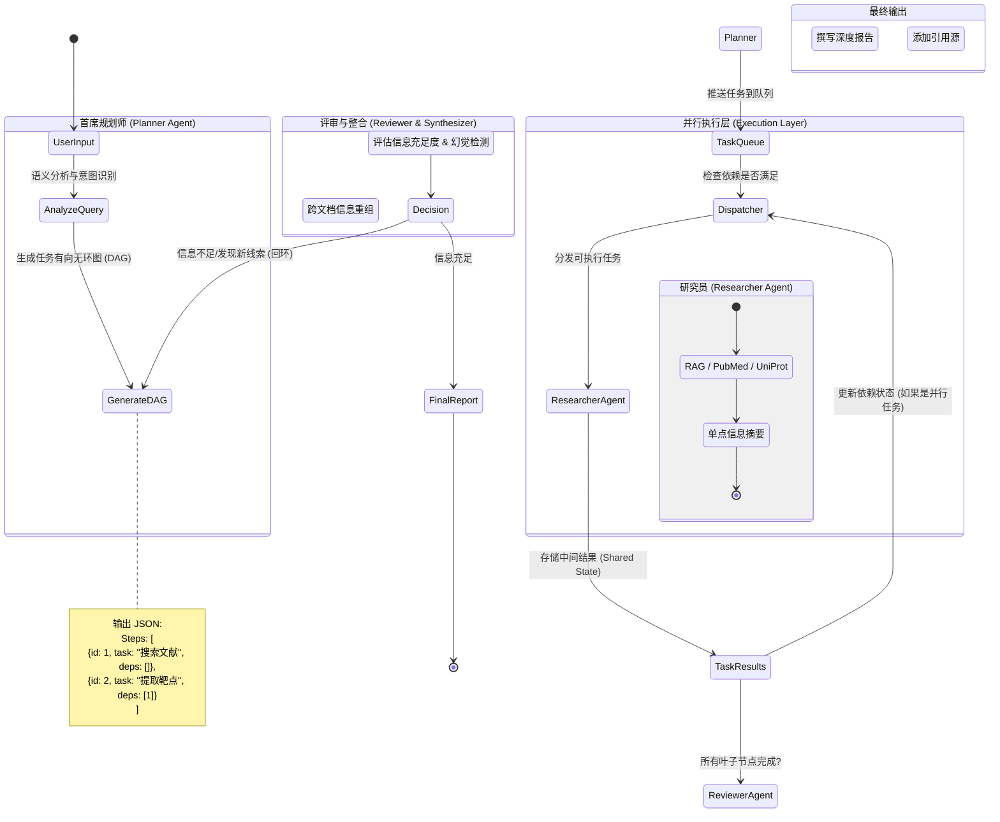

```mermaid
stateDiagram-v2
    direction TB

    classDef planner fill:#f9f,stroke:#333,stroke-width:2px;
    classDef executor fill:#bbf,stroke:#333,stroke-width:2px;
    classDef reviewer fill:#bfb,stroke:#333,stroke-width:2px;
    classDef endstate fill:#ddd,stroke:#333,stroke-width:2px;

    [*] --> UserInput

    state "首席规划师 (Planner Agent)" as Planner:::planner {
        UserInput --> AnalyzeQuery: 语义分析与意图识别
        AnalyzeQuery --> GenerateDAG: 生成任务有向无环图 (DAG)
        note right of GenerateDAG
            输出 JSON:
            Steps: [
              {id: 1, task: "搜索文献", deps: []},
              {id: 2, task: "提取靶点", deps: [1]}
            ]
        end note
    }

    Planner --> TaskQueue: 推送任务到队列

    state "并行执行层 (Execution Layer)" as Execution {
        TaskQueue --> Dispatcher: 检查依赖是否满足
        Dispatcher --> ResearcherAgent: 分发可执行任务
        
        state "研究员 (Researcher Agent)" as ResearcherAgent:::executor {
            ToolCall: RAG / PubMed / UniProt
            Summarize: 单点信息摘要
            
            [*] --> ToolCall
            ToolCall --> Summarize
            Summarize --> [*]
        }
    }

    ResearcherAgent --> TaskResults: 存储中间结果 (Shared State)
    TaskResults --> Dispatcher: 更新依赖状态 (如果是并行任务)
    TaskResults --> ReviewerAgent: 所有叶子节点完成?

    state "评审与整合 (Reviewer & Synthesizer)" as ReviewerAgent:::reviewer {
        Evaluate: 评估信息充足度 & 幻觉检测
        Reorganize: 跨文档信息重组
        
        Evaluate --> Decision
    }

    state Decision <<choice>>
    Decision --> GenerateDAG: 信息不足/发现新线索 (回环)
    Decision --> FinalReport: 信息充足

    state "最终输出" as FinalReport:::endstate {
        Write: 撰写深度报告
        Citations: 添加引用源
    }

    FinalReport --> [*]
```
