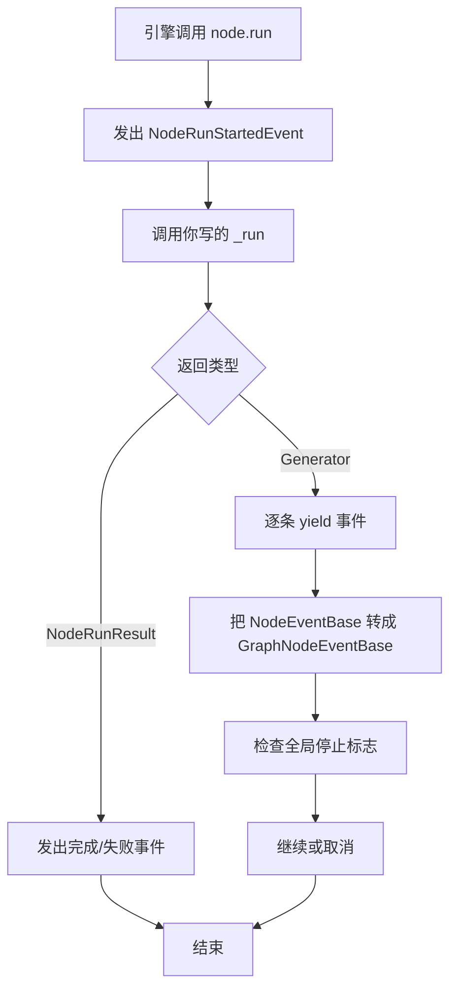
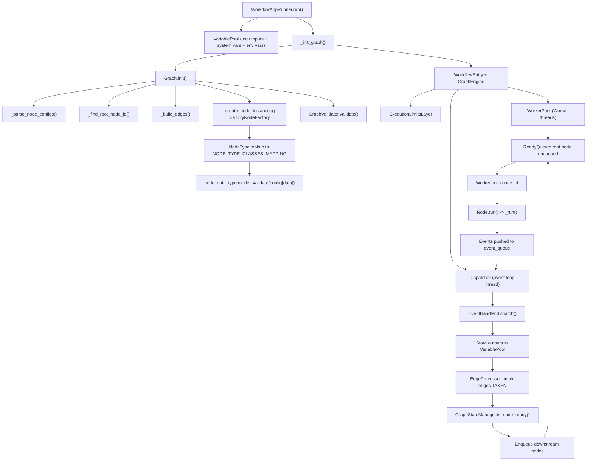
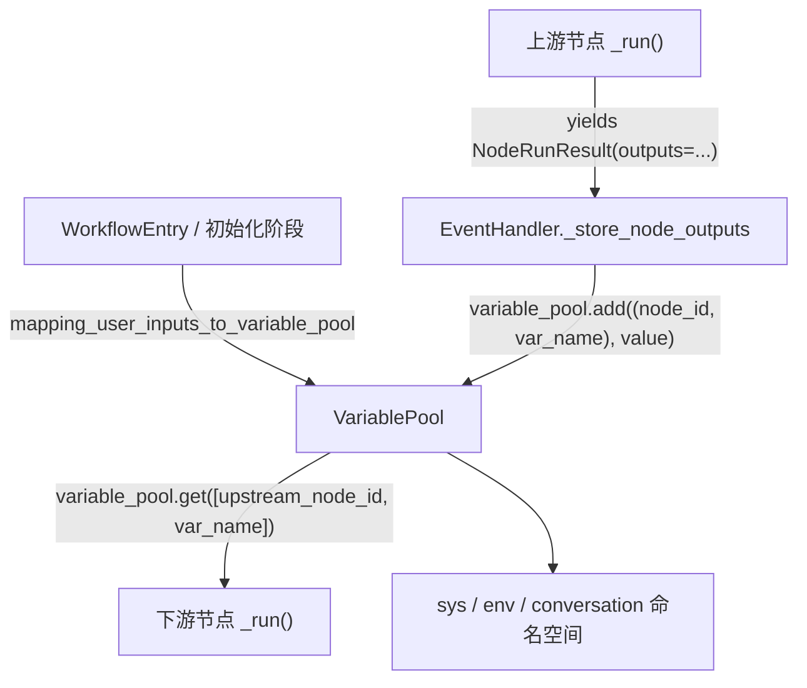
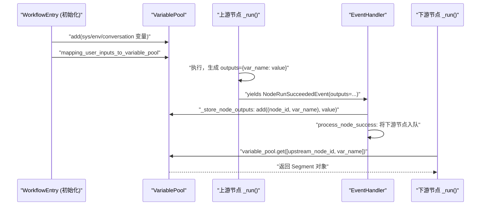

# DeepWiki Q&A with Code Context for Repository: langgenius/dify
## Q1
给我讲讲dify的llm客户端是如何写的 重点：如何使用不同提供商的模型 ；重点2 不同节点之间他是如何进行格式化规范的 如何保证节点图之间可以llm可以稳定的运行而不出问题
### Answer
## 一句话总结
Dify 通过 Model Runtime 三层架构统一不同 LLM 提供商的调用，并在工作流节点内使用 LLMNode 将模型配置、提示模板与变量池标准化，再通过发布前凭据校验与运行时异常处理保证节点图稳定运行。

---

## 1. 多提供商模型的统一使用方式（Model Runtime 三层架构）

- **工厂层**：提供获取所有 providers、模型列表、实例化与凭据校验的统一入口（`ModelProviderFactory`），对外屏蔽不同厂商差异 dify:37-40 。
- **Provider 层**：每个 provider 实现自己的模型列表、实例获取与凭据规则，支持横向扩展（如 OpenAI、本地 Xinference 等） dify:41-50 。
- **Model 层**：具体模型实现 invoke_llm 等方法，支持流式/非流式、工具调用、结构化输出等 dify:45-47 。
- **插件化调用**：支持通过插件方式调用 LLM，`_invoke_llm_via_plugin` 将请求转发到 `PluginModelClient` dify:138-167 。

### 在 LLM 节点中的使用
- 节点配置 `ModelConfig` 包含 `provider`、`name`、`mode` 与 `completion_params` dify:12-17 。
- `LLMNode._fetch_model_config` 通过 `ModelManager.get_model_instance` 获取对应 provider 的 `ModelInstance`，完成凭据与参数组装 dify:202-205 （实现细节见 `ModelManager` 调用）。
- 调用统一入口 `LLMNode.invoke_llm`，传入 `prompt_messages`、`model_parameters`、`tools` 等，由 `ModelInstance.invoke_llm` 实际执行 dify:240-253 。

---

## 2. 节点间格式化规范与稳定性保障

### 2.1 消息与变量格式化
- **提示模板**：支持基础模板与 Jinja2 模板两类，`LLMNode.handle_list_messages` 分别处理：Jinja2 通过 `_render_jinja2_message` 渲染；基础模板通过 `VariablePool.convert_template` 替换变量并处理文件段（图片/视频/文档等） dify:1076-1135 。
- **变量池（VariablePool）**：在图运行时共享变量，节点通过选择器（如 `["sys","query"]`）读写，保证跨节点数据类型一致 dify:159-172 。
- **结构化输出**：`invoke_llm_with_structured_output` 根据模型能力选择原生 JSON Schema 或提示式注入，并在流式与非流式下统一解析结果为结构化对象 dify:121-148 。

### 2.2 稳定性保障机制
- **发布前凭据校验**：`WorkflowService._validate_workflow_credentials` 遍历所有 LLM/Agent/Tool 节点，调用 `ModelManager.get_model_instance` 与 `ProviderManager.get_configurations` 验证凭据合规性与模型状态，防止运行时因配置失败导致节点崩溃 dify:342-420 ；具体 LLM 校验见 `_validate_llm_model_config` dify:422-472 。
- **运行时异常处理**：LLM 节点在 `_run` 中捕获异常并通过 `NodeRunResult` 返回 FAILED 状态与错误信息，避免流程中断 dify:219-231 （示例节点处理方式）。
- **推理内容分离**：通过 `reasoning_format` 控制是否保留 `<think>` 标签，`_split_reasoning` 将推理内容与正文分离，避免下游解析错误 dify:267-273 。

---

## 3. 完整调用示例（测试用例佐证）
- 测试用例展示 LLM 节点配置：指定 provider 为 “openai”、name 为 “gpt-3.5-turbo”、mode 为 “chat”，并在提示模板中使用变量选择器 `{{#abc.output#}}` 与 `{{#sys.query#}}` dify:95-107 。
- 通过 mock `fetch_model_config` 与 `fetch_prompt_messages` 验证节点能正确组装 `PromptMessage` 并调用 `model_instance.invoke_llm` dify:118-167 。

---

## Notes
- Model Runtime 的三层设计（工厂/Provider/Model）是实现多厂商统一的关键，新增 provider 只需实现对应接口 dify:35-47 。
- 节点间通过 `VariablePool` 与统一 `PromptMessage` 格式交换数据，Jinja2 与基础模板并存满足灵活性与可维护性 dify:1076-1135 。
- 发布前的凭据与模型状态校验是防止运行时节点崩溃的重要防线 dify:342-420 。
- 结构化输出与推理内容分离机制进一步增强了节点间数据解析的鲁棒性 dify:121-148 dify:267-273 。

Wiki pages you might want to explore:
- [Application Types and Execution Modes (langgenius/dify)](/wiki/langgenius/dify#2.3)
### Citations
**File:** api/core/model_runtime/README.md (L35-47)
```markdown
Model Runtime is divided into three layers:

- The outermost layer is the factory method

  It provides methods for obtaining all providers, all model lists, getting provider instances, and authenticating provider/model credentials.

- The second layer is the provider layer

  It provides the current provider's model list, model instance obtaining, provider credential authentication, and provider configuration rule information, **allowing horizontal expansion** to support different providers.

- The bottom layer is the model layer

  It offers direct invocation of various model types, predefined model configuration information, getting predefined/remote model lists, model credential authentication methods. Different models provide additional special methods, like LLM's pre-computed tokens method, cost information obtaining method, etc., **allowing horizontal expansion** for different models under the same provider (within supported model types).
```
**File:** api/core/model_runtime/README_CN.md (L41-50)
```markdown
- 第二层为供应商层

  提供获取当前供应商模型列表、获取模型实例、供应商凭据鉴权、供应商配置规则信息，**可横向扩展**以支持不同的供应商。

  对于供应商/模型凭据，有两种情况

  - 如 OpenAI 这类中心化供应商，需要定义如**api_key**这类的鉴权凭据
  - 如[**Xinference**](https://github.com/xorbitsai/inference)这类本地部署的供应商，需要定义如**server_url**这类的地址凭据，有时候还需要定义**model_uid**之类的模型类型凭据。当在供应商层定义了这些凭据后，就可以在前端页面上直接展示，无需修改前端逻辑。

  当配置好凭据后，就可以通过 DifyRuntime 的外部接口直接获取到对应供应商所需要的**Schema**（凭据表单规则），从而在可以在不修改前端逻辑的情况下，提供新的供应商/模型的支持。
```
**File:** api/core/model_runtime/model_providers/__base/large_language_model.py (L138-167)
```python
def _invoke_llm_via_plugin(
    *,
    tenant_id: str,
    user_id: str,
    plugin_id: str,
    provider: str,
    model: str,
    credentials: dict,
    model_parameters: dict,
    prompt_messages: Sequence[PromptMessage],
    tools: list[PromptMessageTool] | None,
    stop: Sequence[str] | None,
    stream: bool,
) -> Union[LLMResult, Generator[LLMResultChunk, None, None]]:
    from core.plugin.impl.model import PluginModelClient

    plugin_model_manager = PluginModelClient()
    return plugin_model_manager.invoke_llm(
        tenant_id=tenant_id,
        user_id=user_id,
        plugin_id=plugin_id,
        provider=provider,
        model=model,
        credentials=credentials,
        model_parameters=model_parameters,
        prompt_messages=list(prompt_messages),
        tools=tools,
        stop=list(stop) if stop else None,
        stream=stream,
    )
```
**File:** api/core/workflow/nodes/llm/entities.py (L12-17)
```python
class ModelConfig(BaseModel):
    provider: str
    name: str
    mode: LLMMode
    completion_params: dict[str, Any] = Field(default_factory=dict)

```
**File:** api/core/workflow/nodes/llm/node.py (L159-172)
```python
        variable_pool = self.graph_runtime_state.variable_pool

        try:
            # init messages template
            self.node_data.prompt_template = self._transform_chat_messages(self.node_data.prompt_template)

            # fetch variables and fetch values from variable pool
            inputs = self._fetch_inputs(node_data=self.node_data)

            # fetch jinja2 inputs
            jinja_inputs = self._fetch_jinja_inputs(node_data=self.node_data)

            # merge inputs
            inputs.update(jinja_inputs)
```
**File:** api/core/workflow/nodes/llm/node.py (L202-205)
```python
            model_instance, model_config = LLMNode._fetch_model_config(
                node_data_model=self.node_data.model,
                tenant_id=self.tenant_id,
            )
```
**File:** api/core/workflow/nodes/llm/node.py (L240-253)
```python
            generator = LLMNode.invoke_llm(
                node_data_model=self.node_data.model,
                model_instance=model_instance,
                prompt_messages=prompt_messages,
                stop=stop,
                user_id=self.user_id,
                structured_output_enabled=self.node_data.structured_output_enabled,
                structured_output=self.node_data.structured_output,
                file_saver=self._llm_file_saver,
                file_outputs=self._file_outputs,
                node_id=self._node_id,
                node_type=self.node_type,
                reasoning_format=self.node_data.reasoning_format,
            )
```
**File:** api/core/workflow/nodes/llm/node.py (L267-273)
```python
                    # For downstream nodes, determine clean text based on reasoning_format
                    if self.node_data.reasoning_format == "tagged":
                        # Keep <think> tags for backward compatibility
                        clean_text = result_text
                    else:
                        # Extract clean text from <think> tags
                        clean_text, _ = LLMNode._split_reasoning(result_text, self.node_data.reasoning_format)
```
**File:** api/core/workflow/nodes/llm/node.py (L1076-1135)
```python
    def handle_list_messages(
        *,
        messages: Sequence[LLMNodeChatModelMessage],
        context: str | None,
        jinja2_variables: Sequence[VariableSelector],
        variable_pool: VariablePool,
        vision_detail_config: ImagePromptMessageContent.DETAIL,
    ) -> Sequence[PromptMessage]:
        prompt_messages: list[PromptMessage] = []
        for message in messages:
            if message.edition_type == "jinja2":
                result_text = _render_jinja2_message(
                    template=message.jinja2_text or "",
                    jinja2_variables=jinja2_variables,
                    variable_pool=variable_pool,
                )
                prompt_message = _combine_message_content_with_role(
                    contents=[TextPromptMessageContent(data=result_text)], role=message.role
                )
                prompt_messages.append(prompt_message)
            else:
                # Get segment group from basic message
                if context:
                    template = message.text.replace("{#context#}", context)
                else:
                    template = message.text
                segment_group = variable_pool.convert_template(template)

                # Process segments for images
                file_contents = []
                for segment in segment_group.value:
                    if isinstance(segment, ArrayFileSegment):
                        for file in segment.value:
                            if file.type in {FileType.IMAGE, FileType.VIDEO, FileType.AUDIO, FileType.DOCUMENT}:
                                file_content = file_manager.to_prompt_message_content(
                                    file, image_detail_config=vision_detail_config
                                )
                                file_contents.append(file_content)
                    elif isinstance(segment, FileSegment):
                        file = segment.value
                        if file.type in {FileType.IMAGE, FileType.VIDEO, FileType.AUDIO, FileType.DOCUMENT}:
                            file_content = file_manager.to_prompt_message_content(
                                file, image_detail_config=vision_detail_config
                            )
                            file_contents.append(file_content)

                # Create message with text from all segments
                plain_text = segment_group.text
                if plain_text:
                    prompt_message = _combine_message_content_with_role(
                        contents=[TextPromptMessageContent(data=plain_text)], role=message.role
                    )
                    prompt_messages.append(prompt_message)

                if file_contents:
                    # Create message with image contents
                    prompt_message = _combine_message_content_with_role(contents=file_contents, role=message.role)
                    prompt_messages.append(prompt_message)

        return prompt_messages
```
**File:** api/core/llm_generator/output_parser/structured_output.py (L121-148)
```python
    # handle native json schema
    model_parameters_with_json_schema: dict[str, Any] = {
        **(model_parameters or {}),
    }

    if model_schema.support_structure_output:
        model_parameters = _handle_native_json_schema(
            provider, model_schema, json_schema, model_parameters_with_json_schema, model_schema.parameter_rules
        )
    else:
        # Set appropriate response format based on model capabilities
        _set_response_format(model_parameters_with_json_schema, model_schema.parameter_rules)

        # handle prompt based schema
        prompt_messages = _handle_prompt_based_schema(
            prompt_messages=prompt_messages,
            structured_output_schema=json_schema,
        )

    llm_result = model_instance.invoke_llm(
        prompt_messages=list(prompt_messages),
        model_parameters=model_parameters_with_json_schema,
        tools=tools,
        stop=stop,
        stream=stream,
        user=user,
        callbacks=callbacks,
    )
```
**File:** api/services/workflow_service.py (L342-420)
```python
    def _validate_workflow_credentials(self, workflow: Workflow) -> None:
        """
        Validate all credentials in workflow nodes before publishing.

        :param workflow: The workflow to validate
        :raises ValueError: If any credentials violate policy compliance
        """
        graph_dict = workflow.graph_dict
        nodes = graph_dict.get("nodes", [])

        for node in nodes:
            node_data = node.get("data", {})
            node_type = node_data.get("type")
            node_id = node.get("id", "unknown")

            try:
                # Extract and validate credentials based on node type
                if node_type == "tool":
                    credential_id = node_data.get("credential_id")
                    provider = node_data.get("provider_id")
                    if provider:
                        if credential_id:
                            # Check specific credential
                            from core.helper.credential_utils import check_credential_policy_compliance

                            check_credential_policy_compliance(
                                credential_id=credential_id,
                                provider=provider,
                                credential_type=PluginCredentialType.TOOL,
                            )
                        else:
                            # Check default workspace credential for this provider
                            self._check_default_tool_credential(workflow.tenant_id, provider)

                elif node_type == "agent":
                    agent_params = node_data.get("agent_parameters", {})

                    model_config = agent_params.get("model", {}).get("value", {})
                    if model_config.get("provider") and model_config.get("model"):
                        self._validate_llm_model_config(
                            workflow.tenant_id, model_config["provider"], model_config["model"]
                        )

                        # Validate load balancing credentials for agent model if load balancing is enabled
                        agent_model_node_data = {"model": model_config}
                        self._validate_load_balancing_credentials(workflow, agent_model_node_data, node_id)

                    # Validate agent tools
                    tools = agent_params.get("tools", {}).get("value", [])
                    for tool in tools:
                        # Agent tools store provider in provider_name field
                        provider = tool.get("provider_name")
                        credential_id = tool.get("credential_id")
                        if provider:
                            if credential_id:
                                from core.helper.credential_utils import check_credential_policy_compliance

                                check_credential_policy_compliance(credential_id, provider, PluginCredentialType.TOOL)
                            else:
                                self._check_default_tool_credential(workflow.tenant_id, provider)

                elif node_type in ["llm", "knowledge_retrieval", "parameter_extractor", "question_classifier"]:
                    model_config = node_data.get("model", {})
                    provider = model_config.get("provider")
                    model_name = model_config.get("name")

                    if provider and model_name:
                        # Validate that the provider+model combination can fetch valid credentials
                        self._validate_llm_model_config(workflow.tenant_id, provider, model_name)
                        # Validate load balancing credentials if load balancing is enabled
                        self._validate_load_balancing_credentials(workflow, node_data, node_id)
                    else:
                        raise ValueError(f"Node {node_id} ({node_type}): Missing provider or model configuration")

            except Exception as e:
                if isinstance(e, ValueError):
                    raise e
                else:
                    raise ValueError(f"Node {node_id} ({node_type}): {str(e)}")
```
**File:** api/services/workflow_service.py (L422-472)
```python
    def _validate_llm_model_config(self, tenant_id: str, provider: str, model_name: str) -> None:
        """
        Validate that an LLM model configuration can fetch valid credentials and has active status.

        This method attempts to get the model instance and validates that:
        1. The provider exists and is configured
        2. The model exists in the provider
        3. Credentials can be fetched for the model
        4. The credentials pass policy compliance checks
        5. The model status is ACTIVE (not NO_CONFIGURE, DISABLED, etc.)

        :param tenant_id: The tenant ID
        :param provider: The provider name
        :param model_name: The model name
        :raises ValueError: If the model configuration is invalid or credentials fail policy checks
        """
        try:
            from core.model_manager import ModelManager
            from core.model_runtime.entities.model_entities import ModelType
            from core.provider_manager import ProviderManager

            # Get model instance to validate provider+model combination
            model_manager = ModelManager()
            model_manager.get_model_instance(
                tenant_id=tenant_id, provider=provider, model_type=ModelType.LLM, model=model_name
            )

            # The ModelInstance constructor will automatically check credential policy compliance
            # via ProviderConfiguration.get_current_credentials() -> _check_credential_policy_compliance()
            # If it fails, an exception will be raised

            # Additionally, check the model status to ensure it's ACTIVE
            provider_manager = ProviderManager()
            provider_configurations = provider_manager.get_configurations(tenant_id)
            models = provider_configurations.get_models(provider=provider, model_type=ModelType.LLM)

            target_model = None
            for model in models:
                if model.model == model_name and model.provider.provider == provider:
                    target_model = model
                    break

            if target_model:
                target_model.raise_for_status()
            else:
                raise ValueError(f"Model {model_name} not found for provider {provider}")

        except Exception as e:
            raise ValueError(
                f"Failed to validate LLM model configuration (provider: {provider}, model: {model_name}): {str(e)}"
            )
```
**File:** api/core/workflow/nodes/question_classifier/question_classifier_node.py (L219-231)
```python
        except ValueError as e:
            return NodeRunResult(
                status=WorkflowNodeExecutionStatus.FAILED,
                inputs=variables,
                error=str(e),
                error_type=type(e).__name__,
                metadata={
                    WorkflowNodeExecutionMetadataKey.TOTAL_TOKENS: usage.total_tokens,
                    WorkflowNodeExecutionMetadataKey.TOTAL_PRICE: usage.total_price,
                    WorkflowNodeExecutionMetadataKey.CURRENCY: usage.currency,
                },
                llm_usage=usage,
            )
```
**File:** api/tests/integration_tests/workflow/nodes/test_llm.py (L95-107)
```python
                "model": {
                    "provider": "openai",
                    "name": "gpt-3.5-turbo",
                    "mode": "chat",
                    "completion_params": {},
                },
                "prompt_template": [
                    {
                        "role": "system",
                        "text": "you are a helpful assistant.\ntoday's weather is {{#abc.output#}}.",
                    },
                    {"role": "user", "text": "{{#sys.query#}}"},
                ],
```
**File:** api/tests/integration_tests/workflow/nodes/test_llm.py (L118-167)
```python
    def mock_fetch_model_config(**_kwargs):
        from decimal import Decimal
        from unittest.mock import MagicMock

        from core.model_runtime.entities.llm_entities import LLMResult, LLMUsage
        from core.model_runtime.entities.message_entities import AssistantPromptMessage

        # Create mock model instance
        mock_model_instance = MagicMock()
        mock_usage = LLMUsage(
            prompt_tokens=30,
            prompt_unit_price=Decimal("0.001"),
            prompt_price_unit=Decimal(1000),
            prompt_price=Decimal("0.00003"),
            completion_tokens=20,
            completion_unit_price=Decimal("0.002"),
            completion_price_unit=Decimal(1000),
            completion_price=Decimal("0.00004"),
            total_tokens=50,
            total_price=Decimal("0.00007"),
            currency="USD",
            latency=0.5,
        )
        mock_message = AssistantPromptMessage(content="Test response from mock")
        mock_llm_result = LLMResult(
            model="gpt-3.5-turbo",
            prompt_messages=[],
            message=mock_message,
            usage=mock_usage,
        )
        mock_model_instance.invoke_llm.return_value = mock_llm_result

        # Create mock model config
        mock_model_config = MagicMock()
        mock_model_config.mode = "chat"
        mock_model_config.provider = "openai"
        mock_model_config.model = "gpt-3.5-turbo"
        mock_model_config.parameters = {}

        return mock_model_instance, mock_model_config

    # Mock fetch_prompt_messages to avoid database calls
    def mock_fetch_prompt_messages_1(**_kwargs):
        from core.model_runtime.entities.message_entities import SystemPromptMessage, UserPromptMessage

        return [
            SystemPromptMessage(content="you are a helpful assistant. today's weather is sunny."),
            UserPromptMessage(content="what's the weather today?"),
        ], []

```
## Q2
讲讲llm
### Answer
## 概要
在 Dify 中，LLM 节点（`LLMNode`）负责统一调用不同提供商的大模型，支持流式/非流式、结构化输出、多模态与推理内容分离，并通过变量池与提示模板实现节点间数据规范化，同时通过发布前凭据校验与运行时异常捕获保障工作流稳定运行 dify:151-205 dify:240-253 。

---

## 1. 核心执行流程（_run）
- 初始化提示模板并获取变量池，提取普通变量与 Jinja2 变量并合并 dify:159-172 。
- 可选获取上下文与视觉文件，存入 `node_inputs` 用于后续传递 dify:187-199 。
- 通过 `_fetch_model_config` 获取 `ModelInstance` 与 `ModelConfig`，完成凭据与模型参数组装 dify:202-205 。
- 调用 `fetch_prompt_messages` 构造最终 `PromptMessage` 列表与停止词 dify:223-237 。
- 调用 `invoke_llm` 执行模型请求，处理流式事件与结构化输出，并扣除配额 dify:240-284 。
- 根据 `reasoning_format` 决定是否剥离 `<think>` 标签，输出 `clean_text` 与 `reasoning_content` dify:267-273 。
- 异常时返回 `NodeRunResult(FAILED)` 并记录错误信息，避免流程中断 dify:331-353 。

---

## 2. 模型调用（invoke_llm）
- 获取模型 `model_schema`，若启用结构化输出则调用 `invoke_llm_with_structured_output`，否则直接调用 `model_instance.invoke_llm`，均以流式方式执行 dify:371-403 。
- `handle_invoke_result` 统一处理流式分块，收集文本、使用量、完成原因，并支持多模态文件保存 dify:442-494 。

---

## 3. 提示消息构建（fetch_prompt_messages 与 handle_list_messages）
- 支持两种模板：基础模板通过 `VariablePool.convert_template` 替换变量；Jinja2 模板通过 `_render_jinja2_message` 渲染 dify:1076-1135 。
- 自动处理多模态文件（图片/视频/音频/文档），将其转为 `PromptMessageContent` 并按角色组装 dify:1104-1133 。

---

## 4. 结构化输出与推理内容分离
- 根据模型是否原生支持结构化输出，选择注入 JSON Schema 或提示式约束，并在流式/非流式下统一解析为结构化对象 dify:121-148 。
- `reasoning_format` 为 `separated` 时剥离 `<think>` 标签，为 `tagged` 时保留原始文本，同时提供 `reasoning_content` 字段供下游使用 dify:267-273 。

---

## 5. 稳定性保障
- 发布前遍历所有 LLM/Agent/Tool 节点，校验凭据合规性与模型状态，防止运行时因配置失败崩溃 dify:342-420 。
- 运行时捕获异常并返回 `NodeRunResult(FAILED)`，记录错误类型与使用量，避免整个工作流中断 dify:331-353 。

---

## Notes
- `LLMNode` 是工作流中调用 LLM 的统一入口，通过 `ModelConfig` 指定 provider、name、mode 与参数 dify:12-17 。
- 测试用例展示了如何配置 provider 为 “openai”、name 为 “gpt-3.5-turbo”，并在提示中使用变量选择器 `{{#abc.output#}}` 与 `{{#sys.query#}}` dify:95-107 。
- 流式执行时通过 `StreamChunkEvent` 逐块输出，最终以 `StreamCompletedEvent` 结束并携带完整结果 dify:311-330 。

Wiki pages you might want to explore:
- [Application Types and Execution Modes (langgenius/dify)](/wiki/langgenius/dify#2.3)
### Citations
**File:** api/core/workflow/nodes/llm/node.py (L151-205)
```python
    def _run(self) -> Generator:
        node_inputs: dict[str, Any] = {}
        process_data: dict[str, Any] = {}
        result_text = ""
        clean_text = ""
        usage = LLMUsage.empty_usage()
        finish_reason = None
        reasoning_content = None
        variable_pool = self.graph_runtime_state.variable_pool

        try:
            # init messages template
            self.node_data.prompt_template = self._transform_chat_messages(self.node_data.prompt_template)

            # fetch variables and fetch values from variable pool
            inputs = self._fetch_inputs(node_data=self.node_data)

            # fetch jinja2 inputs
            jinja_inputs = self._fetch_jinja_inputs(node_data=self.node_data)

            # merge inputs
            inputs.update(jinja_inputs)

            # fetch files
            files = (
                llm_utils.fetch_files(
                    variable_pool=variable_pool,
                    selector=self.node_data.vision.configs.variable_selector,
                )
                if self.node_data.vision.enabled
                else []
            )

            if files:
                node_inputs["#files#"] = [file.to_dict() for file in files]

            # fetch context value
            generator = self._fetch_context(node_data=self.node_data)
            context = None
            context_files: list[File] = []
            for event in generator:
                context = event.context
                context_files = event.context_files or []
                yield event
            if context:
                node_inputs["#context#"] = context

            if context_files:
                node_inputs["#context_files#"] = [file.model_dump() for file in context_files]

            # fetch model config
            model_instance, model_config = LLMNode._fetch_model_config(
                node_data_model=self.node_data.model,
                tenant_id=self.tenant_id,
            )
```
**File:** api/core/workflow/nodes/llm/node.py (L223-237)
```python
            prompt_messages, stop = LLMNode.fetch_prompt_messages(
                sys_query=query,
                sys_files=files,
                context=context,
                memory=memory,
                model_config=model_config,
                prompt_template=self.node_data.prompt_template,
                memory_config=self.node_data.memory,
                vision_enabled=self.node_data.vision.enabled,
                vision_detail=self.node_data.vision.configs.detail,
                variable_pool=variable_pool,
                jinja2_variables=self.node_data.prompt_config.jinja2_variables,
                tenant_id=self.tenant_id,
                context_files=context_files,
            )
```
**File:** api/core/workflow/nodes/llm/node.py (L240-284)
```python
            generator = LLMNode.invoke_llm(
                node_data_model=self.node_data.model,
                model_instance=model_instance,
                prompt_messages=prompt_messages,
                stop=stop,
                user_id=self.user_id,
                structured_output_enabled=self.node_data.structured_output_enabled,
                structured_output=self.node_data.structured_output,
                file_saver=self._llm_file_saver,
                file_outputs=self._file_outputs,
                node_id=self._node_id,
                node_type=self.node_type,
                reasoning_format=self.node_data.reasoning_format,
            )

            structured_output: LLMStructuredOutput | None = None

            for event in generator:
                if isinstance(event, StreamChunkEvent):
                    yield event
                elif isinstance(event, ModelInvokeCompletedEvent):
                    # Raw text
                    result_text = event.text
                    usage = event.usage
                    finish_reason = event.finish_reason
                    reasoning_content = event.reasoning_content or ""

                    # For downstream nodes, determine clean text based on reasoning_format
                    if self.node_data.reasoning_format == "tagged":
                        # Keep <think> tags for backward compatibility
                        clean_text = result_text
                    else:
                        # Extract clean text from <think> tags
                        clean_text, _ = LLMNode._split_reasoning(result_text, self.node_data.reasoning_format)

                    # Process structured output if available from the event.
                    structured_output = (
                        LLMStructuredOutput(structured_output=event.structured_output)
                        if event.structured_output
                        else None
                    )

                    # deduct quota
                    llm_utils.deduct_llm_quota(tenant_id=self.tenant_id, model_instance=model_instance, usage=usage)
                    break
```
**File:** api/core/workflow/nodes/llm/node.py (L311-330)
```python
            yield StreamChunkEvent(
                selector=[self._node_id, "text"],
                chunk="",
                is_final=True,
            )

            yield StreamCompletedEvent(
                node_run_result=NodeRunResult(
                    status=WorkflowNodeExecutionStatus.SUCCEEDED,
                    inputs=node_inputs,
                    process_data=process_data,
                    outputs=outputs,
                    metadata={
                        WorkflowNodeExecutionMetadataKey.TOTAL_TOKENS: usage.total_tokens,
                        WorkflowNodeExecutionMetadataKey.TOTAL_PRICE: usage.total_price,
                        WorkflowNodeExecutionMetadataKey.CURRENCY: usage.currency,
                    },
                    llm_usage=usage,
                )
            )
```
**File:** api/core/workflow/nodes/llm/node.py (L331-353)
```python
        except ValueError as e:
            yield StreamCompletedEvent(
                node_run_result=NodeRunResult(
                    status=WorkflowNodeExecutionStatus.FAILED,
                    error=str(e),
                    inputs=node_inputs,
                    process_data=process_data,
                    error_type=type(e).__name__,
                    llm_usage=usage,
                )
            )
        except Exception as e:
            logger.exception("error while executing llm node")
            yield StreamCompletedEvent(
                node_run_result=NodeRunResult(
                    status=WorkflowNodeExecutionStatus.FAILED,
                    error=str(e),
                    inputs=node_inputs,
                    process_data=process_data,
                    error_type=type(e).__name__,
                    llm_usage=usage,
                )
            )
```
**File:** api/core/workflow/nodes/llm/node.py (L371-403)
```python
        model_schema = model_instance.model_type_instance.get_model_schema(
            node_data_model.name, model_instance.credentials
        )
        if not model_schema:
            raise ValueError(f"Model schema not found for {node_data_model.name}")

        if structured_output_enabled:
            output_schema = LLMNode.fetch_structured_output_schema(
                structured_output=structured_output or {},
            )
            request_start_time = time.perf_counter()

            invoke_result = invoke_llm_with_structured_output(
                provider=model_instance.provider,
                model_schema=model_schema,
                model_instance=model_instance,
                prompt_messages=prompt_messages,
                json_schema=output_schema,
                model_parameters=node_data_model.completion_params,
                stop=list(stop or []),
                stream=True,
                user=user_id,
            )
        else:
            request_start_time = time.perf_counter()

            invoke_result = model_instance.invoke_llm(
                prompt_messages=list(prompt_messages),
                model_parameters=node_data_model.completion_params,
                stop=list(stop or []),
                stream=True,
                user=user_id,
            )
```
**File:** api/core/workflow/nodes/llm/node.py (L442-494)
```python
        # For streaming mode
        model = ""
        prompt_messages: list[PromptMessage] = []

        usage = LLMUsage.empty_usage()
        finish_reason = None
        full_text_buffer = io.StringIO()

        # Initialize streaming metrics tracking
        start_time = request_start_time if request_start_time is not None else time.perf_counter()
        first_token_time = None
        has_content = False

        collected_structured_output = None  # Collect structured_output from streaming chunks
        # Consume the invoke result and handle generator exception
        try:
            for result in invoke_result:
                if isinstance(result, LLMResultChunkWithStructuredOutput):
                    # Collect structured_output from the chunk
                    if result.structured_output is not None:
                        collected_structured_output = dict(result.structured_output)
                    yield result
                if isinstance(result, LLMResultChunk):
                    contents = result.delta.message.content
                    for text_part in LLMNode._save_multimodal_output_and_convert_result_to_markdown(
                        contents=contents,
                        file_saver=file_saver,
                        file_outputs=file_outputs,
                    ):
                        # Detect first token for TTFT calculation
                        if text_part and not has_content:
                            first_token_time = time.perf_counter()
                            has_content = True

                        full_text_buffer.write(text_part)
                        yield StreamChunkEvent(
                            selector=[node_id, "text"],
                            chunk=text_part,
                            is_final=False,
                        )

                    # Update the whole metadata
                    if not model and result.model:
                        model = result.model
                    if len(prompt_messages) == 0:
                        # TODO(QuantumGhost): it seems that this update has no visable effect.
                        # What's the purpose of the line below?
                        prompt_messages = list(result.prompt_messages)
                    if usage.prompt_tokens == 0 and result.delta.usage:
                        usage = result.delta.usage
                    if finish_reason is None and result.delta.finish_reason:
                        finish_reason = result.delta.finish_reason
        except OutputParserError as e:
```
**File:** api/core/workflow/nodes/llm/node.py (L1076-1135)
```python
    def handle_list_messages(
        *,
        messages: Sequence[LLMNodeChatModelMessage],
        context: str | None,
        jinja2_variables: Sequence[VariableSelector],
        variable_pool: VariablePool,
        vision_detail_config: ImagePromptMessageContent.DETAIL,
    ) -> Sequence[PromptMessage]:
        prompt_messages: list[PromptMessage] = []
        for message in messages:
            if message.edition_type == "jinja2":
                result_text = _render_jinja2_message(
                    template=message.jinja2_text or "",
                    jinja2_variables=jinja2_variables,
                    variable_pool=variable_pool,
                )
                prompt_message = _combine_message_content_with_role(
                    contents=[TextPromptMessageContent(data=result_text)], role=message.role
                )
                prompt_messages.append(prompt_message)
            else:
                # Get segment group from basic message
                if context:
                    template = message.text.replace("{#context#}", context)
                else:
                    template = message.text
                segment_group = variable_pool.convert_template(template)

                # Process segments for images
                file_contents = []
                for segment in segment_group.value:
                    if isinstance(segment, ArrayFileSegment):
                        for file in segment.value:
                            if file.type in {FileType.IMAGE, FileType.VIDEO, FileType.AUDIO, FileType.DOCUMENT}:
                                file_content = file_manager.to_prompt_message_content(
                                    file, image_detail_config=vision_detail_config
                                )
                                file_contents.append(file_content)
                    elif isinstance(segment, FileSegment):
                        file = segment.value
                        if file.type in {FileType.IMAGE, FileType.VIDEO, FileType.AUDIO, FileType.DOCUMENT}:
                            file_content = file_manager.to_prompt_message_content(
                                file, image_detail_config=vision_detail_config
                            )
                            file_contents.append(file_content)

                # Create message with text from all segments
                plain_text = segment_group.text
                if plain_text:
                    prompt_message = _combine_message_content_with_role(
                        contents=[TextPromptMessageContent(data=plain_text)], role=message.role
                    )
                    prompt_messages.append(prompt_message)

                if file_contents:
                    # Create message with image contents
                    prompt_message = _combine_message_content_with_role(contents=file_contents, role=message.role)
                    prompt_messages.append(prompt_message)

        return prompt_messages
```
**File:** api/core/workflow/nodes/llm/entities.py (L12-17)
```python
class ModelConfig(BaseModel):
    provider: str
    name: str
    mode: LLMMode
    completion_params: dict[str, Any] = Field(default_factory=dict)

```
**File:** api/tests/integration_tests/workflow/nodes/test_llm.py (L95-107)
```python
                "model": {
                    "provider": "openai",
                    "name": "gpt-3.5-turbo",
                    "mode": "chat",
                    "completion_params": {},
                },
                "prompt_template": [
                    {
                        "role": "system",
                        "text": "you are a helpful assistant.\ntoday's weather is {{#abc.output#}}.",
                    },
                    {"role": "user", "text": "{{#sys.query#}}"},
                ],
```
## Q3
jinjia2变量是什么意思
### Answer
在 Dify 工作流的 LLM 节点中，Jinja2 变量是一种在提示模板里使用 Jinja2 语法动态插入变量池值的机制，适用于需要条件、循环等复杂模板逻辑的场景 dify:584-626 。

### 核心要点
- **定义位置**：在 `prompt_config.jinja2_variables` 中配置变量名与对应的 `value_selector`（从变量池取值的路径） dify:41-49 。
- **使用方式**：在提示消息的 `edition_type` 设为 `jinja2` 时，在 `jinja2_text` 里用 `{{ 变量名 }}` 引用 dify:1086-1095 。
- **渲染流程**：
  1. `_fetch_jinja_inputs` 从变量池按 selector 取值并转为字符串/字典 dify:584-626 。
  2. `_render_jinja2_message` 通过 `CodeExecutor.execute_workflow_code_template` 以 Jinja2 模式执行渲染 dify:1286-1305 。
- **与基础模板区别**：基础模板用 `{{#sys.query#}}` 形式，由 `VariablePool.convert_template` 处理；Jinja2 支持循环/条件等语法，由 Jinja2 引擎渲染 dify:1097-1102 。
- **前端交互**：在节点面板可添加 Jinja2 变量列表，编辑器可切换到 Jinja2 模式并高亮提示 dify:169-192 。
- **测试示例**：配置 `jinja2_variables` 与 `jinja2_text`，运行后模板被正确渲染为变量值 dify:188-293 。

### 完整示例（测试用例）
```yaml
prompt_config:
  jinja2_variables:
    - variable: sys_query
      value_selector: [sys, query]
    - variable: output
      value_selector: [abc, output]
prompt_template:
  - role: system
    edition_type: jinja2
    jinja2_text: "you are a helpful assistant. today's weather is {{output}}."
  - role: user
    edition_type: basic
    text: "{{#sys.query#}}"
```
运行后系统消息被渲染为 `you are a helpful assistant. today's weather is sunny.`（假设 `output` 变量值为 sunny） dify:188-293 。

### 渲染实现细节
- `_render_jinja2_message` 将模板与变量交给 `CodeExecutor`，其内部使用 `Jinja2TemplateTransformer` 生成安全脚本并执行，返回渲染结果 dify:37-61 。
- `handle_list_messages` 根据消息的 `edition_type` 决定走 Jinja2 渲染路径还是基础模板路径 dify:1076-1102 。

---

## Notes
- Jinja2 变量仅在消息的 `edition_type` 为 `jinja2` 时生效，同一节点可混合使用基础模板与 Jinja2 模板 dify:1086-1102 。
- 前端编辑器提供切换开关，并在启用时显示 Jinja2 图标与帮助链接 dify:186-205 。
- 渲染过程在沙箱中执行，模板会被 base64 编码以避免特殊字符问题 dify:22-34 。

Wiki pages you might want to explore:
- [Application Types and Execution Modes (langgenius/dify)](/wiki/langgenius/dify#2.3)
### Citations
**File:** api/core/workflow/nodes/llm/node.py (L584-626)
```python
    def _fetch_jinja_inputs(self, node_data: LLMNodeData) -> dict[str, str]:
        variables: dict[str, Any] = {}

        if not node_data.prompt_config:
            return variables

        for variable_selector in node_data.prompt_config.jinja2_variables or []:
            variable_name = variable_selector.variable
            variable = self.graph_runtime_state.variable_pool.get(variable_selector.value_selector)
            if variable is None:
                raise VariableNotFoundError(f"Variable {variable_selector.variable} not found")

            def parse_dict(input_dict: Mapping[str, Any]) -> str:
                """
                Parse dict into string
                """
                # check if it's a context structure
                if "metadata" in input_dict and "_source" in input_dict["metadata"] and "content" in input_dict:
                    return str(input_dict["content"])

                # else, parse the dict
                try:
                    return json.dumps(input_dict, ensure_ascii=False)
                except Exception:
                    return str(input_dict)

            if isinstance(variable, ArraySegment):
                result = ""
                for item in variable.value:
                    if isinstance(item, dict):
                        result += parse_dict(item)
                    else:
                        result += str(item)
                    result += "\n"
                value = result.strip()
            elif isinstance(variable, ObjectSegment):
                value = parse_dict(variable.value)
            else:
                value = variable.text

            variables[variable_name] = value

        return variables
```
**File:** api/core/workflow/nodes/llm/node.py (L1076-1102)
```python
    def handle_list_messages(
        *,
        messages: Sequence[LLMNodeChatModelMessage],
        context: str | None,
        jinja2_variables: Sequence[VariableSelector],
        variable_pool: VariablePool,
        vision_detail_config: ImagePromptMessageContent.DETAIL,
    ) -> Sequence[PromptMessage]:
        prompt_messages: list[PromptMessage] = []
        for message in messages:
            if message.edition_type == "jinja2":
                result_text = _render_jinja2_message(
                    template=message.jinja2_text or "",
                    jinja2_variables=jinja2_variables,
                    variable_pool=variable_pool,
                )
                prompt_message = _combine_message_content_with_role(
                    contents=[TextPromptMessageContent(data=result_text)], role=message.role
                )
                prompt_messages.append(prompt_message)
            else:
                # Get segment group from basic message
                if context:
                    template = message.text.replace("{#context#}", context)
                else:
                    template = message.text
                segment_group = variable_pool.convert_template(template)
```
**File:** api/core/workflow/nodes/llm/node.py (L1286-1305)
```python
def _render_jinja2_message(
    *,
    template: str,
    jinja2_variables: Sequence[VariableSelector],
    variable_pool: VariablePool,
):
    if not template:
        return ""

    jinja2_inputs = {}
    for jinja2_variable in jinja2_variables:
        variable = variable_pool.get(jinja2_variable.value_selector)
        jinja2_inputs[jinja2_variable.variable] = variable.to_object() if variable else ""
    code_execute_resp = CodeExecutor.execute_workflow_code_template(
        language=CodeLanguage.JINJA2,
        code=template,
        inputs=jinja2_inputs,
    )
    result_text = code_execute_resp["result"]
    return result_text
```
**File:** api/core/workflow/nodes/llm/entities.py (L41-49)
```python
class PromptConfig(BaseModel):
    jinja2_variables: Sequence[VariableSelector] = Field(default_factory=list)

    @field_validator("jinja2_variables", mode="before")
    @classmethod
    def convert_none_jinja2_variables(cls, v: Any):
        if v is None:
            return []
        return v
```
**File:** web/app/components/workflow/nodes/llm/use-config.ts (L169-192)
```typescript
  // variables
  const isShowVars = (() => {
    if (isChatModel)
      return (inputs.prompt_template as PromptItem[]).some(item => item.edition_type === EditionType.jinja2)

    return (inputs.prompt_template as PromptItem).edition_type === EditionType.jinja2
  })()
  const handleAddEmptyVariable = useCallback(() => {
    const newInputs = produce(inputRef.current, (draft) => {
      if (!draft.prompt_config) {
        draft.prompt_config = {
          jinja2_variables: [],
        }
      }
      if (!draft.prompt_config.jinja2_variables)
        draft.prompt_config.jinja2_variables = []

      draft.prompt_config.jinja2_variables.push({
        variable: '',
        value_selector: [],
      })
    })
    setInputs(newInputs)
  }, [setInputs])
```
**File:** api/tests/integration_tests/workflow/nodes/test_llm.py (L188-293)
```python
def test_execute_llm_with_jinja2():
    """
    Test execute LLM node with jinja2
    """
    node = init_llm_node(
        config={
            "id": "llm",
            "data": {
                "title": "123",
                "type": "llm",
                "model": {"provider": "openai", "name": "gpt-3.5-turbo", "mode": "chat", "completion_params": {}},
                "prompt_config": {
                    "jinja2_variables": [
                        {"variable": "sys_query", "value_selector": ["sys", "query"]},
                        {"variable": "output", "value_selector": ["abc", "output"]},
                    ]
                },
                "prompt_template": [
                    {
                        "role": "system",
                        "text": "you are a helpful assistant.\ntoday's weather is {{#abc.output#}}",
                        "jinja2_text": "you are a helpful assistant.\ntoday's weather is {{output}}.",
                        "edition_type": "jinja2",
                    },
                    {
                        "role": "user",
                        "text": "{{#sys.query#}}",
                        "jinja2_text": "{{sys_query}}",
                        "edition_type": "basic",
                    },
                ],
                "memory": None,
                "context": {"enabled": False},
                "vision": {"enabled": False},
            },
        },
    )

    # Mock db.session.close()
    db.session.close = MagicMock()

    # Mock the _fetch_model_config method
    def mock_fetch_model_config(**_kwargs):
        from decimal import Decimal
        from unittest.mock import MagicMock

        from core.model_runtime.entities.llm_entities import LLMResult, LLMUsage
        from core.model_runtime.entities.message_entities import AssistantPromptMessage

        # Create mock model instance
        mock_model_instance = MagicMock()
        mock_usage = LLMUsage(
            prompt_tokens=30,
            prompt_unit_price=Decimal("0.001"),
            prompt_price_unit=Decimal(1000),
            prompt_price=Decimal("0.00003"),
            completion_tokens=20,
            completion_unit_price=Decimal("0.002"),
            completion_price_unit=Decimal(1000),
            completion_price=Decimal("0.00004"),
            total_tokens=50,
            total_price=Decimal("0.00007"),
            currency="USD",
            latency=0.5,
        )
        mock_message = AssistantPromptMessage(content="Test response: sunny weather and what's the weather today?")
        mock_llm_result = LLMResult(
            model="gpt-3.5-turbo",
            prompt_messages=[],
            message=mock_message,
            usage=mock_usage,
        )
        mock_model_instance.invoke_llm.return_value = mock_llm_result

        # Create mock model config
        mock_model_config = MagicMock()
        mock_model_config.mode = "chat"
        mock_model_config.provider = "openai"
        mock_model_config.model = "gpt-3.5-turbo"
        mock_model_config.parameters = {}

        return mock_model_instance, mock_model_config

    # Mock fetch_prompt_messages to avoid database calls
    def mock_fetch_prompt_messages_2(**_kwargs):
        from core.model_runtime.entities.message_entities import SystemPromptMessage, UserPromptMessage

        return [
            SystemPromptMessage(content="you are a helpful assistant. today's weather is sunny."),
            UserPromptMessage(content="what's the weather today?"),
        ], []

    with (
        patch.object(LLMNode, "_fetch_model_config", mock_fetch_model_config),
        patch.object(LLMNode, "fetch_prompt_messages", mock_fetch_prompt_messages_2),
    ):
        # execute node
        result = node._run()

        for item in result:
            if isinstance(item, StreamCompletedEvent):
                assert item.node_run_result.status == WorkflowNodeExecutionStatus.SUCCEEDED
                assert item.node_run_result.process_data is not None
                assert "sunny" in json.dumps(item.node_run_result.process_data)
                assert "what's the weather today?" in json.dumps(item.node_run_result.process_data)

```
**File:** api/core/helper/code_executor/jinja2/jinja2_transformer.py (L22-34)
```python
    def assemble_runner_script(cls, code: str, inputs: Mapping[str, Any]) -> str:
        """
        Override base class to use base64 encoding for template code.
        This prevents issues with special characters (quotes, newlines) in templates
        breaking the generated Python script. Fixes #26818.
        """
        script = cls.get_runner_script()
        # Encode template as base64 to safely embed any content including quotes
        code_b64 = cls.serialize_code(code)
        script = script.replace(cls._template_b64_placeholder, code_b64)
        inputs_str = cls.serialize_inputs(inputs)
        script = script.replace(cls._inputs_placeholder, inputs_str)
        return script
```
**File:** api/core/helper/code_executor/jinja2/jinja2_transformer.py (L37-61)
```python
    def get_runner_script(cls) -> str:
        runner_script = dedent(f"""
            import jinja2
            import json
            from base64 import b64decode

            # declare main function
            def main(**inputs):
                # Decode base64-encoded template to handle special characters safely
                template_code = b64decode('{cls._template_b64_placeholder}').decode('utf-8')
                template = jinja2.Template(template_code)
                return template.render(**inputs)

            # decode and prepare input dict
            inputs_obj = json.loads(b64decode('{cls._inputs_placeholder}').decode('utf-8'))

            # execute main function
            output = main(**inputs_obj)

            # convert output and print
            result = f'''<<RESULT>>{{output}}<<RESULT>>'''
            print(result)

            """)
        return runner_script
```
**File:** web/app/components/workflow/nodes/_base/components/prompt/editor.tsx (L186-205)
```typescript
                {isSupportJinja && (
                  <Tooltip
                    popupContent={(
                      <div>
                        <div>{t('common.enableJinja', { ns: 'workflow' })}</div>
                        <a className="text-text-accent" target="_blank" href="https://jinja.palletsprojects.com/en/2.10.x/">{t('common.learnMore', { ns: 'workflow' })}</a>
                      </div>
                    )}
                  >
                    <div className={cn(editionType === EditionType.jinja2 && 'border-components-button-ghost-bg-hover bg-components-button-ghost-bg-hover', 'flex h-[22px] items-center space-x-0.5 rounded-[5px] border border-transparent px-1.5 hover:border-components-button-ghost-bg-hover')}>
                      <Jinja className="h-3 w-6 text-text-quaternary" />
                      <Switch
                        size="sm"
                        defaultValue={editionType === EditionType.jinja2}
                        onChange={(checked) => {
                          onEditionTypeChange?.(checked ? EditionType.jinja2 : EditionType.basic)
                        }}
                      />
                    </div>
                  </Tooltip>
```
## Q4
所以jinja2到底是什么
### Answer
Jinja2 是一个模板引擎，在 Dify 里用于在 LLM 节点的提示模板中写变量、循环和条件，从而动态生成最终发给模型的提示文本 dify:1286-1305 。

### 核心要点
- **定义变量**：在 `prompt_config.jinja2_variables` 里配置变量名和从变量池取值的路径（value_selector） dify:41-49 。
- **使用模板**：把消息的 `edition_type` 设为 `jinja2`，在 `jinja2_text` 里用 `{{ 变量名 }}`、`` 等语法写模板 dify:1086-1095 。
- **渲染流程**：`_render_jinja2_message` 把模板和变量交给 `CodeExecutor`，后者用 `Jinja2TemplateTransformer` 生成脚本并执行，返回渲染后的文本 dify:37-61 。
- **与基础模板区别**：基础模板用 `{{#sys.query#}}`，由 `VariablePool.convert_template` 替换；Jinja2 支持循环/条件，由 Jinja2 引擎渲染 dify:1097-1102 。
- **前端开关**：编辑器可切换到 Jinja2 模式，并显示帮助链接 dify:186-205 。

### 示例（测试用例）
```yaml
prompt_config:
  jinja2_variables:
    - variable: output
      value_selector: [abc, output]
prompt_template:
  - role: system
    edition_type: jinja2
    jinja2_text: "Weather: {{output}}."
```
运行后渲染为 `Weather: sunny.`（假设 output 为 sunny） dify:188-293 。

### 渲染实现
- `_fetch_jinja_inputs` 从变量池取值并转为字符串/字典，供渲染使用 dify:584-626 。
- `handle_list_messages` 根据 `edition_type` 选择走 Jinja2 渲染还是基础模板路径 dify:1076-1102 。

---

## Notes
- Jinja2 变量仅在 `edition_type` 为 `jinja2` 的消息里生效，同一节点可混用基础模板与 Jinja2 dify:1086-1102 。
- 渲染在沙箱中进行，模板会被 base64 编码以避免特殊字符问题 dify:22-34 。

Wiki pages you might want to explore:
- [Application Types and Execution Modes (langgenius/dify)](/wiki/langgenius/dify#2.3)
### Citations
**File:** api/core/workflow/nodes/llm/node.py (L584-626)
```python
    def _fetch_jinja_inputs(self, node_data: LLMNodeData) -> dict[str, str]:
        variables: dict[str, Any] = {}

        if not node_data.prompt_config:
            return variables

        for variable_selector in node_data.prompt_config.jinja2_variables or []:
            variable_name = variable_selector.variable
            variable = self.graph_runtime_state.variable_pool.get(variable_selector.value_selector)
            if variable is None:
                raise VariableNotFoundError(f"Variable {variable_selector.variable} not found")

            def parse_dict(input_dict: Mapping[str, Any]) -> str:
                """
                Parse dict into string
                """
                # check if it's a context structure
                if "metadata" in input_dict and "_source" in input_dict["metadata"] and "content" in input_dict:
                    return str(input_dict["content"])

                # else, parse the dict
                try:
                    return json.dumps(input_dict, ensure_ascii=False)
                except Exception:
                    return str(input_dict)

            if isinstance(variable, ArraySegment):
                result = ""
                for item in variable.value:
                    if isinstance(item, dict):
                        result += parse_dict(item)
                    else:
                        result += str(item)
                    result += "\n"
                value = result.strip()
            elif isinstance(variable, ObjectSegment):
                value = parse_dict(variable.value)
            else:
                value = variable.text

            variables[variable_name] = value

        return variables
```
**File:** api/core/workflow/nodes/llm/node.py (L1076-1102)
```python
    def handle_list_messages(
        *,
        messages: Sequence[LLMNodeChatModelMessage],
        context: str | None,
        jinja2_variables: Sequence[VariableSelector],
        variable_pool: VariablePool,
        vision_detail_config: ImagePromptMessageContent.DETAIL,
    ) -> Sequence[PromptMessage]:
        prompt_messages: list[PromptMessage] = []
        for message in messages:
            if message.edition_type == "jinja2":
                result_text = _render_jinja2_message(
                    template=message.jinja2_text or "",
                    jinja2_variables=jinja2_variables,
                    variable_pool=variable_pool,
                )
                prompt_message = _combine_message_content_with_role(
                    contents=[TextPromptMessageContent(data=result_text)], role=message.role
                )
                prompt_messages.append(prompt_message)
            else:
                # Get segment group from basic message
                if context:
                    template = message.text.replace("{#context#}", context)
                else:
                    template = message.text
                segment_group = variable_pool.convert_template(template)
```
**File:** api/core/workflow/nodes/llm/node.py (L1286-1305)
```python
def _render_jinja2_message(
    *,
    template: str,
    jinja2_variables: Sequence[VariableSelector],
    variable_pool: VariablePool,
):
    if not template:
        return ""

    jinja2_inputs = {}
    for jinja2_variable in jinja2_variables:
        variable = variable_pool.get(jinja2_variable.value_selector)
        jinja2_inputs[jinja2_variable.variable] = variable.to_object() if variable else ""
    code_execute_resp = CodeExecutor.execute_workflow_code_template(
        language=CodeLanguage.JINJA2,
        code=template,
        inputs=jinja2_inputs,
    )
    result_text = code_execute_resp["result"]
    return result_text
```
**File:** api/core/helper/code_executor/jinja2/jinja2_transformer.py (L22-34)
```python
    def assemble_runner_script(cls, code: str, inputs: Mapping[str, Any]) -> str:
        """
        Override base class to use base64 encoding for template code.
        This prevents issues with special characters (quotes, newlines) in templates
        breaking the generated Python script. Fixes #26818.
        """
        script = cls.get_runner_script()
        # Encode template as base64 to safely embed any content including quotes
        code_b64 = cls.serialize_code(code)
        script = script.replace(cls._template_b64_placeholder, code_b64)
        inputs_str = cls.serialize_inputs(inputs)
        script = script.replace(cls._inputs_placeholder, inputs_str)
        return script
```
**File:** api/core/helper/code_executor/jinja2/jinja2_transformer.py (L37-61)
```python
    def get_runner_script(cls) -> str:
        runner_script = dedent(f"""
            import jinja2
            import json
            from base64 import b64decode

            # declare main function
            def main(**inputs):
                # Decode base64-encoded template to handle special characters safely
                template_code = b64decode('{cls._template_b64_placeholder}').decode('utf-8')
                template = jinja2.Template(template_code)
                return template.render(**inputs)

            # decode and prepare input dict
            inputs_obj = json.loads(b64decode('{cls._inputs_placeholder}').decode('utf-8'))

            # execute main function
            output = main(**inputs_obj)

            # convert output and print
            result = f'''<<RESULT>>{{output}}<<RESULT>>'''
            print(result)

            """)
        return runner_script
```
**File:** web/app/components/workflow/nodes/_base/components/prompt/editor.tsx (L186-205)
```typescript
                {isSupportJinja && (
                  <Tooltip
                    popupContent={(
                      <div>
                        <div>{t('common.enableJinja', { ns: 'workflow' })}</div>
                        <a className="text-text-accent" target="_blank" href="https://jinja.palletsprojects.com/en/2.10.x/">{t('common.learnMore', { ns: 'workflow' })}</a>
                      </div>
                    )}
                  >
                    <div className={cn(editionType === EditionType.jinja2 && 'border-components-button-ghost-bg-hover bg-components-button-ghost-bg-hover', 'flex h-[22px] items-center space-x-0.5 rounded-[5px] border border-transparent px-1.5 hover:border-components-button-ghost-bg-hover')}>
                      <Jinja className="h-3 w-6 text-text-quaternary" />
                      <Switch
                        size="sm"
                        defaultValue={editionType === EditionType.jinja2}
                        onChange={(checked) => {
                          onEditionTypeChange?.(checked ? EditionType.jinja2 : EditionType.basic)
                        }}
                      />
                    </div>
                  </Tooltip>
```
**File:** api/tests/integration_tests/workflow/nodes/test_llm.py (L188-293)
```python
def test_execute_llm_with_jinja2():
    """
    Test execute LLM node with jinja2
    """
    node = init_llm_node(
        config={
            "id": "llm",
            "data": {
                "title": "123",
                "type": "llm",
                "model": {"provider": "openai", "name": "gpt-3.5-turbo", "mode": "chat", "completion_params": {}},
                "prompt_config": {
                    "jinja2_variables": [
                        {"variable": "sys_query", "value_selector": ["sys", "query"]},
                        {"variable": "output", "value_selector": ["abc", "output"]},
                    ]
                },
                "prompt_template": [
                    {
                        "role": "system",
                        "text": "you are a helpful assistant.\ntoday's weather is {{#abc.output#}}",
                        "jinja2_text": "you are a helpful assistant.\ntoday's weather is {{output}}.",
                        "edition_type": "jinja2",
                    },
                    {
                        "role": "user",
                        "text": "{{#sys.query#}}",
                        "jinja2_text": "{{sys_query}}",
                        "edition_type": "basic",
                    },
                ],
                "memory": None,
                "context": {"enabled": False},
                "vision": {"enabled": False},
            },
        },
    )

    # Mock db.session.close()
    db.session.close = MagicMock()

    # Mock the _fetch_model_config method
    def mock_fetch_model_config(**_kwargs):
        from decimal import Decimal
        from unittest.mock import MagicMock

        from core.model_runtime.entities.llm_entities import LLMResult, LLMUsage
        from core.model_runtime.entities.message_entities import AssistantPromptMessage

        # Create mock model instance
        mock_model_instance = MagicMock()
        mock_usage = LLMUsage(
            prompt_tokens=30,
            prompt_unit_price=Decimal("0.001"),
            prompt_price_unit=Decimal(1000),
            prompt_price=Decimal("0.00003"),
            completion_tokens=20,
            completion_unit_price=Decimal("0.002"),
            completion_price_unit=Decimal(1000),
            completion_price=Decimal("0.00004"),
            total_tokens=50,
            total_price=Decimal("0.00007"),
            currency="USD",
            latency=0.5,
        )
        mock_message = AssistantPromptMessage(content="Test response: sunny weather and what's the weather today?")
        mock_llm_result = LLMResult(
            model="gpt-3.5-turbo",
            prompt_messages=[],
            message=mock_message,
            usage=mock_usage,
        )
        mock_model_instance.invoke_llm.return_value = mock_llm_result

        # Create mock model config
        mock_model_config = MagicMock()
        mock_model_config.mode = "chat"
        mock_model_config.provider = "openai"
        mock_model_config.model = "gpt-3.5-turbo"
        mock_model_config.parameters = {}

        return mock_model_instance, mock_model_config

    # Mock fetch_prompt_messages to avoid database calls
    def mock_fetch_prompt_messages_2(**_kwargs):
        from core.model_runtime.entities.message_entities import SystemPromptMessage, UserPromptMessage

        return [
            SystemPromptMessage(content="you are a helpful assistant. today's weather is sunny."),
            UserPromptMessage(content="what's the weather today?"),
        ], []

    with (
        patch.object(LLMNode, "_fetch_model_config", mock_fetch_model_config),
        patch.object(LLMNode, "fetch_prompt_messages", mock_fetch_prompt_messages_2),
    ):
        # execute node
        result = node._run()

        for item in result:
            if isinstance(item, StreamCompletedEvent):
                assert item.node_run_result.status == WorkflowNodeExecutionStatus.SUCCEEDED
                assert item.node_run_result.process_data is not None
                assert "sunny" in json.dumps(item.node_run_result.process_data)
                assert "what's the weather today?" in json.dumps(item.node_run_result.process_data)

```
## Q5
讲讲basenode是如何写的吧
### Answer
## 一句话概要
BaseNode（`Node`）是 Dify 工作流所有节点的泛型基类，通过 `Node[NodeDataT]` 自动提取并校验节点数据类型、注册版本化实现，并提供统一的 `_run` 抽象方法与事件驱动执行框架 dify:67-76 。

---

## 1. 设计目标与关键职责
- **统一节点接口**：所有节点继承自 `Node[NodeDataT]` 并实现 `_run`，引擎通过 `run()` 驱动并发出开始/流/完成/失败事件 dify:297-303 dify:309-357 。
- **泛型数据绑定**：利用 `__init_subclass__` 自动从 `Node[MyNodeData]` 提取 `MyNodeData` 并存为 `_node_data_type`，在 `__init__` 里通过 `_hydrate_node_data` 自动反序列化 `config["data"]` 为强类型对象 dify:81-138 dify:294-295 。
- **版本化注册**：子类定义 `node_type` 与 `version()`，在 `__init_subclass__` 中按 `node_type` 与版本注册到全局 `_registry`，支持“latest”指针与生产/测试类隔离 dify:162-182 。
- **事件分发**：通过 `@singledispatchmethod` 将节点内 `NodeEventBase` 转为 `GraphNodeEventBase`，便于引擎层统一处理 dify:593-631 。

---

## 2. 核心执行流程（run 方法）
1. 生成/恢复 `execution_id` 并发出 `NodeRunStartedEvent`（含节点类型、标题等） dify:310-357 。
2. 调用子类实现的 `_run`，可返回 `NodeRunResult` 或事件生成器 dify:360-377 。
3. 对每个事件：
   - 若为 `NodeEventBase`，通过 `_dispatch` 转发为图事件；
   - 若为 `GraphNodeEventBase` 且不在迭代/循环内，补全 `execution_id`；
   - 检查全局停止标志并决定是否中止 dify:368-391 。
4. 捕获异常并发出 `NodeRunFailedEvent`，保证工作流不中断 dify:392-406 。

---

## 3. 如何实现一个自定义节点

### 3.1 定义节点数据（继承 BaseNodeData）
```python
class MyNodeData(BaseNodeData):
    title: str
    desc: str | None = None
    # 自定义字段
    my_input: str
``` dify:170-183 

### 3.2 继承 Node 并实现必要成员
```python
class MyNode(Node[MyNodeData]):
    node_type = NodeType.MY_TYPE  # 需在枚举中定义
    @classmethod
    def version(cls) -> str:
        return "1"

    def _run(self) -> NodeRunResult:
        # 业务逻辑
        return NodeRunResult(
            status=WorkflowNodeExecutionStatus.SUCCEEDED,
            inputs={},
            outputs={"result": "ok"},
        )
```
- 泛型参数让基类自动绑定 `MyNodeData`，无需手动实现 `_get_title` 等样板方法 dify:96-143 。
- `node_type` 用于注册与路由，`version` 用于多版本共存 dify:162-182 。

### 3.3 注册与发现
- 全局映射由 `Node.get_node_type_classes_mapping()` 填充，`node_mapping.py` 直接使用该映射 dify:8-9 。
- 测试用例验证所有子类能被正确注册与提取 dify:20-29 。

---

## 4. 示例：StartNode 的极简实现
- `StartNode` 继承 `Node[StartNodeData]`，仅实现 `_run` 返回用户输入与系统变量作为输出 dify:13-32 。
- 无需手动处理数据解析，基类已将 `config["data"]` 转为 `StartNodeData` 实例 dify:246-250 。

---

## 5. 常见扩展点
- **post_init**：子类可重写以完成额外初始化（如注入文件保存器） dify:254-256 。
- **_dispatch** 子类注册：为自定义 `NodeEventBase` 添加转发逻辑 dify:593-606 。
- **变量选择器提取**：实现 `_extract_variable_selector_to_variable_mapping` 以声明节点依赖的变量，供静态分析使用 dify:461-469 。

---

## Notes
- 节点不应在实例属性中保存需跨暂停/恢复持久化的状态；必要状态应写入 `outputs` dify:68-75 。
- 泛型参数必须是 `BaseNodeData` 子类，否则在类定义时报错 dify:77-84 。
- 生产节点类必须位于 `core.workflow.nodes.*` 下，否则不会覆盖同名注册 dify:162-172 。

Wiki pages you might want to explore:
- [Application Types and Execution Modes (langgenius/dify)](/wiki/langgenius/dify#2.3)
### Citations
**File:** api/core/workflow/nodes/base/node.py (L67-76)
```python
class Node(Generic[NodeDataT]):
    """BaseNode serves as the foundational class for all node implementations.

    Nodes are allowed to maintain transient states (e.g., `LLMNode` uses the `_file_output`
    attribute to track files generated by the LLM). However, these states are not persisted
    when the workflow is suspended or resumed. If a node needs its state to be preserved
    across workflow suspension and resumption, it should include the relevant state data
    in its output.
    """

```
**File:** api/core/workflow/nodes/base/node.py (L81-143)
```python
    def __init_subclass__(cls, **kwargs: Any) -> None:
        """
        Automatically extract and validate the node data type from the generic parameter.

        When a subclass is defined as `class MyNode(Node[MyNodeData])`, this method:
        1. Inspects `__orig_bases__` to find the `Node[T]` parameterization
        2. Extracts `T` (e.g., `MyNodeData`) from the generic argument
        3. Validates that `T` is a proper `BaseNodeData` subclass
        4. Stores it in `_node_data_type` for automatic hydration in `__init__`

        This eliminates the need for subclasses to manually implement boilerplate
        accessor methods like `_get_title()`, `_get_error_strategy()`, etc.

        How it works:
        ::

            class CodeNode(Node[CodeNodeData]):
                          │         │
                          │         └─────────────────────────────────┐
                          │                                           │
                          ▼                                           ▼
            ┌─────────────────────────────┐     ┌─────────────────────────────────┐
            │  __orig_bases__ = (         │     │  CodeNodeData(BaseNodeData)     │
            │    Node[CodeNodeData],      │     │    title: str                   │
            │  )                          │     │    desc: str | None             │
            └──────────────┬──────────────┘     │    ...                          │
                           │                    └─────────────────────────────────┘
                           ▼                                      ▲
            ┌─────────────────────────────┐                       │
            │  get_origin(base) -> Node   │                       │
            │  get_args(base) -> (        │                       │
            │    CodeNodeData,            │ ──────────────────────┘
            │  )                          │
            └──────────────┬──────────────┘
                           │
                           ▼
            ┌─────────────────────────────┐
            │  Validate:                  │
            │  - Is it a type?            │
            │  - Is it a BaseNodeData     │
            │    subclass?                │
            └──────────────┬──────────────┘
                           │
                           ▼
            ┌─────────────────────────────┐
            │  cls._node_data_type =      │
            │    CodeNodeData             │
            └─────────────────────────────┘

        Later, in __init__:
        ::

            config["data"] ──► _hydrate_node_data() ──► _node_data_type.model_validate()
                                                                │
                                                                ▼
                                                        CodeNodeData instance
                                                        (stored in self._node_data)

        Example:
            class CodeNode(Node[CodeNodeData]):  # CodeNodeData is auto-extracted
                node_type = NodeType.CODE
                # No need to implement _get_title, _get_error_strategy, etc.
        """
```
**File:** api/core/workflow/nodes/base/node.py (L162-182)
```python
        module_name = getattr(cls, "__module__", "")
        # Only register concrete subclasses that define node_type and version()
        node_type = cls.node_type
        version = cls.version()
        bucket = Node._registry.setdefault(node_type, {})
        if module_name.startswith("core.workflow.nodes."):
            # Production node definitions take precedence and may override
            bucket[version] = cls  # type: ignore[index]
        else:
            # External/test subclasses may register but must not override production
            bucket.setdefault(version, cls)  # type: ignore[index]
        # Maintain a "latest" pointer preferring numeric versions; fallback to lexicographic
        version_keys = [v for v in bucket if v != "latest"]
        numeric_pairs: list[tuple[str, int]] = []
        for v in version_keys:
            numeric_pairs.append((v, int(v)))
        if numeric_pairs:
            latest_key = max(numeric_pairs, key=operator.itemgetter(1))[0]
        else:
            latest_key = max(version_keys) if version_keys else version
        bucket["latest"] = bucket[latest_key]
```
**File:** api/core/workflow/nodes/base/node.py (L246-250)
```python
        raw_node_data = config.get("data") or {}
        if not isinstance(raw_node_data, Mapping):
            raise ValueError("Node config data must be a mapping.")

        self._node_data: NodeDataT = self._hydrate_node_data(raw_node_data)
```
**File:** api/core/workflow/nodes/base/node.py (L254-256)
```python
    def post_init(self) -> None:
        """Optional hook for subclasses requiring extra initialization."""
        return
```
**File:** api/core/workflow/nodes/base/node.py (L294-295)
```python
    def _hydrate_node_data(self, data: Mapping[str, Any]) -> NodeDataT:
        return cast(NodeDataT, self._node_data_type.model_validate(data))
```
**File:** api/core/workflow/nodes/base/node.py (L297-303)
```python
    @abstractmethod
    def _run(self) -> NodeRunResult | Generator[NodeEventBase, None, None]:
        """
        Run node
        :return:
        """
        raise NotImplementedError
```
**File:** api/core/workflow/nodes/base/node.py (L309-357)
```python
    def run(self) -> Generator[GraphNodeEventBase, None, None]:
        execution_id = self.ensure_execution_id()
        self._start_at = naive_utc_now()

        # Create and push start event with required fields
        start_event = NodeRunStartedEvent(
            id=execution_id,
            node_id=self._node_id,
            node_type=self.node_type,
            node_title=self.title,
            in_iteration_id=None,
            start_at=self._start_at,
        )

        # === FIXME(-LAN-): Needs to refactor.
        from core.workflow.nodes.tool.tool_node import ToolNode

        if isinstance(self, ToolNode):
            start_event.provider_id = getattr(self.node_data, "provider_id", "")
            start_event.provider_type = getattr(self.node_data, "provider_type", "")

        from core.workflow.nodes.datasource.datasource_node import DatasourceNode

        if isinstance(self, DatasourceNode):
            plugin_id = getattr(self.node_data, "plugin_id", "")
            provider_name = getattr(self.node_data, "provider_name", "")

            start_event.provider_id = f"{plugin_id}/{provider_name}"
            start_event.provider_type = getattr(self.node_data, "provider_type", "")

        from core.workflow.nodes.trigger_plugin.trigger_event_node import TriggerEventNode

        if isinstance(self, TriggerEventNode):
            start_event.provider_id = getattr(self.node_data, "provider_id", "")
            start_event.provider_type = getattr(self.node_data, "provider_type", "")

        from typing import cast

        from core.workflow.nodes.agent.agent_node import AgentNode
        from core.workflow.nodes.agent.entities import AgentNodeData

        if isinstance(self, AgentNode):
            start_event.agent_strategy = AgentNodeStrategyInit(
                name=cast(AgentNodeData, self.node_data).agent_strategy_name,
                icon=self.agent_strategy_icon,
            )

        # ===
        yield start_event
```
**File:** api/core/workflow/nodes/base/node.py (L360-391)
```python
            result = self._run()

            # Handle NodeRunResult
            if isinstance(result, NodeRunResult):
                yield self._convert_node_run_result_to_graph_node_event(result)
                return

            # Handle event stream
            for event in result:
                # NOTE: this is necessary because iteration and loop nodes yield GraphNodeEventBase
                if isinstance(event, NodeEventBase):  # pyright: ignore[reportUnnecessaryIsInstance]
                    yield self._dispatch(event)
                elif isinstance(event, GraphNodeEventBase) and not event.in_iteration_id and not event.in_loop_id:  # pyright: ignore[reportUnnecessaryIsInstance]
                    event.id = self.execution_id
                    yield event
                else:
                    yield event

                if self._should_stop():
                    error_message = "Execution cancelled"
                    yield NodeRunFailedEvent(
                        id=self.execution_id,
                        node_id=self._node_id,
                        node_type=self.node_type,
                        start_at=self._start_at,
                        node_run_result=NodeRunResult(
                            status=WorkflowNodeExecutionStatus.FAILED,
                            error=error_message,
                        ),
                        error=error_message,
                    )
                    return
```
**File:** api/core/workflow/nodes/base/node.py (L392-406)
```python
        except Exception as e:
            logger.exception("Node %s failed to run", self._node_id)
            result = NodeRunResult(
                status=WorkflowNodeExecutionStatus.FAILED,
                error=str(e),
                error_type="WorkflowNodeError",
            )
            yield NodeRunFailedEvent(
                id=self.execution_id,
                node_id=self._node_id,
                node_type=self.node_type,
                start_at=self._start_at,
                node_run_result=result,
                error=str(e),
            )
```
**File:** api/core/workflow/nodes/base/node.py (L461-469)
```python
    @classmethod
    def _extract_variable_selector_to_variable_mapping(
        cls,
        *,
        graph_config: Mapping[str, Any],
        node_id: str,
        node_data: Mapping[str, Any],
    ) -> Mapping[str, Sequence[str]]:
        return {}
```
**File:** api/core/workflow/nodes/base/node.py (L593-631)
```python
    @singledispatchmethod
    def _dispatch(self, event: NodeEventBase) -> GraphNodeEventBase:
        raise NotImplementedError(f"Node {self._node_id} does not support event type {type(event)}")

    @_dispatch.register
    def _(self, event: StreamChunkEvent) -> NodeRunStreamChunkEvent:
        return NodeRunStreamChunkEvent(
            id=self.execution_id,
            node_id=self._node_id,
            node_type=self.node_type,
            selector=event.selector,
            chunk=event.chunk,
            is_final=event.is_final,
        )

    @_dispatch.register
    def _(self, event: StreamCompletedEvent) -> NodeRunSucceededEvent | NodeRunFailedEvent:
        match event.node_run_result.status:
            case WorkflowNodeExecutionStatus.SUCCEEDED:
                return NodeRunSucceededEvent(
                    id=self.execution_id,
                    node_id=self._node_id,
                    node_type=self.node_type,
                    start_at=self._start_at,
                    node_run_result=event.node_run_result,
                )
            case WorkflowNodeExecutionStatus.FAILED:
                return NodeRunFailedEvent(
                    id=self.execution_id,
                    node_id=self._node_id,
                    node_type=self.node_type,
                    start_at=self._start_at,
                    node_run_result=event.node_run_result,
                    error=event.node_run_result.error,
                )
            case _:
                raise NotImplementedError(
                    f"Node {self._node_id} does not support status {event.node_run_result.status}"
                )
```
**File:** api/core/workflow/nodes/base/entities.py (L170-183)
```python
class BaseNodeData(ABC, BaseModel):
    title: str
    desc: str | None = None
    version: str = "1"
    error_strategy: ErrorStrategy | None = None
    default_value: list[DefaultValue] | None = None
    retry_config: RetryConfig = RetryConfig()

    @property
    def default_value_dict(self) -> dict[str, Any]:
        if self.default_value:
            return {item.key: item.value for item in self.default_value}
        return {}

```
**File:** api/core/workflow/nodes/node_mapping.py (L8-9)
```python
# Mapping is built by Node.get_node_type_classes_mapping(), which imports and walks core.workflow.nodes
NODE_TYPE_CLASSES_MAPPING: Mapping[NodeType, Mapping[str, type[Node]]] = Node.get_node_type_classes_mapping()
```
**File:** api/tests/unit_tests/core/workflow/nodes/base/test_base_node.py (L20-29)
```python
def _get_all_subclasses(root: type[Node]) -> list[type[Node]]:
    subclasses = []
    queue = [root]
    while queue:
        cls = queue.pop()

        subclasses.extend(cls.__subclasses__())
        queue.extend(cls.__subclasses__())

    return subclasses
```
**File:** api/tests/unit_tests/core/workflow/nodes/base/test_base_node.py (L77-84)
```python
def test_extract_node_data_type_from_generic_raises_for_non_base_node_data():
    """When generic parameter is not a BaseNodeData subtype, should raise TypeError."""
    with pytest.raises(TypeError, match="must parameterize Node with a BaseNodeData subtype"):

        class _InvalidNode(Node[str]):  # type: ignore[type-arg]
            pass


```
**File:** api/core/workflow/nodes/start/start_node.py (L13-32)
```python
class StartNode(Node[StartNodeData]):
    node_type = NodeType.START
    execution_type = NodeExecutionType.ROOT

    @classmethod
    def version(cls) -> str:
        return "1"

    def _run(self) -> NodeRunResult:
        node_inputs = dict(self.graph_runtime_state.variable_pool.user_inputs)
        self._validate_and_normalize_json_object_inputs(node_inputs)
        system_inputs = self.graph_runtime_state.variable_pool.system_variables.to_dict()

        # TODO: System variables should be directly accessible, no need for special handling
        # Set system variables as node outputs.
        for var in system_inputs:
            node_inputs[SYSTEM_VARIABLE_NODE_ID + "." + var] = system_inputs[var]
        outputs = dict(node_inputs)

        return NodeRunResult(status=WorkflowNodeExecutionStatus.SUCCEEDED, inputs=node_inputs, outputs=outputs)
```
## Q6
我看不懂 我是vibecoding工程师 用我能理解的方式讲解
### Answer
一句话总结
BaseNode 是 Dify 工作流的“节点模板”，你写新节点只需继承它、定义数据类、实现 _run，剩下的注册、事件、异常全帮你搞定 dify:67-76 。

---

## 三步写一个自定义节点

### 第1步：定义你的节点数据（继承 BaseNodeData）
```python
# my_node_data.py
from core.workflow.nodes.base.entities import BaseNodeData

class MyNodeData(BaseNodeData):
    title: str
    my_input: str
```
- 所有字段自动支持校验与序列化 dify:170-183 。

### 第2步：写节点类（继承 Node[MyNodeData]）
```python
# my_node.py
class MyNode(Node[MyNodeData]):
    node_type = NodeType.MY_TYPE  # 告诉系统你是哪种节点
    @classmethod
    def version(cls) -> str:
        return "1"

    def _run(self) -> NodeRunResult:
        # 你的逻辑：读变量、调接口、算结果
        return NodeRunResult(
            status=WorkflowNodeExecutionStatus.SUCCEEDED,
            inputs={},
            outputs={"result": "ok"},
        )
```
- 泛型让基类自动把 config["data"] 变成 MyNodeData 对象，不用你写解析代码 dify:81-138 。
- _run 是你唯一必须实现的方法 dify:297-303 。

### 第3步：放到正确目录，自动注册
- 把文件放在 `core.workflow.nodes.*` 下，类定义时就会被自动注册到全局映射，支持多版本 dify:162-182 。
- 全局映射在 `node_mapping.py` 里直接使用，引擎靠它找到你的类 dify:8-9 。

---

## 运行时发生了什么（流程图）


- 所有异常都会被捕获并变成 NodeRunFailedEvent，不会让整个工作流崩掉 dify:392-406 。

---

## 极简示例：StartNode
- 只继承、写 _run，直接把用户输入和系统变量当输出 dify:13-32 。
- 不用写任何解析代码，基类已经把 config["data"] 变成了 StartNodeData 实例 dify:246-250 。

---

## 带变量的示例：CodeNode
- 从变量池按选择器取值，转成字典传给代码执行器 dify:89-98 。
- 成功/失败都返回 NodeRunResult，引擎统一处理 dify:106-114 。

---

## Notes
- 节点实例属性（如 _file_output）是临时的，暂停/恢复会丢；需要持久化的状态请写进 outputs dify:68-75 。
- 泛型参数必须是 BaseNodeData 子类，否则类定义时就报错 dify:77-84 。
- 生产节点必须放在 `core.workflow.nodes.*` 下，否则不会覆盖同名注册 dify:162-172 。

Wiki pages you might want to explore:
- [Application Types and Execution Modes (langgenius/dify)](/wiki/langgenius/dify#2.3)

Wiki pages you might want to explore:
- [Application Types and Execution Modes (langgenius/dify)](/wiki/langgenius/dify#2.3)
### Citations
**File:** api/core/workflow/nodes/base/node.py (L67-76)
```python
class Node(Generic[NodeDataT]):
    """BaseNode serves as the foundational class for all node implementations.

    Nodes are allowed to maintain transient states (e.g., `LLMNode` uses the `_file_output`
    attribute to track files generated by the LLM). However, these states are not persisted
    when the workflow is suspended or resumed. If a node needs its state to be preserved
    across workflow suspension and resumption, it should include the relevant state data
    in its output.
    """

```
**File:** api/core/workflow/nodes/base/node.py (L81-138)
```python
    def __init_subclass__(cls, **kwargs: Any) -> None:
        """
        Automatically extract and validate the node data type from the generic parameter.

        When a subclass is defined as `class MyNode(Node[MyNodeData])`, this method:
        1. Inspects `__orig_bases__` to find the `Node[T]` parameterization
        2. Extracts `T` (e.g., `MyNodeData`) from the generic argument
        3. Validates that `T` is a proper `BaseNodeData` subclass
        4. Stores it in `_node_data_type` for automatic hydration in `__init__`

        This eliminates the need for subclasses to manually implement boilerplate
        accessor methods like `_get_title()`, `_get_error_strategy()`, etc.

        How it works:
        ::

            class CodeNode(Node[CodeNodeData]):
                          │         │
                          │         └─────────────────────────────────┐
                          │                                           │
                          ▼                                           ▼
            ┌─────────────────────────────┐     ┌─────────────────────────────────┐
            │  __orig_bases__ = (         │     │  CodeNodeData(BaseNodeData)     │
            │    Node[CodeNodeData],      │     │    title: str                   │
            │  )                          │     │    desc: str | None             │
            └──────────────┬──────────────┘     │    ...                          │
                           │                    └─────────────────────────────────┘
                           ▼                                      ▲
            ┌─────────────────────────────┐                       │
            │  get_origin(base) -> Node   │                       │
            │  get_args(base) -> (        │                       │
            │    CodeNodeData,            │ ──────────────────────┘
            │  )                          │
            └──────────────┬──────────────┘
                           │
                           ▼
            ┌─────────────────────────────┐
            │  Validate:                  │
            │  - Is it a type?            │
            │  - Is it a BaseNodeData     │
            │    subclass?                │
            └──────────────┬──────────────┘
                           │
                           ▼
            ┌─────────────────────────────┐
            │  cls._node_data_type =      │
            │    CodeNodeData             │
            └─────────────────────────────┘

        Later, in __init__:
        ::

            config["data"] ──► _hydrate_node_data() ──► _node_data_type.model_validate()
                                                                │
                                                                ▼
                                                        CodeNodeData instance
                                                        (stored in self._node_data)

```
**File:** api/core/workflow/nodes/base/node.py (L162-182)
```python
        module_name = getattr(cls, "__module__", "")
        # Only register concrete subclasses that define node_type and version()
        node_type = cls.node_type
        version = cls.version()
        bucket = Node._registry.setdefault(node_type, {})
        if module_name.startswith("core.workflow.nodes."):
            # Production node definitions take precedence and may override
            bucket[version] = cls  # type: ignore[index]
        else:
            # External/test subclasses may register but must not override production
            bucket.setdefault(version, cls)  # type: ignore[index]
        # Maintain a "latest" pointer preferring numeric versions; fallback to lexicographic
        version_keys = [v for v in bucket if v != "latest"]
        numeric_pairs: list[tuple[str, int]] = []
        for v in version_keys:
            numeric_pairs.append((v, int(v)))
        if numeric_pairs:
            latest_key = max(numeric_pairs, key=operator.itemgetter(1))[0]
        else:
            latest_key = max(version_keys) if version_keys else version
        bucket["latest"] = bucket[latest_key]
```
**File:** api/core/workflow/nodes/base/node.py (L246-250)
```python
        raw_node_data = config.get("data") or {}
        if not isinstance(raw_node_data, Mapping):
            raise ValueError("Node config data must be a mapping.")

        self._node_data: NodeDataT = self._hydrate_node_data(raw_node_data)
```
**File:** api/core/workflow/nodes/base/node.py (L297-303)
```python
    @abstractmethod
    def _run(self) -> NodeRunResult | Generator[NodeEventBase, None, None]:
        """
        Run node
        :return:
        """
        raise NotImplementedError
```
**File:** api/core/workflow/nodes/base/node.py (L392-406)
```python
        except Exception as e:
            logger.exception("Node %s failed to run", self._node_id)
            result = NodeRunResult(
                status=WorkflowNodeExecutionStatus.FAILED,
                error=str(e),
                error_type="WorkflowNodeError",
            )
            yield NodeRunFailedEvent(
                id=self.execution_id,
                node_id=self._node_id,
                node_type=self.node_type,
                start_at=self._start_at,
                node_run_result=result,
                error=str(e),
            )
```
**File:** api/core/workflow/nodes/start/start_node.py (L13-32)
```python
class StartNode(Node[StartNodeData]):
    node_type = NodeType.START
    execution_type = NodeExecutionType.ROOT

    @classmethod
    def version(cls) -> str:
        return "1"

    def _run(self) -> NodeRunResult:
        node_inputs = dict(self.graph_runtime_state.variable_pool.user_inputs)
        self._validate_and_normalize_json_object_inputs(node_inputs)
        system_inputs = self.graph_runtime_state.variable_pool.system_variables.to_dict()

        # TODO: System variables should be directly accessible, no need for special handling
        # Set system variables as node outputs.
        for var in system_inputs:
            node_inputs[SYSTEM_VARIABLE_NODE_ID + "." + var] = system_inputs[var]
        outputs = dict(node_inputs)

        return NodeRunResult(status=WorkflowNodeExecutionStatus.SUCCEEDED, inputs=node_inputs, outputs=outputs)
```
**File:** api/core/workflow/nodes/code/code_node.py (L89-98)
```python
        # Get variables
        variables = {}
        for variable_selector in self.node_data.variables:
            variable_name = variable_selector.variable
            variable = self.graph_runtime_state.variable_pool.get(variable_selector.value_selector)
            if isinstance(variable, ArrayFileSegment):
                variables[variable_name] = [v.to_dict() for v in variable.value] if variable.value else None
            else:
                variables[variable_name] = variable.to_object() if variable else None
        # Run code
```
**File:** api/core/workflow/nodes/code/code_node.py (L106-114)
```python

            # Transform result
            result = self._transform_result(result=result, output_schema=self.node_data.outputs)
        except (CodeExecutionError, CodeNodeError) as e:
            return NodeRunResult(
                status=WorkflowNodeExecutionStatus.FAILED, inputs=variables, error=str(e), error_type=type(e).__name__
            )

        return NodeRunResult(status=WorkflowNodeExecutionStatus.SUCCEEDED, inputs=variables, outputs=result)
```
## Q7
我的项目是electron项目 你觉得应该如何设计basenodedata呢
### Answer
在 Electron 项目里，建议把 BaseNodeData 设计为“纯数据+序列化友好”的结构，主进程用类做校验，渲染进程用相同接口的 TypeScript 类型，通过 IPC 传递 JSON，并增加 Electron 运行时字段与持久化支持。

---

## 核心设计要点

### 1. 主进程：用类做校验与默认值（参考 Dify BaseNodeData）
- 保留 title/desc/version/error_strategy/default_value/retry_config 等通用字段 dify:170-183 。
- 提供 default_value_dict 方便取用默认值 dify:178-182 。
- 使用 class-validator 或 zod 做运行时校验，确保从渲染进程传来的数据合法。

### 2. 渲染进程：用 TypeScript 接口复现
- 定义与主进程字段一一对应的 IBaseNodeData 接口，保证类型安全。
- 前端表单库（如 react-hook-form）可直接绑定该接口，双向同步到主进程。

### 3. IPC 传输：只传 JSON
- 主进程在发送前把类实例序列化为 plain object（nodeData.toJSON() 或 toPlainObject()）。
- 渲染进程收到后用 TypeScript 类型断言，不做类实例化，保持轻量。

### 4. Electron 运行时扩展字段（可选）
- electronWindowId: string（标识目标窗口）
- nodeId: string（节点实例 ID）
- persistedAt: number（持久化时间戳）

### 5. 持久化与版本兼容
- 用 electron-store 或 sqlite 保存节点配置。
- 在 BaseNodeData 里保留 version 字段，主进程升级时可做迁移逻辑。

---

## 示例代码

### 主进程（Node.js）
```ts
// BaseNodeData.ts
import { IsString, IsOptional, IsObject } from 'class-validator';

export class BaseNodeData {
  @IsString()
  title: string;

  @IsString()
  @IsOptional()
  desc?: string;

  @IsString()
  version = '1';

  @IsObject()
  @IsOptional()
  error_strategy?: any;

  @IsObject()
  @IsOptional()
  default_value?: any;

  @IsObject()
  @IsOptional()
  retry_config?: any;

  get default_value_dict(): Record<string, any> {
    if (!this.default_value) return {};
    // 把数组转 key-value
    return (this.default_value as Array<{key:string;value:any}>).reduce((acc, item) => {
      acc[item.key] = item.value;
      return acc;
    }, {});
  }

  // Electron 运行时字段（可选）
  electronWindowId?: string;
  nodeId?: string;
}
```

### 渲染进程（TypeScript）
```ts
// IBaseNodeData.ts
export interface IBaseNodeData {
  title: string;
  desc?: string;
  version: string;
  error_strategy?: any;
  default_value?: any;
  retry_config?: any;
  electronWindowId?: string;
  nodeId?: string;
}
```

### IPC 通信
```ts
// 主进程发送
ipcMain.handle('save-node', (_, raw) => {
  const nodeData = new BaseNodeData();
  Object.assign(nodeData, raw);
  const errors = validateSync(nodeData);
  if (errors.length) throw new Error(errors.join(', '));
  myStore.set(nodeData.nodeId, nodeData);
});

// 渲染进程调用
const payload: IBaseNodeData = { title: 'My Node', nodeId: 'n1', version: '1' };
await ipcRenderer.invoke('save-node', payload);
```

---

## Notes
- 保持 BaseNodeData 为纯数据类，不要在主进程类里放方法或不可序列化的属性（如函数、Map），否则 IPC 会报错。
- 如果节点需要在窗口间共享，可把 electronWindowId 留空，用全局 store；否则绑定到具体窗口。
- 版本升级时，在主进程读取后检查 version，做数据迁移，再写回。
- 前端可以用 JSON Schema 生成表单，保证与主进程结构一致。

这样设计既利用了 Dify BaseNodeData 的通用字段与默认值思路，又适配了 Electron 多进程与持久化的需求。

Wiki pages you might want to explore:
- [Application Types and Execution Modes (langgenius/dify)](/wiki/langgenius/dify#2.3)
### Citations
**File:** api/core/workflow/nodes/base/entities.py (L170-183)
```python
class BaseNodeData(ABC, BaseModel):
    title: str
    desc: str | None = None
    version: str = "1"
    error_strategy: ErrorStrategy | None = None
    default_value: list[DefaultValue] | None = None
    retry_config: RetryConfig = RetryConfig()

    @property
    def default_value_dict(self) -> dict[str, Any]:
        if self.default_value:
            return {item.key: item.value for item in self.default_value}
        return {}

```
## Q8
用我能理解的方式来讲讲调度器是如何允许配置中的工作流的 我们假定这个工作流包含开始结束 知识库检索 llm agent等等 以及还有很多每个节点里面的单独小配置 比如什么变量啊 模型设定啊 格式化输出、jsonschema等等乱七八糟的
我是vibecoding工程师 我不是很理解 你用给初学者讲解的方式来讲
### Answer
# Dify Workflow Orchestrator: Complete Execution Lifecycle

Here is a detailed, end-to-end walkthrough of how Dify loads, parses, validates, and executes a multi-node workflow configuration.

---

## 1. Workflow Configuration Loading & Graph Initialization

The entry point for a running workflow is `WorkflowAppRunner.run()`. It reads the workflow's graph configuration (stored as JSON in the database as `workflow.graph_dict`), builds a `VariablePool` seeded with system variables and user inputs, then calls `_init_graph()`. dify:62-124 

`_init_graph()` in `WorkflowBasedAppRunner` validates that the config has both `nodes` and `edges` lists, creates a `GraphInitParams` (the immutable context object for the entire execution), instantiates a `DifyNodeFactory`, and finally calls `Graph.init()`. dify:97-145 

---

## 2. Graph Construction & Node Configuration Parsing

`Graph.init()` is the core graph-building method. It performs the following steps in sequence:

**a) Parse node configs** — `_parse_node_configs()` turns the flat list of node JSON objects into a `dict[node_id → NodeConfigDict]`, filtering out `"custom-note"` type nodes. dify:71-83 dify:284-346 

**b) Find the root node** — `_find_root_node_id()` finds nodes with no incoming edges and prefers nodes whose `NodeType.is_start_node` is true (e.g., `start`, `trigger-webhook`, etc.). dify:85-130 

**c) Build edges** — `_build_edges()` creates `Edge` objects from each edge config dict, populating `in_edges` and `out_edges` adjacency maps. dify:132-173 

**d) Instantiate node objects** — `_create_node_instances()` iterates every node config and calls `node_factory.create_node()`. dify:176-198 

**e) Graph validation** — A `GraphValidator` runs `_EdgeEndpointValidator`, `_RootNodeValidator`, and `_TriggerStartExclusivityValidator` to catch structural errors. dify:101-159 

---

## 3. Node Configuration Parsing: The Node Factory

`DifyNodeFactory.create_node()` is responsible for parsing each node's `data` dict into a concrete typed `Node` subclass. It reads the `"type"` field from `node_config["data"]`, looks up the correct class in `NODE_TYPE_CLASSES_MAPPING` (respecting the `"version"` field), and constructs the node instance. Special nodes like `CODE`, `TEMPLATE_TRANSFORM`, `HTTP_REQUEST`, and `KNOWLEDGE_RETRIEVAL` receive additional injected dependencies. dify:82-160 

`NODE_TYPE_CLASSES_MAPPING` is populated lazily by walking all subpackages under `core.workflow.nodes` and collecting every `Node` subclass registered via `__init_subclass__`. dify:1-9 dify:497-514 

**Node data hydration** — In `Node.__init__()`, the raw `config["data"]` mapping is passed to `_hydrate_node_data()`, which calls `self._node_data_type.model_validate(data)` (Pydantic validation). The node data type `T` in `Node[T]` is auto-extracted from the generic at class definition time via `__init_subclass__`. dify:81-183 dify:218-256 dify:294-296 

`BaseNodeData` defines the shared fields every node must have (`title`, `desc`, `version`, `error_strategy`, `retry_config`, `default_value`). dify:170-182 

---

## 4. Credential Validation

Credential validation happens at **two distinct points**:

### a) Pre-publish (static validation)
When a workflow is published, `WorkflowService.publish_workflow()` calls `_validate_workflow_credentials()`, which walks all nodes and validates by type:
- **`tool` / `agent` nodes**: calls `check_credential_policy_compliance()` on the `credential_id`.
- **`llm`, `knowledge_retrieval`, `parameter_extractor`, `question_classifier` nodes**: calls `_validate_llm_model_config()`. dify:275-340 dify:342-420 

`_validate_llm_model_config()` calls `ModelManager.get_model_instance()` (which triggers credential policy compliance internally) and then calls `target_model.raise_for_status()` to ensure the model is `ACTIVE`. dify:422-472 

### b) At runtime (dynamic, per-node)
Inside `LLMNode._run()`, `_fetch_model_config()` is called, which delegates to `llm_utils.fetch_model_config()`. This fetches a `ModelInstance` via `ModelManager`, calls `provider_model.raise_for_status()`, and retrieves the model schema with credentials attached. dify:30-72 

---

## 5. Workflow Entry & Engine Setup

`WorkflowEntry.__init__()` creates a `GraphEngine` and wraps it with cross-cutting layers:
- **`DebugLoggingLayer`** (if debug mode)
- **`ExecutionLimitsLayer`** — enforces `WORKFLOW_MAX_EXECUTION_STEPS` and `WORKFLOW_MAX_EXECUTION_TIME`
- **`ObservabilityLayer`** (if OTel is enabled)
- **`WorkflowPersistenceLayer`** (added by the runner for DB persistence) dify:36-126 

The `GraphEngineLayer` abstract base class defines the `on_graph_start`, `on_event`, `on_graph_end`, `on_node_run_start`, and `on_node_run_end` hooks. dify:24-128 

---

## 6. Execution Orchestration: The GraphEngine

`GraphEngine` is the main orchestrator. Its constructor wires together all execution subsystems:

| Subsystem | Responsibility |
|---|---|
| `WorkerPool` | Pool of `Worker` threads pulling from a ready queue |
| `GraphStateManager` | Thread-safe node/edge state + executing set tracking |
| `EdgeProcessor` | Determines ready downstream nodes after a node completes |
| `SkipPropagator` | Marks unreachable branches as skipped |
| `Dispatcher` | Reads the event queue and routes events to `EventHandler` |
| `CommandProcessor` | Handles external commands (abort, pause, variable update) |
| `ExecutionLimitsLayer` | Abort on step/time limit exceeded | dify:63-202 

`GraphEngine.run()` then:
1. Calls `_initialize_layers()`.
2. Emits `GraphRunStartedEvent`.
3. Calls `_start_execution()` — enqueues the root node into the ready queue and starts the `WorkerPool` + `Dispatcher`.
4. Yields all events via `_event_manager.emit_events()`.
5. Emits the final `GraphRunSucceededEvent`, `GraphRunPartialSucceededEvent`, `GraphRunPausedEvent`, or `GraphRunFailedEvent`. dify:223-305 dify:315-348 

---

## 7. Sequential Node Execution via Worker Threads

`Worker` threads (daemon threads named `GraphWorker-N`) continuously pull node IDs from the `ReadyQueue`. For each node, they call `node.run()`, push every yielded event to the `event_queue`, and invoke `on_node_run_start` / `on_node_run_end` hooks on all layers. dify:94-163 

The `WorkerPool` starts with a number of workers proportional to the graph's node count, and can scale up/down dynamically based on queue depth. dify:71-105 

---

## 8. Node Execution (`Node.run()`)

`Node.run()` is the public entry point for every node. It:
1. Emits `NodeRunStartedEvent`.
2. Calls the abstract `_run()` method of the concrete node subclass.
3. If `_run()` returns a `NodeRunResult`, converts it to a `NodeRunSucceededEvent` or `NodeRunFailedEvent`.
4. If `_run()` is a generator (streaming), dispatches each `NodeEventBase` (e.g., `StreamChunkEvent`) via `singledispatchmethod` to the correct `GraphNodeEventBase`.
5. Emits `NodeRunFailedEvent` on any unhandled exception. dify:309-407 

---

## 9. Graph Traversal After Node Completion

The `Dispatcher` thread reads from the event queue and calls `EventHandler.dispatch()`. On `NodeRunSucceededEvent`:
1. Node outputs are stored in the `VariablePool` via `_store_node_outputs()`.
2. `EdgeProcessor.process_node_success()` is called — for branch nodes it routes to the selected handle; for others it marks all outgoing edges as `TAKEN`.
3. `GraphStateManager.is_node_ready()` checks each downstream node: a node is ready when at least one incoming edge is `TAKEN` and none are still `UNKNOWN`.
4. Ready downstream nodes are enqueued back into the `ReadyQueue`, continuing the execution chain. dify:156-211 dify:50-126 dify:66-92 

---

## 10. Error Handling Strategies

When `NodeRunFailedEvent` arrives, `ErrorHandler.handle_node_failure()` applies one of three strategies based on `node.error_strategy`:
- **`None` (default)**: Aborts entire graph execution.
- **`FAIL_BRANCH`**: Converts the failure to a `NodeRunExceptionEvent` and routes execution via the `"fail-branch"` handle.
- **`DEFAULT_VALUE`**: Uses pre-configured default outputs and continues execution normally.

Additionally, if the node has `retry_config.max_retries > 0`, it emits a `NodeRunRetryEvent` and re-enqueues the node. dify:52-137 

---

## Architecture Summary Diagram



---

## Notes

- **VariablePool** is the shared in-memory store (keyed by `[node_id, variable_name]`) through which nodes pass data to each other. After each node succeeds, its outputs are written there, making them available as inputs to downstream nodes. dify:30-81 

- **Parallel execution** is supported natively: when multiple outgoing edges from a node lead to independent branches, those downstream nodes are all enqueued simultaneously and can be picked up by different `Worker` threads.

- **Credential validation at publish time** is gated on `FeatureService.get_system_features().plugin_manager.enabled`, so it only runs in plugin-manager-enabled deployments. dify:293-300 

- The `GraphEngineConfig` sets the worker pool bounds: `min_workers=1`, `max_workers=5`, scaling up when `queue_depth > scale_up_threshold` (default 3). dify:8-16
### Citations
**File:** api/core/app/apps/workflow/app_runner.py (L62-124)
```python
    def run(self):
        """
        Run application
        """
        app_config = self.application_generate_entity.app_config
        app_config = cast(WorkflowAppConfig, app_config)
        invoke_from = self.application_generate_entity.invoke_from
        # if only single iteration or single loop run is requested
        if self.application_generate_entity.single_iteration_run or self.application_generate_entity.single_loop_run:
            invoke_from = InvokeFrom.DEBUGGER
        user_from = self._resolve_user_from(invoke_from)

        resume_state = self._resume_graph_runtime_state

        if resume_state is not None:
            graph_runtime_state = resume_state
            variable_pool = graph_runtime_state.variable_pool
            graph = self._init_graph(
                graph_config=self._workflow.graph_dict,
                graph_runtime_state=graph_runtime_state,
                workflow_id=self._workflow.id,
                tenant_id=self._workflow.tenant_id,
                user_id=self.application_generate_entity.user_id,
                user_from=user_from,
                invoke_from=invoke_from,
                root_node_id=self._root_node_id,
            )
        elif self.application_generate_entity.single_iteration_run or self.application_generate_entity.single_loop_run:
            graph, variable_pool, graph_runtime_state = self._prepare_single_node_execution(
                workflow=self._workflow,
                single_iteration_run=self.application_generate_entity.single_iteration_run,
                single_loop_run=self.application_generate_entity.single_loop_run,
            )
        else:
            inputs = self.application_generate_entity.inputs

            # Create a variable pool.
            system_inputs = SystemVariable(
                files=self.application_generate_entity.files,
                user_id=self._sys_user_id,
                app_id=app_config.app_id,
                timestamp=int(naive_utc_now().timestamp()),
                workflow_id=app_config.workflow_id,
                workflow_execution_id=self.application_generate_entity.workflow_execution_id,
            )
            variable_pool = VariablePool(
                system_variables=system_inputs,
                user_inputs=inputs,
                environment_variables=self._workflow.environment_variables,
                conversation_variables=[],
            )

            graph_runtime_state = GraphRuntimeState(variable_pool=variable_pool, start_at=time.perf_counter())
            graph = self._init_graph(
                graph_config=self._workflow.graph_dict,
                graph_runtime_state=graph_runtime_state,
                workflow_id=self._workflow.id,
                tenant_id=self._workflow.tenant_id,
                user_id=self.application_generate_entity.user_id,
                user_from=user_from,
                invoke_from=invoke_from,
                root_node_id=self._root_node_id,
            )
```
**File:** api/core/app/apps/workflow_app_runner.py (L97-145)
```python
    def _init_graph(
        self,
        graph_config: Mapping[str, Any],
        graph_runtime_state: GraphRuntimeState,
        user_from: UserFrom,
        invoke_from: InvokeFrom,
        workflow_id: str = "",
        tenant_id: str = "",
        user_id: str = "",
        root_node_id: str | None = None,
    ) -> Graph:
        """
        Init graph
        """
        if "nodes" not in graph_config or "edges" not in graph_config:
            raise ValueError("nodes or edges not found in workflow graph")

        if not isinstance(graph_config.get("nodes"), list):
            raise ValueError("nodes in workflow graph must be a list")

        if not isinstance(graph_config.get("edges"), list):
            raise ValueError("edges in workflow graph must be a list")

        # Create required parameters for Graph.init
        graph_init_params = GraphInitParams(
            tenant_id=tenant_id or "",
            app_id=self._app_id,
            workflow_id=workflow_id,
            graph_config=graph_config,
            user_id=user_id,
            user_from=user_from,
            invoke_from=invoke_from,
            call_depth=0,
        )

        # Use the provided graph_runtime_state for consistent state management

        node_factory = DifyNodeFactory(
            graph_init_params=graph_init_params,
            graph_runtime_state=graph_runtime_state,
        )

        # init graph
        graph = Graph.init(graph_config=graph_config, node_factory=node_factory, root_node_id=root_node_id)

        if not graph:
            raise ValueError("graph not found in workflow")

        return graph
```
**File:** api/core/workflow/graph/graph.py (L71-83)
```python
    def _parse_node_configs(cls, node_configs: list[NodeConfigDict]) -> dict[str, NodeConfigDict]:
        """
        Parse node configurations and build a mapping of node IDs to configs.

        :param node_configs: list of node configuration dictionaries
        :return: mapping of node ID to node config
        """
        node_configs_map: dict[str, NodeConfigDict] = {}

        for node_config in node_configs:
            node_configs_map[node_config["id"]] = node_config

        return node_configs_map
```
**File:** api/core/workflow/graph/graph.py (L85-130)
```python
    @classmethod
    def _find_root_node_id(
        cls,
        node_configs_map: Mapping[str, NodeConfigDict],
        edge_configs: Sequence[Mapping[str, object]],
        root_node_id: str | None = None,
    ) -> str:
        """
        Find the root node ID if not specified.

        :param node_configs_map: mapping of node ID to node config
        :param edge_configs: list of edge configurations
        :param root_node_id: explicitly specified root node ID
        :return: determined root node ID
        """
        if root_node_id:
            if root_node_id not in node_configs_map:
                raise ValueError(f"Root node id {root_node_id} not found in the graph")
            return root_node_id

        # Find nodes with no incoming edges
        nodes_with_incoming: set[str] = set()
        for edge_config in edge_configs:
            target = edge_config.get("target")
            if isinstance(target, str):
                nodes_with_incoming.add(target)

        root_candidates = [nid for nid in node_configs_map if nid not in nodes_with_incoming]

        # Prefer START node if available
        start_node_id = None
        for nid in root_candidates:
            node_data = node_configs_map[nid]["data"]
            node_type = node_data["type"]
            if not isinstance(node_type, str):
                continue
            if NodeType(node_type).is_start_node:
                start_node_id = nid
                break

        root_node_id = start_node_id or (root_candidates[0] if root_candidates else None)

        if not root_node_id:
            raise ValueError("Unable to determine root node ID")

        return root_node_id
```
**File:** api/core/workflow/graph/graph.py (L132-173)
```python
    @classmethod
    def _build_edges(
        cls, edge_configs: list[dict[str, object]]
    ) -> tuple[dict[str, Edge], dict[str, list[str]], dict[str, list[str]]]:
        """
        Build edge objects and mappings from edge configurations.

        :param edge_configs: list of edge configurations
        :return: tuple of (edges dict, in_edges dict, out_edges dict)
        """
        edges: dict[str, Edge] = {}
        in_edges: dict[str, list[str]] = defaultdict(list)
        out_edges: dict[str, list[str]] = defaultdict(list)

        edge_counter = 0
        for edge_config in edge_configs:
            source = edge_config.get("source")
            target = edge_config.get("target")

            if not is_str(source) or not is_str(target):
                continue

            # Create edge
            edge_id = f"edge_{edge_counter}"
            edge_counter += 1

            source_handle = edge_config.get("sourceHandle", "source")
            if not is_str(source_handle):
                continue

            edge = Edge(
                id=edge_id,
                tail=source,
                head=target,
                source_handle=source_handle,
            )

            edges[edge_id] = edge
            out_edges[source].append(edge_id)
            in_edges[target].append(edge_id)

        return edges, dict(in_edges), dict(out_edges)
```
**File:** api/core/workflow/graph/graph.py (L176-198)
```python
    def _create_node_instances(
        cls,
        node_configs_map: dict[str, NodeConfigDict],
        node_factory: NodeFactory,
    ) -> dict[str, Node]:
        """
        Create node instances from configurations using the node factory.

        :param node_configs_map: mapping of node ID to node config
        :param node_factory: factory for creating node instances
        :return: mapping of node ID to node instance
        """
        nodes: dict[str, Node] = {}

        for node_id, node_config in node_configs_map.items():
            try:
                node_instance = node_factory.create_node(node_config)
            except Exception:
                logger.exception("Failed to create node instance for node_id %s", node_id)
                raise
            nodes[node_id] = node_instance

        return nodes
```
**File:** api/core/workflow/graph/graph.py (L284-346)
```python
    def init(
        cls,
        *,
        graph_config: Mapping[str, object],
        node_factory: NodeFactory,
        root_node_id: str | None = None,
        skip_validation: bool = False,
    ) -> Graph:
        """
        Initialize graph

        :param graph_config: graph config containing nodes and edges
        :param node_factory: factory for creating node instances from config data
        :param root_node_id: root node id
        :return: graph instance
        """
        # Parse configs
        edge_configs = graph_config.get("edges", [])
        node_configs = graph_config.get("nodes", [])

        edge_configs = cast(list[dict[str, object]], edge_configs)
        node_configs = _ListNodeConfigDict.validate_python(node_configs)

        if not node_configs:
            raise ValueError("Graph must have at least one node")

        node_configs = [node_config for node_config in node_configs if node_config.get("type", "") != "custom-note"]

        # Parse node configurations
        node_configs_map = cls._parse_node_configs(node_configs)

        # Find root node
        root_node_id = cls._find_root_node_id(node_configs_map, edge_configs, root_node_id)

        # Build edges
        edges, in_edges, out_edges = cls._build_edges(edge_configs)

        # Create node instances
        nodes = cls._create_node_instances(node_configs_map, node_factory)

        # Promote fail-branch nodes to branch execution type at graph level
        cls._promote_fail_branch_nodes(nodes)

        # Get root node instance
        root_node = nodes[root_node_id]

        # Mark inactive root branches as skipped
        cls._mark_inactive_root_branches(nodes, edges, in_edges, out_edges, root_node_id)

        # Create and return the graph
        graph = cls(
            nodes=nodes,
            edges=edges,
            in_edges=in_edges,
            out_edges=out_edges,
            root_node=root_node,
        )

        if not skip_validation:
            # Validate the graph structure using built-in validators
            get_graph_validator().validate(graph)

        return graph
```
**File:** api/core/workflow/graph/validation.py (L101-159)
```python
@dataclass(frozen=True, slots=True)
class GraphValidator:
    """Coordinates execution of graph validation rules."""

    rules: tuple[GraphValidationRule, ...]

    def validate(self, graph: Graph) -> None:
        """Validate the graph against all configured rules."""
        issues: list[GraphValidationIssue] = []
        for rule in self.rules:
            issues.extend(rule.validate(graph))

        if issues:
            raise GraphValidationError(issues)


@dataclass(frozen=True, slots=True)
class _TriggerStartExclusivityValidator:
    """Ensures trigger nodes do not coexist with UserInput (start) nodes."""

    conflict_code: str = "TRIGGER_START_NODE_CONFLICT"

    def validate(self, graph: Graph) -> Sequence[GraphValidationIssue]:
        start_node_id: str | None = None
        trigger_node_ids: list[str] = []

        for node in graph.nodes.values():
            node_type = getattr(node, "node_type", None)
            if not isinstance(node_type, NodeType):
                continue

            if node_type == NodeType.START:
                start_node_id = node.id
            elif node_type.is_trigger_node:
                trigger_node_ids.append(node.id)

        if start_node_id and trigger_node_ids:
            trigger_list = ", ".join(trigger_node_ids)
            return [
                GraphValidationIssue(
                    code=self.conflict_code,
                    message=(
                        f"UserInput (start) node '{start_node_id}' cannot coexist with trigger nodes: {trigger_list}."
                    ),
                    node_id=start_node_id,
                )
            ]

        return []


_DEFAULT_RULES: tuple[GraphValidationRule, ...] = (
    _EdgeEndpointValidator(),
    _RootNodeValidator(),
    _TriggerStartExclusivityValidator(),
)


def get_graph_validator() -> GraphValidator:
```
**File:** api/core/app/workflow/node_factory.py (L82-160)
```python
    @override
    def create_node(self, node_config: NodeConfigDict) -> Node:
        """
        Create a Node instance from node configuration data using the traditional mapping.

        :param node_config: node configuration dictionary containing type and other data
        :return: initialized Node instance
        :raises ValueError: if node type is unknown or configuration is invalid
        """
        # Get node_id from config
        node_id = node_config["id"]

        # Get node type from config
        node_data = node_config["data"]
        try:
            node_type = NodeType(node_data["type"])
        except ValueError:
            raise ValueError(f"Unknown node type: {node_data['type']}")

        # Get node class
        node_mapping = NODE_TYPE_CLASSES_MAPPING.get(node_type)
        if not node_mapping:
            raise ValueError(f"No class mapping found for node type: {node_type}")

        latest_node_class = node_mapping.get(LATEST_VERSION)
        node_version = str(node_data.get("version", "1"))
        matched_node_class = node_mapping.get(node_version)
        node_class = matched_node_class or latest_node_class
        if not node_class:
            raise ValueError(f"No latest version class found for node type: {node_type}")

        # Create node instance
        if node_type == NodeType.CODE:
            return CodeNode(
                id=node_id,
                config=node_config,
                graph_init_params=self.graph_init_params,
                graph_runtime_state=self.graph_runtime_state,
                code_executor=self._code_executor,
                code_providers=self._code_providers,
                code_limits=self._code_limits,
            )

        if node_type == NodeType.TEMPLATE_TRANSFORM:
            return TemplateTransformNode(
                id=node_id,
                config=node_config,
                graph_init_params=self.graph_init_params,
                graph_runtime_state=self.graph_runtime_state,
                template_renderer=self._template_renderer,
                max_output_length=self._template_transform_max_output_length,
            )

        if node_type == NodeType.HTTP_REQUEST:
            return HttpRequestNode(
                id=node_id,
                config=node_config,
                graph_init_params=self.graph_init_params,
                graph_runtime_state=self.graph_runtime_state,
                http_client=self._http_request_http_client,
                tool_file_manager_factory=self._http_request_tool_file_manager_factory,
                file_manager=self._http_request_file_manager,
            )

        if node_type == NodeType.KNOWLEDGE_RETRIEVAL:
            return KnowledgeRetrievalNode(
                id=node_id,
                config=node_config,
                graph_init_params=self.graph_init_params,
                graph_runtime_state=self.graph_runtime_state,
                rag_retrieval=self._rag_retrieval,
            )

        return node_class(
            id=node_id,
            config=node_config,
            graph_init_params=self.graph_init_params,
            graph_runtime_state=self.graph_runtime_state,
        )
```
**File:** api/core/workflow/nodes/node_mapping.py (L1-9)
```python
from collections.abc import Mapping

from core.workflow.enums import NodeType
from core.workflow.nodes.base.node import Node

LATEST_VERSION = "latest"

# Mapping is built by Node.get_node_type_classes_mapping(), which imports and walks core.workflow.nodes
NODE_TYPE_CLASSES_MAPPING: Mapping[NodeType, Mapping[str, type[Node]]] = Node.get_node_type_classes_mapping()
```
**File:** api/core/workflow/nodes/base/node.py (L81-183)
```python
    def __init_subclass__(cls, **kwargs: Any) -> None:
        """
        Automatically extract and validate the node data type from the generic parameter.

        When a subclass is defined as `class MyNode(Node[MyNodeData])`, this method:
        1. Inspects `__orig_bases__` to find the `Node[T]` parameterization
        2. Extracts `T` (e.g., `MyNodeData`) from the generic argument
        3. Validates that `T` is a proper `BaseNodeData` subclass
        4. Stores it in `_node_data_type` for automatic hydration in `__init__`

        This eliminates the need for subclasses to manually implement boilerplate
        accessor methods like `_get_title()`, `_get_error_strategy()`, etc.

        How it works:
        ::

            class CodeNode(Node[CodeNodeData]):
                          │         │
                          │         └─────────────────────────────────┐
                          │                                           │
                          ▼                                           ▼
            ┌─────────────────────────────┐     ┌─────────────────────────────────┐
            │  __orig_bases__ = (         │     │  CodeNodeData(BaseNodeData)     │
            │    Node[CodeNodeData],      │     │    title: str                   │
            │  )                          │     │    desc: str | None             │
            └──────────────┬──────────────┘     │    ...                          │
                           │                    └─────────────────────────────────┘
                           ▼                                      ▲
            ┌─────────────────────────────┐                       │
            │  get_origin(base) -> Node   │                       │
            │  get_args(base) -> (        │                       │
            │    CodeNodeData,            │ ──────────────────────┘
            │  )                          │
            └──────────────┬──────────────┘
                           │
                           ▼
            ┌─────────────────────────────┐
            │  Validate:                  │
            │  - Is it a type?            │
            │  - Is it a BaseNodeData     │
            │    subclass?                │
            └──────────────┬──────────────┘
                           │
                           ▼
            ┌─────────────────────────────┐
            │  cls._node_data_type =      │
            │    CodeNodeData             │
            └─────────────────────────────┘

        Later, in __init__:
        ::

            config["data"] ──► _hydrate_node_data() ──► _node_data_type.model_validate()
                                                                │
                                                                ▼
                                                        CodeNodeData instance
                                                        (stored in self._node_data)

        Example:
            class CodeNode(Node[CodeNodeData]):  # CodeNodeData is auto-extracted
                node_type = NodeType.CODE
                # No need to implement _get_title, _get_error_strategy, etc.
        """
        super().__init_subclass__(**kwargs)

        if cls is Node:
            return

        node_data_type = cls._extract_node_data_type_from_generic()

        if node_data_type is None:
            raise TypeError(f"{cls.__name__} must inherit from Node[T] with a BaseNodeData subtype")

        cls._node_data_type = node_data_type

        # Skip base class itself
        if cls is Node:
            return
        # Only register production node implementations defined under core.workflow.nodes.*
        # This prevents test helper subclasses from polluting the global registry and
        # accidentally overriding real node types (e.g., a test Answer node).
        module_name = getattr(cls, "__module__", "")
        # Only register concrete subclasses that define node_type and version()
        node_type = cls.node_type
        version = cls.version()
        bucket = Node._registry.setdefault(node_type, {})
        if module_name.startswith("core.workflow.nodes."):
            # Production node definitions take precedence and may override
            bucket[version] = cls  # type: ignore[index]
        else:
            # External/test subclasses may register but must not override production
            bucket.setdefault(version, cls)  # type: ignore[index]
        # Maintain a "latest" pointer preferring numeric versions; fallback to lexicographic
        version_keys = [v for v in bucket if v != "latest"]
        numeric_pairs: list[tuple[str, int]] = []
        for v in version_keys:
            numeric_pairs.append((v, int(v)))
        if numeric_pairs:
            latest_key = max(numeric_pairs, key=operator.itemgetter(1))[0]
        else:
            latest_key = max(version_keys) if version_keys else version
        bucket["latest"] = bucket[latest_key]

```
**File:** api/core/workflow/nodes/base/node.py (L218-256)
```python
    def __init__(
        self,
        id: str,
        config: Mapping[str, Any],
        graph_init_params: GraphInitParams,
        graph_runtime_state: GraphRuntimeState,
    ) -> None:
        self._graph_init_params = graph_init_params
        self.id = id
        self.tenant_id = graph_init_params.tenant_id
        self.app_id = graph_init_params.app_id
        self.workflow_id = graph_init_params.workflow_id
        self.graph_config = graph_init_params.graph_config
        self.user_id = graph_init_params.user_id
        self.user_from = UserFrom(graph_init_params.user_from)
        self.invoke_from = InvokeFrom(graph_init_params.invoke_from)
        self.workflow_call_depth = graph_init_params.call_depth
        self.graph_runtime_state = graph_runtime_state
        self.state: NodeState = NodeState.UNKNOWN  # node execution state

        node_id = config.get("id")
        if not node_id:
            raise ValueError("Node ID is required.")

        self._node_id = node_id
        self._node_execution_id: str = ""
        self._start_at = naive_utc_now()

        raw_node_data = config.get("data") or {}
        if not isinstance(raw_node_data, Mapping):
            raise ValueError("Node config data must be a mapping.")

        self._node_data: NodeDataT = self._hydrate_node_data(raw_node_data)

        self.post_init()

    def post_init(self) -> None:
        """Optional hook for subclasses requiring extra initialization."""
        return
```
**File:** api/core/workflow/nodes/base/node.py (L294-296)
```python
    def _hydrate_node_data(self, data: Mapping[str, Any]) -> NodeDataT:
        return cast(NodeDataT, self._node_data_type.model_validate(data))

```
**File:** api/core/workflow/nodes/base/node.py (L309-407)
```python
    def run(self) -> Generator[GraphNodeEventBase, None, None]:
        execution_id = self.ensure_execution_id()
        self._start_at = naive_utc_now()

        # Create and push start event with required fields
        start_event = NodeRunStartedEvent(
            id=execution_id,
            node_id=self._node_id,
            node_type=self.node_type,
            node_title=self.title,
            in_iteration_id=None,
            start_at=self._start_at,
        )

        # === FIXME(-LAN-): Needs to refactor.
        from core.workflow.nodes.tool.tool_node import ToolNode

        if isinstance(self, ToolNode):
            start_event.provider_id = getattr(self.node_data, "provider_id", "")
            start_event.provider_type = getattr(self.node_data, "provider_type", "")

        from core.workflow.nodes.datasource.datasource_node import DatasourceNode

        if isinstance(self, DatasourceNode):
            plugin_id = getattr(self.node_data, "plugin_id", "")
            provider_name = getattr(self.node_data, "provider_name", "")

            start_event.provider_id = f"{plugin_id}/{provider_name}"
            start_event.provider_type = getattr(self.node_data, "provider_type", "")

        from core.workflow.nodes.trigger_plugin.trigger_event_node import TriggerEventNode

        if isinstance(self, TriggerEventNode):
            start_event.provider_id = getattr(self.node_data, "provider_id", "")
            start_event.provider_type = getattr(self.node_data, "provider_type", "")

        from typing import cast

        from core.workflow.nodes.agent.agent_node import AgentNode
        from core.workflow.nodes.agent.entities import AgentNodeData

        if isinstance(self, AgentNode):
            start_event.agent_strategy = AgentNodeStrategyInit(
                name=cast(AgentNodeData, self.node_data).agent_strategy_name,
                icon=self.agent_strategy_icon,
            )

        # ===
        yield start_event

        try:
            result = self._run()

            # Handle NodeRunResult
            if isinstance(result, NodeRunResult):
                yield self._convert_node_run_result_to_graph_node_event(result)
                return

            # Handle event stream
            for event in result:
                # NOTE: this is necessary because iteration and loop nodes yield GraphNodeEventBase
                if isinstance(event, NodeEventBase):  # pyright: ignore[reportUnnecessaryIsInstance]
                    yield self._dispatch(event)
                elif isinstance(event, GraphNodeEventBase) and not event.in_iteration_id and not event.in_loop_id:  # pyright: ignore[reportUnnecessaryIsInstance]
                    event.id = self.execution_id
                    yield event
                else:
                    yield event

                if self._should_stop():
                    error_message = "Execution cancelled"
                    yield NodeRunFailedEvent(
                        id=self.execution_id,
                        node_id=self._node_id,
                        node_type=self.node_type,
                        start_at=self._start_at,
                        node_run_result=NodeRunResult(
                            status=WorkflowNodeExecutionStatus.FAILED,
                            error=error_message,
                        ),
                        error=error_message,
                    )
                    return
        except Exception as e:
            logger.exception("Node %s failed to run", self._node_id)
            result = NodeRunResult(
                status=WorkflowNodeExecutionStatus.FAILED,
                error=str(e),
                error_type="WorkflowNodeError",
            )
            yield NodeRunFailedEvent(
                id=self.execution_id,
                node_id=self._node_id,
                node_type=self.node_type,
                start_at=self._start_at,
                node_run_result=result,
                error=str(e),
            )

```
**File:** api/core/workflow/nodes/base/node.py (L497-514)
```python
    @classmethod
    def get_node_type_classes_mapping(cls) -> Mapping[NodeType, Mapping[str, type[Node]]]:
        """Return mapping of NodeType -> {version -> Node subclass} using __init_subclass__ registry.

        Import all modules under core.workflow.nodes so subclasses register themselves on import.
        Then we return a readonly view of the registry to avoid accidental mutation.
        """
        # Import all node modules to ensure they are loaded (thus registered)
        import core.workflow.nodes as _nodes_pkg

        for _, _modname, _ in pkgutil.walk_packages(_nodes_pkg.__path__, _nodes_pkg.__name__ + "."):
            # Avoid importing modules that depend on the registry to prevent circular imports.
            if _modname == "core.workflow.nodes.node_mapping":
                continue
            importlib.import_module(_modname)

        # Return a readonly view so callers can't mutate the registry by accident
        return {nt: MappingProxyType(ver_map) for nt, ver_map in cls._registry.items()}
```
**File:** api/core/workflow/nodes/base/entities.py (L170-182)
```python
class BaseNodeData(ABC, BaseModel):
    title: str
    desc: str | None = None
    version: str = "1"
    error_strategy: ErrorStrategy | None = None
    default_value: list[DefaultValue] | None = None
    retry_config: RetryConfig = RetryConfig()

    @property
    def default_value_dict(self) -> dict[str, Any]:
        if self.default_value:
            return {item.key: item.value for item in self.default_value}
        return {}
```
**File:** api/services/workflow_service.py (L275-340)
```python
    def publish_workflow(
        self,
        *,
        session: Session,
        app_model: App,
        account: Account,
        marked_name: str = "",
        marked_comment: str = "",
    ) -> Workflow:
        draft_workflow_stmt = select(Workflow).where(
            Workflow.tenant_id == app_model.tenant_id,
            Workflow.app_id == app_model.id,
            Workflow.version == Workflow.VERSION_DRAFT,
        )
        draft_workflow = session.scalar(draft_workflow_stmt)
        if not draft_workflow:
            raise ValueError("No valid workflow found.")

        # Validate credentials before publishing, for credential policy check
        from services.feature_service import FeatureService

        if FeatureService.get_system_features().plugin_manager.enabled:
            self._validate_workflow_credentials(draft_workflow)

        # validate graph structure
        self.validate_graph_structure(graph=draft_workflow.graph_dict)

        # billing check
        if dify_config.BILLING_ENABLED:
            limit_info = BillingService.get_info(app_model.tenant_id)
            if limit_info["subscription"]["plan"] == CloudPlan.SANDBOX:
                # Check trigger node count limit for SANDBOX plan
                trigger_node_count = sum(
                    1
                    for _, node_data in draft_workflow.walk_nodes()
                    if (node_type_str := node_data.get("type"))
                    and isinstance(node_type_str, str)
                    and NodeType(node_type_str).is_trigger_node
                )
                if trigger_node_count > 2:
                    raise TriggerNodeLimitExceededError(count=trigger_node_count, limit=2)

        # create new workflow
        workflow = Workflow.new(
            tenant_id=app_model.tenant_id,
            app_id=app_model.id,
            type=draft_workflow.type,
            version=Workflow.version_from_datetime(naive_utc_now()),
            graph=draft_workflow.graph,
            created_by=account.id,
            environment_variables=draft_workflow.environment_variables,
            conversation_variables=draft_workflow.conversation_variables,
            marked_name=marked_name,
            marked_comment=marked_comment,
            rag_pipeline_variables=draft_workflow.rag_pipeline_variables,
            features=draft_workflow.features,
        )

        # commit db session changes
        session.add(workflow)

        # trigger app workflow events
        app_published_workflow_was_updated.send(app_model, published_workflow=workflow)

        # return new workflow
        return workflow
```
**File:** api/services/workflow_service.py (L342-420)
```python
    def _validate_workflow_credentials(self, workflow: Workflow) -> None:
        """
        Validate all credentials in workflow nodes before publishing.

        :param workflow: The workflow to validate
        :raises ValueError: If any credentials violate policy compliance
        """
        graph_dict = workflow.graph_dict
        nodes = graph_dict.get("nodes", [])

        for node in nodes:
            node_data = node.get("data", {})
            node_type = node_data.get("type")
            node_id = node.get("id", "unknown")

            try:
                # Extract and validate credentials based on node type
                if node_type == "tool":
                    credential_id = node_data.get("credential_id")
                    provider = node_data.get("provider_id")
                    if provider:
                        if credential_id:
                            # Check specific credential
                            from core.helper.credential_utils import check_credential_policy_compliance

                            check_credential_policy_compliance(
                                credential_id=credential_id,
                                provider=provider,
                                credential_type=PluginCredentialType.TOOL,
                            )
                        else:
                            # Check default workspace credential for this provider
                            self._check_default_tool_credential(workflow.tenant_id, provider)

                elif node_type == "agent":
                    agent_params = node_data.get("agent_parameters", {})

                    model_config = agent_params.get("model", {}).get("value", {})
                    if model_config.get("provider") and model_config.get("model"):
                        self._validate_llm_model_config(
                            workflow.tenant_id, model_config["provider"], model_config["model"]
                        )

                        # Validate load balancing credentials for agent model if load balancing is enabled
                        agent_model_node_data = {"model": model_config}
                        self._validate_load_balancing_credentials(workflow, agent_model_node_data, node_id)

                    # Validate agent tools
                    tools = agent_params.get("tools", {}).get("value", [])
                    for tool in tools:
                        # Agent tools store provider in provider_name field
                        provider = tool.get("provider_name")
                        credential_id = tool.get("credential_id")
                        if provider:
                            if credential_id:
                                from core.helper.credential_utils import check_credential_policy_compliance

                                check_credential_policy_compliance(credential_id, provider, PluginCredentialType.TOOL)
                            else:
                                self._check_default_tool_credential(workflow.tenant_id, provider)

                elif node_type in ["llm", "knowledge_retrieval", "parameter_extractor", "question_classifier"]:
                    model_config = node_data.get("model", {})
                    provider = model_config.get("provider")
                    model_name = model_config.get("name")

                    if provider and model_name:
                        # Validate that the provider+model combination can fetch valid credentials
                        self._validate_llm_model_config(workflow.tenant_id, provider, model_name)
                        # Validate load balancing credentials if load balancing is enabled
                        self._validate_load_balancing_credentials(workflow, node_data, node_id)
                    else:
                        raise ValueError(f"Node {node_id} ({node_type}): Missing provider or model configuration")

            except Exception as e:
                if isinstance(e, ValueError):
                    raise e
                else:
                    raise ValueError(f"Node {node_id} ({node_type}): {str(e)}")
```
**File:** api/services/workflow_service.py (L422-472)
```python
    def _validate_llm_model_config(self, tenant_id: str, provider: str, model_name: str) -> None:
        """
        Validate that an LLM model configuration can fetch valid credentials and has active status.

        This method attempts to get the model instance and validates that:
        1. The provider exists and is configured
        2. The model exists in the provider
        3. Credentials can be fetched for the model
        4. The credentials pass policy compliance checks
        5. The model status is ACTIVE (not NO_CONFIGURE, DISABLED, etc.)

        :param tenant_id: The tenant ID
        :param provider: The provider name
        :param model_name: The model name
        :raises ValueError: If the model configuration is invalid or credentials fail policy checks
        """
        try:
            from core.model_manager import ModelManager
            from core.model_runtime.entities.model_entities import ModelType
            from core.provider_manager import ProviderManager

            # Get model instance to validate provider+model combination
            model_manager = ModelManager()
            model_manager.get_model_instance(
                tenant_id=tenant_id, provider=provider, model_type=ModelType.LLM, model=model_name
            )

            # The ModelInstance constructor will automatically check credential policy compliance
            # via ProviderConfiguration.get_current_credentials() -> _check_credential_policy_compliance()
            # If it fails, an exception will be raised

            # Additionally, check the model status to ensure it's ACTIVE
            provider_manager = ProviderManager()
            provider_configurations = provider_manager.get_configurations(tenant_id)
            models = provider_configurations.get_models(provider=provider, model_type=ModelType.LLM)

            target_model = None
            for model in models:
                if model.model == model_name and model.provider.provider == provider:
                    target_model = model
                    break

            if target_model:
                target_model.raise_for_status()
            else:
                raise ValueError(f"Model {model_name} not found for provider {provider}")

        except Exception as e:
            raise ValueError(
                f"Failed to validate LLM model configuration (provider: {provider}, model: {model_name}): {str(e)}"
            )
```
**File:** api/core/workflow/nodes/llm/llm_utils.py (L30-72)
```python
def fetch_model_config(
    tenant_id: str, node_data_model: ModelConfig
) -> tuple[ModelInstance, ModelConfigWithCredentialsEntity]:
    if not node_data_model.mode:
        raise LLMModeRequiredError("LLM mode is required.")

    model = ModelManager().get_model_instance(
        tenant_id=tenant_id,
        model_type=ModelType.LLM,
        provider=node_data_model.provider,
        model=node_data_model.name,
    )

    model.model_type_instance = cast(LargeLanguageModel, model.model_type_instance)

    # check model
    provider_model = model.provider_model_bundle.configuration.get_provider_model(
        model=node_data_model.name, model_type=ModelType.LLM
    )

    if provider_model is None:
        raise ModelNotExistError(f"Model {node_data_model.name} not exist.")
    provider_model.raise_for_status()

    # model config
    stop: list[str] = []
    if "stop" in node_data_model.completion_params:
        stop = node_data_model.completion_params.pop("stop")

    model_schema = model.model_type_instance.get_model_schema(node_data_model.name, model.credentials)
    if not model_schema:
        raise ModelNotExistError(f"Model {node_data_model.name} not exist.")

    return model, ModelConfigWithCredentialsEntity(
        provider=node_data_model.provider,
        model=node_data_model.name,
        model_schema=model_schema,
        mode=node_data_model.mode,
        provider_model_bundle=model.provider_model_bundle,
        credentials=model.credentials,
        parameters=node_data_model.completion_params,
        stop=stop,
    )
```
**File:** api/core/workflow/workflow_entry.py (L36-126)
```python
class WorkflowEntry:
    def __init__(
        self,
        tenant_id: str,
        app_id: str,
        workflow_id: str,
        graph_config: Mapping[str, Any],
        graph: Graph,
        user_id: str,
        user_from: UserFrom,
        invoke_from: InvokeFrom,
        call_depth: int,
        variable_pool: VariablePool,
        graph_runtime_state: GraphRuntimeState,
        command_channel: CommandChannel | None = None,
    ) -> None:
        """
        Init workflow entry
        :param tenant_id: tenant id
        :param app_id: app id
        :param workflow_id: workflow id
        :param workflow_type: workflow type
        :param graph_config: workflow graph config
        :param graph: workflow graph
        :param user_id: user id
        :param user_from: user from
        :param invoke_from: invoke from
        :param call_depth: call depth
        :param variable_pool: variable pool
        :param graph_runtime_state: pre-created graph runtime state
        :param command_channel: command channel for external control (optional, defaults to InMemoryChannel)
        :param thread_pool_id: thread pool id
        """
        # check call depth
        workflow_call_max_depth = dify_config.WORKFLOW_CALL_MAX_DEPTH
        if call_depth > workflow_call_max_depth:
            raise ValueError(f"Max workflow call depth {workflow_call_max_depth} reached.")

        # Use provided command channel or default to InMemoryChannel
        if command_channel is None:
            command_channel = InMemoryChannel()

        self.command_channel = command_channel
        self.graph_engine = GraphEngine(
            workflow_id=workflow_id,
            graph=graph,
            graph_runtime_state=graph_runtime_state,
            command_channel=command_channel,
            config=GraphEngineConfig(
                min_workers=dify_config.GRAPH_ENGINE_MIN_WORKERS,
                max_workers=dify_config.GRAPH_ENGINE_MAX_WORKERS,
                scale_up_threshold=dify_config.GRAPH_ENGINE_SCALE_UP_THRESHOLD,
                scale_down_idle_time=dify_config.GRAPH_ENGINE_SCALE_DOWN_IDLE_TIME,
            ),
        )

        # Add debug logging layer when in debug mode
        if dify_config.DEBUG:
            logger.info("Debug mode enabled - adding DebugLoggingLayer to GraphEngine")
            debug_layer = DebugLoggingLayer(
                level="DEBUG",
                include_inputs=True,
                include_outputs=True,
                include_process_data=False,  # Process data can be very verbose
                logger_name=f"GraphEngine.Debug.{workflow_id[:8]}",  # Use workflow ID prefix for unique logger
            )
            self.graph_engine.layer(debug_layer)

        # Add execution limits layer
        limits_layer = ExecutionLimitsLayer(
            max_steps=dify_config.WORKFLOW_MAX_EXECUTION_STEPS, max_time=dify_config.WORKFLOW_MAX_EXECUTION_TIME
        )
        self.graph_engine.layer(limits_layer)

        # Add observability layer when OTel is enabled
        if dify_config.ENABLE_OTEL or is_instrument_flag_enabled():
            self.graph_engine.layer(ObservabilityLayer())

    def run(self) -> Generator[GraphEngineEvent, None, None]:
        graph_engine = self.graph_engine

        try:
            # run workflow
            generator = graph_engine.run()
            yield from generator
        except GenerateTaskStoppedError:
            pass
        except Exception as e:
            logger.exception("Unknown Error when workflow entry running")
            yield GraphRunFailedEvent(error=str(e))
            return
```
**File:** api/core/workflow/graph_engine/layers/base.py (L24-128)
```python
class GraphEngineLayer(ABC):
    """
    Abstract base class for GraphEngine layers.

    Layers are middleware-like components that can:
    - Observe all events emitted by the GraphEngine
    - Access the graph runtime state
    - Send commands to control execution

    Subclasses should override the constructor to accept configuration parameters,
    then implement the three lifecycle methods.
    """

    def __init__(self) -> None:
        """Initialize the layer. Subclasses can override with custom parameters."""
        self._graph_runtime_state: ReadOnlyGraphRuntimeState | None = None
        self.command_channel: CommandChannel | None = None

    @property
    def graph_runtime_state(self) -> ReadOnlyGraphRuntimeState:
        if self._graph_runtime_state is None:
            raise GraphEngineLayerNotInitializedError(type(self).__name__)
        return self._graph_runtime_state

    def initialize(self, graph_runtime_state: ReadOnlyGraphRuntimeState, command_channel: CommandChannel) -> None:
        """
        Initialize the layer with engine dependencies.

        Called by GraphEngine to inject the read-only runtime state and command channel.
        This is invoked when the layer is registered with a `GraphEngine` instance.
        Implementations should be idempotent.
        Args:
            graph_runtime_state: Read-only view of the runtime state
            command_channel: Channel for sending commands to the engine
        """
        self._graph_runtime_state = graph_runtime_state
        self.command_channel = command_channel

    @abstractmethod
    def on_graph_start(self) -> None:
        """
        Called when graph execution starts.

        This is called after the engine has been initialized but before any nodes
        are executed. Layers can use this to set up resources or log start information.
        """
        pass

    @abstractmethod
    def on_event(self, event: GraphEngineEvent) -> None:
        """
        Called for every event emitted by the engine.

        This method receives all events generated during graph execution, including:
        - Graph lifecycle events (start, success, failure)
        - Node execution events (start, success, failure, retry)
        - Stream events for response nodes
        - Container events (iteration, loop)

        Args:
            event: The event emitted by the engine
        """
        pass

    @abstractmethod
    def on_graph_end(self, error: Exception | None) -> None:
        """
        Called when graph execution ends.

        This is called after all nodes have been executed or when execution is
        aborted. Layers can use this to clean up resources or log final state.

        Args:
            error: The exception that caused execution to fail, or None if successful
        """
        pass

    def on_node_run_start(self, node: Node) -> None:
        """
        Called immediately before a node begins execution.

        Layers can override to inject behavior (e.g., start spans) prior to node execution.
        The node's execution ID is available via `node._node_execution_id` and will be
        consistent with all events emitted by this node execution.

        Args:
            node: The node instance about to be executed
        """
        return

    def on_node_run_end(
        self, node: Node, error: Exception | None, result_event: GraphNodeEventBase | None = None
    ) -> None:
        """
        Called after a node finishes execution.

        The node's execution ID is available via `node._node_execution_id` and matches
        the `id` field in all events emitted by this node execution.

        Args:
            node: The node instance that just finished execution
            error: Exception instance if the node failed, otherwise None
            result_event: The final result event from node execution (succeeded/failed/paused), if any
        """
        return
```
**File:** api/core/workflow/graph_engine/graph_engine.py (L63-202)
```python
class GraphEngine:
    """
    Queue-based graph execution engine.

    Uses a modular architecture that delegates responsibilities to specialized
    subsystems, following Domain-Driven Design and SOLID principles.
    """

    def __init__(
        self,
        workflow_id: str,
        graph: Graph,
        graph_runtime_state: GraphRuntimeState,
        command_channel: CommandChannel,
        config: GraphEngineConfig = _DEFAULT_CONFIG,
    ) -> None:
        """Initialize the graph engine with all subsystems and dependencies."""
        # stop event
        self._stop_event = threading.Event()

        # Bind runtime state to current workflow context
        self._graph = graph
        self._graph_runtime_state = graph_runtime_state
        self._graph_runtime_state.stop_event = self._stop_event
        self._graph_runtime_state.configure(graph=cast("GraphProtocol", graph))
        self._command_channel = command_channel
        self._config = config

        # Graph execution tracks the overall execution state
        self._graph_execution = cast("GraphExecution", self._graph_runtime_state.graph_execution)
        self._graph_execution.workflow_id = workflow_id

        # === Execution Queues ===
        self._ready_queue = self._graph_runtime_state.ready_queue

        # Queue for events generated during execution
        self._event_queue: queue.Queue[GraphNodeEventBase] = queue.Queue()

        # === State Management ===
        # Unified state manager handles all node state transitions and queue operations
        self._state_manager = GraphStateManager(self._graph, self._ready_queue)

        # === Response Coordination ===
        # Coordinates response streaming from response nodes
        self._response_coordinator = cast("ResponseStreamCoordinator", self._graph_runtime_state.response_coordinator)

        # === Event Management ===
        # Event manager handles both collection and emission of events
        self._event_manager = EventManager()

        # === Error Handling ===
        # Centralized error handler for graph execution errors
        self._error_handler = ErrorHandler(self._graph, self._graph_execution)

        # === Graph Traversal Components ===
        # Propagates skip status through the graph when conditions aren't met
        self._skip_propagator = SkipPropagator(
            graph=self._graph,
            state_manager=self._state_manager,
        )

        # Processes edges to determine next nodes after execution
        # Also handles conditional branching and route selection
        self._edge_processor = EdgeProcessor(
            graph=self._graph,
            state_manager=self._state_manager,
            response_coordinator=self._response_coordinator,
            skip_propagator=self._skip_propagator,
        )

        # === Command Processing ===
        # Processes external commands (e.g., abort requests)
        self._command_processor = CommandProcessor(
            command_channel=self._command_channel,
            graph_execution=self._graph_execution,
        )

        # Register command handlers
        abort_handler = AbortCommandHandler()
        self._command_processor.register_handler(AbortCommand, abort_handler)

        pause_handler = PauseCommandHandler()
        self._command_processor.register_handler(PauseCommand, pause_handler)

        update_variables_handler = UpdateVariablesCommandHandler(self._graph_runtime_state.variable_pool)
        self._command_processor.register_handler(UpdateVariablesCommand, update_variables_handler)

        # === Extensibility ===
        # Layers allow plugins to extend engine functionality
        self._layers: list[GraphEngineLayer] = []

        # === Worker Pool Setup ===
        # Capture execution context for worker threads
        execution_context = capture_current_context()

        # Create worker pool for parallel node execution
        self._worker_pool = WorkerPool(
            ready_queue=self._ready_queue,
            event_queue=self._event_queue,
            graph=self._graph,
            layers=self._layers,
            execution_context=execution_context,
            config=self._config,
            stop_event=self._stop_event,
        )

        # === Orchestration ===
        # Coordinates the overall execution lifecycle
        self._execution_coordinator = ExecutionCoordinator(
            graph_execution=self._graph_execution,
            state_manager=self._state_manager,
            command_processor=self._command_processor,
            worker_pool=self._worker_pool,
        )

        # === Event Handler Registry ===
        # Central registry for handling all node execution events
        self._event_handler_registry = EventHandler(
            graph=self._graph,
            graph_runtime_state=self._graph_runtime_state,
            graph_execution=self._graph_execution,
            response_coordinator=self._response_coordinator,
            event_collector=self._event_manager,
            edge_processor=self._edge_processor,
            state_manager=self._state_manager,
            error_handler=self._error_handler,
        )

        # Dispatches events and manages execution flow
        self._dispatcher = Dispatcher(
            event_queue=self._event_queue,
            event_handler=self._event_handler_registry,
            execution_coordinator=self._execution_coordinator,
            event_emitter=self._event_manager,
            stop_event=self._stop_event,
        )

        # === Validation ===
        # Ensure all nodes share the same GraphRuntimeState instance
        self._validate_graph_state_consistency()
```
**File:** api/core/workflow/graph_engine/graph_engine.py (L223-305)
```python
    def run(self) -> Generator[GraphEngineEvent, None, None]:
        """
        Execute the graph using the modular architecture.

        Returns:
            Generator yielding GraphEngineEvent instances
        """
        try:
            # Initialize layers
            self._initialize_layers()

            is_resume = self._graph_execution.started
            if not is_resume:
                self._graph_execution.start()
            else:
                self._graph_execution.paused = False
                self._graph_execution.pause_reasons = []

            start_event = GraphRunStartedEvent(
                reason=WorkflowStartReason.RESUMPTION if is_resume else WorkflowStartReason.INITIAL,
            )
            self._event_manager.notify_layers(start_event)
            yield start_event

            # Start subsystems
            self._start_execution(resume=is_resume)

            # Yield events as they occur
            yield from self._event_manager.emit_events()

            # Handle completion
            if self._graph_execution.is_paused:
                pause_reasons = self._graph_execution.pause_reasons
                assert pause_reasons, "pause_reasons should not be empty when execution is paused."
                # Ensure we have a valid PauseReason for the event
                paused_event = GraphRunPausedEvent(
                    reasons=pause_reasons,
                    outputs=self._graph_runtime_state.outputs,
                )
                self._event_manager.notify_layers(paused_event)
                yield paused_event
            elif self._graph_execution.aborted:
                abort_reason = "Workflow execution aborted by user command"
                if self._graph_execution.error:
                    abort_reason = str(self._graph_execution.error)
                aborted_event = GraphRunAbortedEvent(
                    reason=abort_reason,
                    outputs=self._graph_runtime_state.outputs,
                )
                self._event_manager.notify_layers(aborted_event)
                yield aborted_event
            elif self._graph_execution.has_error:
                if self._graph_execution.error:
                    raise self._graph_execution.error
            else:
                outputs = self._graph_runtime_state.outputs
                exceptions_count = self._graph_execution.exceptions_count
                if exceptions_count > 0:
                    partial_event = GraphRunPartialSucceededEvent(
                        exceptions_count=exceptions_count,
                        outputs=outputs,
                    )
                    self._event_manager.notify_layers(partial_event)
                    yield partial_event
                else:
                    succeeded_event = GraphRunSucceededEvent(
                        outputs=outputs,
                    )
                    self._event_manager.notify_layers(succeeded_event)
                    yield succeeded_event

        except Exception as e:
            failed_event = GraphRunFailedEvent(
                error=str(e),
                exceptions_count=self._graph_execution.exceptions_count,
            )
            self._event_manager.notify_layers(failed_event)
            yield failed_event
            raise

        finally:
            self._stop_execution()

```
**File:** api/core/workflow/graph_engine/graph_engine.py (L315-348)
```python
    def _start_execution(self, *, resume: bool = False) -> None:
        """Start execution subsystems."""
        self._stop_event.clear()
        paused_nodes: list[str] = []
        deferred_nodes: list[str] = []
        if resume:
            paused_nodes = self._graph_runtime_state.consume_paused_nodes()
            deferred_nodes = self._graph_runtime_state.consume_deferred_nodes()

        # Start worker pool (it calculates initial workers internally)
        self._worker_pool.start()

        # Register response nodes
        for node in self._graph.nodes.values():
            if node.execution_type == NodeExecutionType.RESPONSE:
                self._response_coordinator.register(node.id)

        if not resume:
            # Enqueue root node
            root_node = self._graph.root_node
            self._state_manager.enqueue_node(root_node.id)
            self._state_manager.start_execution(root_node.id)
        else:
            seen_nodes: set[str] = set()
            for node_id in paused_nodes + deferred_nodes:
                if node_id in seen_nodes:
                    continue
                seen_nodes.add(node_id)
                self._state_manager.enqueue_node(node_id)
                self._state_manager.start_execution(node_id)

        # Start dispatcher
        self._dispatcher.start()

```
**File:** api/core/workflow/graph_engine/worker.py (L94-163)
```python
    def run(self) -> None:
        """
        Main worker loop.

        Continuously pulls node IDs from ready_queue, executes them,
        and pushes events to event_queue until stopped.
        """
        while not self._stop_event.is_set():
            # Try to get a node ID from the ready queue (with timeout)
            try:
                node_id = self._ready_queue.get(timeout=0.1)
            except queue.Empty:
                continue

            self._last_task_time = time.time()
            node = self._graph.nodes[node_id]
            try:
                self._execute_node(node)
                self._ready_queue.task_done()
            except Exception as e:
                error_event = NodeRunFailedEvent(
                    id=node.execution_id,
                    node_id=node.id,
                    node_type=node.node_type,
                    in_iteration_id=None,
                    error=str(e),
                    start_at=datetime.now(),
                )
                self._event_queue.put(error_event)

    def _execute_node(self, node: Node) -> None:
        """
        Execute a single node and handle its events.

        Args:
            node: The node instance to execute
        """
        node.ensure_execution_id()

        error: Exception | None = None
        result_event: GraphNodeEventBase | None = None

        # Execute the node with preserved context if execution context is provided
        if self._execution_context is not None:
            with self._execution_context:
                self._invoke_node_run_start_hooks(node)
                try:
                    node_events = node.run()
                    for event in node_events:
                        self._event_queue.put(event)
                        if is_node_result_event(event):
                            result_event = event
                except Exception as exc:
                    error = exc
                    raise
                finally:
                    self._invoke_node_run_end_hooks(node, error, result_event)
        else:
            self._invoke_node_run_start_hooks(node)
            try:
                node_events = node.run()
                for event in node_events:
                    self._event_queue.put(event)
                    if is_node_result_event(event):
                        result_event = event
            except Exception as exc:
                error = exc
                raise
            finally:
                self._invoke_node_run_end_hooks(node, error, result_event)
```
**File:** api/core/workflow/graph_engine/worker_management/worker_pool.py (L71-105)
```python
    def start(self, initial_count: int | None = None) -> None:
        """
        Start the worker pool.

        Args:
            initial_count: Number of workers to start with (auto-calculated if None)
        """
        with self._lock:
            if self._running:
                return

            self._running = True

            # Calculate initial worker count
            if initial_count is None:
                node_count = len(self._graph.nodes)
                if node_count < 10:
                    initial_count = self._config.min_workers
                elif node_count < 50:
                    initial_count = min(self._config.min_workers + 1, self._config.max_workers)
                else:
                    initial_count = min(self._config.min_workers + 2, self._config.max_workers)

                logger.debug(
                    "Starting worker pool: %d workers (nodes=%d, min=%d, max=%d)",
                    initial_count,
                    node_count,
                    self._config.min_workers,
                    self._config.max_workers,
                )

            # Create initial workers
            for _ in range(initial_count):
                self._create_worker()

```
**File:** api/core/workflow/graph_engine/event_management/event_handlers.py (L156-211)
```python
    @_dispatch.register
    def _(self, event: NodeRunSucceededEvent) -> None:
        """
        Handle node success by coordinating subsystems.

        This method coordinates between different subsystems to process
        node completion, handle edges, and trigger downstream execution.

        Args:
            event: The node succeeded event
        """
        # Update domain model
        node_execution = self._graph_execution.get_or_create_node_execution(event.node_id)
        node_execution.mark_taken()

        self._accumulate_node_usage(event.node_run_result.llm_usage)

        # Store outputs in variable pool
        self._store_node_outputs(event.node_id, event.node_run_result.outputs)

        # Forward to response coordinator and emit streaming events
        streaming_events = self._response_coordinator.intercept_event(event)
        for stream_event in streaming_events:
            self._event_collector.collect(stream_event)

        # Process edges and get ready nodes
        node = self._graph.nodes[event.node_id]
        if node.execution_type == NodeExecutionType.BRANCH:
            ready_nodes, edge_streaming_events = self._edge_processor.handle_branch_completion(
                event.node_id, event.node_run_result.edge_source_handle
            )
        else:
            ready_nodes, edge_streaming_events = self._edge_processor.process_node_success(event.node_id)

        # Collect streaming events from edge processing
        for edge_event in edge_streaming_events:
            self._event_collector.collect(edge_event)

        # Enqueue ready nodes
        if self._graph_execution.is_paused:
            for node_id in ready_nodes:
                self._graph_runtime_state.register_deferred_node(node_id)
        else:
            for node_id in ready_nodes:
                self._state_manager.enqueue_node(node_id)
                self._state_manager.start_execution(node_id)

        # Update execution tracking
        self._state_manager.finish_execution(event.node_id)

        # Handle response node outputs
        if node.execution_type == NodeExecutionType.RESPONSE:
            self._update_response_outputs(event.node_run_result.outputs)

        # Collect the event
        self._event_collector.collect(event)
```
**File:** api/core/workflow/graph_engine/graph_traversal/edge_processor.py (L50-126)
```python
    def process_node_success(
        self, node_id: str, selected_handle: str | None = None
    ) -> tuple[Sequence[str], Sequence[NodeRunStreamChunkEvent]]:
        """
        Process edges after a node succeeds.

        Args:
            node_id: The ID of the succeeded node
            selected_handle: For branch nodes, the selected edge handle

        Returns:
            Tuple of (list of downstream node IDs that are now ready, list of streaming events)
        """
        node = self._graph.nodes[node_id]

        if node.execution_type == NodeExecutionType.BRANCH:
            return self._process_branch_node_edges(node_id, selected_handle)
        else:
            return self._process_non_branch_node_edges(node_id)

    def _process_non_branch_node_edges(self, node_id: str) -> tuple[Sequence[str], Sequence[NodeRunStreamChunkEvent]]:
        """
        Process edges for non-branch nodes (mark all as TAKEN).

        Args:
            node_id: The ID of the succeeded node

        Returns:
            Tuple of (list of downstream nodes ready for execution, list of streaming events)
        """
        ready_nodes: list[str] = []
        all_streaming_events: list[NodeRunStreamChunkEvent] = []
        outgoing_edges = self._graph.get_outgoing_edges(node_id)

        for edge in outgoing_edges:
            nodes, events = self._process_taken_edge(edge)
            ready_nodes.extend(nodes)
            all_streaming_events.extend(events)

        return ready_nodes, all_streaming_events

    def _process_branch_node_edges(
        self, node_id: str, selected_handle: str | None
    ) -> tuple[Sequence[str], Sequence[NodeRunStreamChunkEvent]]:
        """
        Process edges for branch nodes.

        Args:
            node_id: The ID of the branch node
            selected_handle: The handle of the selected edge

        Returns:
            Tuple of (list of downstream nodes ready for execution, list of streaming events)

        Raises:
            ValueError: If no edge was selected
        """
        if not selected_handle:
            raise ValueError(f"Branch node {node_id} did not select any edge")

        ready_nodes: list[str] = []
        all_streaming_events: list[NodeRunStreamChunkEvent] = []

        # Categorize edges
        selected_edges, unselected_edges = self._state_manager.categorize_branch_edges(node_id, selected_handle)

        # Process unselected edges first (mark as skipped)
        for edge in unselected_edges:
            self._process_skipped_edge(edge)

        # Process selected edges
        for edge in selected_edges:
            nodes, events = self._process_taken_edge(edge)
            ready_nodes.extend(nodes)
            all_streaming_events.extend(events)

        return ready_nodes, all_streaming_events
```
**File:** api/core/workflow/graph_engine/graph_state_manager.py (L66-92)
```python
    def is_node_ready(self, node_id: str) -> bool:
        """
        Check if a node is ready to be executed.

        A node is ready when all its incoming edges from taken branches
        have been satisfied.

        Args:
            node_id: The ID of the node to check

        Returns:
            True if the node is ready for execution
        """
        with self._lock:
            # Get all incoming edges to this node
            incoming_edges = self._graph.get_incoming_edges(node_id)

            # If no incoming edges, node is always ready
            if not incoming_edges:
                return True

            # If any edge is UNKNOWN, node is not ready
            if any(edge.state == NodeState.UNKNOWN for edge in incoming_edges):
                return False

            # Node is ready if at least one edge is TAKEN
            return any(edge.state == NodeState.TAKEN for edge in incoming_edges)
```
**File:** api/core/workflow/graph_engine/error_handler.py (L52-137)
```python
    def handle_node_failure(self, event: NodeRunFailedEvent) -> GraphNodeEventBase | None:
        """
        Handle a node failure event.

        Selects and applies the appropriate error strategy based on
        the node's configuration.

        Args:
            event: The node failure event

        Returns:
            Optional new event to process, or None to abort
        """
        node = self._graph.nodes[event.node_id]
        # Get retry count from NodeExecution
        node_execution = self._graph_execution.get_or_create_node_execution(event.node_id)
        retry_count = node_execution.retry_count

        # First check if retry is configured and not exhausted
        if node.retry and retry_count < node.retry_config.max_retries:
            result = self._handle_retry(event, retry_count)
            if result:
                # Retry count will be incremented when NodeRunRetryEvent is handled
                return result

        # Apply configured error strategy
        strategy = node.error_strategy

        match strategy:
            case None:
                return self._handle_abort(event)
            case ErrorStrategyEnum.FAIL_BRANCH:
                return self._handle_fail_branch(event)
            case ErrorStrategyEnum.DEFAULT_VALUE:
                return self._handle_default_value(event)

    def _handle_abort(self, event: NodeRunFailedEvent):
        """
        Handle error by aborting execution.

        This is the default strategy when no other strategy is specified.
        It stops the entire graph execution when a node fails.

        Args:
            event: The failure event

        Returns:
            None - signals abortion
        """
        logger.error("Node %s failed with ABORT strategy: %s", event.node_id, event.error)
        # Return None to signal that execution should stop

    def _handle_retry(self, event: NodeRunFailedEvent, retry_count: int):
        """
        Handle error by retrying the node.

        This strategy re-attempts node execution up to a configured
        maximum number of retries with configurable intervals.

        Args:
            event: The failure event
            retry_count: Current retry attempt count

        Returns:
            NodeRunRetryEvent if retry should occur, None otherwise
        """
        node = self._graph.nodes[event.node_id]

        # Check if we've exceeded max retries
        if not node.retry or retry_count >= node.retry_config.max_retries:
            return None

        # Wait for retry interval
        time.sleep(node.retry_config.retry_interval_seconds)

        # Create retry event
        return NodeRunRetryEvent(
            id=event.id,
            node_title=node.title,
            node_id=event.node_id,
            node_type=event.node_type,
            node_run_result=event.node_run_result,
            start_at=event.start_at,
            error=event.error,
            retry_index=retry_count + 1,
        )
```
**File:** api/core/workflow/runtime/variable_pool.py (L30-81)
```python
class VariablePool(BaseModel):
    # Variable dictionary is a dictionary for looking up variables by their selector.
    # The first element of the selector is the node id, it's the first-level key in the dictionary.
    # Other elements of the selector are the keys in the second-level dictionary. To get the key, we hash the
    # elements of the selector except the first one.
    variable_dictionary: defaultdict[str, Annotated[dict[str, Variable], Field(default_factory=dict)]] = Field(
        description="Variables mapping",
        default=defaultdict(dict),
    )

    # The `user_inputs` is used only when constructing the inputs for the `StartNode`. It's not used elsewhere.
    user_inputs: Mapping[str, Any] = Field(
        description="User inputs",
        default_factory=dict,
    )
    system_variables: SystemVariable = Field(
        description="System variables",
        default_factory=SystemVariable.default,
    )
    environment_variables: Sequence[Variable] = Field(
        description="Environment variables.",
        default_factory=list[Variable],
    )
    conversation_variables: Sequence[Variable] = Field(
        description="Conversation variables.",
        default_factory=list[Variable],
    )
    rag_pipeline_variables: list[RAGPipelineVariableInput] = Field(
        description="RAG pipeline variables.",
        default_factory=list,
    )

    def model_post_init(self, context: Any, /):
        # Create a mapping from field names to SystemVariableKey enum values
        self._add_system_variables(self.system_variables)
        # Add environment variables to the variable pool
        for var in self.environment_variables:
            self.add((ENVIRONMENT_VARIABLE_NODE_ID, var.name), var)
        # Add conversation variables to the variable pool
        for var in self.conversation_variables:
            self.add((CONVERSATION_VARIABLE_NODE_ID, var.name), var)
        # Add rag pipeline variables to the variable pool
        if self.rag_pipeline_variables:
            rag_pipeline_variables_map: defaultdict[Any, dict[Any, Any]] = defaultdict(dict)
            for rag_var in self.rag_pipeline_variables:
                node_id = rag_var.variable.belong_to_node_id
                key = rag_var.variable.variable
                value = rag_var.value
                rag_pipeline_variables_map[node_id][key] = value
            for key, value in rag_pipeline_variables_map.items():
                self.add((RAG_PIPELINE_VARIABLE_NODE_ID, key), value)

```
**File:** api/core/workflow/graph_engine/config.py (L8-16)
```python
class GraphEngineConfig(BaseModel):
    """Configuration for GraphEngine worker pool scaling."""

    model_config = ConfigDict(frozen=True)

    min_workers: int = 1
    max_workers: int = 5
    scale_up_threshold: int = 3
    scale_down_idle_time: float = 5.0
```
## Q9
各个节点直接是否是解耦的呢 节点间的交互逻辑是怎么实现的呢
### Answer
# Dify 工作流节点间 VariablePool 数据交互机制

## 总体架构图



---

## 一、VariablePool 的数据结构

`VariablePool` 是一个以 `node_id` 为一级 key 的两级字典，存储所有运行时变量：

- `variable_dictionary: defaultdict[str, dict[str, Variable]]` — 第一级 key 是 `node_id`，第二级 key 是变量名。
- 另外有四个特殊命名空间：`sys`（系统变量）、`env`（环境变量）、`conversation`（对话变量）、`rag`（RAG变量），这些在初始化时就注入池中。 dify:30-60 dify:1-4 

---

## 二、VariablePool 的两个核心操作

### 写入：`add(selector, value)`

`selector` **必须是恰好两个元素** `[node_id, variable_name]`，value 会自动转换为 `Variable` 对象存入池中。 dify:82-119 

### 读取：`get(selector)`

支持两种 selector：
- `[node_id, variable_name]`：直接返回该变量的 `Segment`
- `[node_id, variable_name, attr, ...]`：支持嵌套属性访问，用于 `FileSegment` 或 `ObjectSegment` dify:133-188 

---

## 三、节点输出如何写入 VariablePool（引擎层自动完成）

节点本身**不直接**将自己的输出写入 VariablePool（特殊节点除外）。正常流程是：

1. 节点 `_run()` 返回 `NodeRunResult(outputs={...})`
2. `Worker` 执行节点并将事件发送到 `event_queue`
3. `Dispatcher` 调用 `EventHandler.dispatch(event)`
4. `EventHandler` 在处理 `NodeRunSucceededEvent` 时，调用 `_store_node_outputs`，遍历 outputs 字典，**以 `(node_id, variable_name)` 为 key 批量写入 VariablePool** dify:157-211 dify:329-337 

这意味着：**节点自身只需要在 `NodeRunResult.outputs` 字典中声明自己的输出变量，引擎层自动将其注入 VariablePool，下游节点即可读取**。

---

## 四、节点如何声明依赖的上游变量（静态注册）

每个节点类通过重写类方法 `_extract_variable_selector_to_variable_mapping` 声明自己依赖哪些变量。基类默认返回空字典： dify:408-469 

返回的 mapping 格式为：
```
{ "node_id.#upstream_node_id.var_name#": ["upstream_node_id", "var_name"] }
```

### 各节点的实现举例

**CodeNode**：遍历配置中的 `variables` 列表，每个 `VariableSelector` 中的 `value_selector` 就是对应的 selector： dify:84-97 

**VariableAssignerNode v1**：声明 `assigned_variable_selector`（目标会话变量）和 `input_variable_selector`（输入源变量）： dify:49-70 

**LLMNode**：从 prompt 模板中用 `VariableTemplateParser` 解析 `{{#node_id.var#}}` 语法，以及 context、vision、memory 等字段中的 selector： dify:12-18 dify:628-662 

---

## 五、初始化阶段：将依赖变量注入 VariablePool（单步运行）

在 `WorkflowEntry.single_step_run` 中，会先调用 `extract_variable_selector_to_variable_mapping` 获取该节点的完整依赖 mapping，再通过两步将用户输入注入 VariablePool：

1. `load_into_variable_pool`：从 `VariableLoader` 加载不在 user_inputs 中的变量（如 draft 中的变量）
2. `mapping_user_inputs_to_variable_pool`：将用户输入值按 selector 写入 VariablePool dify:174-196 dify:371-437 dify:56-83 

---

## 六、下游节点运行时如何读取上游输出

节点在 `_run()` 内部通过 `self.graph_runtime_state.variable_pool.get(selector)` 读取。`selector` 就是 `[upstream_node_id, var_name]`（或含嵌套路径）。

以 **CodeNode** 为例，直接用 `variable_selector.value_selector` 从 pool 中 get： dify:90-97 

以 **LLMNode** 为例，在 `_fetch_inputs` 中遍历从 prompt 模板中解析出的 selector，依次 get： dify:628-662 

以 **VariableAssignerNode v1** 为例，读取后在节点内部直接修改会话变量并**主动写回 VariablePool**（这是少数节点自行 add 的场景）： dify:72-99 

---

## 七、节点是否"完全解耦"？

**节点之间是逻辑解耦的，但通过 Selector（即 `[upstream_node_id, var_name]`）形成了隐式的名字耦合**。

| 维度 | 结论 |
|---|---|
| 对象引用 | ✅ 完全解耦，下游节点不持有上游节点的任何引用 |
| 执行顺序 | ✅ 由图引擎（`GraphStateManager` + `EdgeProcessor`）控制，节点不感知 |
| 变量命名 | ⚠️ 下游节点配置中硬编码了上游 `node_id` + `variable_name`，存在隐式名字耦合 |
| 特殊变量写回 | ⚠️ `VariableAssignerNode` 等节点会主动调用 `variable_pool.add` 修改共享状态 |

变量的 selector 格式是 `[node_id, variable_name]`，`node_id` 在工作流配置中是固定的，下游节点通过配置文件中的 selector 引用上游输出。 dify:66-93 dify:166-226 

---

## 完整生命周期总结



---

## Notes

1. **大多数节点不直接写 VariablePool**，只是在 `NodeRunResult.outputs` 中返回结果，由引擎的 `_store_node_outputs` 统一写入。例外是 `VariableAssignerNode`，它会在 `_run()` 内部主动调用 `variable_pool.add` 来更新 Conversation 变量。
2. **VariablePool 是整个 workflow 执行期间全局共享的单例对象**，通过 `GraphRuntimeState.variable_pool` 属性访问，所有节点拿到的是同一个实例。
3. **`_extract_variable_selector_to_variable_mapping` 是静态/编译时行为**，用于 debug 单步运行时预加载变量；而实际全量运行时，引擎按图拓扑顺序执行，上游节点写入后下游自然可读，无需预加载。
4. Selector 中的 `node_id` 就是工作流配置 JSON 中节点的 `id` 字段，这是下游节点与上游节点之间唯一的耦合点。
### Citations
**File:** api/core/workflow/runtime/variable_pool.py (L30-60)
```python
class VariablePool(BaseModel):
    # Variable dictionary is a dictionary for looking up variables by their selector.
    # The first element of the selector is the node id, it's the first-level key in the dictionary.
    # Other elements of the selector are the keys in the second-level dictionary. To get the key, we hash the
    # elements of the selector except the first one.
    variable_dictionary: defaultdict[str, Annotated[dict[str, Variable], Field(default_factory=dict)]] = Field(
        description="Variables mapping",
        default=defaultdict(dict),
    )

    # The `user_inputs` is used only when constructing the inputs for the `StartNode`. It's not used elsewhere.
    user_inputs: Mapping[str, Any] = Field(
        description="User inputs",
        default_factory=dict,
    )
    system_variables: SystemVariable = Field(
        description="System variables",
        default_factory=SystemVariable.default,
    )
    environment_variables: Sequence[Variable] = Field(
        description="Environment variables.",
        default_factory=list[Variable],
    )
    conversation_variables: Sequence[Variable] = Field(
        description="Conversation variables.",
        default_factory=list[Variable],
    )
    rag_pipeline_variables: list[RAGPipelineVariableInput] = Field(
        description="RAG pipeline variables.",
        default_factory=list,
    )
```
**File:** api/core/workflow/runtime/variable_pool.py (L82-119)
```python
    def add(self, selector: Sequence[str], value: Any, /):
        """
        Add a variable to the variable pool.

        This method accepts a selector path and a value, converting the value
        to a Variable object if necessary before storing it in the pool.

        Args:
            selector: A two-element sequence containing [node_id, variable_name].
                     The selector must have exactly 2 elements to be valid.
            value: The value to store. Can be a Variable, Segment, or any value
                  that can be converted to a Segment (str, int, float, dict, list, File).

        Raises:
            ValueError: If selector length is not exactly 2 elements.

        Note:
            While non-Segment values are currently accepted and automatically
            converted, it's recommended to pass Segment or Variable objects directly.
        """
        if len(selector) != SELECTORS_LENGTH:
            raise ValueError(
                f"Invalid selector: expected {SELECTORS_LENGTH} elements (node_id, variable_name), "
                f"got {len(selector)} elements"
            )

        if isinstance(value, VariableBase):
            variable = value
        elif isinstance(value, Segment):
            variable = variable_factory.segment_to_variable(segment=value, selector=selector)
        else:
            segment = variable_factory.build_segment(value)
            variable = variable_factory.segment_to_variable(segment=segment, selector=selector)

        node_id, name = self._selector_to_keys(selector)
        # Based on the definition of `Variable`,
        # `VariableBase` instances can be safely used as `Variable` since they are compatible.
        self.variable_dictionary[node_id][name] = cast(Variable, variable)
```
**File:** api/core/workflow/runtime/variable_pool.py (L133-188)
```python
    def get(self, selector: Sequence[str], /) -> Segment | None:
        """
        Retrieve a variable's value from the pool as a Segment.

        This method supports both simple selectors [node_id, variable_name] and
        extended selectors that include attribute access for FileSegment and
        ObjectSegment types.

        Args:
            selector: A sequence with at least 2 elements:
                     - [node_id, variable_name]: Returns the full segment
                     - [node_id, variable_name, attr, ...]: Returns a nested value
                       from FileSegment (e.g., 'url', 'name') or ObjectSegment

        Returns:
            The Segment associated with the selector, or None if not found.
            Returns None if selector has fewer than 2 elements.

        Raises:
            ValueError: If attempting to access an invalid FileAttribute.
        """
        if len(selector) < SELECTORS_LENGTH:
            return None

        node_id, name = self._selector_to_keys(selector)
        node_map = self.variable_dictionary.get(node_id)
        if node_map is None:
            return None

        segment: Segment | None = node_map.get(name)

        if segment is None:
            return None

        if len(selector) == 2:
            return segment

        if isinstance(segment, FileSegment):
            attr = selector[2]
            # Python support `attr in FileAttribute` after 3.12
            if attr not in {item.value for item in FileAttribute}:
                return None
            attr = FileAttribute(attr)
            attr_value = file_manager.get_attr(file=segment.value, attr=attr)
            return variable_factory.build_segment(attr_value)

        # Navigate through nested attributes
        result: Any = segment
        for attr in selector[2:]:
            result = self._extract_value(result)
            result = self._get_nested_attribute(result, attr)
            if result is None:
                return None

        # Return result as Segment
        return result if isinstance(result, Segment) else variable_factory.build_segment(result)
```
**File:** api/core/workflow/constants.py (L1-4)
```python
SYSTEM_VARIABLE_NODE_ID = "sys"
ENVIRONMENT_VARIABLE_NODE_ID = "env"
CONVERSATION_VARIABLE_NODE_ID = "conversation"
RAG_PIPELINE_VARIABLE_NODE_ID = "rag"
```
**File:** api/core/workflow/graph_engine/event_management/event_handlers.py (L157-211)
```python
    def _(self, event: NodeRunSucceededEvent) -> None:
        """
        Handle node success by coordinating subsystems.

        This method coordinates between different subsystems to process
        node completion, handle edges, and trigger downstream execution.

        Args:
            event: The node succeeded event
        """
        # Update domain model
        node_execution = self._graph_execution.get_or_create_node_execution(event.node_id)
        node_execution.mark_taken()

        self._accumulate_node_usage(event.node_run_result.llm_usage)

        # Store outputs in variable pool
        self._store_node_outputs(event.node_id, event.node_run_result.outputs)

        # Forward to response coordinator and emit streaming events
        streaming_events = self._response_coordinator.intercept_event(event)
        for stream_event in streaming_events:
            self._event_collector.collect(stream_event)

        # Process edges and get ready nodes
        node = self._graph.nodes[event.node_id]
        if node.execution_type == NodeExecutionType.BRANCH:
            ready_nodes, edge_streaming_events = self._edge_processor.handle_branch_completion(
                event.node_id, event.node_run_result.edge_source_handle
            )
        else:
            ready_nodes, edge_streaming_events = self._edge_processor.process_node_success(event.node_id)

        # Collect streaming events from edge processing
        for edge_event in edge_streaming_events:
            self._event_collector.collect(edge_event)

        # Enqueue ready nodes
        if self._graph_execution.is_paused:
            for node_id in ready_nodes:
                self._graph_runtime_state.register_deferred_node(node_id)
        else:
            for node_id in ready_nodes:
                self._state_manager.enqueue_node(node_id)
                self._state_manager.start_execution(node_id)

        # Update execution tracking
        self._state_manager.finish_execution(event.node_id)

        # Handle response node outputs
        if node.execution_type == NodeExecutionType.RESPONSE:
            self._update_response_outputs(event.node_run_result.outputs)

        # Collect the event
        self._event_collector.collect(event)
```
**File:** api/core/workflow/graph_engine/event_management/event_handlers.py (L329-337)
```python
    def _store_node_outputs(self, node_id: str, outputs: Mapping[str, object]) -> None:
        """
        Store node outputs in the variable pool.

        Args:
            event: The node succeeded event containing outputs
        """
        for variable_name, variable_value in outputs.items():
            self._graph_runtime_state.variable_pool.add((node_id, variable_name), variable_value)
```
**File:** api/core/workflow/nodes/base/node.py (L408-469)
```python
    @classmethod
    def extract_variable_selector_to_variable_mapping(
        cls,
        *,
        graph_config: Mapping[str, Any],
        config: Mapping[str, Any],
    ) -> Mapping[str, Sequence[str]]:
        """Extracts references variable selectors from node configuration.

        The `config` parameter represents the configuration for a specific node type and corresponds
        to the `data` field in the node definition object.

        The returned mapping has the following structure:

            {'1747829548239.#1747829667553.result#': ['1747829667553', 'result']}

        For loop and iteration nodes, the mapping may look like this:

            {
                "1748332301644.input_selector": ["1748332363630", "result"],
                "1748332325079.1748332325079.#sys.workflow_id#": ["sys", "workflow_id"],
            }

        where `1748332301644` is the ID of the loop / iteration node,
        and `1748332325079` is the ID of the node inside the loop or iteration node.

        Here, the key consists of two parts: the current node ID (provided as the `node_id`
        parameter to `_extract_variable_selector_to_variable_mapping`) and the variable selector,
        enclosed in `#` symbols. These two parts are separated by a dot (`.`).

        The value is a list of string representing the variable selector, where the first element is the node ID
        of the referenced variable, and the second element is the variable name within that node.

        The meaning of the above response is:

        The node with ID `1747829548239` references the variable `result` from the node with
        ID `1747829667553`. For example, if `1747829548239` is a LLM node, its prompt may contain a
        reference to the `result` output variable of node `1747829667553`.

        :param graph_config: graph config
        :param config: node config
        :return:
        """
        node_id = config.get("id")
        if not node_id:
            raise ValueError("Node ID is required when extracting variable selector to variable mapping.")

        # Pass raw dict data instead of creating NodeData instance
        data = cls._extract_variable_selector_to_variable_mapping(
            graph_config=graph_config, node_id=node_id, node_data=config.get("data", {})
        )
        return data

    @classmethod
    def _extract_variable_selector_to_variable_mapping(
        cls,
        *,
        graph_config: Mapping[str, Any],
        node_id: str,
        node_data: Mapping[str, Any],
    ) -> Mapping[str, Sequence[str]]:
        return {}
```
**File:** api/core/workflow/nodes/code/code_node.py (L84-97)
```python
    def _run(self) -> NodeRunResult:
        # Get code language
        code_language = self.node_data.code_language
        code = self.node_data.code

        # Get variables
        variables = {}
        for variable_selector in self.node_data.variables:
            variable_name = variable_selector.variable
            variable = self.graph_runtime_state.variable_pool.get(variable_selector.value_selector)
            if isinstance(variable, ArrayFileSegment):
                variables[variable_name] = [v.to_dict() for v in variable.value] if variable.value else None
            else:
                variables[variable_name] = variable.to_object() if variable else None
```
**File:** api/core/workflow/nodes/variable_assigner/v1/node.py (L49-70)
```python
    @classmethod
    def _extract_variable_selector_to_variable_mapping(
        cls,
        *,
        graph_config: Mapping[str, Any],
        node_id: str,
        node_data: Mapping[str, Any],
    ) -> Mapping[str, Sequence[str]]:
        # Create typed NodeData from dict
        typed_node_data = VariableAssignerData.model_validate(node_data)

        mapping = {}
        assigned_variable_node_id = typed_node_data.assigned_variable_selector[0]
        if assigned_variable_node_id == CONVERSATION_VARIABLE_NODE_ID:
            selector_key = ".".join(typed_node_data.assigned_variable_selector)
            key = f"{node_id}.#{selector_key}#"
            mapping[key] = typed_node_data.assigned_variable_selector

        selector_key = ".".join(typed_node_data.input_variable_selector)
        key = f"{node_id}.#{selector_key}#"
        mapping[key] = typed_node_data.input_variable_selector
        return mapping
```
**File:** api/core/workflow/nodes/variable_assigner/v1/node.py (L72-99)
```python
    def _run(self) -> NodeRunResult:
        assigned_variable_selector = self.node_data.assigned_variable_selector
        # Should be String, Number, Object, ArrayString, ArrayNumber, ArrayObject
        original_variable = self.graph_runtime_state.variable_pool.get(assigned_variable_selector)
        if not isinstance(original_variable, VariableBase):
            raise VariableOperatorNodeError("assigned variable not found")

        match self.node_data.write_mode:
            case WriteMode.OVER_WRITE:
                income_value = self.graph_runtime_state.variable_pool.get(self.node_data.input_variable_selector)
                if not income_value:
                    raise VariableOperatorNodeError("input value not found")
                updated_variable = original_variable.model_copy(update={"value": income_value.value})

            case WriteMode.APPEND:
                income_value = self.graph_runtime_state.variable_pool.get(self.node_data.input_variable_selector)
                if not income_value:
                    raise VariableOperatorNodeError("input value not found")
                updated_value = original_variable.value + [income_value.value]
                updated_variable = original_variable.model_copy(update={"value": updated_value})

            case WriteMode.CLEAR:
                income_value = SegmentType.get_zero_value(original_variable.value_type)
                updated_variable = original_variable.model_copy(update={"value": income_value.to_object()})

        # Over write the variable.
        self.graph_runtime_state.variable_pool.add(assigned_variable_selector, updated_variable)

```
**File:** api/core/workflow/nodes/base/variable_template_parser.py (L12-18)
```python
def extract_selectors_from_template(template: str, /) -> Sequence[VariableSelector]:
    parts = SELECTOR_PATTERN.split(template)
    selectors = []
    for part in filter(lambda x: x, parts):
        if "." in part and part[0] == "#" and part[-1] == "#":
            selectors.append(VariableSelector(variable=f"{part}", value_selector=part[1:-1].split(".")))
    return selectors
```
**File:** api/core/workflow/nodes/llm/node.py (L628-662)
```python
    def _fetch_inputs(self, node_data: LLMNodeData) -> dict[str, Any]:
        inputs = {}
        prompt_template = node_data.prompt_template

        variable_selectors = []
        if isinstance(prompt_template, list):
            for prompt in prompt_template:
                variable_template_parser = VariableTemplateParser(template=prompt.text)
                variable_selectors.extend(variable_template_parser.extract_variable_selectors())
        elif isinstance(prompt_template, CompletionModelPromptTemplate):
            variable_template_parser = VariableTemplateParser(template=prompt_template.text)
            variable_selectors = variable_template_parser.extract_variable_selectors()

        for variable_selector in variable_selectors:
            variable = self.graph_runtime_state.variable_pool.get(variable_selector.value_selector)
            if variable is None:
                raise VariableNotFoundError(f"Variable {variable_selector.variable} not found")
            if isinstance(variable, NoneSegment):
                inputs[variable_selector.variable] = ""
            inputs[variable_selector.variable] = variable.to_object()

        memory = node_data.memory
        if memory and memory.query_prompt_template:
            query_variable_selectors = VariableTemplateParser(
                template=memory.query_prompt_template
            ).extract_variable_selectors()
            for variable_selector in query_variable_selectors:
                variable = self.graph_runtime_state.variable_pool.get(variable_selector.value_selector)
                if variable is None:
                    raise VariableNotFoundError(f"Variable {variable_selector.variable} not found")
                if isinstance(variable, NoneSegment):
                    continue
                inputs[variable_selector.variable] = variable.to_object()

        return inputs
```
**File:** api/core/workflow/workflow_entry.py (L174-196)
```python
        try:
            # variable selector to variable mapping
            variable_mapping = node_cls.extract_variable_selector_to_variable_mapping(
                graph_config=workflow.graph_dict, config=node_config
            )
        except NotImplementedError:
            variable_mapping = {}

        # Loading missing variable from draft var here, and set it into
        # variable_pool.
        load_into_variable_pool(
            variable_loader=variable_loader,
            variable_pool=variable_pool,
            variable_mapping=variable_mapping,
            user_inputs=user_inputs,
        )
        if node_type != NodeType.DATASOURCE:
            cls.mapping_user_inputs_to_variable_pool(
                variable_mapping=variable_mapping,
                user_inputs=user_inputs,
                variable_pool=variable_pool,
                tenant_id=workflow.tenant_id,
            )
```
**File:** api/core/workflow/workflow_entry.py (L371-437)
```python
    @classmethod
    def mapping_user_inputs_to_variable_pool(
        cls,
        *,
        variable_mapping: Mapping[str, Sequence[str]],
        user_inputs: Mapping[str, Any],
        variable_pool: VariablePool,
        tenant_id: str,
    ):
        # NOTE(QuantumGhost): This logic should remain synchronized with
        # the implementation of `load_into_variable_pool`, specifically the logic about
        # variable existence checking.

        # WARNING(QuantumGhost): The semantics of this method are not clearly defined,
        # and multiple parts of the codebase depend on its current behavior.
        # Modify with caution.
        for node_variable, variable_selector in variable_mapping.items():
            # fetch node id and variable key from node_variable
            node_variable_list = node_variable.split(".")
            if len(node_variable_list) < 1:
                raise ValueError(f"Invalid node variable {node_variable}")

            node_variable_key = ".".join(node_variable_list[1:])

            if (node_variable_key not in user_inputs and node_variable not in user_inputs) and not variable_pool.get(
                variable_selector
            ):
                raise ValueError(f"Variable key {node_variable} not found in user inputs.")

            # environment variable already exist in variable pool, not from user inputs
            if variable_pool.get(variable_selector) and variable_selector[0] == ENVIRONMENT_VARIABLE_NODE_ID:
                continue

            # fetch variable node id from variable selector
            variable_node_id = variable_selector[0]
            variable_key_list = variable_selector[1:]
            variable_key_list = list(variable_key_list)

            # get input value
            input_value = user_inputs.get(node_variable)
            if not input_value:
                input_value = user_inputs.get(node_variable_key)
            if input_value is None:
                continue

            if isinstance(input_value, dict) and "type" in input_value and "transfer_method" in input_value:
                input_value = file_factory.build_from_mapping(mapping=input_value, tenant_id=tenant_id)
            if (
                isinstance(input_value, list)
                and all(isinstance(item, dict) for item in input_value)
                and all("type" in item and "transfer_method" in item for item in input_value)
            ):
                input_value = file_factory.build_from_mappings(mappings=input_value, tenant_id=tenant_id)

            # append variable and value to variable pool
            if variable_node_id != ENVIRONMENT_VARIABLE_NODE_ID:
                # In single run, the input_value is set as the LLM's structured output value within the variable_pool.
                if len(variable_key_list) == 2 and variable_key_list[0] == "structured_output":
                    input_value = {variable_key_list[1]: input_value}
                    variable_key_list = variable_key_list[0:1]

                    # Support for a single node to reference multiple structured_output variables
                    current_variable = variable_pool.get([variable_node_id] + variable_key_list)
                    if current_variable and isinstance(current_variable.value, dict):
                        input_value = current_variable.value | input_value

                variable_pool.add([variable_node_id] + variable_key_list, input_value)
```
**File:** api/core/workflow/variable_loader.py (L56-83)
```python
def load_into_variable_pool(
    variable_loader: VariableLoader,
    variable_pool: VariablePool,
    variable_mapping: Mapping[str, Sequence[str]],
    user_inputs: Mapping[str, Any],
):
    # Loading missing variable from draft var here, and set it into
    # variable_pool.
    variables_to_load: list[list[str]] = []
    for key, selector in variable_mapping.items():
        # NOTE(QuantumGhost): this logic needs to be in sync with
        # `WorkflowEntry.mapping_user_inputs_to_variable_pool`.
        node_variable_list = key.split(".")
        if len(node_variable_list) < 2:
            raise ValueError(f"Invalid variable key: {key}. It should have at least two elements.")
        if key in user_inputs:
            continue
        node_variable_key = ".".join(node_variable_list[1:])
        if node_variable_key in user_inputs:
            continue
        if variable_pool.get(selector) is None:
            variables_to_load.append(list(selector))
    loaded = variable_loader.load_variables(variables_to_load)
    for var in loaded:
        assert len(var.selector) >= SELECTORS_LENGTH, f"Invalid variable {var}"
        # Add variable directly to the pool
        # The variable pool expects 2-element selectors [node_id, variable_name]
        variable_pool.add([var.selector[0], var.selector[1]], var)
```
**File:** api/core/workflow/graph_engine/graph_state_manager.py (L66-93)
```python
    def is_node_ready(self, node_id: str) -> bool:
        """
        Check if a node is ready to be executed.

        A node is ready when all its incoming edges from taken branches
        have been satisfied.

        Args:
            node_id: The ID of the node to check

        Returns:
            True if the node is ready for execution
        """
        with self._lock:
            # Get all incoming edges to this node
            incoming_edges = self._graph.get_incoming_edges(node_id)

            # If no incoming edges, node is always ready
            if not incoming_edges:
                return True

            # If any edge is UNKNOWN, node is not ready
            if any(edge.state == NodeState.UNKNOWN for edge in incoming_edges):
                return False

            # Node is ready if at least one edge is TAKEN
            return any(edge.state == NodeState.TAKEN for edge in incoming_edges)

```
**File:** api/core/workflow/runtime/graph_runtime_state.py (L166-226)
```python
class GraphRuntimeState:
    """Mutable runtime state shared across graph execution components.

    `GraphRuntimeState` encapsulates the runtime state of workflow execution,
    including scheduling details, variable values, and timing information.

    Values that are initialized prior to workflow execution and remain constant
    throughout the execution should be part of `GraphInitParams` instead.
    """

    def __init__(
        self,
        *,
        variable_pool: VariablePool,
        start_at: float,
        total_tokens: int = 0,
        llm_usage: LLMUsage | None = None,
        outputs: dict[str, object] | None = None,
        node_run_steps: int = 0,
        ready_queue: ReadyQueueProtocol | None = None,
        graph_execution: GraphExecutionProtocol | None = None,
        response_coordinator: ResponseStreamCoordinatorProtocol | None = None,
        graph: GraphProtocol | None = None,
    ) -> None:
        self._variable_pool = variable_pool
        self._start_at = start_at

        if total_tokens < 0:
            raise ValueError("total_tokens must be non-negative")
        self._total_tokens = total_tokens

        self._llm_usage = (llm_usage or LLMUsage.empty_usage()).model_copy()
        self._outputs = deepcopy(outputs) if outputs is not None else {}

        if node_run_steps < 0:
            raise ValueError("node_run_steps must be non-negative")
        self._node_run_steps = node_run_steps

        self._graph: GraphProtocol | None = None

        self._ready_queue = ready_queue
        self._graph_execution = graph_execution
        self._response_coordinator = response_coordinator
        self._pending_response_coordinator_dump: str | None = None
        self._pending_graph_execution_workflow_id: str | None = None
        self._paused_nodes: set[str] = set()
        self._deferred_nodes: set[str] = set()

        # Node and edges states needed to be restored into
        # graph object.
        #
        # These two fields are non-None only when resuming from a snapshot.
        # Once the graph is attached, these two fields will be set to None.
        self._pending_graph_node_states: dict[str, NodeState] | None = None
        self._pending_graph_edge_states: dict[str, NodeState] | None = None

        self.stop_event: threading.Event = threading.Event()

        if graph is not None:
            self.attach_graph(graph)

```
## Q10
你来讲讲 工作流的数据格式和设计 这个是用于我来设计一个工作流的持久化数据格式、schema和示例
### Answer
## 一句话总结
Dify 工作流持久化以 JSON 存储“图配置（nodes+edges+viewport）”与“元数据（features/variables）”，节点数据通过泛型 BaseNodeData 子类校验，前端通过同步接口将 ReactFlow 结构序列化为相同 schema，导出为 YAML DSL dify:148-232 dify:57-120 。

---

## 1. 核心持久化结构（Workflow 模型）
- `graph`（LongText）：存储整个画布的 JSON，包含 nodes、edges、viewport dify:148-149 。
- `features`（LongText）：应用级特性（文件上传、TTS、引用等） dify:282-309 。
- `environment_variables`/`conversation_variables`/`rag_pipeline_variables`：全局变量列表，JSON 序列化存储 dify:160-166 。
- `version`：版本号，"draft" 或数字版本 dify:168-169 。

---

## 2. 图配置 JSON 结构（graph 字段）
```json
{
  "nodes": [
    {
      "id": "node-uuid",
      "type": "custom",
      "position": {"x": 30, "y": 227},
      "data": {
        "type": "llm",          // 节点类型
        "title": "LLM",
        "desc": "",
        "model": {...},         // 节点专属配置
        "variables": [...],     // 输入变量定义（仅 start）
        "outputs": [...]       // 输出变量定义（仅 end）
      }
    }
  ],
  "edges": [
    {
      "id": "edge-uuid",
      "source": "node-uuid",
      "target": "node-uuid",
      "sourceHandle": "source",
      "targetHandle": "target"
    }
  ],
  "viewport": {"x": 0, "y": 0, "zoom": 1}
}
```
- `nodes` 数组：每个节点包含 ReactFlow 的位置/类型与 `data`（节点业务数据） dify:300-322 。
- `edges` 数组：定义节点连线，`sourceHandle/targetHandle` 用于多入多出 dify:58-70 。
- `viewport`：画布平移与缩放状态，前端同步时保存 dify:56-65 。

---

## 3. 节点数据类型（data 字段）
- 所有节点 `data` 必须包含 `type`，对应 NodeType 枚举，用于路由到具体节点类 dify:408-469 。
- 每个节点类型对应一个继承自 `BaseNodeData` 的 Pydantic 模型，定义其专属字段（如 LLM 的 model、prompt_template） dify:170-183 。
- 通用字段（title/desc/version/error_strategy/default_value/retry_config）由 BaseNodeData 提供 dify:170-183 。

---

## 4. 前后端同步结构（SyncDraftWorkflowPayload）
前端编辑器通过 `POST /apps/{appId}/workflows/draft` 将画布状态同步到后端，payload 结构与持久化字段一一对应 dify:92-98 ：
```ts
{
  graph: { nodes, edges, viewport },
  features: { file_upload, text_to_speech, ... },
  environment_variables: [...],
  conversation_variables: [...],
  hash: string  // 增量同步防冲突
}
```
前端在发送前会清理 `_` 开头的临时字段，确保只持久化必要数据 dify:40-55 。

---

## 5. 导出 DSL 结构（YAML）
通过 `AppDslService.export_dsl` 将整个应用（含工作流）导出为 YAML，包含 `kind: app`、`app` 元信息、`workflow` 与 `dependencies` dify:546-566 。
- `workflow` 字段直接使用 `Workflow.to_dict()` 的内容，包含 graph、features、variables dify:577-613 。
- 导出时会过滤敏感信息（如 credential_id）并加密数据集 ID dify:589-597 。

---

## 6. 完整示例（YAML）
以下是一个“直通”工作流（Start → End）的完整导出示例，包含所有关键字段 dify:1-120 。
- `data.type` 决定节点实现类，新增节点类型需在 `NodeType` 枚举与对应 `BaseNodeData` 子类中注册 dify:162-182 。
- 前端同步的 `hash` 用于乐观锁，防止并发编辑冲突 dify:77-80 。
- 导出 DSL 的 `dependencies` 用于记录所用模型、工具、数据集等外部依赖，便于环境复现 dify:614-620 。

Wiki pages you might want to explore:
- [Application Types and Execution Modes (langgenius/dify)](/wiki/langgenius/dify#2.3)

Wiki pages you might want to explore:
- [Service APIs (langgenius/dify)](/wiki/langgenius/dify#9)
### Citations
**File:** api/models/workflow.py (L148-232)
```python
    graph: Mapped[str] = mapped_column(LongText)
    _features: Mapped[str] = mapped_column("features", LongText)
    created_by: Mapped[str] = mapped_column(StringUUID, nullable=False)
    created_at: Mapped[datetime] = mapped_column(DateTime, nullable=False, server_default=func.current_timestamp())
    updated_by: Mapped[str | None] = mapped_column(StringUUID)
    updated_at: Mapped[datetime] = mapped_column(
        DateTime,
        nullable=False,
        default=func.current_timestamp(),
        server_default=func.current_timestamp(),
        onupdate=func.current_timestamp(),
    )
    _environment_variables: Mapped[str] = mapped_column("environment_variables", LongText, nullable=False, default="{}")
    _conversation_variables: Mapped[str] = mapped_column(
        "conversation_variables", LongText, nullable=False, default="{}"
    )
    _rag_pipeline_variables: Mapped[str] = mapped_column(
        "rag_pipeline_variables", LongText, nullable=False, default="{}"
    )

    VERSION_DRAFT = "draft"

    @classmethod
    def new(
        cls,
        *,
        tenant_id: str,
        app_id: str,
        type: str,
        version: str,
        graph: str,
        features: str,
        created_by: str,
        environment_variables: Sequence[VariableBase],
        conversation_variables: Sequence[VariableBase],
        rag_pipeline_variables: list[dict],
        marked_name: str = "",
        marked_comment: str = "",
    ) -> "Workflow":
        workflow = Workflow()
        workflow.id = str(uuid4())
        workflow.tenant_id = tenant_id
        workflow.app_id = app_id
        workflow.type = type
        workflow.version = version
        workflow.graph = graph
        workflow.features = features
        workflow.created_by = created_by
        workflow.environment_variables = environment_variables or []
        workflow.conversation_variables = conversation_variables or []
        workflow.rag_pipeline_variables = rag_pipeline_variables or []
        workflow.marked_name = marked_name
        workflow.marked_comment = marked_comment
        workflow.created_at = naive_utc_now()
        workflow.updated_at = workflow.created_at
        return workflow

    @property
    def created_by_account(self):
        return db.session.get(Account, self.created_by)

    @property
    def updated_by_account(self):
        return db.session.get(Account, self.updated_by) if self.updated_by else None

    @property
    def graph_dict(self) -> Mapping[str, Any]:
        # TODO(QuantumGhost): Consider caching `graph_dict` to avoid repeated JSON decoding.
        #
        # Using `functools.cached_property` could help, but some code in the codebase may
        # modify the returned dict, which can cause issues elsewhere.
        #
        # For example, changing this property to a cached property led to errors like the
        # following when single stepping an `Iteration` node:
        #
        #     Root node id 1748401971780start not found in the graph
        #
        # There is currently no standard way to make a dict deeply immutable in Python,
        # and tracking modifications to the returned dict is difficult. For now, we leave
        # the code as-is to avoid these issues.
        #
        # Currently, the following functions / methods would mutate the returned dict:
        #
        # - `_get_graph_and_variable_pool_for_single_node_run`.
        return json.loads(self.graph) if self.graph else {}
```
**File:** api/models/workflow.py (L282-309)
```python
    def features(self) -> str:
        """
        Convert old features structure to new features structure.
        """
        if not self._features:
            return self._features

        features = json.loads(self._features)
        if features.get("file_upload", {}).get("image", {}).get("enabled", False):
            image_enabled = True
            image_number_limits = int(features["file_upload"]["image"].get("number_limits", DEFAULT_FILE_NUMBER_LIMITS))
            image_transfer_methods = features["file_upload"]["image"].get(
                "transfer_methods", ["remote_url", "local_file"]
            )
            features["file_upload"]["enabled"] = image_enabled
            features["file_upload"]["number_limits"] = image_number_limits
            features["file_upload"]["allowed_file_upload_methods"] = image_transfer_methods
            features["file_upload"]["allowed_file_types"] = features["file_upload"].get("allowed_file_types", ["image"])
            features["file_upload"]["allowed_file_extensions"] = features["file_upload"].get(
                "allowed_file_extensions", []
            )
            del features["file_upload"]["image"]
            self._features = json.dumps(features)
        return self._features

    @features.setter
    def features(self, value: str):
        self._features = value
```
**File:** api/tests/fixtures/workflow/simple_passthrough_workflow.yml (L1-120)
```yaml
app:
  description: 'This workflow receive a "query" and output the same content.'
  icon: 🤖
  icon_background: '#FFEAD5'
  mode: workflow
  name: echo
  use_icon_as_answer_icon: false
dependencies: []
kind: app
version: 0.3.1
workflow:
  conversation_variables: []
  environment_variables: []
  features:
    file_upload:
      allowed_file_extensions:
      - .JPG
      - .JPEG
      - .PNG
      - .GIF
      - .WEBP
      - .SVG
      allowed_file_types:
      - image
      allowed_file_upload_methods:
      - local_file
      - remote_url
      enabled: false
      fileUploadConfig:
        audio_file_size_limit: 50
        batch_count_limit: 5
        file_size_limit: 15
        image_file_size_limit: 10
        video_file_size_limit: 100
        workflow_file_upload_limit: 10
      image:
        enabled: false
        number_limits: 3
        transfer_methods:
        - local_file
        - remote_url
      number_limits: 3
    opening_statement: ''
    retriever_resource:
      enabled: true
    sensitive_word_avoidance:
      enabled: false
    speech_to_text:
      enabled: false
    suggested_questions: []
    suggested_questions_after_answer:
      enabled: false
    text_to_speech:
      enabled: false
      language: ''
      voice: ''
  graph:
    edges:
    - data:
        isInIteration: false
        isInLoop: false
        sourceType: start
        targetType: end
      id: 1754154032319-source-1754154034161-target
      source: '1754154032319'
      sourceHandle: source
      target: '1754154034161'
      targetHandle: target
      type: custom
      zIndex: 0
    nodes:
    - data:
        desc: ''
        selected: false
        title: Start
        type: start
        variables:
        - label: query
          max_length: null
          options: []
          required: true
          type: text-input
          variable: query
      height: 90
      id: '1754154032319'
      position:
        x: 30
        y: 227
      positionAbsolute:
        x: 30
        y: 227
      selected: false
      sourcePosition: right
      targetPosition: left
      type: custom
      width: 244
    - data:
        desc: ''
        outputs:
        - value_selector:
          - '1754154032319'
          - query
          value_type: string
          variable: query
        selected: true
        title: End
        type: end
      height: 90
      id: '1754154034161'
      position:
        x: 334
        y: 227
      positionAbsolute:
        x: 334
        y: 227
      selected: true
      sourcePosition: right
      targetPosition: left
      type: custom
      width: 244
```
**File:** api/core/workflow/graph/graph.py (L300-322)
```python
        # Parse configs
        edge_configs = graph_config.get("edges", [])
        node_configs = graph_config.get("nodes", [])

        edge_configs = cast(list[dict[str, object]], edge_configs)
        node_configs = _ListNodeConfigDict.validate_python(node_configs)

        if not node_configs:
            raise ValueError("Graph must have at least one node")

        node_configs = [node_config for node_config in node_configs if node_config.get("type", "") != "custom-note"]

        # Parse node configurations
        node_configs_map = cls._parse_node_configs(node_configs)

        # Find root node
        root_node_id = cls._find_root_node_id(node_configs_map, edge_configs, root_node_id)

        # Build edges
        edges, in_edges, out_edges = cls._build_edges(edge_configs)

        # Create node instances
        nodes = cls._create_node_instances(node_configs_map, node_factory)
```
**File:** web/app/components/workflow-app/hooks/use-nodes-sync-draft.ts (L40-55)
```typescript
    const producedNodes = produce(nodes, (draft) => {
      draft.forEach((node) => {
        Object.keys(node.data).forEach((key) => {
          if (key.startsWith('_'))
            delete node.data[key]
        })
      })
    })
    const producedEdges = produce(edges.filter(edge => !edge.data?._isTemp), (draft) => {
      draft.forEach((edge) => {
        Object.keys(edge.data).forEach((key) => {
          if (key.startsWith('_'))
            delete edge.data[key]
        })
      })
    })
```
**File:** web/app/components/workflow-app/hooks/use-nodes-sync-draft.ts (L56-65)
```typescript
    const viewport = { x, y, zoom }

    return {
      url: `/apps/${appId}/workflows/draft`,
      params: {
        graph: {
          nodes: producedNodes,
          edges: producedEdges,
          viewport,
        },
```
**File:** web/app/components/workflow-app/hooks/use-nodes-sync-draft.ts (L77-80)
```typescript
        conversation_variables: conversationVariables,
        hash: syncWorkflowDraftHash,
      },
    }
```
**File:** api/controllers/console/app/workflow.py (L92-98)
```python
class SyncDraftWorkflowPayload(BaseModel):
    graph: dict[str, Any]
    features: dict[str, Any]
    hash: str | None = None
    environment_variables: list[dict[str, Any]] = Field(default_factory=list)
    conversation_variables: list[dict[str, Any]] = Field(default_factory=list)

```
**File:** api/services/app_dsl_service.py (L546-566)
```python
        export_data = {
            "version": CURRENT_DSL_VERSION,
            "kind": "app",
            "app": {
                "name": app_model.name,
                "mode": app_model.mode,
                "icon": app_model.icon if app_model.icon_type == "image" else "🤖",
                "icon_background": "#FFEAD5" if app_model.icon_type == "image" else app_model.icon_background,
                "description": app_model.description,
                "use_icon_as_answer_icon": app_model.use_icon_as_answer_icon,
            },
        }

        if app_mode in {AppMode.ADVANCED_CHAT, AppMode.WORKFLOW}:
            cls._append_workflow_export_data(
                export_data=export_data, app_model=app_model, include_secret=include_secret, workflow_id=workflow_id
            )
        else:
            cls._append_model_config_export_data(export_data, app_model)

        return yaml.dump(export_data, allow_unicode=True)
```
**File:** api/services/app_dsl_service.py (L577-613)
```python
        workflow_service = WorkflowService()
        workflow = workflow_service.get_draft_workflow(app_model, workflow_id)
        if not workflow:
            raise ValueError("Missing draft workflow configuration, please check.")

        workflow_dict = workflow.to_dict(include_secret=include_secret)
        # TODO: refactor: we need a better way to filter workspace related data from nodes
        for node in workflow_dict.get("graph", {}).get("nodes", []):
            node_data = node.get("data", {})
            if not node_data:
                continue
            data_type = node_data.get("type", "")
            if data_type == NodeType.KNOWLEDGE_RETRIEVAL:
                dataset_ids = node_data.get("dataset_ids", [])
                node_data["dataset_ids"] = [
                    cls.encrypt_dataset_id(dataset_id=dataset_id, tenant_id=app_model.tenant_id)
                    for dataset_id in dataset_ids
                ]
            # filter credential id from tool node
            if not include_secret and data_type == NodeType.TOOL:
                node_data.pop("credential_id", None)
            # filter credential id from agent node
            if not include_secret and data_type == NodeType.AGENT:
                for tool in node_data.get("agent_parameters", {}).get("tools", {}).get("value", []):
                    tool.pop("credential_id", None)
            if data_type == NodeType.TRIGGER_SCHEDULE.value:
                # override the config with the default config
                node_data["config"] = TriggerScheduleNode.get_default_config()["config"]
            if data_type == NodeType.TRIGGER_WEBHOOK.value:
                # clear the webhook_url
                node_data["webhook_url"] = ""
                node_data["webhook_debug_url"] = ""
            if data_type == NodeType.TRIGGER_PLUGIN.value:
                # clear the subscription_id
                node_data["subscription_id"] = ""

        export_data["workflow"] = workflow_dict
```
**File:** api/services/app_dsl_service.py (L614-620)
```python
        dependencies = cls._extract_dependencies_from_workflow(workflow)
        export_data["dependencies"] = [
            jsonable_encoder(d.model_dump())
            for d in DependenciesAnalysisService.generate_dependencies(
                tenant_id=app_model.tenant_id, dependencies=dependencies
            )
        ]
```