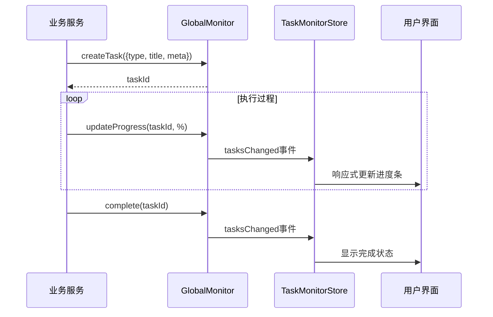
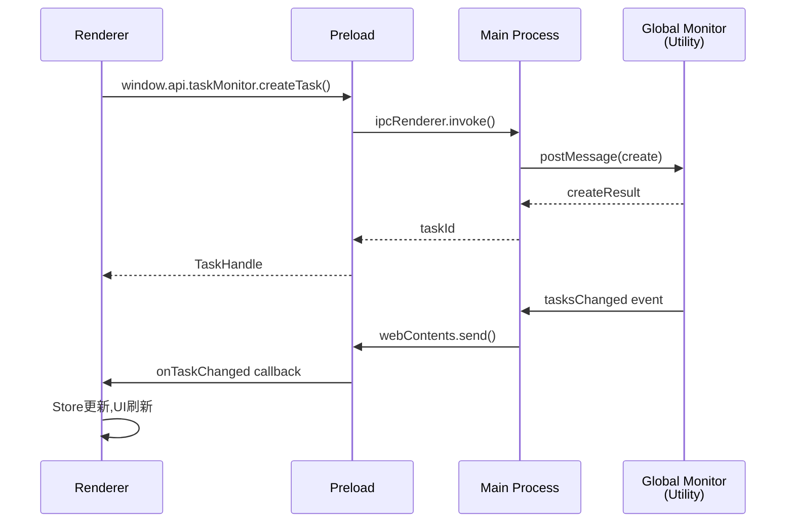
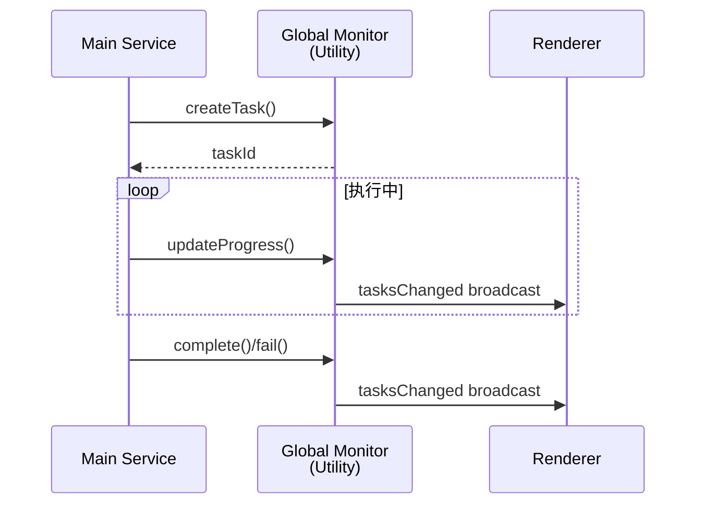
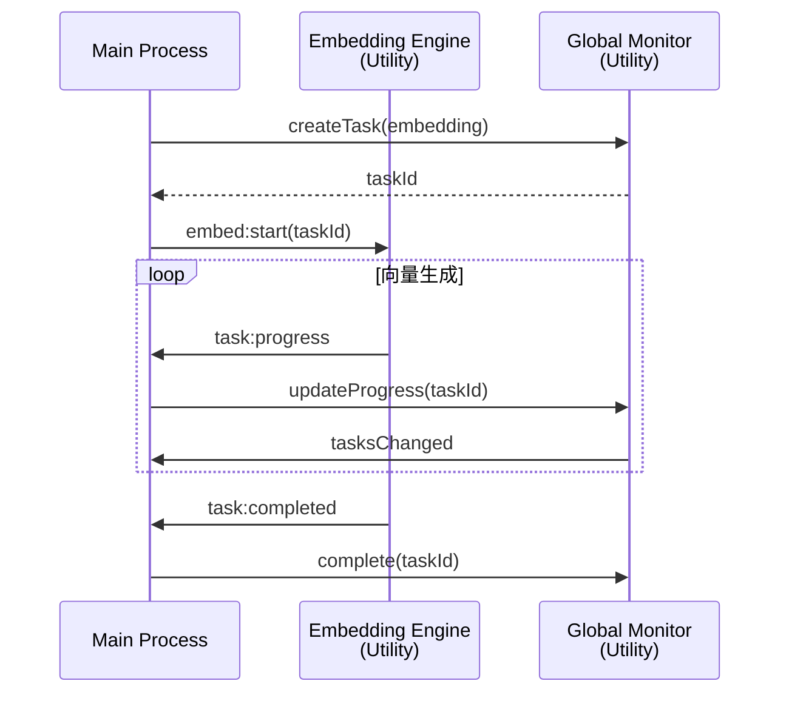

# DeepWiki Q&A with Code Context for Repository: HNULS-LabHub/HNULS-KnowledgeDatabase


## Q1

你觉得作为开发者 应该如何正确的使用全局监控系统？我需要一个工作流


### Answer

# 全局监控系统的正确使用工作流

您询问的是如何正确使用代码库中的全局监控系统(Global Monitor System)。这个系统位于 `src/utility/global-monitor/` 目录,用于跨进程追踪长时间运行的任务(如文档解析、分块、向量嵌入)。 HNULS-KnowledgeDatabase:1-4 

## 开发者工作流

### 1. 创建任务

**在业务服务中创建任务:**

当您启动一个长时间运行的操作时,首先通过 `globalMonitorBridge.createTask()` 创建任务记录。 HNULS-KnowledgeDatabase:317-326 

```typescript
const taskId = await globalMonitorBridge.createTask({
  type: 'embedding',  // 任务类型标识
  title: `嵌入: ${fileName}`,  // 用户可读标题
  meta: {  // 业务自定义元数据
    documentId: params.documentId,
    totalChunks: params.chunks.length
  }
})
```

**前端预生成任务ID(可选):**

对于需要立即反馈的场景,前端可以预生成任务ID并传递给后端,实现乐观更新。 HNULS-KnowledgeDatabase:333-349 

### 2. 更新进度

**在任务执行过程中持续更新:**

使用 `globalMonitorBridge.updateProgress()` 报告进度百分比和元数据变化。 HNULS-KnowledgeDatabase:166-174 

```typescript
globalMonitorBridge.updateProgress(taskId, progress, {
  completedChunks: msg.completedChunks,
  totalChunks: msg.totalChunks,
  currentRPM: msg.currentRPM
})
```

系统会自动将任务状态从 `pending` 切换到 `running`。 HNULS-KnowledgeDatabase:50-64 

### 3. 完成或失败

**成功完成:**

调用 `globalMonitorBridge.complete()` 标记任务完成,进度自动设为100%。 HNULS-KnowledgeDatabase:187-189 

**失败处理:**

调用 `globalMonitorBridge.fail()` 记录错误信息。 HNULS-KnowledgeDatabase:214-216 

### 4. 前端监听

**初始化Store:**

在组件挂载时调用 `store.init()` 加载任务列表并订阅变更。 HNULS-KnowledgeDatabase:104-124 

**响应式更新:**

所有任务状态变化会通过 `tasksChanged` 事件自动广播到前端,Store会更新 `tasksById` Map,触发UI重新渲染。 HNULS-KnowledgeDatabase:25-28 

## 完整示例流程



## Notes

- **任务类型**: 使用有意义的类型标识(如 `'embedding'`, `'parsing'`, `'chunking'`),前端可据此过滤和分组显示。 HNULS-KnowledgeDatabase:16-26 
- **元数据设计**: `meta` 字段应包含业务关键信息(如文档ID、文件名),便于用户识别和调试。
- **错误处理**: 所有消息处理都包含 try-catch,确保单个任务失败不影响整个监控系统。 HNULS-KnowledgeDatabase:44-114 
- **进度日志过滤**: `updateProgress` 消息不会打印日志,避免控制台噪音。 HNULS-KnowledgeDatabase:39-42 
- **批量操作**: 前端支持批量暂停/恢复任务,通过 `batchPause()` 和 `batchResume()` 实现。 HNULS-KnowledgeDatabase:207-240 

Wiki pages you might want to explore:
- [Task Monitoring System (HNULS-LabHub/HNULS-KnowledgeDatabase)](/wiki/HNULS-LabHub/HNULS-KnowledgeDatabase#10)
- [Multi-Process Electron Architecture (HNULS-LabHub/HNULS-KnowledgeDatabase)](/wiki/HNULS-LabHub/HNULS-KnowledgeDatabase#3.1)


### Citations


**File:** KnowledgeDatabase-src/src/utility/global-monitor/entry.ts (L1-4)

```typescript
/**
 * @file 全局监控服务入口
 * @description Utility Process 入口文件，管理全局任务状态
 */
```

**File:** KnowledgeDatabase-src/src/utility/global-monitor/entry.ts (L25-28)

```typescript
// 订阅变更，广播给 Main 进程
registry.subscribe((tasks) => {
  sendMessage({ type: 'tasksChanged', tasks })
})
```

**File:** KnowledgeDatabase-src/src/utility/global-monitor/entry.ts (L39-42)

```typescript
  // 过滤掉 updateProgress 的日志噪音
  if (msg?.type !== 'updateProgress') {
    log(`Received: ${msg?.type}`)
  }
```

**File:** KnowledgeDatabase-src/src/utility/global-monitor/entry.ts (L44-114)

```typescript
  try {
    switch (msg.type) {
      case 'create': {
        const taskId = registry.create(msg.params)
        sendMessage({ type: 'createResult', requestId: msg.requestId, taskId })
        break
      }

      case 'updateProgress': {
        registry.updateProgress(msg.taskId, msg.progress, msg.metaPatch)
        break
      }

      case 'complete': {
        registry.complete(msg.taskId, msg.metaPatch)
        break
      }

      case 'fail': {
        registry.fail(msg.taskId, msg.error)
        break
      }

      case 'pause': {
        registry.pause(msg.taskId)
        break
      }

      case 'resume': {
        registry.resume(msg.taskId)
        break
      }

      case 'remove': {
        const success = registry.remove(msg.taskId)
        sendMessage({ type: 'removeResult', requestId: msg.requestId, success })
        break
      }

      case 'clear': {
        const count = registry.clear(msg.filter)
        sendMessage({ type: 'clearResult', requestId: msg.requestId, count })
        break
      }

      case 'getAll': {
        const tasks = registry.getAll()
        sendMessage({ type: 'getAllResult', requestId: msg.requestId, tasks })
        break
      }

      case 'batchPause': {
        registry.batchPause(msg.taskIds)
        sendMessage({ type: 'batchPauseResult', requestId: msg.requestId, success: true })
        break
      }

      case 'batchResume': {
        registry.batchResume(msg.taskIds)
        sendMessage({ type: 'batchResumeResult', requestId: msg.requestId, success: true })
        break
      }

      default:
        log(`Unknown message type: ${(msg as any).type}`)
    }
  } catch (err) {
    const errorMsg = err instanceof Error ? err.message : 'Unknown error'
    log(`Error handling ${msg.type}: ${errorMsg}`)
    sendMessage({ type: 'error', requestId: (msg as any).requestId, message: errorMsg })
  }
```

**File:** KnowledgeDatabase-src/src/main/services/embedding-engine-bridge/index.ts (L166-174)

```typescript
      case 'task:progress': {
        // 转发进度到 GlobalMonitor
        globalMonitorBridge.updateProgress(msg.taskId, msg.progress, {
          documentId: msg.documentId,
          completedChunks: msg.completedChunks,
          totalChunks: msg.totalChunks,
          currentRPM: msg.currentRPM
        })

```

**File:** KnowledgeDatabase-src/src/main/services/embedding-engine-bridge/index.ts (L187-189)

```typescript
      case 'task:completed': {
        // 通知 GlobalMonitor 完成
        globalMonitorBridge.complete(msg.taskId)
```

**File:** KnowledgeDatabase-src/src/main/services/embedding-engine-bridge/index.ts (L214-216)

```typescript
      case 'task:failed': {
        // 通知 GlobalMonitor 失败
        globalMonitorBridge.fail(msg.taskId, msg.error)
```

**File:** KnowledgeDatabase-src/src/main/services/embedding-engine-bridge/index.ts (L317-326)

```typescript
  async submitTask(params: SubmitEmbeddingTaskParams): Promise<string> {
    // 1. 先在 GlobalMonitor 创建任务
    const taskId = await globalMonitorBridge.createTask({
      type: 'embedding',
      title: `嵌入: ${params.meta?.fileName || params.documentId}`,
      meta: {
        documentId: params.documentId,
        totalChunks: params.chunks.length
      }
    })
```

**File:** KnowledgeDatabase-src/src/renderer/src/views/MainWindow/MainContent/views/KnowledgeView/KnowledgeDetail/DetailDrawer/ParseTab/index.vue (L333-349)

```vue
  // 1. 生成任务 ID（前端预生成）
  const monitorTaskId = `parsing-${Date.now()}-${Math.random().toString(36).slice(2, 9)}`

  // 2. 立即创建占位任务（不等待后端）
  window.api.taskMonitor
    .createTask({
      id: monitorTaskId,
      type: 'parsing',
      title: `文档解析 - ${fileName}`,
      meta: {
        fileKey: props.fileKey,
        fileName,
        knowledgeBaseId: props.knowledgeBaseId,
        status: '等待后端响应'
      }
    })
    .catch((err) => console.warn('[ParseTab] Failed to create monitor task:', err))
```

**File:** KnowledgeDatabase-src/src/utility/global-monitor/task-registry.ts (L50-64)

```typescript
  updateProgress(taskId: string, progress: number, metaPatch?: Record<string, unknown>): boolean {
    const task = this.tasks.get(taskId)
    if (!task) return false

    task.status = 'running'
    task.progress = Math.min(100, Math.max(0, progress))
    task.updatedAt = Date.now()

    if (metaPatch) {
      task.meta = { ...task.meta, ...metaPatch }
    }

    this.notifyChange()
    return true
  }
```

**File:** KnowledgeDatabase-src/src/renderer/src/stores/global-monitor-panel/task-monitor.store.ts (L104-124)

```typescript
  async function init() {
    if (listenerInited.value) return
    listenerInited.value = true
    loading.value = true

    try {
      const taskList = await window.api.taskMonitor.getTasks()
      tasksById.value = new Map(taskList.map((t) => [t.id, t]))

      window.api.taskMonitor.onTaskChanged((list) => {
        tasksById.value = new Map(list.map((t) => [t.id, t]))
      })

      console.log('[TaskMonitor] Store initialized, tasks:', taskList.length)
    } catch (err) {
      error.value = err instanceof Error ? err.message : '初始化任务监控失败'
      console.error('[TaskMonitor] Failed to init:', err)
    } finally {
      loading.value = false
    }
  }
```

**File:** KnowledgeDatabase-src/src/renderer/src/stores/global-monitor-panel/task-monitor.store.ts (L207-240)

```typescript
  async function batchPauseTasks() {
    if (selectedTaskIds.value.size === 0) return

    loading.value = true
    try {
      const taskIds = Array.from(selectedTaskIds.value)
      await window.api.taskMonitor.batchPause(taskIds)
      clearSelection()
    } catch (err) {
      error.value = err instanceof Error ? err.message : '批量暂停任务失败'
      console.error('[TaskMonitor] Failed to batch pause tasks:', err)
    } finally {
      loading.value = false
    }
  }

  /**
   * 批量恢复任务
   */
  async function batchResumeTasks() {
    if (selectedTaskIds.value.size === 0) return

    loading.value = true
    try {
      const taskIds = Array.from(selectedTaskIds.value)
      await window.api.taskMonitor.batchResume(taskIds)
      clearSelection()
    } catch (err) {
      error.value = err instanceof Error ? err.message : '批量恢复任务失败'
      console.error('[TaskMonitor] Failed to batch resume tasks:', err)
    } finally {
      loading.value = false
    }
  }
```

**File:** KnowledgeDatabase-src/src/preload/types/task-monitor.types.ts (L16-26)

```typescript
export interface TaskRecord {
  id: string
  type: string // 业务自定义，如 'file-import' | 'document-parsing' | 'chunking' | 'embedding' | ...
  title: string
  status: TaskStatus
  progress: number // 0-100
  meta: Record<string, unknown> // 扁平对象，业务自定义元数据
  createdAt: number
  updatedAt: number
  error?: string
}
```

## Q2

我需要你进行分类讨论
首先是根据监控渲染进程 mian跨electron主进程与显然进程 跨mian 渲染以及utility process（包括多个），来讨论如何使用全局监控系统


### Answer

# 全局监控系统的跨进程使用指南

您希望按照不同的进程边界来分类讨论全局监控系统的使用方式。这个系统涉及 Renderer Process(渲染进程)、Main Process(主进程)和多个 Utility Processes(工具进程),通过 IPC 和 postMessage 进行跨进程通信。 HNULS-KnowledgeDatabase:1-4 

## 场景一: Renderer Process → Main Process → Global Monitor

**适用场景**: 前端用户操作触发的任务(如批量嵌入、文档解析)。

### 工作流程

**1. Renderer 创建任务**

前端通过 `window.api.taskMonitor.createTask()` 创建任务,这会触发 IPC 调用到 Main Process。 HNULS-KnowledgeDatabase:405-416 

```typescript
// Renderer Process
const taskHandle = await window.api.taskMonitor.createTask({
  type: 'embedding',
  title: `向量嵌入 - ${fileName}`,
  meta: { fileKey, fileName, totalChunks }
})
```

**2. Preload 桥接层**

Preload 脚本通过 `contextBridge` 暴露 API,使用 `ipcRenderer.invoke()` 转发请求。 HNULS-KnowledgeDatabase:34-43 

**3. Main Process 转发**

Main Process 的 IPC Handler 接收请求,调用 `globalMonitorBridge` 转发到 Global Monitor Utility Process。 HNULS-KnowledgeDatabase:33-34 

**4. 进度更新回传**

Global Monitor 通过 `tasksChanged` 事件广播任务变化,Main Process 使用 `BrowserWindow.webContents.send()` 推送到所有 Renderer。 HNULS-KnowledgeDatabase:304-311 

**5. Renderer 响应式更新**

Store 监听 `onTaskChanged` 事件,更新 `tasksById` Map,触发 UI 重新渲染。 HNULS-KnowledgeDatabase:113-115 



---

## 场景二: Main Process Service → Global Monitor

**适用场景**: Main Process 中的服务(如 `MinerUParserService`)直接创建和更新任务。

### 工作流程

**1. 服务直接调用 Bridge**

Main Process 服务通过 `globalMonitorBridge` 单例直接与 Global Monitor 通信,无需经过 IPC。 HNULS-KnowledgeDatabase:12-12 

```typescript
// Main Process Service
const taskId = await globalMonitorBridge.createTask({
  type: 'parsing',
  title: `文档解析 - ${fileName}`,
  meta: { fileKey, batchId }
})
```

**2. 进度更新**

服务在任务执行过程中调用 `updateProgress()`,Global Monitor 自动广播变化。 HNULS-KnowledgeDatabase:361-366 

**3. 完成或失败**

根据任务结果调用 `complete()` 或 `fail()`。 HNULS-KnowledgeDatabase:353-360 



---

## 场景三: Utility Process → Global Monitor

**适用场景**: Embedding Engine 等 Utility Process 需要报告任务进度。

### 工作流程

**1. Main Process 预创建任务**

Main Process 在启动 Utility Process 任务前,先在 Global Monitor 创建任务记录。 HNULS-KnowledgeDatabase:317-326 

**2. Utility Process 通过 Main 转发**

Embedding Engine 通过 `postMessage` 发送进度消息到 Main Process,Main Process 的 `EmbeddingEngineBridge` 接收后转发到 Global Monitor。 HNULS-KnowledgeDatabase:166-174 

**3. 双向通信**

Utility Process 不直接访问 Global Monitor,所有通信都通过 Main Process 中转。 HNULS-KnowledgeDatabase:34-50 



---

## 场景四: 前端预生成任务 ID(乐观更新)

**适用场景**: 需要立即反馈的场景,避免等待后端响应。

### 工作流程

**1. 前端生成 ID**

前端预先生成任务 ID 并立即创建占位任务。 HNULS-KnowledgeDatabase:333-349 

```typescript
// 前端预生成
const monitorTaskId = `parsing-${Date.now()}-${Math.random().toString(36).slice(2, 9)}`

// 立即创建占位任务(不等待)
window.api.taskMonitor.createTask({
  id: monitorTaskId,  // 传递预生成的 ID
  type: 'parsing',
  title: `文档解析 - ${fileName}`
})

// 发起后端请求(传递相同 ID)
await parsingStore.startParsing(fileKey, { monitorTaskId })
```

**2. 后端使用相同 ID**

后端接收到 `monitorTaskId` 后,使用该 ID 创建任务,Global Monitor 的幂等性设计确保不会重复创建。 HNULS-KnowledgeDatabase:20-28 

---

## 关键设计原则

### 1. 进程隔离

- **Global Monitor** 运行在独立 Utility Process,维护权威任务状态。 HNULS-KnowledgeDatabase:15-20 
- **Embedding Engine** 等计算密集型任务运行在独立 Utility Process,避免阻塞 Main Process。 HNULS-KnowledgeDatabase:10-13 

### 2. 单向数据流

所有任务变化从 Global Monitor 单向广播到 Renderer,确保一致性。 HNULS-KnowledgeDatabase:25-28 

### 3. 通信协议

- **Renderer ↔ Main**: IPC (`ipcRenderer.invoke` / `ipcMain.handle`)
- **Main ↔ Utility**: `postMessage` / `parentPort.on('message')` HNULS-KnowledgeDatabase:37-42 

## Notes

- **进程启动顺序**: Global Monitor 和 Embedding Engine 在 `app.whenReady()` 后启动,确保 Electron 环境就绪。 HNULS-KnowledgeDatabase:33-37 
- **错误隔离**: 每个 Utility Process 的错误不会影响其他进程,Main Process 负责错误处理和重启。 HNULS-KnowledgeDatabase:44-114 
- **日志过滤**: `updateProgress` 消息不打印日志,避免控制台噪音。 HNULS-KnowledgeDatabase:39-42 

Wiki pages you might want to explore:
- [Task Monitoring System (HNULS-LabHub/HNULS-KnowledgeDatabase)](/wiki/HNULS-LabHub/HNULS-KnowledgeDatabase#10)
- [Multi-Process Electron Architecture (HNULS-LabHub/HNULS-KnowledgeDatabase)](/wiki/HNULS-LabHub/HNULS-KnowledgeDatabase#3.1)


### Citations


**File:** KnowledgeDatabase-src/src/utility/global-monitor/entry.ts (L1-4)

```typescript
/**
 * @file 全局监控服务入口
 * @description Utility Process 入口文件，管理全局任务状态
 */
```

**File:** KnowledgeDatabase-src/src/utility/global-monitor/entry.ts (L15-20)

```typescript
// Electron utilityProcess 使用 process.parentPort，不是 worker_threads
const parentPort = process.parentPort
if (!parentPort) {
  log('Error: Not running inside a UtilityProcess.')
  process.exit(1)
}
```

**File:** KnowledgeDatabase-src/src/utility/global-monitor/entry.ts (L25-28)

```typescript
// 订阅变更，广播给 Main 进程
registry.subscribe((tasks) => {
  sendMessage({ type: 'tasksChanged', tasks })
})
```

**File:** KnowledgeDatabase-src/src/utility/global-monitor/entry.ts (L37-42)

```typescript
parentPort.on('message', (event: { data: MainToUtilityMessage }) => {
  const msg = event.data
  // 过滤掉 updateProgress 的日志噪音
  if (msg?.type !== 'updateProgress') {
    log(`Received: ${msg?.type}`)
  }
```

**File:** KnowledgeDatabase-src/src/utility/global-monitor/entry.ts (L44-114)

```typescript
  try {
    switch (msg.type) {
      case 'create': {
        const taskId = registry.create(msg.params)
        sendMessage({ type: 'createResult', requestId: msg.requestId, taskId })
        break
      }

      case 'updateProgress': {
        registry.updateProgress(msg.taskId, msg.progress, msg.metaPatch)
        break
      }

      case 'complete': {
        registry.complete(msg.taskId, msg.metaPatch)
        break
      }

      case 'fail': {
        registry.fail(msg.taskId, msg.error)
        break
      }

      case 'pause': {
        registry.pause(msg.taskId)
        break
      }

      case 'resume': {
        registry.resume(msg.taskId)
        break
      }

      case 'remove': {
        const success = registry.remove(msg.taskId)
        sendMessage({ type: 'removeResult', requestId: msg.requestId, success })
        break
      }

      case 'clear': {
        const count = registry.clear(msg.filter)
        sendMessage({ type: 'clearResult', requestId: msg.requestId, count })
        break
      }

      case 'getAll': {
        const tasks = registry.getAll()
        sendMessage({ type: 'getAllResult', requestId: msg.requestId, tasks })
        break
      }

      case 'batchPause': {
        registry.batchPause(msg.taskIds)
        sendMessage({ type: 'batchPauseResult', requestId: msg.requestId, success: true })
        break
      }

      case 'batchResume': {
        registry.batchResume(msg.taskIds)
        sendMessage({ type: 'batchResumeResult', requestId: msg.requestId, success: true })
        break
      }

      default:
        log(`Unknown message type: ${(msg as any).type}`)
    }
  } catch (err) {
    const errorMsg = err instanceof Error ? err.message : 'Unknown error'
    log(`Error handling ${msg.type}: ${errorMsg}`)
    sendMessage({ type: 'error', requestId: (msg as any).requestId, message: errorMsg })
  }
```

**File:** KnowledgeDatabase-src/src/renderer/src/composables/useBatchOperations/index.ts (L405-416)

```typescript
            taskHandle = await window.api.taskMonitor.createTask({
              type: 'embedding',
              title: `向量嵌入 - ${fileName}`,
              meta: {
                fileKey,
                fileName,
                knowledgeBaseId,
                knowledgeBaseName,
                configId: embeddingConfig.configId,
                totalChunks
              }
            })
```

**File:** KnowledgeDatabase-src/src/preload/bridge/index.ts (L34-43)

```typescript
export function exposeBridge(): void {
  if (process.contextIsolated) {
    try {
      // 暴露 electron-toolkit 提供的标准 API
      contextBridge.exposeInMainWorld('electron', electronAPI)

      // 暴露自定义业务 API
      contextBridge.exposeInMainWorld('api', customAPI)

      console.log('Context bridge APIs exposed successfully')
```

**File:** KnowledgeDatabase-src/src/main/index.ts (L33-37)

```typescript
      // 启动全局监控服务（Utility Process）- 必须在 app ready 之后
      await globalMonitorBridge.start()

      // 启动嵌入引擎（Utility Process）
      await embeddingEngineBridge.start()
```

**File:** KnowledgeDatabase-src/src/main/services/embedding-engine-bridge/index.ts (L166-174)

```typescript
      case 'task:progress': {
        // 转发进度到 GlobalMonitor
        globalMonitorBridge.updateProgress(msg.taskId, msg.progress, {
          documentId: msg.documentId,
          completedChunks: msg.completedChunks,
          totalChunks: msg.totalChunks,
          currentRPM: msg.currentRPM
        })

```

**File:** KnowledgeDatabase-src/src/main/services/embedding-engine-bridge/index.ts (L304-311)

```typescript
  private broadcastToRenderers(channel: string, data: unknown): void {
    const windows = BrowserWindow.getAllWindows()
    for (const win of windows) {
      if (!win.isDestroyed()) {
        win.webContents.send(channel, data)
      }
    }
  }
```

**File:** KnowledgeDatabase-src/src/main/services/embedding-engine-bridge/index.ts (L317-326)

```typescript
  async submitTask(params: SubmitEmbeddingTaskParams): Promise<string> {
    // 1. 先在 GlobalMonitor 创建任务
    const taskId = await globalMonitorBridge.createTask({
      type: 'embedding',
      title: `嵌入: ${params.meta?.fileName || params.documentId}`,
      meta: {
        documentId: params.documentId,
        totalChunks: params.chunks.length
      }
    })
```

**File:** KnowledgeDatabase-src/src/renderer/src/stores/global-monitor-panel/task-monitor.store.ts (L113-115)

```typescript
      window.api.taskMonitor.onTaskChanged((list) => {
        tasksById.value = new Map(list.map((t) => [t.id, t]))
      })
```

**File:** KnowledgeDatabase-src/src/main/services/mineru-parser/mineru-parser-service.ts (L12-12)

```typescript
import { globalMonitorBridge } from '../global-monitor-bridge'
```

**File:** KnowledgeDatabase-src/src/main/services/mineru-parser/mineru-parser-service.ts (L353-360)

```typescript
        if (task.state === 'done') {
          globalMonitorBridge.complete(task.monitorTaskId, {
            extractedPages: task.extractedPages,
            totalPages: task.totalPages
          })
        } else if (task.state === 'failed') {
          globalMonitorBridge.fail(task.monitorTaskId, task.errMsg || '解析失败')
        } else {
```

**File:** KnowledgeDatabase-src/src/main/services/mineru-parser/mineru-parser-service.ts (L361-366)

```typescript
          globalMonitorBridge.updateProgress(task.monitorTaskId, progress, {
            state: task.state,
            extractedPages: task.extractedPages,
            totalPages: task.totalPages
          })
        }
```

**File:** KnowledgeDatabase-src/src/utility/embedding-engine/entry.ts (L34-50)

```typescript
// ============================================================================
// 发送消息到 Main 进程
// ============================================================================

function sendMessage(msg: EngineToMainMessage): void {
  parentPort?.postMessage(msg)
}

// ============================================================================
// 初始化核心模块
// ============================================================================

const taskMonitorBridge = new TaskMonitorBridge(sendMessage)
const taskManager = new TaskManager()
const progressTracker = new ProgressTracker(taskManager, taskMonitorBridge)
const channelManager = new ChannelManager()
const scheduler = new Scheduler(taskManager, channelManager, progressTracker, sendMessage)
```

**File:** KnowledgeDatabase-src/src/renderer/src/views/MainWindow/MainContent/views/KnowledgeView/KnowledgeDetail/DetailDrawer/ParseTab/index.vue (L333-349)

```vue
  // 1. 生成任务 ID（前端预生成）
  const monitorTaskId = `parsing-${Date.now()}-${Math.random().toString(36).slice(2, 9)}`

  // 2. 立即创建占位任务（不等待后端）
  window.api.taskMonitor
    .createTask({
      id: monitorTaskId,
      type: 'parsing',
      title: `文档解析 - ${fileName}`,
      meta: {
        fileKey: props.fileKey,
        fileName,
        knowledgeBaseId: props.knowledgeBaseId,
        status: '等待后端响应'
      }
    })
    .catch((err) => console.warn('[ParseTab] Failed to create monitor task:', err))
```

**File:** KnowledgeDatabase-src/src/utility/global-monitor/task-registry.ts (L20-28)

```typescript
  create(params: CreateTaskParams): string {
    // 使用传入的 ID 或自动生成
    const id = params.id || this.generateId()
    const now = Date.now()

    // 如果任务已存在，直接返回（幂等性）
    if (this.tasks.has(id)) {
      return id
    }
```

**File:** KnowledgeDatabase-src/electron.vite.config.ts (L10-13)

```typescript
          index: resolve(__dirname, 'src/main/index.ts'),
          'utility/embedding': resolve(__dirname, 'src/utility/embedding-engine/entry.ts'),
          'utility/global-monitor': resolve(__dirname, 'src/utility/global-monitor/entry.ts')
        }
```

