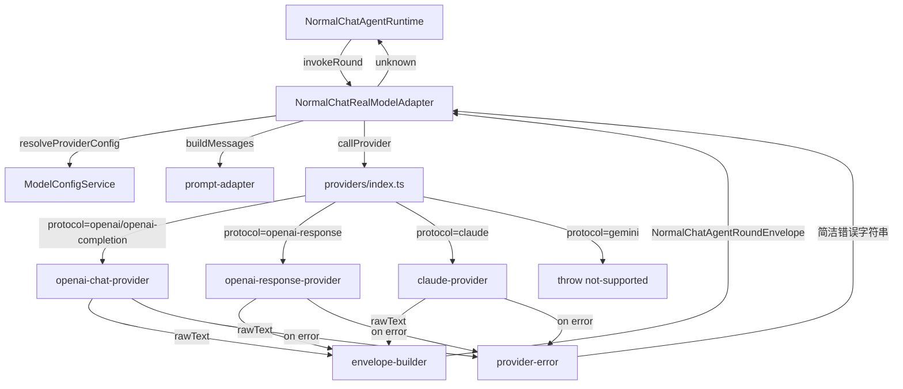

# Normal-Chat 真实 LLM Client 接入方案

## 背景

当前 `NormalChatAgentRuntime` 通过 `NormalChatModelAdapter` 接口调用 LLM，该接口目前由脚本桩 [`NormalChatScriptedModelAdapter`](../LuminaStudio/src/main/services/normal-chat/runtime/llm/scripted/scripted-model-adapter.ts) 实现，直接返回硬编码的 envelope。本任务将新建真实的 LLM client 实现，替换注入点，接入真实后端。

## 现有架构要点

### 调用链路

```
NormalChatAgentRuntime.runAgentExecution()
  └─ modelAdapter.invokeRound(NormalChatScriptRoundInput)
       └─ 返回 unknown（被 NormalChatOutputEnvelopeParser.parse() 解析）
            └─ NormalChatAgentRoundEnvelope { replyMd, wantsAction, actionCalls, apiMetaMd }
```

### 关键类型

- [`NormalChatModelAdapter`](../LuminaStudio/src/main/services/normal-chat/runtime/llm/model-adapter.interface.ts:30)：接口，单方法 `invokeRound(input): Promise<unknown>`
- [`NormalChatScriptRoundInput`](../LuminaStudio/src/main/services/normal-chat/runtime/llm/model-adapter.interface.ts:15)：包含 `promptBundle.promptDocument`（完整 prompt 文本）、`enabledActions`、`actionResults` 等，**不含** provider 信息
- [`NormalChatAgentRoundEnvelope`](../LuminaStudio/src/main/services/normal-chat/runtime/agent/graph/output-envelope.types.ts:3)：`{ replyMd, wantsAction, actionCalls, apiMetaMd }`
- [`ModelProviderProtocol`](../LuminaStudio/src/preload/types/model-config.types.ts:16)：5 种值 — `openai` | `openai-response` | `openai-completion` | `claude` | `gemini`
- [`PersistedModelProviderConfig`](../LuminaStudio/src/main/services/model-config/model-config-service.ts:26)：含 `id`, `protocol`, `apiKey`, `baseUrl`, `defaultHeaders`, `models[]`

### 注入点

- [`NormalChatService` 第 109 行](../LuminaStudio/src/main/services/normal-chat/application/normal-chat-service.ts:109)：`new NormalChatScriptedModelAdapter()` → **替换目标**
- [`main/index.ts` 第 114 行](../LuminaStudio/src/main/index.ts:114)：`new NormalChatService(databaseManager, paperRetrievalService)` → 需补传 `modelConfigService`

### 已有 SDK

| SDK | 用途 | 已有 |
|-----|------|------|
| `openai` | Chat Completions / Responses API | ✅ |
| `@langchain/anthropic` | Anthropic Messages（封装） | ✅ |
| `gemini` | 暂不实现 | — |

## 方案架构图



## 新建文件清单

### `LuminaStudio/src/main/services/normal-chat/runtime/llm/providers/`

#### `provider-config.types.ts`

```typescript
import type { ModelProviderProtocol } from '@preload/types'

export interface NormalChatProviderConfig {
  providerId: string
  modelId: string
  protocol: ModelProviderProtocol
  apiKey: string
  baseUrl: string
  defaultHeaders?: Record<string, string>
}
```

#### `provider-error.ts`

统一从 SDK 错误中提取可读错误信息：

- OpenAI SDK：`APIError` 有 `.status`（HTTP 状态码）和 `.message`（含服务端原因）
- LangChain Anthropic：捕获 `Error` 后检测 `message` 是否含 HTTP status 前缀
- 格式：`"503 Service Unavailable: The model is overloaded"`
- 若无法识别，透传原始 `error.message`

```typescript
export function extractProviderError(err: unknown): string {
  // OpenAI APIError
  if (err && typeof err === 'object' && 'status' in err && 'message' in err) {
    const status = (err as { status: number }).status
    const msg = (err as { message: string }).message
    return `${status} ${msg}`
  }
  if (err instanceof Error) return err.message
  return String(err)
}
```

#### `openai-chat-provider.ts`

处理 `protocol = 'openai'` 和 `'openai-completion'`：

- 使用 `new OpenAI({ apiKey, baseURL })` 构造客户端
- 调用 `client.chat.completions.create({ model, messages, stream: false })`
- 返回 `response.choices[0].message.content ?? ''`
- 错误：catch → `extractProviderError` → `throw new Error(cleanMsg)`

#### `openai-response-provider.ts`

处理 `protocol = 'openai-response'`：

- 使用 `new OpenAI({ apiKey, baseURL })` 构造客户端
- 调用 `client.responses.create({ model, input: messages, stream: false })`
- 从 response 中提取文本输出
- 错误处理同上

#### `claude-provider.ts`

处理 `protocol = 'claude'`：

- 使用 `new ChatAnthropic({ model, apiKey, clientOptions: { baseURL, defaultHeaders } })` 构造
- 调用 `model.invoke(messages)` （LangChain 标准接口）
- 返回 `result.content`（字符串化）
- 错误处理：catch Error → `extractProviderError`

#### `index.ts`

```typescript
export async function callProvider(
  config: NormalChatProviderConfig,
  messages: ChatMessage[]
): Promise<string>
```

按 `config.protocol` 路由，`gemini` 直接 `throw new Error('gemini protocol is not supported in normal-chat')`

### `LuminaStudio/src/main/services/normal-chat/runtime/llm/envelope-builder.ts`

将 LLM 返回的原始文本解析为 `NormalChatAgentRoundEnvelope`：

- 尝试 JSON.parse：若是合法对象且含 `replyMd` 字段，直接返回
- fallback：`{ replyMd: rawText, wantsAction: false, actionCalls: [], apiMetaMd: 'real-llm-response' }`
- 关键保障：`replyMd` 不能为空，否则 `NormalChatOutputEnvelopeParser.parse()` 会抛异常

> **注意**：当前 `NormalChatOutputEnvelopeParser` 要求 `replyMd` 不为空，envelope-builder 需保证此约束。

### `LuminaStudio/src/main/services/normal-chat/runtime/llm/real-model-adapter.ts`

实现 `NormalChatModelAdapter` 接口：

```typescript
export class NormalChatRealModelAdapter implements NormalChatModelAdapter {
  constructor(private readonly modelConfigService: ModelConfigService) {}

  async invokeRound(input: NormalChatScriptRoundInput): Promise<unknown> {
    // 1. 从 ModelConfigService 获取配置，按 activeProviderId 或第一个 enabled provider 解析
    const providerConfig = await this.resolveProviderConfig()
    
    // 2. 将 promptBundle.promptDocument 转为 messages 数组
    const messages = buildMessages(input.promptBundle.promptDocument)
    
    // 3. 调用 provider（错误在 provider 层 catch 后 rethrow 简洁错误）
    const rawText = await callProvider(providerConfig, messages)
    
    // 4. 将原始文本构建为 envelope
    return buildEnvelope(rawText)
  }

  private async resolveProviderConfig(): Promise<NormalChatProviderConfig> {
    const config = await this.modelConfigService.getConfig()
    const provider = config.providers.find(p => p.id === config.activeProviderId && p.enabled)
      ?? config.providers.find(p => p.enabled)
    if (!provider) throw new Error('No enabled provider configured.')
    const model = provider.models[0]
    if (!model) throw new Error(`Provider ${provider.id} has no models configured.`)
    return {
      providerId: provider.id,
      modelId: model.id,
      protocol: provider.protocol,
      apiKey: provider.apiKey,
      baseUrl: provider.baseUrl,
      defaultHeaders: provider.defaultHeaders
    }
  }
}
```

**Messages 构造**（`buildMessages`）：将 `promptDocument` 作为单条 `user` 消息传入，或按 `---` 分隔符解析为 system + user 两条。初版保持简单，单条 user message 即可。

## 修改文件

### [`NormalChatService` 构造器](../LuminaStudio/src/main/services/normal-chat/application/normal-chat-service.ts)

1. 增加 `import type { ModelConfigService } from '../../model-config'`
2. 增加 `import { NormalChatRealModelAdapter } from '../runtime/llm/real-model-adapter'`
3. 构造器签名：`constructor(databaseManager: DatabaseManager, paperRetrievalService: PaperRetrievalService, modelConfigService: ModelConfigService)`
4. 第 109 行替换：`new NormalChatScriptedModelAdapter()` → `new NormalChatRealModelAdapter(modelConfigService)`

### [`main/index.ts` 第 114 行](../LuminaStudio/src/main/index.ts:114)

```typescript
// 修改前
const normalChatService = new NormalChatService(databaseManager, paperRetrievalService)
// 修改后
const normalChatService = new NormalChatService(databaseManager, paperRetrievalService, modelConfigService)
```

`modelConfigService` 已在第 84 行创建，直接可用。

## 错误处理规范

| 场景 | 期望输出 |
|------|----------|
| HTTP 503 | `"503 Service Unavailable: The model is overloaded"` |
| HTTP 401 | `"401 Unauthorized: Invalid API key"` |
| 网络超时 | `"Request timeout: connection reset"` |
| 无 provider 配置 | `"No enabled provider configured."` |
| gemini 协议 | `"gemini protocol is not supported in normal-chat"` |

所有错误通过 `throw new Error(cleanMsg)` 向上透传，由 `AgentRuntime` 层统一捕获并写入 task 状态。

## 不修改的文件

- [`scripted-model-adapter.ts`](../LuminaStudio/src/main/services/normal-chat/runtime/llm/scripted/scripted-model-adapter.ts) — 保留不删，可用于测试/降级
- [`stub-executor.ts`](../LuminaStudio/src/main/services/normal-chat/runtime/executor/stub-executor.ts) — 保留不删（当前本未被使用）
- [`model-adapter.interface.ts`](../LuminaStudio/src/main/services/normal-chat/runtime/llm/model-adapter.interface.ts) — **不修改接口**，新实现直接满足现有接口约束

## 执行顺序

```
步骤 1: provider-config.types.ts
步骤 2: provider-error.ts
步骤 3: openai-chat-provider.ts
步骤 4: openai-response-provider.ts
步骤 5: claude-provider.ts
步骤 6: providers/index.ts
步骤 7: envelope-builder.ts
步骤 8: real-model-adapter.ts
步骤 9: 修改 normal-chat-service.ts
步骤 10: 修改 main/index.ts
```

完成后运行 `pnpm exec tsc -p LuminaStudio/tsconfig.node.json --noEmit` 做类型检查。
